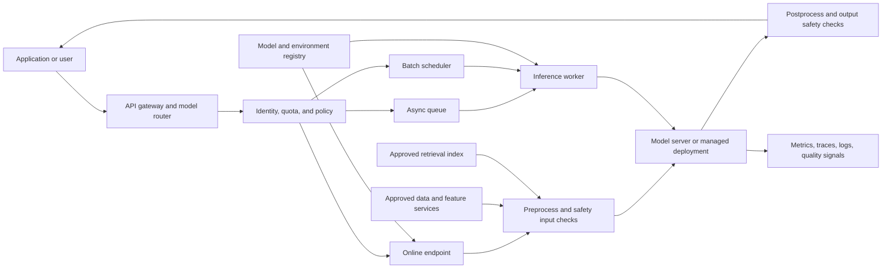

> **文档类型：**数据、AI 和集成架构参考模型
> **规范性术语：** **MUST**、**MUST NOT**、**SHOULD**、**SHOULD NOT** 和 **MAY** 是要求级别。
> **适用范围：** 通过同步、异步、批处理、流式传输、边缘或嵌入式推理端点提供服务的生产模型。
> **例外流程：** 偏离要求需要记录风险评估、补偿控制、指定风险负责人和到期日期。

|控制领域|价值|
|---|---|
|文件编号 | `DAI-20` |
|负责人|云卓越中心 |
|审核周期|至少每年一次，并且在重大平台、提供商、数据、安全或运营模式发生变化之后 |
|证据|模型到端点契约、部署测试、容量模型、安全审查和运营就绪证据 |

# AI 模型服务、推理和端点架构

> **决策简述：** 通过明确的契约、安全身份、容量护栏、推出控制和可度量的 SLO，将批准的模型制品提升到端点。

## 目的

此参考架构描述了如何将经过训练或配置的模型从批准的注册表移动到生产推理端点。它涵盖同步在线推理、异步推理、批量评分、检索和工具依赖性、模型网关、安全性、流量管理、容量、可观测性和质量控制。

模型服务是一种平台功能，而不仅仅是容器部署。端点必须明确模型、运行时、分词器或预处理、依赖项、身份、网络路径、输入契约、输出契约、版本和操作限制。由于延迟、并发、令牌限制、冷启动、数据分布、依赖性漂移或不安全的输出，在离线笔记本中准确的模型仍然可能在生产中失败。

## 服务模式

|模式|互动|最适合|主要设计风险|
|---|---|---|---|
|在线同步|请求等待响应 | API、副驾驶、分类、评分 |尾部延迟、并发性和成本 |
|异步|请求返回作业 ID |长时间运行的生成或文档处理|队列增长和重复工作|
|批量|预定数据集评分 |预测、丰富、离线决策 |过时的结果和部分完成 |
|Streaming |令牌或部分结果 |对话式用户体验 |取消、背压和会计 |
|边缘或嵌入式|模型在客户附近运行 |离线或低时延场景 |模型分发和更新控制|

选择满足产品 SLO 的最简单模式。当队列或批处理作业提供更安全的成本和可靠性配置文件时，不要将每个用例都设为同步端点。

## 模型到端点契约

每个可部署模型版本 MUST 具有：

- 唯一的模型和版本标识符；
- 训练或微调数据血缘和许可证信息；
- 环境或容器摘要；
- 具有大小和类型限制的输入和输出模式；
- 预处理、后处理、分词器和提示模板版本；
- 支持的硬件和最大并发；
- 安全和数据分类要求；
- 离线评估结果和已知的故障模式；
- 回滚或流量迁移行为；和
- 所有者、支持窗口和退休日期。

对于生成模型，记录模型族、部署配置、系统指令、安全过滤器、检索索引版本、工具契约和令牌预算。提示模板是服务制品的一部分，更改它可以更改输出行为。

## 参考端点架构

网关应提供身份验证、请求验证、租户或工作负载配额、模型路由、相关 ID 和粗略速率限制。它不应该成为隐藏特定于模型的业务逻辑的地方。特定于模型的预处理和后处理属于版本化服务组件或声明的端点配置。

## 高层设计

### 注册和发布平面

发布平面存储不可变的模型包、容器或环境定义、提示和检索资产、评估结果、安全扫描结果和部署清单。升级必须移动已批准的发布参考，而不是在生产环境中重建模型。

注册表应区分：

- 候选、验证、批准、部署、退役和阻止的生命周期状态；
- 来自服务环境的模型制品；
- 离线质量源于生产质量；
- 来自任务特定适配器或提示包的通用模型；和
- 来自端点部署版本的模型版本。

### 端点平面

一个端点可以包含一个或多个部署。使用部署级版本进行蓝/绿或金丝雀部署，同时端点提供稳定的消费者 URI 和策略边界。流量分配必须是明确且可监控的。

对于 Azure Machine Learning 托管的在线端点，部署定义应包括批准的环境、模型参考、实例类型、实例计数、请求设置、探测、规模设置、身份、网络状态和数据收集配置。等效字段应在其他服务平台上表示。

### 依赖平面

推理依赖性可以包括特征存储、向量索引、文档存储、安全服务、密钥管理、外部工具和策略引擎。每个依赖项都必须有超时、重试策略、故障模式和数据分类。模型端点应该因未经授权的数据访问而关闭，并在可选的丰富服务不可用时正常失败。

## 低级部署契约

以下是概念性部署清单。特定于提供商的字段必须映射到目标平台并在 CI 中进行验证：
```yaml
endpoint:
  name: claims-scorer
  auth: entra-id
  public_network_access: disabled
  request:
    max_payload_mb: 4
    timeout_seconds: 30
    max_concurrency: 80
  quota:
    requests_per_minute: 1200
    tokens_per_minute: 800000
deployment:
  name: v2026-08-13
  model: registry://claims-scorer/4.2.0
  environment: registry://inference/python-cpu@sha256:REPLACE_ME
  instance_type: standard-cpu
  instance_count: 3
  traffic_weight: 10
  probes:
    startup_seconds: 180
    readiness_seconds: 10
  dependencies:
    - name: feature-store
      timeout_ms: 300
      required: true
    - name: audit-sink
      timeout_ms: 200
      required: false
```
清单应作为一个整体进行审查。更改模型镜像而不更改模型参考仍然可以改变行为；更改超时可以更改有效的 SLO；将依赖项从可选更改为必需可以更改可用性。

## 安全和隐私

使用 Microsoft Entra ID、工作负载身份或等效的短期身份进行端点管理和服务到服务调用。基于密钥的端点身份验证可能适合受控集成场景，但它需要安全分发、轮换和使用监控。

生产端点 SHOULD 在数据分类、监管范围或租户隔离需要时使用私有入口。当可以通过私有连接提供消费者路径时，禁用公共网络访问。限制从服务环境到批准的注册表、存储、要素服务、遥测和模型依赖项的出口。

默认情况下，不记录原始提示、文档、凭据或模型输出。使用脱敏、采样、散列、结构化敏感度标签和保留策略。质量评估数据必须具有合法且经批准的用途；生产链路追踪不是自动批准的培训数据。

## 性能和容量规划

模型服务容量必须基于计算和请求形状。采集：

- 请求率和并发度；
- 输入和输出令牌或有效负载大小；
- 排队、预处理、模型、依赖性和总延迟；
- CPU、内存、GPU、加速器内存和网络利用率；
- 冷启动、横向扩展以及镜像或模型加载时间；
- 错误、超时、取消和重试率；和
- 每个请求、令牌、文档或业务成果的成本。

对于同步端点，定义一个并发预算，将 p95 和 p99 延迟保持在 SLO 内。对于队列，定义最大寿命、可见深度、工作线程吞吐量、重试计数和死信行为。对于批处理，定义完成窗口、检查点、部分输出处理和重新运行语义。

不要仅针对平均流量调整大小。包括一个实例、区域、依赖项或模型部署不可用的故障场景。如果高可用性需要至少三个实例或额外的升级预留，请将其编码为部署策略和容量计算。

## 推出和回滚

使用将端点身份与部署版本分开的发布顺序：

1. 在隔离端点中验证模型和服务环境。
2. 运行契约、负载、安全和代表性质量测试。
3. 以零或低流量部署新版本。
4. 在数据策略允许的情况下执行合成请求和影子请求。
5. 发送小金丝雀百分比或路由显式测试标头。
6. 将技术、成本和质量信号与现任者进行比较。
7. 以受控的步骤增加流量。
8. 护栏突破时应停车或后退。
9. 保留之前的部署，直到回滚窗口关闭。
回滚应该恢复已知的模型、环境、配置和依赖项集。如果数据迁移或索引重建阻止立即回滚，则端点必须使用兼容的回退模式或路由到安全降级行为。

## SLO 和质量护栏

技术 SLO 应包括可用性、p50/p95/p99 延迟、错误率、超时率、队列寿命和容量饱和度。模型特定的护栏可以包括准确性、校准、groundedness、引用正确性、拒绝行为、毒性、偏差指标、模式有效性和人工升级率。

不能仅仅因为某个部署的离线评分提高而对其进行晋级。发布决策应说明哪些指标得到了改进、测试了哪些群体、发生了哪些变化、哪些是未知的以及哪些生产信号可以触发回滚。

## 验证

- [ ] 端点契约标识模型、环境、提示或预处理、依赖项和所有者。
- [ ] 在线、异步、批处理和流式决策由工作负载行为证明是合理的。
- [ ] 端点访问、网络、出口、机密和数据保留已获取批准。
- [ ] 请求和响应限制保护端点免受无限负载的影响。
- [ ] 容量包括故障域和部署余量。
- [ ] 金丝雀或蓝/绿部署具有可度量的晋级门槛。
- [ ] 技术和质量遥测与请求和发布版本相关。
- [ ] 回滚或安全降级已通过实际故障进行了测试。
- [ ] 模型和服务制品在退役时是不可变的、可追踪的和可移除的。

## 操作注意事项

AI 平台团队负责端点平台、部署控制、共享服务运行时和操作仪表板。模型所有者负责模型质量、输入假设、评估数据和报废。应用所有者负责消费者行为、重试、面向用户的 SLO 和数据最小化。

更改模型系列、加速器、请求架构、提示或检索行为、数据分类、网络公开或依赖关系拓扑时，请检查端点体系结构。即使端点 URL 保持不变，模型更改也可以是 API、安全性和容量更改。

## 相关主题

- [Azure OpenAI 平台架构](dai-azure-openai-platform-architecture.md)
- [企业 MLOps 平台和模型生命周期架构](dai-enterprise-mlops-platform-and-model-lifecycle.md)
- [AI 应用的生产运营](dai-production-operations-for-ai-applications.md)
- [Kubernetes 可观测性和 OpenTelemetry 标准](../applications-kubernetes/app-kubernetes-observability-and-opentelemetry-standards.md)
- [如何构建企业 RAG 应用](../how-to-guides/how-to-build-an-enterprise-rag-application.md)

## 参考文档

- [将机器学习模型部署到在线端点](https://learn.microsoft.com/en-us/azure/machine-learning/how-to-deploy-online-endpoints?view=azureml-api-2)
- [安全托管在线端点](https://learn.microsoft.com/en-gb/azure/machine-learning/how-to-secure-online-endpoint?view=azureml-api-2)
- [在线端点部署问题排查](https://learn.microsoft.com/en-us/azure/machine-learning/how-to-troubleshoot-deployment?view=azureml-api-2)
- [Azure Machine Learning 在线部署 REST API](https://learn.microsoft.com/en-us/rest/api/azureml/online-deployments?view=rest-azureml-2026-03-01)
