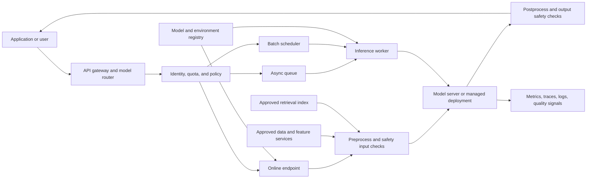

> **Document class:** Data, AI & Integration architecture reference model
> **Normative terms:** **MUST**, **MUST NOT**, **SHOULD**, **SHOULD NOT**, and **MAY** are requirements levels.
> **Applicability:** Production model serving through synchronous, asynchronous, batch, streaming, edge, or embedded inference endpoints.
> **Exception process:** Deviations require a documented risk assessment, compensating controls, named risk owner, and expiry date.

| Control field | Value |
|---|---|
| Document ID | `DAI-20` |
| Owner | Cloud Center of Excellence |
| Review cycle | At least annually and after material platform, provider, data, security, or operating-model changes |
| Evidence | Model-to-endpoint contract, deployment tests, capacity model, security review, and operational readiness evidence |

# AI Model Serving, Inference, and Endpoint Architecture

> **Decision in brief:** Promote approved model artifacts into endpoints with explicit contracts, secure identities, capacity guardrails, rollout controls, and measurable SLOs.

## Purpose

This reference architecture describes how to move a trained or configured model from an approved registry to a production inference endpoint. It covers synchronous online inference, asynchronous inference, batch scoring, retrieval and tool dependencies, model gateways, security, traffic management, capacity, observability, and quality controls.

Model serving is a platform capability, not simply a container deployment. The endpoint must make the model, runtime, tokenizer or preprocessing, dependencies, identity, network path, input contract, output contract, version, and operating limits explicit. A model that is accurate in an offline notebook can still fail in production because of latency, concurrency, token limits, cold start, data distribution, dependency drift, or unsafe output.

## Serving modes

| Mode | Interaction | Best fit | Main design risk |
|---|---|---|---|
| Online synchronous | Request waits for response | APIs, copilots, classification, scoring | Tail latency, concurrency, and cost |
| Asynchronous | Request returns job ID | Long-running generation or document processing | Queue growth and duplicate work |
| Batch | Scheduled dataset scoring | Forecasts, enrichment, offline decisions | Stale results and partial completion |
| Streaming | Tokens or partial results | Conversational user experience | Cancellation, backpressure, and accounting |
| Edge or embedded | Model runs near the client | Offline or low-latency scenarios | Model distribution and update control |

Choose the simplest mode that meets the product SLO. Do not make every use case a synchronous endpoint when a queue or batch job provides a safer cost and reliability profile.

## Model-to-endpoint contract

Every deployable model version MUST have:

- a unique model and release identifier;
- training or fine-tuning data lineage and license information;
- an environment or container digest;
- input and output schemas with size and type limits;
- preprocessing, postprocessing, tokenizer, and prompt-template versions;
- supported hardware and maximum concurrency;
- security and data-classification requirements;
- offline evaluation results and known failure modes;
- rollback or traffic-shift behavior; and
- an owner, support window, and retirement date.

For generative models, record the model family, deployment configuration, system instructions, safety filters, retrieval index version, tool contract, and token budget. A prompt template is part of the serving artifact when changing it can change the output behavior.

## Reference endpoint architecture



The gateway should provide authentication, request validation, tenant or workload quotas, model routing, correlation IDs, and coarse rate limits. It should not become the place where model-specific business logic is hidden. Model-specific preprocessing and postprocessing belong to a versioned serving component or declared endpoint configuration.

## High-level design

### Registry and release plane

The release plane stores immutable model packages, container or environment definitions, prompt and retrieval assets, evaluation results, security scan results, and deployment manifests. Promotion must move an approved release reference rather than rebuild the model in the production environment.

The registry should distinguish:

- candidate, validated, approved, deployed, retired, and blocked lifecycle states;
- model artifact from serving environment;
- offline quality from production quality;
- general-purpose model from task-specific adapter or prompt package; and
- a model version from an endpoint deployment version.

### Endpoint plane

An endpoint can contain one or more deployments. Use deployment-level versions for blue/green or canary rollout, while the endpoint provides a stable consumer URI and policy boundary. Traffic assignments must be explicit and observable.

For Azure Machine Learning managed online endpoints, the deployment definition should include an approved environment, model reference, instance type, instance count, request settings, probes, scale settings, identity, network posture, and data-collection configuration. Equivalent fields should be represented on other serving platforms.

### Dependency plane

Inference dependencies may include feature stores, vector indexes, document stores, safety services, key management, external tools, and policy engines. Each dependency must have a timeout, retry policy, failure mode, and data classification. A model endpoint should fail closed for unauthorized data access and fail gracefully when an optional enrichment service is unavailable.

## Low-level deployment contract

The following is a conceptual deployment manifest. Provider-specific fields must be mapped to the target platform and validated in CI:

```yaml
endpoint:
  name: claims-scorer
  auth: entra-id
  public_network_access: disabled
  request:
    max_payload_mb: 4
    timeout_seconds: 30
    max_concurrency: 80
  quota:
    requests_per_minute: 1200
    tokens_per_minute: 800000
deployment:
  name: v2026-08-13
  model: registry://claims-scorer/4.2.0
  environment: registry://inference/python-cpu@sha256:REPLACE_ME
  instance_type: standard-cpu
  instance_count: 3
  traffic_weight: 10
  probes:
    startup_seconds: 180
    readiness_seconds: 10
  dependencies:
    - name: feature-store
      timeout_ms: 300
      required: true
    - name: audit-sink
      timeout_ms: 200
      required: false
```

The manifest should be reviewed as a unit. Changing a model image without changing the model reference can still change behavior; changing a timeout can change the effective SLO; changing a dependency from optional to required can change availability.

## Security and privacy

Use Microsoft Entra ID, workload identity, or an equivalent short-lived identity for endpoint administration and service-to-service calls. Key-based endpoint authentication may be appropriate for controlled integration scenarios, but it requires secure distribution, rotation, and usage monitoring.

Production endpoints SHOULD use private ingress where data classification, regulatory scope, or tenant isolation requires it. Disable public network access when the consumer path can be provided through private connectivity. Restrict egress from the serving environment to approved registries, storage, feature services, telemetry, and model dependencies.

Do not log raw prompts, documents, credentials, or model outputs by default. Use redaction, sampling, hashing, structured sensitivity labels, and a retention policy. Quality evaluation data must have a lawful and approved use; production traces are not automatically approved training data.

## Performance and capacity planning

Model serving capacity must be based on both compute and request shape. Capture:

- request rate and concurrency;
- input and output tokens or payload size;
- queueing, preprocessing, model, dependency, and total latency;
- CPU, memory, GPU, accelerator memory, and network utilization;
- cold start, scale-out, and image or model load time;
- error, timeout, cancellation, and retry rates; and
- cost per request, token, document, or business outcome.

For a synchronous endpoint, define a concurrency budget that keeps p95 and p99 latency within the SLO. For a queue, define maximum age, visible depth, worker throughput, retry count, and dead-letter behavior. For batch, define completion windows, checkpointing, partial-output handling, and rerun semantics.

Do not size only for average traffic. Include a failure scenario in which one instance, zone, dependency, or model deployment is unavailable. If high availability requires at least three instances or an extra upgrade reserve, encode that as a deployment policy and capacity calculation.

## Rollout and rollback

Use a release sequence that separates endpoint identity from deployment version:

1. Validate the model and serving environment in an isolated endpoint.
2. Run contract, load, security, and representative quality tests.
3. Deploy the new version with zero or low traffic.
4. Execute synthetic and shadow requests where data policy permits.
5. Send a small canary percentage or route an explicit test header.
6. Compare technical, cost, and quality signals to the incumbent.
7. Increase traffic in controlled steps.
8. Stop or roll back when a guardrail breaches.
9. Retain the prior deployment until the rollback window closes.

Rollback should restore a known model, environment, configuration, and dependency set. If a data migration or index rebuild prevents immediate rollback, the endpoint must use a compatible fallback mode or route to a safe degraded behavior.

## SLO and quality guardrails

Technical SLOs should include availability, p50/p95/p99 latency, error rate, timeout rate, queue age, and capacity saturation. Model-specific guardrails can include accuracy, calibration, groundedness, citation correctness, refusal behavior, toxicity, bias indicators, schema validity, and human escalation rate.

A deployment must not be promoted solely because its offline score improved. The release decision should state which metric improved, which population was tested, what changed, what is unknown, and which production signals can trigger rollback.

## Validation

- [ ] The endpoint contract identifies model, environment, prompt or preprocessing, dependencies, and owner.
- [ ] Online, asynchronous, batch, and streaming decisions are justified by workload behavior.
- [ ] Endpoint access, network, egress, secrets, and data retention are approved.
- [ ] Request and response limits protect the endpoint from unbounded load.
- [ ] Capacity includes failure-domain and rollout headroom.
- [ ] A canary or blue/green deployment has measurable promotion gates.
- [ ] Technical and quality telemetry is correlated by request and release version.
- [ ] Rollback or safe degradation has been tested with a realistic failure.
- [ ] Model and serving artifacts are immutable, traceable, and removable when retired.

## Operational considerations

The AI platform team owns the endpoint platform, deployment controls, shared serving runtimes, and operational dashboards. The model owner owns model quality, input assumptions, evaluation data, and retirement. The application owner owns consumer behavior, retries, user-facing SLOs, and data minimization.

Review endpoint architecture when changing model family, accelerator, request schema, prompt or retrieval behavior, data classification, network exposure, or dependency topology. A model change can be an API, security, and capacity change even when the endpoint URL stays the same.

## Related topics

- [Azure OpenAI Platform Architecture](dai-azure-openai-platform-architecture.md)
- [Enterprise MLOps Platform and Model Lifecycle Architecture](dai-enterprise-mlops-platform-and-model-lifecycle.md)
- [Production Operations for AI Applications](dai-production-operations-for-ai-applications.md)
- [Kubernetes Observability and OpenTelemetry Standards](../applications-kubernetes/app-kubernetes-observability-and-opentelemetry-standards.md)
- [How to Build an Enterprise RAG Application](../how-to-guides/how-to-build-an-enterprise-rag-application.md)

## References

- [Deploy machine-learning models to online endpoints](https://learn.microsoft.com/en-us/azure/machine-learning/how-to-deploy-online-endpoints?view=azureml-api-2)
- [Secure managed online endpoints](https://learn.microsoft.com/en-gb/azure/machine-learning/how-to-secure-online-endpoint?view=azureml-api-2)
- [Troubleshoot online endpoint deployment](https://learn.microsoft.com/en-us/azure/machine-learning/how-to-troubleshoot-deployment?view=azureml-api-2)
- [Azure Machine Learning online deployments REST API](https://learn.microsoft.com/en-us/rest/api/azureml/online-deployments?view=rest-azureml-2026-03-01)
