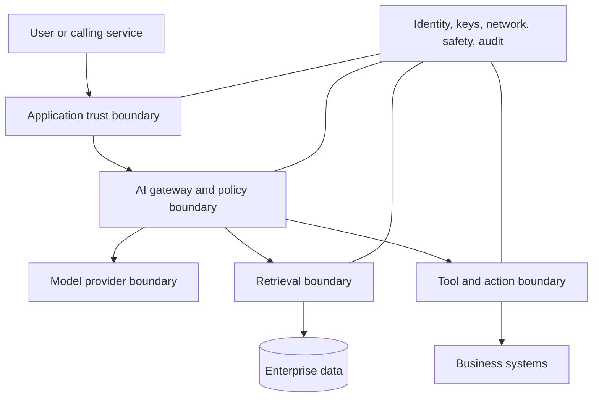
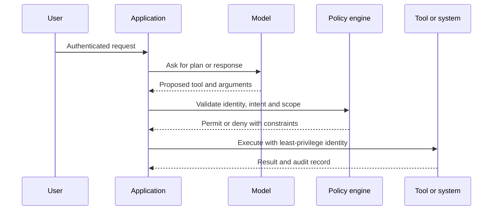
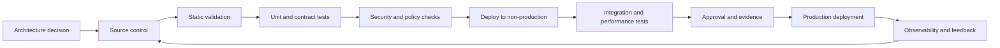

> **文档类型：**数据、AI 和集成实施指南
> **规范性术语：** **MUST**、**MUST NOT**、**SHOULD**、**SHOULD NOT** 和 **MAY** 是要求级别。
> **适用范围：** 企业 AI 系统，包括托管和开放模型、RAG、代理、预测 ML 和支持 AI 的 SaaS 功能。
> **例外流程：** 偏离要求需要记录风险评估、补偿控制、指定风险负责人和到期日期。

|控制领域|价值|
|---|---|
|文件编号 | `DAI-08` |
|负责人|云卓越中心 |
|审核周期|至少每年一次，并且在重大平台、提供商、数据、安全或运营模式发生变化之后 |
|证据|威胁模型、身份和数据控制审查、安全评估、验证结果和运营就绪证据 |

# AI 安全、身份和负责任的 AI

> **决策简述：** 在每个 AI 系统周围放置确定性身份、授权、数据保护、安全和审计控制。切勿将授权委托给模型输出。

## 目的

本文件定义了企业 AI 系统的强制性安全和负责任的 AI 控制框架。它应用于托管基础模型、开放模型、RAG、代理、预测 ML、AI 辅助开发以及 SaaS 产品中嵌入的 AI 功能。

AI 引入了新的攻击路径和故障模式，但它不会取代现有的安全基础。身份、授权、数据最小化、安全软件交付、日志记录和事件响应仍然是强制性的。

## 信任边界

每个边界都需要显式身份验证、授权、输入验证、输出处理和日志记录。该模型决不能被视为授权引擎。

## 身份架构

人类用户通过企业身份提供商通过条件访问和多因素身份验证进行身份验证。工作负载使用托管身份、IAM 角色、工作负载身份联合或资源主体。代理和工具使用单独的工作负载身份以及每个操作所需的最低权限。

所需规则：

1. 没有共享的人类账户。
2. 没有嵌入模型、搜索、数据库或存储密钥。
3. 应用运行时、部署、摄取、评估和管理的单独身份。
4. 生产管理的有时限的特权访问。
5. 基于组的授权和定期重新认证。
6. 在数据敏感性需要时按租户或按域隔离。
7. 针对受损工作负载和代理的立即撤销路径。

## 授权模型

授权发生在检索之前、工具选择之前，并在目标系统上再次进行后续操作。应用 MAY 使用模型输出来提出操作，但确定性策略即代码必须验证用户、资源、操作、范围和约束。

## 威胁模型

威胁模型 MUST 包括：

- 提示注入和间接提示注入；
- 敏感数据泄露；
- 跨租户检索；
- 训练或反馈数据投毒；
- 模型或依赖项供应链遭入侵；
- 不安全的输出处理；
- 过度代理和未经授权的工具使用；
- 通过令牌或工具放大 Denial-of-Wallet 攻击；
- 模型提取和滥用；
- 越狱和内容策略绕过；
- 不安全的插件、连接器和包依赖项；
- 日志记录和遥测泄漏；
- 预测模型的对抗样本和规避攻击；
- 相关的成员推断和模型反演。

## 安全控制层

|层 |所需的控制|
|---|---|
|用户|强身份验证、会话控制、披露、可接受的使用策略 |
|应用 |输入限制、架构验证、安全输出渲染、速率限制 |
|网关|授权、配额、路由、安全、脱敏、审计 |
|检索|源白名单、ACL 过滤器、删除、来源证明、注入防御 |
|模型|批准的模型、版本控制、安全设置、评估|
|工具|白名单、最小权限、参数验证、人工批准 |
|数据|分类、最小化、加密、保留、驻留 |
|平台|私有网络、修补、配置策略、SIEM 导出 |
|运营|监控、事件响应、终止开关、访问审查|

## 负责任的 AI 生命周期

负责任的 AI 必须通过记录在案的决策和可度量的控制来实施。至少，评估：

- 预期用途和禁止用途；
- 受影响的用户和潜在危害；
- 公平性和分组绩效；
- 可靠性和安全性；
- 隐私和数据治理；
- 透明度和用户披露；
- 人类监督和可竞争性；
- 无障碍；
- 安全性和抗误用性；
- 问责和升级。

高影响力的用例需要在生产前和重大变更后进行正式审查。

## 风险分级

|等级 |示例|最低治理 |
|---|---|---|
|低|非敏感内容内部总结|所有者、基本评估、日志、可接受的使用 |
|中等|企业搜索、客户支持起草|安全审查、RAG 授权、质量和安全测试、人工监督 |
|高|财务、就业、教育、健康、法律或访问决策|正式风险评估、法律/隐私审查、分组评估、人类决策权、上诉途径 |
|禁止 |非法歧视、机密操纵、未经授权的监视、不允许的数据使用 |不部署|

风险分级必须考虑实际影响和自主性，而不是模型是否作为助手进行营销。

## 数据保护

提示和模型输出可以包含受监管或机密数据。所需的控制包括数据最小化、用途限制、批准区域、加密、保留限制、脱敏、租户隔离、删除和访问审计。未经批准和适当的去标识化，将生产数据 MUST NOT 复制到评估或开发环境中。
必须针对每种服务配置评估提供商的数据处理和滥用监控条款。不要假设所有部署类型、区域或产品层都具有相同的处理行为。

## 提示和输出安全

提示是代码相邻配置和 MUST 版本控制。系统指令应将策略与不受信任的内容分开。检索到的文档和用户输入必须被分隔并视为数据，而不是命令。

输出在用于 HTML、SQL、shell 命令、代码执行、API 调用或业务事务之前必须进行验证。使用允许列表、参数化接口、模式、转义和确定性检查。切勿直接执行自由格式模型输出。

## 工具和代理安全

代理操作 MUST 具有最小的自主权。高影响力的行动需要人工确认或确定性批准。工具必须公开狭窄的操作，而不是通用的管理员界面。每个操作都需要审计跟踪中的用户上下文、策略决策、参数、结果和相关 ID。

紧急控制必须包括禁用工具、撤销身份、阻止模型或提示版本、停止代理运行以及隔离受影响的租户。

## 多云控制映射

|控制区|Azure|AWS | GCP |OCI |
|---|---|---|---|---|
|工作负载身份|托管身份和工作负载身份联合 | IAM 角色 |服务账户和工作负载身份联合 |动态组和资源主体 |
|机密和钥匙| Key Vault / 托管 HSM |Secret Manager/KMS |Secret Manager/Cloud KMS |Vault |
|AI 安全 |Azure AI Foundry 和模型服务安全控制|Bedrock 护栏和服务控制| Vertex AI 安全设置 | OCI Generative AI 护栏 |
|安全态势|Defender for Cloud 和 Azure Policy |Security Hub、Config、GuardDuty |Security Command Center 和 Organization Policy|Cloud Guard 和 Security Zones|
|私有服务接入 |私有链接 |私有链接 |私有服务连接 |私有端点和服务网关|

## 验证

所需的测试包括未经授权的访问、提示注入、文档中的间接注入、敏感数据提取、跨租户过滤器、不安全内容、Denial-of-Wallet 攻击、工具参数操纵、依赖关系受损、模型更改回归和日志泄漏。

红队演习应关注整个系统，而不仅仅是模型端点。

## 事件响应

AI 事件程序必须涵盖证据保存、提示和响应处理、模型和提示版本、检索来源、工具操作、受影响的用户、提供商升级、遏制和所需的通知。原始敏感内容应按照受限制的取证程序进行处理。

## 跨领域的治理要求

平台 MUST 将数据产品、模型、提示、索引、管道和集成接口视为受治理资产。每项资产都需要一个负责任的所有者、分类、生命周期状态、批准的消费者、数据血缘、保留规则和运营目标。平台控制 MUST 通过策略即代码和基础设施即代码应用，而不是手动门户配置。

最低治理控制是：
1. 具有自动元数据收集功能的业务术语表和技术目录。
2. 摄取时的数据分类和转换后的重新分类。
3. 从源到转换、模型或索引、API 和消费者的端到端数据血缘。
4. 平台管理、数据管理、开发和生产运营之间的职责分离。
5. 用于管理操作和访问受监管数据的不可变审计日志。
6. 明确的保留、存档、合法保留和删除程序。
7、具有证据、审批、回滚能力的环境晋级。
8. 定期访问重新认证和控制有效性审查。

## 交付和生命周期标准

所有可部署资源 MUST 在版本控制中表示。合规的交付流程是：

生产变更 MUST 使用可重复的流水线、短期工作负载标识、同行评审和可审核的批准。紧急变更需要追溯相同的证据，且 MUST NOT 成为并行运行模型。

## AI 资产与信任盘点

维护生产 AI 资产和信任关系的清单。至少包括应用、代理、模型、部署、提示、安全策略、索引、数据源、评估集、工具、内存、身份、网关和外部提供商。

每条日志 SHOULD 标识所有者、风险层、环境、区域、数据类、允许的用户、提供商、版本、信任颁发者、权限、保留、上次审查、依赖关系和kill switch 程序。

未记录的提示、索引或工具是非托管生产组件，即使它是通过托管门户配置的。

## 策略执行点

安全策略 SHOULD 在独立层强制执行：

1. 身份提供商对参与者进行身份验证。
2. 应用授权用例和租户。
3. 网关限制模型、配额、数据类别和路由。
4. 检索层强制执行源和记录在案的访问权限。
5. 工具代理验证操作和目标权限。
6. 目标系统重新授权实际操作。
7. 输出处理强制披露和执行约束。
8.审计和检测监控完整路径。

没有任何一个模型提示或内容过滤器可以替代这些控件。

## 重大变更触发因素

当变更发生重大变化时，重复相关风险、隐私、安全和负责任的 AI 审查：

- 目标用户、受影响人群或决策影响；
- 自主权或工具权限；
- 模型提供商、模型系列或训练来源；
- 个人或受监管数据的类别；
- 检索来源或共享边界；
- 保留、记忆或反馈使用；
- 区域处理或分处理商；
- 安全设置、人工监督或上诉程序。

次要版本标签并不决定重要性；实际行为和影响确实如此。

## 保障性证据

生产保证日志 SHOULD 包含用例评估、威胁模型、数据流图、模型和提示版本、评估结果、红队调查结果、访问测试、安全配置、人工监督设计、事件计划和已知残余风险。

证据 MUST 可重现并连接到已部署的版本。屏幕截图和一次性演示是不够的。

## 相关主题

- [Azure OpenAI 平台架构](dai-azure-openai-platform-architecture.md)
- [企业 RAG 和 AI 搜索](dai-enterprise-rag-and-ai-search.md)
- [Agent AI 平台架构与工具治理](dai-agentic-ai-platform-architecture-and-tool-governance.md)
- [数据隐私、驻留、保留和安全删除标准](dai-data-privacy-residency-retention-and-deletion.md)

## 反模式
- 使用模型来决定用户是否被授权。
- 为方便起见，向代理提供广泛的管理员凭据。
- 将提供商内容过滤器视为完整的负责任的 AI 程序。
- 在未经同意和控制的情况下将生产对话复制到测试数据集中。
- 在一般应用日志中记录提示和检索的文档。
- 执行生成的 SQL、shell 命令或 API 调用而不进行验证。
- 假设私有端点通过授权模型调用防止数据泄露。
- 仅根据成功的演示来批准用例。

## 架构审查清单

- [ ] 已分配业务所有者、技术所有者、数据所有者和支持所有者。
- [ ] 记录数据分类、驻留、主权、保留和删除要求。
- [ ] 身份使用联合或托管工作负载身份；不允许嵌入凭据。
- [ ] 公共网络暴露被禁用，除非记录在案的例外情况得到批准。
- [ ] 定义了加密、密钥所有权、轮换和 break-glass 程序。
- [ ] 测试可用性、恢复、可扩展性和容量假设。
- [ ] 日志、指标、跟踪、数据血缘和成本分配在生产前实施。
- [ ] 执行部署、回滚、备份恢复和灾难恢复过程。
- [ ] 记录服务限制、配额、区域依赖性和特定于提供商的约束。
- [ ] 退出策略和可移植性边界是明确的。

## 参考文档

- [Microsoft AI 共享责任模型](https://learn.microsoft.com/azure/security/fundamentals/shared-responsibility-ai)
- [Azure OpenAI 的负责任的 AI 实践](https://learn.microsoft.com/azure/ai-foundry/responsible-ai/openai/overview)
- [应用于生成式 AI 的 AWS 安全参考架构](https://docs.aws.amazon.com/prescriptive-guidance/latest/security-reference-architecture-generative-ai/)
- [GCP 负责任的 AI](https://cloud.google.com/responsible-ai)
- [OCI Generative AI 护栏](https://docs.oracle.com/en-us/iaas/Content/generative-ai/guardrails.htm)
- [OCI 企业 AI 治理](https://docs.oracle.com/en-us/iaas/Content/generative-ai/governance.htm)
- [NISTAI 风险管理框架](https://www.nist.gov/itl/ai-risk-management-framework)
