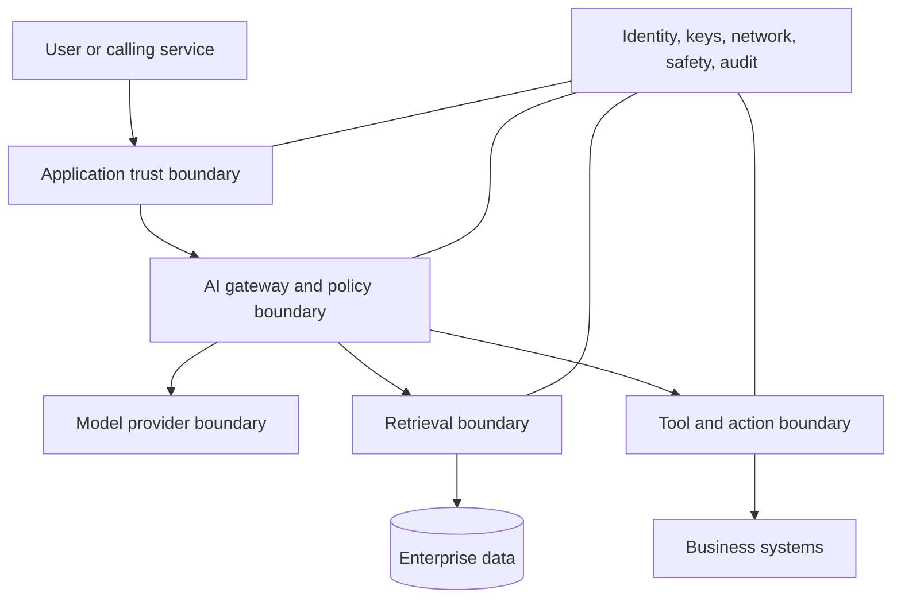
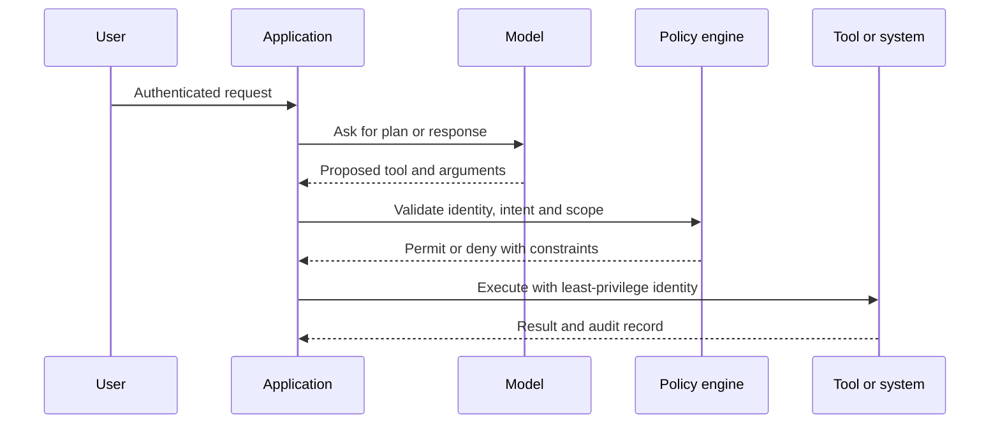
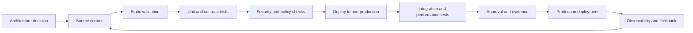

> **Document class:** Data, AI & Integration implementation guide
> **Normative terms:** **MUST**, **MUST NOT**, **SHOULD**, **SHOULD NOT**, and **MAY** are requirements levels.
> **Applicability:** Enterprise AI systems, including hosted and open models, RAG, agents, predictive ML, and AI-enabled SaaS features.
> **Exception process:** Deviations require a documented risk assessment, compensating controls, named risk owner, and expiry date.

| Control field | Value |
|---|---|
| Document ID | `DAI-08` |
| Owner | Cloud Center of Excellence |
| Review cycle | At least annually and after material platform, provider, data, security, or operating-model changes |
| Evidence | Threat model, identity and data-control review, safety evaluation, validation results, and operational readiness evidence |

# AI Security, Identity, and Responsible AI

> **Decision in brief:** Place deterministic identity, authorization, data protection, safety, and audit controls around every AI system. Never delegate authorization to model output.

## Purpose

This document defines the mandatory security and responsible-AI control framework for enterprise AI systems. It applies to hosted foundation models, open models, RAG, agents, predictive ML, AI-assisted development, and AI features embedded in SaaS products.

AI introduces new attack paths and failure modes, but it does not replace existing security fundamentals. Identity, authorization, data minimization, secure software delivery, logging, and incident response remain mandatory.

## Trust Boundaries

Each boundary requires explicit authentication, authorization, input validation, output handling, and logging. The model must never be treated as an authorization engine.

## Identity Architecture

Human users authenticate through the enterprise identity provider with conditional access and multifactor authentication. Workloads use managed identity, IAM roles, workload identity federation, or resource principals. Agents and tools use separate workload identities with the minimum permissions required for each action.

Required rules:

1. No shared human accounts.
2. No embedded model, search, database, or storage keys.
3. Separate identities for application runtime, deployment, ingestion, evaluation, and administration.
4. Time-bound privileged access for production administration.
5. Group-based authorization and periodic recertification.
6. Per-tenant or per-domain isolation where data sensitivity demands it.
7. Immediate revocation path for compromised workloads and agents.

## Authorization Model

Authorization occurs before retrieval, before tool selection, and again at the target system for consequential actions. The application MAY use model output to propose an action, but deterministic policy code must validate the user, resource, operation, scope, and constraints.

## Threat Model

The threat model MUST include:

- prompt injection and indirect prompt injection;
- sensitive-data disclosure;
- cross-tenant retrieval;
- training or feedback data poisoning;
- model or dependency supply-chain compromise;
- insecure output handling;
- excessive agency and unauthorized tool use;
- denial of wallet through token or tool amplification;
- model extraction and abuse;
- jailbreak and content-policy bypass;
- insecure plugins, connectors, and package dependencies;
- logging and telemetry leakage;
- adversarial examples and evasion for predictive models;
- membership inference and model inversion where relevant.

## Security Control Layers

| Layer | Required controls |
|---|---|
| User | strong authentication, session controls, disclosure, acceptable-use policy |
| Application | input limits, schema validation, secure output rendering, rate limits |
| Gateway | authorization, quotas, routing, safety, redaction, audit |
| Retrieval | source allowlist, ACL filters, deletion, provenance, injection defense |
| Model | approved models, version control, safety settings, evaluation |
| Tools | allowlist, least privilege, argument validation, human approval |
| Data | classification, minimization, encryption, retention, residency |
| Platform | private networking, patching, configuration policy, SIEM export |
| Operations | monitoring, incident response, kill switch, access review |

## Responsible-AI Lifecycle

Responsible AI must be operationalized through documented decisions and measurable controls. At minimum, assess:

- intended use and prohibited use;
- affected users and potential harm;
- fairness and subgroup performance;
- reliability and safety;
- privacy and data governance;
- transparency and user disclosure;
- human oversight and contestability;
- accessibility;
- security and misuse resistance;
- accountability and escalation.

High-impact use cases require formal review before production and after material changes.

## Risk Tiering

| Tier | Example | Minimum governance |
|---|---|---|
| Low | internal summarization of non-sensitive content | owner, basic evaluation, logging, acceptable use |
| Moderate | enterprise search, customer support drafting | security review, RAG authorization, quality and safety tests, human oversight |
| High | financial, employment, education, health, legal, or access decisions | formal risk assessment, legal/privacy review, subgroup evaluation, human decision authority, appeal path |
| Prohibited | unlawful discrimination, covert manipulation, unauthorized surveillance, disallowed data use | do not deploy |

Risk tiering must consider actual impact and autonomy, not whether the model is marketed as an assistant.

## Data Protection

Prompts and model outputs can contain regulated or confidential data. Required controls include data minimization, purpose limitation, approved regions, encryption, retention limits, redaction, tenant isolation, deletion, and access auditing. Production data MUST NOT be copied into evaluation or development environments without approval and appropriate de-identification.

Providers' data handling and abuse-monitoring terms must be assessed for each service configuration. Do not assume all deployment types, regions, or product tiers have identical processing behavior.

## Prompt and Output Security

Prompts are code-adjacent configuration and MUST be versioned. System instructions should separate policy from untrusted content. Retrieved documents and user inputs must be delimited and treated as data, not commands.

Outputs must be validated before use in HTML, SQL, shell commands, code execution, API calls, or business transactions. Use allowlists, parameterized interfaces, schemas, escaping, and deterministic checks. Never execute free-form model output directly.

## Tool and Agent Security

Agents MUST operate with minimum autonomy. High-impact actions require human confirmation or deterministic approval. Tools must expose narrow operations, not generic administrator interfaces. Every action requires user context, policy decision, arguments, result, and correlation ID in the audit trail.

Emergency controls must include disabling a tool, revoking an identity, blocking a model or prompt version, stopping an agent run, and isolating affected tenants.

## Multi-Cloud Control Mapping

| Control area | Azure | AWS | GCP | OCI |
|---|---|---|---|---|
| Workload identity | Managed identities and workload federation | IAM roles | Service accounts and workload identity federation | Dynamic groups and resource principals |
| Secrets and keys | Key Vault / Managed HSM | Secrets Manager / KMS | Secret Manager / Cloud KMS | Vault |
| AI safety | Foundry and service safety controls | Bedrock guardrails and service controls | Vertex AI safety settings | OCI Generative AI guardrails |
| Security posture | Defender for Cloud and policy | Security Hub, Config, GuardDuty | Security Command Center and organization policy | Cloud Guard and Security Zones |
| Private service access | Private Link | PrivateLink | Private Service Connect | Private endpoints and service gateways |

## Validation

Required testing includes unauthorized access, prompt injection, indirect injection in documents, sensitive-data extraction, cross-tenant filters, unsafe content, denial-of-wallet, tool argument manipulation, dependency compromise, model change regression, and logging leakage.

Red-team exercises should focus on the full system, not only the model endpoint.

## Incident Response

AI incident procedures must cover evidence preservation, prompt and response handling, model and prompt version, retrieved sources, tool actions, affected users, provider escalation, containment, and required notification. Raw sensitive content should be handled under restricted forensic procedures.

## Cross-cutting governance requirements

The platform MUST treat data products, models, prompts, indexes, pipelines, and integration interfaces as governed assets. Each asset requires an accountable owner, classification, lifecycle state, approved consumers, lineage, retention rules, and operational objectives. Platform controls MUST be applied through policy-as-code and infrastructure-as-code rather than manual portal configuration.

Minimum governance controls are:

1. A business glossary and technical catalog with automated metadata harvesting.
2. Data classification at ingestion and reclassification after transformation.
3. End-to-end lineage from source through transformation, model or index, API, and consumer.
4. Segregation of duties between platform administration, data stewardship, development, and production operations.
5. Immutable audit logging for administrative actions and access to regulated data.
6. Explicit retention, archival, legal-hold, and deletion procedures.
7. Environment promotion with evidence, approval, and rollback capability.
8. Periodic access recertification and control-effectiveness reviews.

## Delivery and lifecycle standard

All deployable resources MUST be represented in version control. A compliant delivery flow is:

Production changes MUST use repeatable pipelines, short-lived workload identities, peer review, and auditable approvals. Emergency changes require the same evidence retrospectively and MUST not become a parallel operating model.

## AI Asset and Trust Inventory

Maintain an inventory of production AI assets and trust relationships. At minimum include applications, agents, models, deployments, prompts, safety policies, indexes, data sources, evaluation sets, tools, memories, identities, gateways, and external providers.

Each record SHOULD identify owner, risk tier, environment, region, data classes, allowed users, provider, version, trust issuer, privileges, retention, last review, dependencies, and kill-switch procedure.

An undocumented prompt, index, or tool is an unmanaged production component even when it is configured through a hosted portal.

## Policy Enforcement Points

Security policy SHOULD be enforced at independent layers:

1. Identity provider authenticates the actor.
2. Application authorizes the use case and tenant.
3. Gateway limits models, quotas, data classes, and routes.
4. Retrieval layer enforces source and record entitlements.
5. Tool broker validates action and target permissions.
6. Target system reauthorizes the actual operation.
7. Output handling enforces disclosure and execution constraints.
8. Audit and detection monitor the complete path.

No single model prompt or content filter can replace these controls.

## Material Change Triggers

Repeat the relevant risk, privacy, security, and responsible-AI review when a change materially alters:

- intended users, affected population, or decision impact;
- autonomy or tool permissions;
- model provider, model family, or training source;
- categories of personal or regulated data;
- retrieval sources or sharing boundaries;
- retention, memory, or feedback use;
- regional processing or subprocessors;
- safety settings, human oversight, or appeal process.

Minor version labels do not determine materiality; actual behavior and impact do.

## Assurance Evidence

A production assurance record SHOULD contain the use-case assessment, threat model, data-flow diagram, model and prompt versions, evaluation results, red-team findings, access tests, safety configuration, human-oversight design, incident plan, and known residual risks.

Evidence MUST be reproducible and connected to the deployed versions. Screenshots and a one-time demo are insufficient.

## Related topics

- [Azure OpenAI Platform Architecture](dai-azure-openai-platform-architecture.md)
- [Enterprise RAG and AI Search](dai-enterprise-rag-and-ai-search.md)
- [Agentic AI Platform Architecture and Tool Governance](dai-agentic-ai-platform-architecture-and-tool-governance.md)
- [Data Privacy, Residency, Retention, and Secure Deletion Standard](dai-data-privacy-residency-retention-and-deletion.md)

## Anti-patterns
- Using the model to decide whether a user is authorized.
- Giving an agent broad administrator credentials for convenience.
- Treating provider content filters as the complete responsible-AI program.
- Copying production conversations into test datasets without consent and controls.
- Logging prompts and retrieved documents in general application logs.
- Executing generated SQL, shell commands, or API calls without validation.
- Assuming private endpoints prevent data leakage through authorized model calls.
- Approving a use case based only on a successful demo.

## Architecture review checklist

- [ ] Business owner, technical owner, data owner, and support owner are assigned.
- [ ] Data classification, residency, sovereignty, retention, and deletion requirements are documented.
- [ ] Identity uses federation or managed workload identity; no embedded credentials are permitted.
- [ ] Public network exposure is disabled unless a documented exception is approved.
- [ ] Encryption, key ownership, rotation, and break-glass procedures are defined.
- [ ] Availability, recovery, scalability, and capacity assumptions are tested.
- [ ] Logging, metrics, traces, lineage, and cost allocation are implemented before production.
- [ ] Deployment, rollback, backup restoration, and disaster-recovery procedures are exercised.
- [ ] Service limits, quotas, regional dependencies, and provider-specific constraints are recorded.
- [ ] Exit strategy and portability boundaries are explicit.

## References

- [Microsoft AI shared responsibility model](https://learn.microsoft.com/azure/security/fundamentals/shared-responsibility-ai)
- [Responsible AI practices for Azure OpenAI](https://learn.microsoft.com/azure/ai-foundry/responsible-ai/openai/overview)
- [AWS Security Reference Architecture for generative AI](https://docs.aws.amazon.com/prescriptive-guidance/latest/security-reference-architecture-generative-ai/)
- [GCP Responsible AI](https://cloud.google.com/responsible-ai)
- [OCI Generative AI guardrails](https://docs.oracle.com/en-us/iaas/Content/generative-ai/guardrails.htm)
- [OCI Enterprise AI Governance](https://docs.oracle.com/en-us/iaas/Content/generative-ai/governance.htm)
- [NIST AI Risk Management Framework](https://www.nist.gov/itl/ai-risk-management-framework)
