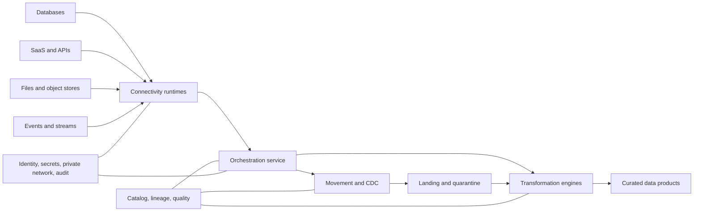
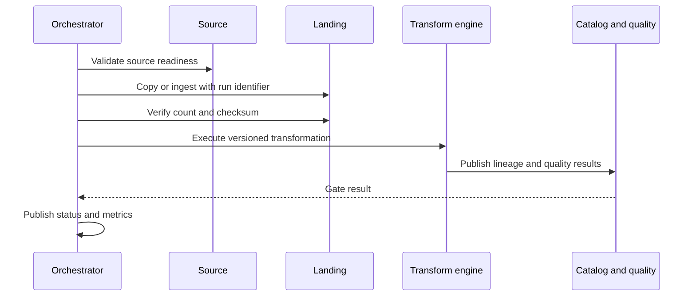
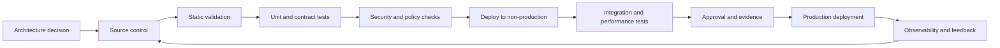

> **文档类型：**数据、AI 和集成实施指南
> **规范性术语：** **MUST**、**MUST NOT**、**SHOULD**、**SHOULD NOT** 和 **MAY** 是要求级别。
> **适用范围：** 跨 Azure、AWS、GCP 和 OCI 的批量、流式传输、CDC、API、文件和应用数据集成。
> **例外流程：** 偏离要求需要记录风险评估、补偿控制、指定风险负责人和到期日期。

|控制领域|价值|
|---|---|
|文件编号 | `DAI-02` |
|负责人|云卓越中心 |
|审核周期|至少每年一次，并且在重大平台、提供商、数据、安全或运营模式发生变化之后 |
|证据|实施计划、配置或代码审查、验证结果和运营就绪证据 |

# Azure Data Factory 和数据集成

> **简要决定：** 独立的连接、移动、转换和编排。使用 Azure Data Factory 作为 Azure 参考实现并跨云保留可移植契约。

## 目的

本文档定义了数据移动和编排的企业标准，使用 Azure Data Factory 作为 Azure 参考实现，并将相同的架构职责映射到 AWS、GCP 和 OCI。

该标准区分了四个不同的问题：连接、移动、转换和编排。选择一种工具来执行所有四种操作通常是一种架构错误。

## 集成模式选择

|模式|使用时 |避免何时|
|---|---|---|
|预定批量复制|数据可以容忍有限的延迟并且源支持提取|需要近乎实时的决策|
|变更数据采集|源日志或变更流可用且顺序很重要 |源无法提供稳定的密钥或日志保留 |
|事件流 |生产者发出业务事件，消费者需要低延迟 |使用事件只是为了弥补糟糕的批量设计|
| API 集成 |需要事务请求/响应和业务验证 |移动大型历史数据集|
|文件交换 |合作伙伴或遗留系统需要文件 |需要低延迟或恰好一次行为 |
|虚拟化/联合 |数据应保留在源头且查询延迟是可以接受的 |源系统无法支持分析负载|

## 参考架构

当 Azure 是执行环境时，Azure Data Factory SHOULD 编排数据集成，但需要大规模 SQL 或 Spark 处理的转换 SHOULD 默认在适当的处理引擎中运行，而不是在编排构造内运行。

## Azure Data Factory 架构标准

生产 Data Factory 部署 SHOULD 使用：

- 生产和非生产工厂分开，或具有经过验证的策略边界的同等隔离；
- 受源和目标支持时的托管虚拟网络和托管私有端点；
- 自托管集成运行时仅应用于无法通过托管连接访问的网络位置；
- 通过多个节点实现自托管运行时的高可用性；
- Azure 资源访问的托管身份；
- 不可避免的机密的 Key Vault 参考；
- Git 支持的开发和基于管道的晋级；
- 诊断日志发送到中央工作区并长期存档；
- 参数化链接服务、数据集和管道；
- 明确的重试、超时、并发和故障路由策略。

自托管集成运行时是一个特权桥梁。它 MUST 进行修补、监控和容量测试，并与一般用户工作负载隔离。它 MUST NOT 安装在域控制器、数据库服务器或共享管理主机上。

## 编排边界

编排服务协调工作。 SHOULD NOT 包含无法独立测试的不透明业务逻辑。复杂的转换逻辑属于版本化的 SQL、Spark、dbt、Dataflow、Glue 或等效的 CodeArtifact。

## 幂等性和重放

每个集成流 MUST 定义其重播行为。批准的方法包括源水印、不可变运行分区、确定性合并键、重复数据删除标识符、事件偏移和事务检查点。重试后可能重复或丢失数据的管道尚未做好生产准备。

对于批量加载，存储源提取时间、流水线运行 ID、源水印、目标提交 ID、记录计数以及校验和或协调结果。对于 CDC 和流，记录偏移量、序列号、模式版本和死信处理。

## 数据质量门

质量规则 SHOULD 在多个阶段执行：

- **摄取：**文件完整性、架构可读性、恶意软件状态、强制元数据；
- **标准化：**类型有效性、密钥存在、重复、参考数据一致性；
- **管理：**业务规则、跨源对账、及时性、完整性；
- **发布：** 契约兼容性、面向消费者的 SLO、隐私和分类检查。

失败的数据 MUST 被隔离，并有足够的上下文来修复和重放。禁止静默删除无效数据。

## 多云能力映射

|责任|Azure|AWS | GCP |OCI |
|---|---|---|---|---|
|编排|Data Factory、Logic Apps、Durable Functions|Step Functions、MWAA、Glue Workflows|Workflows、Cloud Composer|Data Integration、Oracle Integration|
|批量移动|Data Factory 副本 | Glue、DataSync、AppFlow |Data Fusion、Storage Transfer Service|数据集成|
|CDC|Data Factory 连接器、数据库原生 CDC|DMS|Datastream|GoldenGate|
|流传输|Event Hubs|Kinesis、MSK|Pub/Sub|Streaming|
|流处理|Stream Analytics、Databricks|Apache Flink、Glue streaming、EMR 托管服务|Dataflow、Dataproc|Data Flow、GoldenGate Stream Analytics 模式|
|私有混合运行时 |自托管集成运行时 | DMS 代理/连接、DataSync 代理 |Data Fusion 私有连接、应用的代理 |私有端点、服务网关、集成代理（如果适用）|

提供商工具对于契约来说是次要的。可移植的集成设计独立于编排引擎定义源和目标模式、检查点、错误语义、协调可观测性。

## 网络和身份

集成服务需要广泛的覆盖范围，并且是高价值的攻击路径。所需的控制是：

1. 在私有端点或私有服务连接可行的情况下拒绝公共访问。
2. 通过防火墙策略、服务标签、私有服务端点或批准的代理来限制出站目的地。
3. 使用托管身份、IAM 角色、工作负载身份联合或 OCI dynamic groups 而不是静态密钥。
4. 按环境分隔运行时身份，对于敏感工作负载，按域分隔运行时身份。
5. 狭义授予源读和目标写权限；避免所有者或管理员角色。
6. 将连接器机密存储在托管 Vault 中并自动轮换。
7. 记录连接创建、凭证更改、管道发布和数据访问失败。
## 操作要求

至少，按管道或域监控管道成功、持续时间、队列时间、吞吐量、重试、源延迟、水印延迟、运行时 CPU 和内存、连接器限制、目标写入延迟、质量故障以及成本。

告警 SHOULD 将瞬时可重试故障与数据契约违规和平台故障区分开来。没有所有者、运行手册、源、目标和故障类别的通用“流水线故障”告警在操作上很薄弱。

## 性能和规模

- 对大型传输进行分区并测试源系统影响。
- 应用并发限制来保护事务系统。
- 当减少移动且不违反便携性要求时，首选下推或引擎内转换。
- 压缩文件并使用柱状格式进行分析数据。
- 避免许多小文件；紧凑作为平台生命周期的一部分。
- 将提供商配额和 API 限制视为设计输入。
- 在生产之前对自托管或私有运行时进行负载测试。

## CI/CD 和配置

工厂定义、集成代码、模式、质量规则和基础设施 MUST 一起进行版本控制或通过可跟踪的版本进行版本控制。特定于环境的值属于部署参数，而不是复制的流水线定义。生产部署 SHOULD 使用生成的制品，而不是直接从开发人员工作站发布。

## 跨领域的治理要求

平台 MUST 将数据产品、模型、提示、索引、管道和集成接口视为受治理资产。每项资产都需要一个负责任的所有者、分类、生命周期状态、批准的消费者、数据血缘、保留规则和运营目标。平台控制 MUST 通过策略即代码和基础设施即代码应用，而不是手动门户配置。

最低治理控制是：

1. 具有自动元数据收集功能的业务术语表和技术目录。
2. 摄取时的数据分类和转换后的重新分类。
3. 从源到转换、模型或索引、API 和消费者的端到端数据血缘。
4. 平台管理、数据管理、开发和生产运营之间的职责分离。
5. 用于管理操作和访问受监管数据的不可变审计日志。
6. 明确的保留、存档、合法保留和删除程序。
7、具有证据、审批、回滚能力的环境晋级。
8. 定期访问重新认证和控制有效性审查。

## 交付和生命周期标准

所有可部署资源 MUST 在版本控制中表示。合规的交付流程是：

生产变更 MUST 使用可重复的流水线、短期工作负载身份、同行评审和可审核的批准。紧急变更需要追溯相同的证据，且 MUST NOT 成为并行运行模型。

## 集成运行时放置决策

运行时放置是一项安全性和可靠性决策。根据源可达性、数据分类、吞吐量、区域性和管理边界选择运行时。

|运行时模式|正确使用|所需的控制|
|---|---|---|
|公共服务管理路径|批准的公共 SaaS 或服务端点 |受限身份、TLS、目的地验证 |
|托管私有网络|可通过托管私有端点访问 Azure 服务 |私有 DNS、端点审批、监控 |
|自托管企业运行时 |本地或私有网络源 |专用主机、HA 节点、修补、出口控制 |
|特定于域的运行时 |受监管或高通量域 |隔离的身份、网络、配额和所有权|
|临时迁移运行时 |有界迁移窗口|过期、专用凭证、拆卸证据 |

不要仅仅为了简化连接而将不相关的信任区域放置在一个自托管运行时后面。

## 验证

在生产之前，数据集成流程 SHOULD 证明：

1. 纠正源和目标身份，无需广泛的管理员访问权限。
2. 稳定的水印、偏移或运行分区行为。
3.幂等重试和重复处理。
4. 通过并发和提取限制进行源保护。
5. 架构和契约违规路由。
6. 计数、校验和或业务控制协调。
7. 隔离和重播。
8. 凭证轮换和运行时节点丢失。
9. 所有者和故障类别的可观测性。
10. 代表性体积下的成本和吞吐量。

## 连接器生命周期

连接器和驱动程序具有独立的版本、身份验证方法、证书、API 限制和弃用。维护连接器类型、版本、源所有者、凭据、网络路径、数据类和支持状态的清单。

在广泛部署之前，使用代表性源行为测试连接器升级。监控提供商弃用通知和证书更改。不再接收安全修复程序的连接器必须在批准的例外情况下删除或隔离。

## 更改数据采集操作

CDC 设计 MUST 记录保留、依赖性、引导快照、事务排序、模式更改行为、检查点恢复、源故障转移和重新同步。当源日志保留接近未处理的延迟时发出告警。

完整重新快照是一种受控迁移，可能会影响源负载、目标重复项和消费者新鲜度。它需要批准、限制、协调切换计划。

## 相关主题

- [DataOps CI/CD、测试和架构演进最佳实践](dai-dataops-cicd-testing-and-schema-evolution.md)
- [事件流和实时数据平台架构](dai-event-streaming-and-real-time-data-platform.md)
- [数据平台弹性、备份和灾难恢复标准](dai-data-platform-resilience-backup-and-disaster-recovery.md)
- [企业数据治理、目录、数据血缘和质量标准](dai-enterprise-data-governance-catalog-lineage-and-quality.md)

## 反模式
- 使用个人账户授权 SaaS 连接器。
- 在管道 JSON 中嵌入密码、令牌或存储密钥。
- 在无法进行单元测试的复制表达式逻辑中执行大型转换。
- 创建一个全局集成运行时，可以不受限制地访问每个网络。
- 重新处理整个表，因为不存在水印或 CDC 设计。
- 忽略源系统锁定、工作负载影响或 API 速率限制。
- 在协调质量门完成之前宣布成功。
- 创建特定于提供商的管道逻辑，而无需记录出口边界。

## 实施清单

- [ ] 集成模式和延迟目标是明确的。
- [ ] 源契约和目标契约均已版本化。
- [ ] 测试重播、重复数据删除、协调隔离行为。
- [ ] 记录了运行时放置和网络路径。
- [ ] 在支持的情况下使用身份和无机密身份验证。
- [ ] Git 集成和环境升级是自动化的。
- [ ] 管道、运行时间、数据质量和成本遥测是集中的。
- [ ] 源系统容量和节流已经过负载测试。
- [ ] Runbook 涵盖部分加载、损坏的文件、架构漂移和凭据故障。

## 参考文档

- [Azure Data Factory 文档](https://learn.microsoft.com/azure/data-factory/)
- [Azure Architecture Center：现代数据仓库的 DataOps](https://learn.microsoft.com/azure/architecture/databases/architecture/dataops-mdw)
- [AWS Glue 文档](https://docs.aws.amazon.com/glue/)
- [AWS DMS 文档](https://docs.aws.amazon.com/dms/)
- [GCP Dataflow 文档](https://cloud.google.com/dataflow/docs)
- [GCP Datastream 文档](https://cloud.google.com/datastream/docs)
- [OCI 数据集成概述](https://docs.oracle.com/en-us/iaas/Content/data-integration/using/overview.htm)
- [OCI integration network architecture](https://docs.oracle.com/en/solutions/data-application-integration-workloads/)
