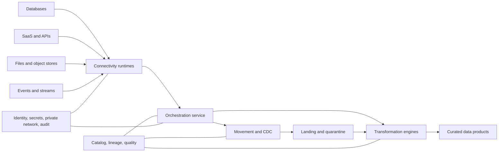
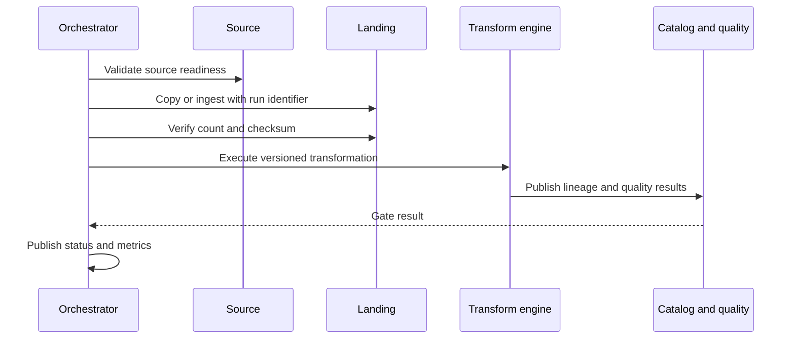
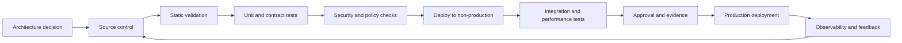

> **Document class:** Data, AI & Integration implementation guide
> **Normative terms:** **MUST**, **MUST NOT**, **SHOULD**, **SHOULD NOT**, and **MAY** are requirements levels.
> **Applicability:** Batch, streaming, CDC, API, file, and application data integration across Azure, AWS, GCP, and OCI.
> **Exception process:** Deviations require a documented risk assessment, compensating controls, named risk owner, and expiry date.

| Control field | Value |
|---|---|
| Document ID | `DAI-02` |
| Owner | Cloud Center of Excellence |
| Review cycle | At least annually and after material platform, provider, data, security, or operating-model changes |
| Evidence | Implementation plan, configuration or code review, validation results, and operational readiness evidence |

# Azure Data Factory and Data Integration

> **Decision in brief:** Separate connectivity, movement, transformation, and orchestration. Use Azure Data Factory as the Azure reference implementation and preserve portable contracts across clouds.

## Purpose

This document defines the enterprise standard for data movement and orchestration, using Azure Data Factory as the Azure reference implementation and mapping the same architectural responsibilities to AWS, GCP, and OCI.

The standard distinguishes four separate concerns: connectivity, movement, transformation, and orchestration. Selecting one tool to perform all four is usually an architectural error.

## Integration Pattern Selection

| Pattern | Use when | Avoid when |
|---|---|---|
| Scheduled batch copy | Data can tolerate bounded delay and source supports extracts | near-real-time decisions are required |
| Change data capture | Source logs or change streams are available and order matters | source cannot provide stable keys or log retention |
| Event streaming | Producers emit business events and consumers need low latency | using events only to compensate for poor batch design |
| API integration | Transactional request/response and business validation are required | moving large historical datasets |
| File exchange | Partner or legacy systems require files | low-latency or exactly-once behavior is required |
| Virtualization/federation | Data should remain at source and query latency is acceptable | source systems cannot support analytical load |

## Reference Architecture

Azure Data Factory SHOULD orchestrate data integration when Azure is the execution environment, but transformations that require large-scale SQL or Spark processing SHOULD run in the appropriate processing engine rather than inside an orchestration construct by default.

## Azure Data Factory Architecture Standard

A production Data Factory deployment SHOULD use:

- separate factories for production and non-production, or equivalent isolation with proven policy boundaries;
- managed virtual network and managed private endpoints when supported by the source and target;
- self-hosted integration runtime only for network locations unreachable through managed connectivity;
- high availability for self-hosted runtimes through multiple nodes;
- managed identity for Azure resource access;
- Key Vault references for unavoidable secrets;
- Git-backed development and pipeline-based promotion;
- diagnostic logs sent to a central workspace and long-term archive;
- parameterized linked services, datasets, and pipelines;
- explicit retry, timeout, concurrency, and failure-routing policies.

A self-hosted integration runtime is a privileged bridge. It MUST be patched, monitored, capacity-tested, and isolated from general user workloads. It MUST NOT be installed on domain controllers, database servers, or shared administrative hosts.

## Orchestration Boundaries

The orchestration service coordinates work. It SHOULD NOT contain opaque business logic that cannot be tested independently. Complex transformation logic belongs in versioned SQL, Spark, dbt, Dataflow, Glue, or equivalent code artifacts.

## Idempotency and Replay

Every integration flow MUST define its replay behavior. Approved approaches include source watermarking, immutable run partitions, deterministic merge keys, deduplication identifiers, event offsets, and transactional checkpoints. A pipeline that can duplicate or lose data after retry is not production-ready.

For batch loads, store the source extract time, pipeline run ID, source watermark, target commit ID, record counts, and checksum or reconciliation result. For CDC and streams, record offsets, sequence numbers, schema versions, and dead-letter disposition.

## Data Quality Gates

Quality rules SHOULD execute at multiple stages:

- **ingestion:** file integrity, schema readability, malware status, mandatory metadata;
- **standardization:** type validity, key presence, duplication, reference-data conformity;
- **curation:** business rules, cross-source reconciliation, timeliness, completeness;
- **publication:** contract compatibility, consumer-facing SLO, privacy and classification checks.

Failed data MUST be quarantined with enough context to remediate and replay. Silently dropping invalid data is prohibited.

## Multi-Cloud Capability Mapping

| Responsibility | Azure | AWS | GCP | OCI |
|---|---|---|---|---|
| Orchestration | Data Factory, Logic Apps, Durable Functions | Step Functions, MWAA, Glue Workflows | Workflows, Cloud Composer | Data Integration, Oracle Integration |
| Batch movement | Data Factory Copy | Glue, DataSync, AppFlow | Data Fusion, Storage Transfer Service | Data Integration |
| CDC | Data Factory connectors, database-native CDC | Database Migration Service | Datastream | GoldenGate |
| Stream transport | Event Hubs | Kinesis, MSK | Pub/Sub | Streaming |
| Stream processing | Stream Analytics, Databricks | Managed Service for Apache Flink, Glue streaming, EMR | Dataflow, Dataproc | Data Flow, GoldenGate Stream Analytics patterns |
| Private hybrid runtime | Self-hosted integration runtime | DMS agents/connectivity, DataSync agents | Data Fusion private connectivity, agents where applicable | Private endpoints, service gateways, integration agents where applicable |

The provider tool is secondary to the contract. A portable integration design defines source and target schemas, checkpoints, error semantics, reconciliation, and observability independently from the orchestration engine.

## Network and Identity

Integration services require broad reach and are high-value attack paths. Required controls are:

1. Deny public access where private endpoints or private service connectivity are feasible.
2. Restrict outbound destinations through firewall policy, service tags, private service endpoints, or approved proxies.
3. Use managed identities, IAM roles, workload identity federation, or OCI dynamic groups instead of static keys.
4. Separate runtime identities by environment and, for sensitive workloads, by domain.
5. Grant source read and target write permissions narrowly; avoid owner or administrator roles.
6. Store connector secrets in a managed vault and rotate automatically.
7. Log connection creation, credential changes, pipeline publication, and data-access failures.

## Operational Requirements

At minimum, monitor pipeline success, duration, queue time, throughput, retries, source latency, watermark lag, runtime CPU and memory, connector throttling, target write latency, quality failures, and cost by pipeline or domain.

Alerting SHOULD distinguish transient retryable faults from data-contract violations and platform failures. A generic “pipeline failed” alert without owner, runbook, source, target, and failure category is operationally weak.

## Performance and Scale

- Partition large transfers and test source-system impact.
- Apply concurrency limits to protect transactional systems.
- Prefer pushdown or in-engine transformation when it reduces movement and does not violate portability requirements.
- Compress files and use columnar formats for analytical data.
- Avoid many tiny files; compact as part of the platform lifecycle.
- Treat provider quotas and API throttles as design inputs.
- Load-test self-hosted or private runtimes before production.

## CI/CD and Configuration

Factory definitions, integration code, schemas, quality rules, and infrastructure MUST be versioned together or through traceable releases. Environment-specific values belong in deployment parameters, not copied pipeline definitions. Production deployment SHOULD use generated artifacts rather than publishing directly from a developer workstation.

## Cross-cutting governance requirements

The platform MUST treat data products, models, prompts, indexes, pipelines, and integration interfaces as governed assets. Each asset requires an accountable owner, classification, lifecycle state, approved consumers, lineage, retention rules, and operational objectives. Platform controls MUST be applied through policy-as-code and infrastructure-as-code rather than manual portal configuration.

Minimum governance controls are:

1. A business glossary and technical catalog with automated metadata harvesting.
2. Data classification at ingestion and reclassification after transformation.
3. End-to-end lineage from source through transformation, model or index, API, and consumer.
4. Segregation of duties between platform administration, data stewardship, development, and production operations.
5. Immutable audit logging for administrative actions and access to regulated data.
6. Explicit retention, archival, legal-hold, and deletion procedures.
7. Environment promotion with evidence, approval, and rollback capability.
8. Periodic access recertification and control-effectiveness reviews.

## Delivery and lifecycle standard

All deployable resources MUST be represented in version control. A compliant delivery flow is:

Production changes MUST use repeatable pipelines, short-lived workload identities, peer review, and auditable approvals. Emergency changes require the same evidence retrospectively and MUST not become a parallel operating model.

## Integration Runtime Placement Decision

Runtime placement is a security and reliability decision. Select the runtime based on source reachability, data classification, throughput, regionality, and administrative boundary.

| Runtime pattern | Appropriate use | Required controls |
|---|---|---|
| Managed public service path | approved public SaaS or service endpoint | restricted identity, TLS, destination validation |
| Managed private network | Azure services reachable by managed private endpoint | private DNS, endpoint approval, monitoring |
| Self-hosted enterprise runtime | on-premises or private network source | dedicated hosts, HA nodes, patching, egress control |
| Domain-specific runtime | regulated or high-throughput domain | isolated identity, network, quotas, and ownership |
| Temporary migration runtime | bounded migration window | expiry, dedicated credentials, teardown evidence |

Do not place unrelated trust zones behind one self-hosted runtime merely to simplify connectivity.

## Validation

Before production, a data-integration flow SHOULD prove:

1. Correct source and target identities with no broad administrator access.
2. Stable watermark, offset, or run-partition behavior.
3. Idempotent retry and duplicate handling.
4. Source protection through concurrency and extraction limits.
5. Schema and contract violation routing.
6. Count, checksum, or business-control reconciliation.
7. Quarantine and replay.
8. Credential rotation and runtime-node loss.
9. Observability with owner and failure category.
10. Cost and throughput under representative volume.

## Connector Lifecycle

Connectors and drivers have independent versions, authentication methods, certificates, API limits, and deprecations. Maintain an inventory of connector type, version, source owner, credentials, network path, data classes, and support status.

Test connector upgrades with representative source behavior before broad rollout. Monitor provider deprecation notices and certificate changes. A connector that no longer receives security fixes must be removed or isolated under an approved exception.

## Change Data Capture Operations

CDC designs MUST document log-retention dependency, bootstrap snapshot, transaction ordering, schema-change behavior, checkpoint recovery, source failover, and resynchronization. Alert when source log retention approaches the unprocessed lag.

A full resnapshot is a controlled migration that can affect source load, target duplicates, and consumer freshness. It requires approval, throttling, reconciliation, and a cutover plan.

## Related topics

- [DataOps CI/CD, Testing, and Schema Evolution Best Practices](dai-dataops-cicd-testing-and-schema-evolution.md)
- [Event Streaming and Real-Time Data Platform Architecture](dai-event-streaming-and-real-time-data-platform.md)
- [Data Platform Resilience, Backup, and Disaster Recovery Standard](dai-data-platform-resilience-backup-and-disaster-recovery.md)
- [Enterprise Data Governance, Catalog, Lineage, and Quality Standard](dai-enterprise-data-governance-catalog-lineage-and-quality.md)

## Anti-patterns
- Using a personal account to authorize SaaS connectors.
- Embedding passwords, tokens, or storage keys in pipeline JSON.
- Performing large transformations in copy-expression logic that cannot be unit-tested.
- Creating one global integration runtime with unrestricted access to every network.
- Reprocessing entire tables because no watermark or CDC design exists.
- Ignoring source-system locking, workload impact, or API rate limits.
- Declaring success before reconciliation and quality gates complete.
- Creating provider-specific pipeline logic without documented exit boundaries.

## Implementation Checklist

- [ ] Integration pattern and latency objective are explicit.
- [ ] Source and target contracts are versioned.
- [ ] Replay, deduplication, reconciliation, and quarantine behavior are tested.
- [ ] Runtime placement and network paths are documented.
- [ ] Identity and secretless authentication are used where supported.
- [ ] Git integration and environment promotion are automated.
- [ ] Pipeline, runtime, data-quality, and cost telemetry are centralized.
- [ ] Source-system capacity and throttling have been load-tested.
- [ ] Runbooks cover partial loads, corrupted files, schema drift, and credential failure.

## References

- [Azure Data Factory documentation](https://learn.microsoft.com/azure/data-factory/)
- [Azure Architecture Center: DataOps for the modern data warehouse](https://learn.microsoft.com/azure/architecture/databases/architecture/dataops-mdw)
- [AWS Glue documentation](https://docs.aws.amazon.com/glue/)
- [AWS Database Migration Service documentation](https://docs.aws.amazon.com/dms/)
- [GCP Dataflow documentation](https://cloud.google.com/dataflow/docs)
- [GCP Datastream documentation](https://cloud.google.com/datastream/docs)
- [OCI Data Integration overview](https://docs.oracle.com/en-us/iaas/Content/data-integration/using/overview.htm)
- [OCI integration network architecture](https://docs.oracle.com/en/solutions/data-application-integration-workloads/)
