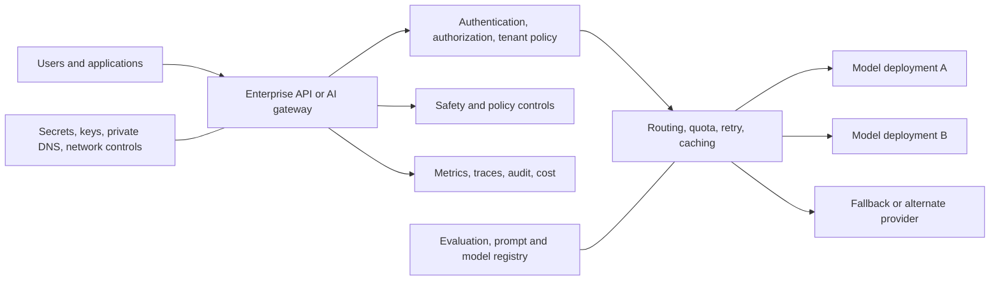
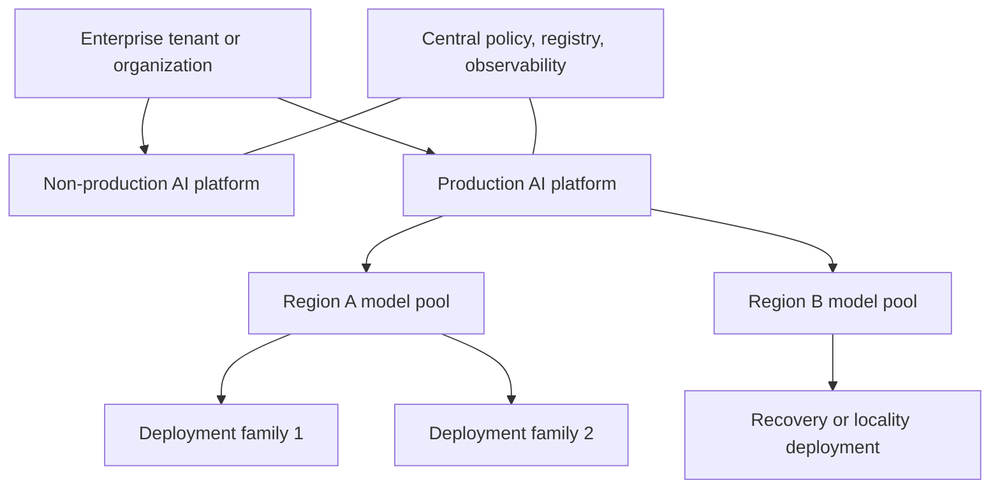
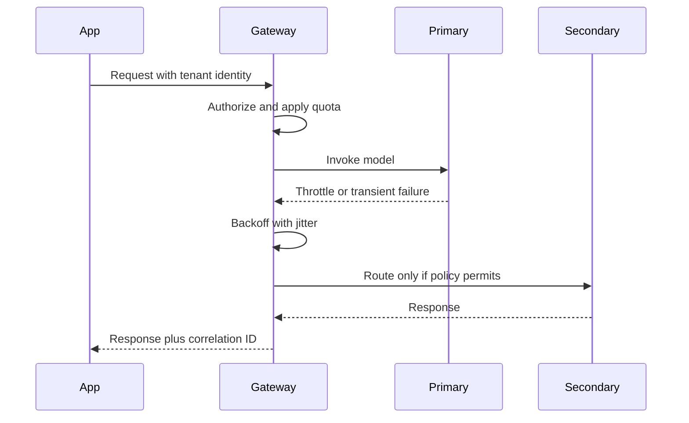
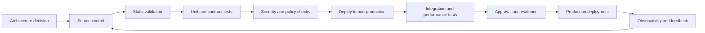

> **文档类型：**数据、AI 和集成架构参考模型
> **规范性术语：** **MUST**、**MUST NOT**、**SHOULD**、**SHOULD NOT** 和 **MAY** 是要求级别。
> **适用范围：** 企业基础——模型接入、网关、模型部署、安全、身份、网络、评估、成本控制。
> **例外流程：** 偏离要求需要记录风险评估、补偿控制、指定风险负责人和到期日期。

|控制领域|价值|
|---|---|
|文件编号 | `DAI-05` |
|负责人|云卓越中心 |
|审核周期|至少每年一次，并且在重大平台、提供商、数据、安全或运营模式发生变化之后 |
|证据|架构决策、网关和模型配置、安全审查、评估结果和运营就绪证据 |

# Azure OpenAI 平台架构

> **决策简述：** 通过集中身份、网络、配额、安全、遥测、评估和成本的受管理平台进行消息代理基础模型访问。

## 目的

本文档定义了基础模型访问的企业体系结构，使用 Microsoft Foundry 中的 Azure OpenAI 作为 Azure 参考实现。同等责任应用于 Amazon Bedrock、Google Vertex AI 和 OCI Generative AI。

平台目标是受控的模型使用，而不仅仅是公开的提供商端点。生产平台必须管理身份、网络访问、模型选择、配额、安全性、可观测性、评估、数据处理和成本。

## 参考架构

对于有限的低风险工作负载，允许应用直接访问模型 MAY，但企业 SHOULD 在需要集中租户配额、模型抽象、故障转移、策略执行、内容控制、详细使用遥测或多个提供商时使用网关或代理。

## 资源环境拓扑

生产和非生产模型资源 MUST 被分开。受监管的数据、业务部门配额隔离、不同的数据驻留或截然不同的安全策略需要额外的分离。

在不了解提供商配额和爆炸半径的情况下，请勿将每个应用置于单个模型资源后面。相反，为每个应用创建资源可能会分散容量和治理。平台团队 SHOULD 按区域、数据边界、关键性和配额域定义资源池。

## 网关职责

AI 网关 SHOULD 仅提供操作合理的功能。典型的职责是：

- 基于令牌的应用身份验证；
- 租户和应用授权；
- 请求和令牌配额；
- 部署路由和健康感知故障转移；
- 具有指数退避和抖动的有界重试；
- 请求大小和超时执行；
- 提示-模板版本解析；
- 内容安全和策略检查；
- 在隐私允许的情况下进行语义或精确缓存；
- 跟踪关联和使用度量；
- 脱敏或结构化日志记录控制；
- 选定用例的提供商抽象。

网关不能替代应用级评估、业务数据授权或提示注入防御。

## 模型选择和生命周期

根据明确的要求选择模型 MUST 满足以下要求：任务质量、上下文大小、延迟、吞吐量、语言支持、工具使用、安全行为、区域可用性、数据处理、生命周期和单位成本。 “使用最有能力的模型”不是架构决策。

模型或部署更改需要：

1.版本化评估数据集；
2.质量和安全阈值；
3. 延迟和负载测试；
4、成本比较；
5.回归和兼容性审查；
6. 分阶段推出或金丝雀；
7.回滚路径；
8.更新了模型卡和操作记录。

## 身份和网络

应用 SHOULD 使用托管身份、工作负载身份联合、IAM 角色或 OCI resource principals 进行身份验证。静态 API 密钥属于例外情况，必须妥善保管、轮换、限定范围并监控。

生产模型端点 SHOULD 在支持的情况下使用私有连接。私有端点设计必须包括 DNS、出口路径、网关放置、构建代理、操作访问以及相关服务（例如搜索、存储、内容安全或遥测）。

人类开发者 MUST NOT 接收不受限制的生产模型密钥。开发访问应使用个人联邦身份和有限配额。

## 数据处理

应用所有者 MUST 对提示、附件、检索的上下文、工具输出、对话历史记录和生成的内容进行分类。平台 MUST 定义哪些字段可以被记录、缓存、保留或用于评估。

所需的控制包括：

- 输入最小化和目的限制；
- 在可行的情况下对敏感字段进行脱敏或标记化；
- 明确的对话保留策略；
- 提示中没有机密；
- 检索或工具执行之前的授权；
- 租户数据分离；
- 加密传输和存储；
- 删除过程，涵盖日志、缓存、索引和评估存储；
- 提供商数据处理和区域性审查。

## 配额、吞吐量和弹性

基础模型服务施加请求、令牌、容量和区域限制。应用 MUST 显式处理节流。重试逻辑必须受到限制，并且不得放大过载。

推荐模式：

应用 SHOULD 支持长时间任务的异步处理、优雅降级、质量允许的较小模型回退以及断路。仅在测试语义差异、数据边界和成本后，多区域或多提供商故障转移才合理。

## 多云能力映射

|责任|Azure|AWS | GCP |OCI |
|---|---|---|---|---|
|管理基础模型| Azure OpenAI / Foundry 模型 |Amazon Bedrock |Vertex AI | OCI Generative AI |
|AI 开发平台|Microsoft Foundry | SageMaker 和 Bedrock 工具 |Vertex AI | OCI Generative AI 和 AI 数据平台功能 |
| API 网关| API Management/自定义网关| API Gateway/自定义网关| Apigee / API Gateway | OCI API Gateway |
|私有连接 |私有链接 |私有链接 |私有服务连接 |私有端点/服务网关|
|身份 | Microsoft Entra ID 和托管身份| IAM 角色 | IAM 和工作负载身份联合 | IAM 策略和资源主体 |
|监控| Azure Monitor/Application Insights | CloudWatch / X-Ray |Cloud Monitoring/Cloud Trace | OCI Monitoring/Logging/APM |

## 可观测性

采集请求计数、输入和输出令牌、模型和部署、租户、延迟、首个令牌时间（TTFT）、限制、重试、安全操作、缓存命中率、工具调用、检索指标、错误和估计成本。默认情况下不记录原始提示或响应内容。

分布式跟踪 SHOULD 链接用户请求、网关、检索、模型调用、工具和下游操作。必须对敏感跟踪属性进行脱敏。

## 安全和负责任的使用

平台控制 SHOULD 包括内容审核、提示注入检测、滥用监控、输出验证以及高影响力决策的人工审核。这些控件必须根据应用进行调整；一般提供商的默认行为并不足以证明安全。

应用 MUST 明确定义禁止使用、升级路径、需要时的用户披露以及不确定或不支持的输出的处理。

## 成本架构

成本由令牌数量、模型选择、配置容量、检索调用、网关基础设施、安全服务、日志记录和重试决定。所需的控制包括预算阈值、每个租户度量、最大输出令牌、上下文大小规则、模型分层、缓存策略以及使用实际提示分布的负载测试。

## 跨领域的治理要求

平台 MUST 将数据产品、模型、提示、索引、管道和集成接口视为受治理资产。每项资产都需要一个负责任的所有者、分类、生命周期状态、批准的消费者、数据血缘、保留规则和运营目标。平台控制 MUST 通过策略即代码和基础设施即代码应用，而不是手动门户配置。

最低治理控制是：

1. 具有自动元数据收集功能的业务术语表和技术目录。
2. 摄取时的数据分类和转换后的重新分类。
3. 从源到转换、模型或索引、API 和消费者的端到端数据血缘。
4. 平台管理、数据管理、开发和生产运营之间的职责分离。
5. 用于管理操作和访问受监管数据的不可变审计日志。
6. 明确的保留、存档、合法保留和删除程序。
7、具有证据、审批、回滚能力的环境晋级。
8. 定期访问重新认证和控制有效性审查。

## 交付和生命周期标准

所有可部署资源 MUST 在版本控制中表示。合规的交付流程是：

生产变更 MUST 使用可重复的流水线、短期工作负载身份、同行评审和可审核的批准。紧急变更需要追溯相同的证据，且 MUST NOT 成为并行运行模型。

## 部署清单和容量域

平台 MUST 维护模型部署清单，包括模型名称和版本、部署类型、区域、配额域、容量、所有者、批准的用例、数据边界、生命周期日期和相关应用。

将 SHOULD 容量划分为显式域，以便一个租户、评估工作负载或重试风暴无法耗尽关键生产访问。当配额或数据策略不同时，分离交互式生产、批量、评估、开发和监管工作负载。

## 退休准备模型

提供商管理的模型具有生命周期和停用日期。平台 SHOULD 持续将已部署的模型映射到已发布的生命周期状态，并在迁移窗口变得关键之前通知应用所有者。

退休计划 SHOULD 包括：

1. 候选替代模型和区域可用性。
2.针对当前生产任务的回归评估。
3. 提示、工具和输出模式兼容性。
4. 容量和配额可用性。
5. 安全性、延迟和成本比较。
6. 金丝雀或影子部署。
7.消费者沟通和回滚窗口。
8. 删除过时的部署和引用。

不要等到停用截止日期才发现所需区域或配额层中没有替代模型。

## 网关故障模式

网关是一个关键的依赖项，并且必须可以预见地发生故障。

|失败|所需行为|
|---|---|
|认证服务不可用 |关闭失败；仅在设计时才使用经批准的服务到服务缓存 |
|策略存储不可用 |高风险行为未能关闭；经批准的有界安全策略缓存 |
|主要模型节流 |退避、队列或策略批准的替代方案 |
|遥测不可用 |尽量减少缓冲或停止高风险处理；永远不要在本地记录机密 |
|配额服务不一致|执行保守的地方上限|
|缓存不可用 |绕过而不改变授权或正确性|
|备用提供商在语义上有所不同 |仅用于经过验证的工作负载并披露降级模式 |

测试网关重启、区域故障、过时的配置、重复请求、流中断和部分提供商响应。

## 提示和配置注册表

系统提示、路由规则、安全设置、工具定义、模型参数和评估阈值 MUST 作为版本化资产进行管理。注册表 SHOULD 记录所有权、环境、兼容模型、生效日期、批准和回滚版本。

应用 SHOULD 请求不可变的批准版本，而不是默默地使用最新的可变提示或策略。

## 相关主题

- [AI 安全、身份和负责任的 AI](dai-ai-security-identity-and-responsible-ai.md)
- [AI 应用的生产运营](dai-production-operations-for-ai-applications.md)
- [企业 RAG 和 AI 搜索](dai-enterprise-rag-and-ai-search.md)
- [AI 与数据成本架构](dai-ai-and-data-cost-architecture.md)

## 反模式
- 向应用团队发布提供商 API 密钥。
- 记录所有提示和响应，无需分类和保留控制。
- 立即无限期地重试受限制的调用。
- 对所有租户使用一种部署，无需配额隔离。
- 假设私有网络可防止提示注入或未经授权的检索。
- 更改模型版本而不进行回归评估。
- 当只需要最少的上下文时发送完整的文档或数据库行。
- 构建一个提供商抽象层，隐藏重要的语义差异并且从未经过测试。

## 验证

- [ ] 已分配业务所有者、技术所有者、数据所有者和支持所有者。
- [ ] 记录数据分类、驻留、主权、保留和删除要求。
- [ ] 身份使用联合或托管工作负载身份；不允许嵌入凭据。
- [ ] 公共网络暴露被禁用，除非记录在案的例外情况得到批准。
- [ ] 定义了加密、密钥所有权、轮换和 break-glass 程序。
- [ ] 测试可用性、恢复、可扩展性和容量假设。
- [ ] 日志、指标、跟踪、数据血缘和成本分配在生产前实施。
- [ ] 执行部署、回滚、备份恢复和灾难恢复过程。
- [ ] 记录服务限制、配额、区域依赖性和特定于提供商的约束。
- [ ] 退出策略和可移植性边界是明确的。

## 参考文档

- [Microsoft Foundry 架构](https://learn.microsoft.com/azure/foundry/concepts/architecture)
- [Microsoft Foundry 模型退役时间表](https://learn.microsoft.com/azure/foundry/openai/concepts/model-retirement-schedule)
- [Azure Architecture Center：基准 Microsoft Foundry 聊天架构](https://learn.microsoft.com/azure/architecture/ai-ml/architecture/baseline-microsoft-foundry-chat)
- [Azure Architecture Center：Azure OpenAI 网关指南](https://learn.microsoft.com/azure/architecture/ai-ml/guide/azure-openai-gateway-guide)
- [AWS 生成式 AI 镜头](https://docs.aws.amazon.com/wellarchitected/latest/generative-ai-lens/)
- [Vertex AI 上的生成式 AI](https://docs.cloud.google.com/vertex-ai/generative-ai/docs)
- [OCI Generative AI 文档](https://docs.oracle.com/en-us/iaas/Content/generative-ai/home.htm)
