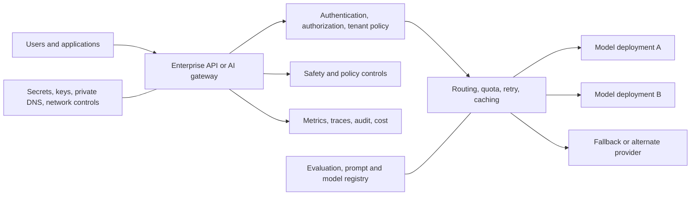
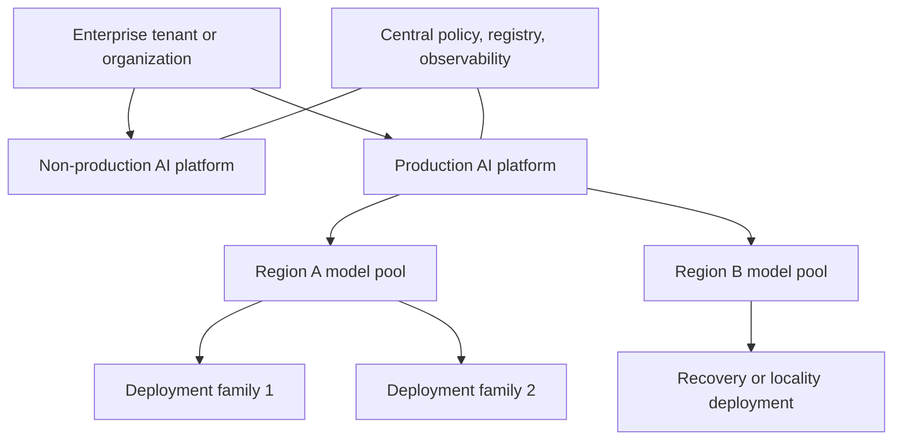
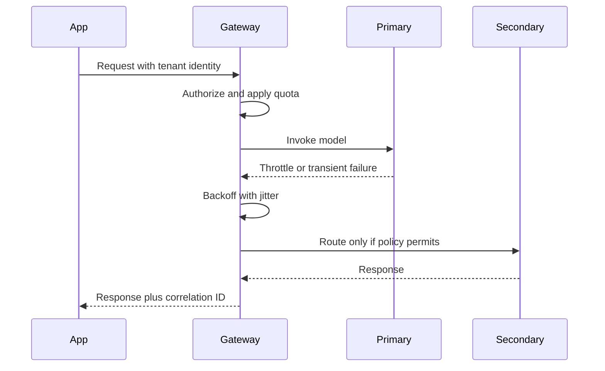
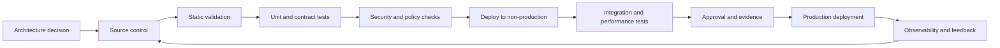

> **Document class:** Data, AI & Integration architecture reference model
> **Normative terms:** **MUST**, **MUST NOT**, **SHOULD**, **SHOULD NOT**, and **MAY** are requirements levels.
> **Applicability:** Enterprise foundation-model access, gateway, model deployment, safety, identity, network, evaluation, and cost controls.
> **Exception process:** Deviations require a documented risk assessment, compensating controls, named risk owner, and expiry date.

| Control field | Value |
|---|---|
| Document ID | `DAI-05` |
| Owner | Cloud Center of Excellence |
| Review cycle | At least annually and after material platform, provider, data, security, or operating-model changes |
| Evidence | Architecture decision, gateway and model configuration, safety review, evaluation results, and operational readiness evidence |

# Azure OpenAI Platform Architecture

> **Decision in brief:** Broker foundation-model access through a governed platform that centralizes identity, network, quotas, safety, telemetry, evaluation, and cost.

## Purpose

This document defines the enterprise architecture for foundation-model access, using Azure OpenAI within Microsoft Foundry as the Azure reference implementation. Equivalent responsibilities apply to Amazon Bedrock, Google Vertex AI, and OCI Generative AI.

The platform objective is controlled model consumption, not merely exposing a provider endpoint. A production platform must govern identity, network access, model selection, quotas, safety, observability, evaluation, data handling, and cost.

## Reference Architecture

Direct application-to-model access MAY be permitted for bounded low-risk workloads, but the enterprise SHOULD use a gateway or broker when it needs centralized tenant quotas, model abstraction, failover, policy enforcement, content controls, detailed usage telemetry, or multiple providers.

## Resource and Environment Topology

Production and non-production model resources MUST be separated. Additional separation is required for regulated data, business-unit quota isolation, distinct data residency, or materially different safety policy.

Do not place every application behind a single model resource without understanding provider quotas and blast radius. Conversely, creating a resource per application can fragment capacity and governance. The platform team SHOULD define resource pools by region, data boundary, criticality, and quota domain.

## Gateway Responsibilities

An AI gateway SHOULD provide only capabilities that are operationally justified. Typical responsibilities are:

- token-based application authentication;
- tenant and application authorization;
- request and token quotas;
- deployment routing and health-aware failover;
- bounded retry with exponential backoff and jitter;
- request-size and timeout enforcement;
- prompt-template version resolution;
- content safety and policy checks;
- semantic or exact caching where privacy permits;
- trace correlation and usage metering;
- redaction or structured logging controls;
- provider abstraction for selected use cases.

A gateway is not a substitute for application-level evaluation, authorization to business data, or prompt-injection defenses.

## Model Selection and Lifecycle

Models MUST be selected against explicit requirements: task quality, context size, latency, throughput, language support, tool use, safety behavior, regional availability, data handling, lifecycle, and unit cost. “Use the most capable model” is not an architecture decision.

A model or deployment change requires:

1. versioned evaluation dataset;
2. quality and safety thresholds;
3. latency and load test;
4. cost comparison;
5. regression and compatibility review;
6. staged rollout or canary;
7. rollback path;
8. updated model card and operational record.

## Identity and Network

Applications SHOULD authenticate with managed identity, workload identity federation, IAM roles, or OCI resource principals. Static API keys are exceptions and must be vaulted, rotated, scoped, and monitored.

Production model endpoints SHOULD use private connectivity where supported. Private endpoint design must include DNS, egress paths, gateway placement, build agents, operations access, and dependent services such as search, storage, content safety, or telemetry.

Human developers MUST NOT receive unrestricted production model keys. Development access should use individual federated identity and bounded quotas.

## Data Handling

The application owner MUST classify prompts, attachments, retrieved context, tool outputs, conversation history, and generated content. The platform MUST define which fields may be logged, cached, retained, or used for evaluation.

Required controls include:

- input minimization and purpose limitation;
- redaction or tokenization of sensitive fields where feasible;
- explicit conversation-retention policy;
- no secrets in prompts;
- authorization before retrieval or tool execution;
- separation of tenant data;
- encrypted transit and storage;
- deletion process covering logs, caches, indexes, and evaluation stores;
- provider data-processing and regionality review.

## Quota, Throughput, and Resilience

Foundation-model services impose request, token, capacity, and regional constraints. Applications MUST handle throttling explicitly. Retry logic must be bounded and must not amplify overload.

Recommended pattern:

Applications SHOULD support asynchronous processing for long tasks, graceful degradation, smaller-model fallback where quality permits, and circuit breaking. Multi-region or multi-provider failover is justified only after testing semantic differences, data boundaries, and cost.

## Multi-Cloud Capability Mapping

| Responsibility | Azure | AWS | GCP | OCI |
|---|---|---|---|---|
| Managed foundation models | Azure OpenAI / Foundry Models | Amazon Bedrock | Vertex AI | OCI Generative AI |
| AI development platform | Microsoft Foundry | SageMaker and Bedrock tooling | Vertex AI | OCI Generative AI and AI Data Platform capabilities |
| API gateway | API Management / custom gateway | API Gateway / custom gateway | Apigee / API Gateway | OCI API Gateway |
| Private connectivity | Private Link | PrivateLink | Private Service Connect | Private endpoints / service gateways |
| Identity | Microsoft Entra ID and managed identity | IAM roles | IAM and workload identity federation | IAM policies and resource principals |
| Monitoring | Azure Monitor / Application Insights | CloudWatch / X-Ray | Cloud Monitoring / Trace | OCI Monitoring / Logging / APM |

## Observability

Capture request count, input and output tokens, model and deployment, tenant, latency, time to first token, throttles, retries, safety actions, cache hit rate, tool calls, retrieval metrics, errors, and estimated cost. Do not log raw prompt or response content by default.

Distributed traces SHOULD link the user request, gateway, retrieval, model call, tools, and downstream actions. Sensitive trace attributes must be redacted.

## Safety and Responsible Use

Platform controls SHOULD include content moderation, prompt-injection detection, abuse monitoring, output validation, and human review for high-impact decisions. These controls must be tuned to the application; generic provider defaults are not sufficient evidence of safety.

Applications MUST clearly define prohibited uses, escalation paths, user disclosure where required, and handling of uncertain or unsupported outputs.

## Cost Architecture

Cost is driven by token volume, model choice, provisioned capacity, retrieval calls, gateway infrastructure, safety services, logging, and retries. Required controls include budget thresholds, per-tenant metering, maximum output tokens, context-size discipline, model tiering, cache policy, and load testing with realistic prompt distributions.

## Cross-cutting governance requirements

The platform MUST treat data products, models, prompts, indexes, pipelines, and integration interfaces as governed assets. Each asset requires an accountable owner, classification, lifecycle state, approved consumers, lineage, retention rules, and operational objectives. Platform controls MUST be applied through policy-as-code and infrastructure-as-code rather than manual portal configuration.

Minimum governance controls are:

1. A business glossary and technical catalog with automated metadata harvesting.
2. Data classification at ingestion and reclassification after transformation.
3. End-to-end lineage from source through transformation, model or index, API, and consumer.
4. Segregation of duties between platform administration, data stewardship, development, and production operations.
5. Immutable audit logging for administrative actions and access to regulated data.
6. Explicit retention, archival, legal-hold, and deletion procedures.
7. Environment promotion with evidence, approval, and rollback capability.
8. Periodic access recertification and control-effectiveness reviews.

## Delivery and lifecycle standard

All deployable resources MUST be represented in version control. A compliant delivery flow is:

Production changes MUST use repeatable pipelines, short-lived workload identities, peer review, and auditable approvals. Emergency changes require the same evidence retrospectively and MUST not become a parallel operating model.

## Deployment Inventory and Capacity Domains

The platform MUST maintain an inventory of model deployments including model name and version, deployment type, region, quota domain, capacity, owner, approved use cases, data boundary, lifecycle dates, and dependent applications.

Capacity SHOULD be divided into explicit domains so that one tenant, evaluation workload, or retry storm cannot exhaust critical production access. Separate interactive production, batch, evaluation, development, and regulated workloads when quotas or data policy differ.

## Model Retirement Readiness

Provider-managed models have lifecycle and retirement dates. The platform SHOULD continuously map deployed models to published lifecycle status and notify application owners before the migration window becomes critical.

A retirement plan SHOULD include:

1. Candidate replacement models and regional availability.
2. Regression evaluation against current production tasks.
3. Prompt, tool, and output-schema compatibility.
4. Capacity and quota availability.
5. Safety, latency, and cost comparison.
6. Canary or shadow deployment.
7. Consumer communication and rollback window.
8. Removal of obsolete deployments and references.

Do not wait for a retirement deadline to discover that a replacement model is unavailable in the required region or quota tier.

## Gateway Failure Modes

The gateway is a critical dependency and must fail predictably.

| Failure | Required behavior |
|---|---|
| Authentication service unavailable | fail closed; use approved service-to-service cache only if designed |
| Policy store unavailable | fail closed for high-risk actions; bounded safe policy cache where approved |
| Primary model throttled | backoff, queue, or policy-approved alternate |
| Telemetry unavailable | buffer minimally or stop high-risk processing; never log secrets locally |
| Quota service inconsistent | enforce conservative local ceiling |
| Cache unavailable | bypass without changing authorization or correctness |
| Alternate provider differs semantically | use only for validated workloads and disclose degraded mode |

Test gateway restart, regional failure, stale configuration, duplicate request, streaming interruption, and partial provider response.

## Prompt and Configuration Registry

System prompts, routing rules, safety settings, tool definitions, model parameters, and evaluation thresholds MUST be versioned assets. The registry SHOULD record ownership, environment, compatible models, effective dates, approvals, and rollback version.

Applications SHOULD request an immutable approved version rather than silently consuming the latest mutable prompt or policy.

## Related topics

- [AI Security, Identity, and Responsible AI](dai-ai-security-identity-and-responsible-ai.md)
- [Production Operations for AI Applications](dai-production-operations-for-ai-applications.md)
- [Enterprise RAG and AI Search](dai-enterprise-rag-and-ai-search.md)
- [AI and Data Cost Architecture](dai-ai-and-data-cost-architecture.md)

## Anti-patterns
- Publishing provider API keys to application teams.
- Logging all prompts and responses without classification and retention controls.
- Retrying throttled calls immediately and indefinitely.
- Using one deployment for all tenants without quota isolation.
- Assuming private networking prevents prompt injection or unauthorized retrieval.
- Changing model versions without regression evaluation.
- Sending full documents or database rows when only minimal context is needed.
- Building a provider-abstraction layer that hides important semantic differences and is never tested.

## Validation

- [ ] Business owner, technical owner, data owner, and support owner are assigned.
- [ ] Data classification, residency, sovereignty, retention, and deletion requirements are documented.
- [ ] Identity uses federation or managed workload identity; no embedded credentials are permitted.
- [ ] Public network exposure is disabled unless a documented exception is approved.
- [ ] Encryption, key ownership, rotation, and break-glass procedures are defined.
- [ ] Availability, recovery, scalability, and capacity assumptions are tested.
- [ ] Logging, metrics, traces, lineage, and cost allocation are implemented before production.
- [ ] Deployment, rollback, backup restoration, and disaster-recovery procedures are exercised.
- [ ] Service limits, quotas, regional dependencies, and provider-specific constraints are recorded.
- [ ] Exit strategy and portability boundaries are explicit.

## References

- [Microsoft Foundry architecture](https://learn.microsoft.com/azure/foundry/concepts/architecture)
- [Microsoft Foundry model retirement schedule](https://learn.microsoft.com/azure/foundry/openai/concepts/model-retirement-schedule)
- [Azure Architecture Center: Baseline Microsoft Foundry chat architecture](https://learn.microsoft.com/azure/architecture/ai-ml/architecture/baseline-microsoft-foundry-chat)
- [Azure Architecture Center: Azure OpenAI gateway guidance](https://learn.microsoft.com/azure/architecture/ai-ml/guide/azure-openai-gateway-guide)
- [AWS Generative AI Lens](https://docs.aws.amazon.com/wellarchitected/latest/generative-ai-lens/)
- [Generative AI on Vertex AI](https://docs.cloud.google.com/vertex-ai/generative-ai/docs)
- [OCI Generative AI documentation](https://docs.oracle.com/en-us/iaas/Content/generative-ai/home.htm)
