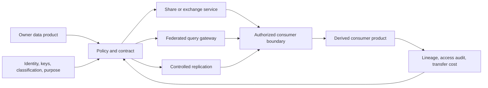
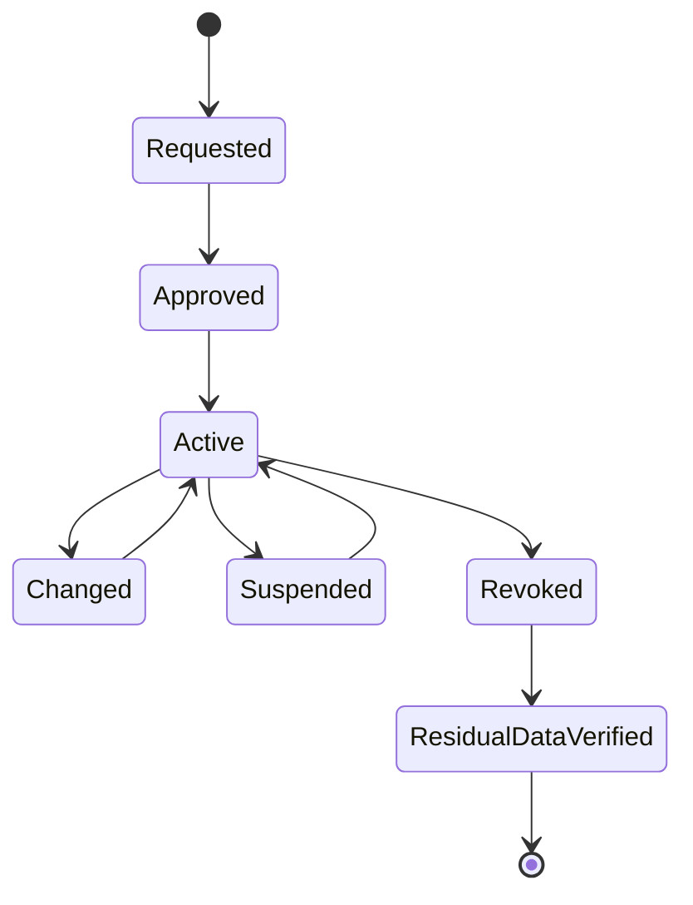

> **文档类型：**数据、AI 和集成架构参考模型
> **规范性术语：** **MUST**、**MUST NOT**、**SHOULD**、**SHOULD NOT** 和 **MAY** 是要求级别。
> **适用范围：** 跨团队、跨组织、跨地域、跨云数据共享、联邦、复制、洁净室、开放交换。
> **例外流程：** 偏离要求需要记录风险评估、补偿控制、指定风险负责人和到期日期。

|控制领域|价值|
|---|---|
|文件编号 | `DAI-19` |
|负责人|云卓越中心 |
|审核周期|至少每年一次，并且在重大平台、提供商、数据、安全或运营模式发生变化之后 |
|证据|数据共享契约、访问和驻留审查、互操作性测试、撤销证据和运营就绪证据 |

# 跨云数据共享、联合和零拷贝架构

> **决策简述：** 选择满足延迟、主权、兼容性和成本需求的最窄的受控交换模式。零复制不是零治理。

## 目的

该架构提供了一个决策模型，用于跨团队、组织、区域和云提供商共享数据。 “零拷贝”是指消费者在不维护独立完整副本的情况下查询或接收受监管的访问权限；它并不能消除缓存、元数据、临时结果、出口或主权问题。

## 模式选择

|模式|使用时 |主要权衡 |
|---|---|---|
|受控共享 |提供商/平台兼容的消费者需要最新数据 |平台耦合 |
|查询联邦|数据必须保留在源头且查询量有限 |延迟和源负载 |
|复制|需要本地性能、可用性或引擎支持 |副本、一致性、传输成本 |
|开放式文件交换 |可移植性和异步交付很重要 |新鲜度和生命周期协调 |
| API/数据产品 |需要稳定的过滤业务接口 |产品工程开销|
|洁净室|各方要求受控联合分析|查询和输出约束 |

## 参考架构

## 决策要求

记录数据所有者、消费者、目的、分类、管辖范围、新鲜度、数量、查询模式、一致性、可用性、撤销、保留、派生数据权利、出口估计和退出计划。优先选择满足可靠性和性能的最少复制模式，而不会对源产生不可接受的依赖。

## 安全和治理

- 使用联邦身份或特定于消费者的工作负载身份；避免共享密钥。
- 在支持的情况下授权指定产品、列、行、用途和时间窗口。
- 在发布前应用屏蔽、聚合、标记化或洁净室输出控制。
- 日志记录授权、查询、导出、失败、策略变更和衍生产品。
- 通过契约传播分类、保留、更正和删除义务。
- 除非明确允许，否则阻止消费者转发。
- 测试撤销、缓存数据处理和提供商账户分离。

## 多云实施

|能力|Azure|AWS | GCP |OCI |
|---|---|---|---|---|
|原生共享|Fabric/Databricks/Synapse 模式|Redshift 数据共享、Lake Formation|BigQuery 共享/Analytics Hub|Autonomous Database 共享|
|联邦|Fabric/Synapse/Databricks 连接器|Athena 联合查询/Redshift|BigQuery 联合查询|Autonomous Database 链接/连接器|
|对象交换|ADLS/Blob|S3|Cloud Storage|Object Storage|
|Clean room|Databricks/合作伙伴模式|AWS Clean Rooms|BigQuery data clean rooms|Oracle 合作伙伴/平台模式|

原生共享通常是特定于提供商的。开放表格式、可移植模式和产品 API 减少了持久交换边界的锁定，但它们仍然需要身份、目录、版本和删除设计。

## 可靠性和成本

联合将消费者与源可用性、配额、模式和性能结合起来。复制解耦了运行时，但引入了滞后和复制治理。测量查询字节、出口、缓存、复制延迟、源负载、失败的授权和未使用的共享。设置消费者配额并防止对运营源进行无限制的探索性查询。

## 生命周期

## 验证

测试正确和错误的身份、行/列策略、导出限制、架构更改、源中断、配额耗尽、撤销、保留到期和派生数据删除。协调共享计数并控制总数，而不会暴露禁止的数据。跟踪活动拨款、未使用的份额、访问审核完成情况、转让量和成本、策略失败、滞后和撤销完成情况。

## 操作注意事项

数据所有者批准目的和范围。平台团队负责交换机制和可观测性。安全和隐私允许敏感或外部共享。消费者负责衍生产品，必须声明关键依赖性。每个外部共享都需要契约和事件通知路径。

## 数据共享契约

每一份 SHOULD 都有一个版本契约。
```yaml
share_id: commerce.orders.partner-a
owner: commerce-data
consumer: partner-a-analytics
purpose: monthly-fulfilment-analysis
interface: governed-share
classification: confidential
allowed_columns:
  - order_month
  - region
  - fulfilment_days
retention_days: 90
resharing: prohibited
expires: 2027-01-31
```
契约 MUST 标识源产品版本、消费者身份、目的、字段、过滤器、聚合、管辖权、新鲜度、可用性、保留、派生数据权利、事件联系人、成本分配、撤销和退出行为。

## 残留数据和撤销

撤销会停止未来的授权访问，但可能不会删除下载的结果、缓存、副本、查询导出、笔记本或下游产品。共享设计 MUST 规定允许哪些副本以及如何验证其保留和删除。

对于敏感共享，需要消费者证明或技术证据，涵盖缓存结果、派生表、本地对象存储、BI 提取、AI 索引和备份。当残留数据存在时，撤销的提供商授权并不是完全撤销。

## 洁净室输出控制

洁净室 SHOULD 强制执行批准的参与者、数据集、查询模板或限制、最小聚合阈值、隐私规则、输出审查、速率限制和审计。防止重复查询通过差异重建抑制值。

高风险输出 MAY 需要延迟发布或人工批准。记录输入版本、查询、隐私规则、结果、审阅者和消费者。请勿将洁净室服务视为合法目的和数据共享协议的替代品。

## 联合查询安全

联合查询 MUST 保护源免受无限扫描和消费者并发的影响。使用配额、资源组、工作负载隔离、查询超时、结果限制和批准的谓词。公开精选视图而不是原始操作模式。

测试源中断、架构更改、查询缓慢、元数据过时、身份吊销和跨区域网络故障。关键消费者应该记录他们是否降级、缓存或切换到复制产品。

## 相关主题
- [数据产品、数据网格和数据契约指南](dai-data-products-data-mesh-and-data-contracts.md)
- [数据隐私、驻留、保留和安全删除标准](dai-data-privacy-residency-retention-and-deletion.md)
- [企业数据治理、目录、数据血缘和质量标准](dai-enterprise-data-governance-catalog-lineage-and-quality.md)

## 参考文档

- [Azure Architecture Center 数据架构](https://learn.microsoft.com/en-us/azure/architecture/data-guide/)
- [AWS 现代数据架构](https://docs.aws.amazon.com/whitepapers/latest/modern-data-architecture-rationales-on-aws/modern-data-architecture-on-aws.html)
- [BigQuery 分享](https://docs.cloud.google.com/bigquery/docs/analytics-hub-introduction)
- [OCI 开源数据 Lakehouse 架构](https://docs.oracle.com/en/solutions/oci-open-source-lakehouse/index.html)

## 相关仓库

- [andyxuan2010/cwb-adf-clientaccount](https://github.com/andyxuan2010/cwb-adf-clientaccount) — 演示通过 Azure Data Factory 交付自动化进行受管理的数据移动。
- [andyxuan2010/enterprise-ai-doc](https://github.com/andyxuan2010/enterprise-ai-doc) — 生成适合受控下游共享和集成的结构化企业数据。
