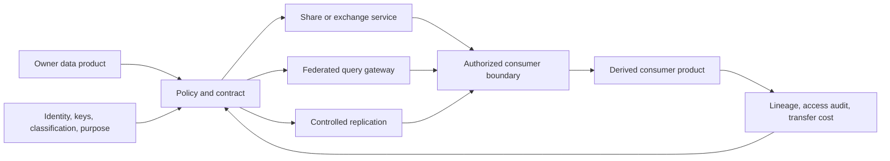
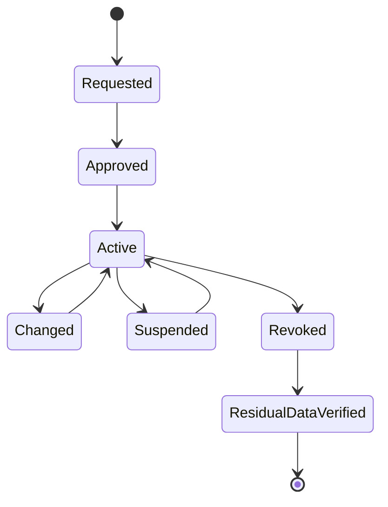

> **Document class:** Data, AI & Integration architecture reference model
> **Normative terms:** **MUST**, **MUST NOT**, **SHOULD**, **SHOULD NOT**, and **MAY** are requirements levels.
> **Applicability:** Cross-team, cross-organization, cross-region, and cross-cloud data sharing, federation, replication, clean rooms, and open exchange.
> **Exception process:** Deviations require a documented risk assessment, compensating controls, named risk owner, and expiry date.

| Control field | Value |
|---|---|
| Document ID | `DAI-19` |
| Owner | Cloud Center of Excellence |
| Review cycle | At least annually and after material platform, provider, data, security, or operating-model changes |
| Evidence | Data-share contract, access and residency review, interoperability tests, revocation evidence, and operational readiness evidence |

# Cross-Cloud Data Sharing, Federation, and Zero-Copy Architecture

> **Decision in brief:** Choose the narrowest governed exchange pattern that meets latency, sovereignty, compatibility, and cost needs. Zero-copy is not zero-governance.

## Purpose

This architecture provides a decision model for sharing data across teams, organizations, regions, and cloud providers. “Zero-copy” means the consumer queries or receives governed access without maintaining an independent full copy; it does not eliminate caches, metadata, temporary results, egress, or sovereignty concerns.

## Pattern selection

| Pattern | Use when | Primary tradeoff |
|---|---|---|
| Governed share | Provider/platform-compatible consumers need current data | Platform coupling |
| Query federation | Data must remain at source and query volume is bounded | Latency and source load |
| Replication | Local performance, availability, or engine support is required | Copies, consistency, transfer cost |
| Open-file exchange | Portability and asynchronous delivery matter | Freshness and lifecycle coordination |
| API/data product | Stable filtered business interface is needed | Product engineering overhead |
| Clean room | Parties require controlled joint analysis | Query and output constraints |

## Reference architecture



## Decision requirements

Document data owner, consumer, purpose, classification, jurisdictions, freshness, volume, query pattern, consistency, availability, revocation, retention, derived-data rights, egress estimate, and exit plan. Prefer the least-copy pattern that meets reliability and performance without creating an unacceptable dependency on the source.

## Security and governance

- Use federated identities or consumer-specific workload identities; avoid shared keys.
- Authorize named products, columns, rows, purposes, and time windows where supported.
- Apply masking, aggregation, tokenization, or clean-room output controls before release.
- Record grants, queries, exports, failures, policy changes, and derived products.
- Propagate classification, retention, correction, and deletion obligations through the contract.
- Prevent consumers from resharing unless explicitly permitted.
- Test revocation, cached data handling, and provider-account separation.

## Multi-cloud implementation

| Capability | Azure | AWS | GCP | OCI |
|---|---|---|---|---|
| Native sharing | Fabric/Databricks/Synapse patterns | Redshift data sharing, Lake Formation | BigQuery sharing/Analytics Hub | Autonomous Database sharing |
| Federation | Fabric/Synapse/Databricks connectors | Athena federated query/Redshift | BigQuery federated queries | Autonomous Database links/connectors |
| Object exchange | ADLS/Blob | S3 | Cloud Storage | Object Storage |
| Clean room | Databricks/partner patterns | AWS Clean Rooms | BigQuery data clean rooms | Oracle partner/platform patterns |

Native shares are usually provider-specific. Open table formats, portable schemas, and product APIs reduce lock-in at durable exchange boundaries, but they still require identity, catalog, version, and deletion design.

## Reliability and cost

Federation couples consumers to source availability, quotas, schema, and performance. Replication decouples runtime but introduces lag and copy governance. Measure query bytes, egress, cache, replication lag, source load, failed grants, and unused shares. Set consumer quotas and prevent unbounded exploratory queries against operational sources.

## Lifecycle



## Validation

Test correct and incorrect identities, row/column policy, export restrictions, schema change, source outage, quota exhaustion, revocation, retention expiration, and derived-data deletion. Reconcile shared counts and control totals without exposing prohibited data. Track active grants, unused shares, access-review completion, transfer volume and cost, policy failures, lag, and revocation completion.

## Operational considerations

Data owners approve purpose and scope. Platform teams own exchange mechanisms and observability. Security and privacy approve sensitive or external sharing. Consumers own derived products and must declare critical dependencies. Every external share requires a contractual and incident-notification path.

## Data-Share Contract

Every share SHOULD have a versioned contract.

```yaml
share_id: commerce.orders.partner-a
owner: commerce-data
consumer: partner-a-analytics
purpose: monthly-fulfilment-analysis
interface: governed-share
classification: confidential
allowed_columns:
  - order_month
  - region
  - fulfilment_days
retention_days: 90
resharing: prohibited
expires: 2027-01-31
```

The contract MUST identify source product version, consumer identity, purpose, fields, filters, aggregation, jurisdiction, freshness, availability, retention, derived-data rights, incident contacts, cost allocation, revocation, and exit behavior.

## Residual Data and Revocation

Revocation stops future authorized access but may not remove downloaded results, caches, replicas, query exports, notebooks, or downstream products. The sharing design MUST state what copies are permitted and how their retention and deletion are verified.

For sensitive shares, require consumer attestation or technical evidence covering cached results, derived tables, local object storage, BI extracts, AI indexes, and backups. A revoked provider grant is not complete revocation when residual data remains.

## Clean-Room Output Controls

Clean rooms SHOULD enforce approved participants, datasets, query templates or restrictions, minimum aggregation thresholds, privacy rules, output review, rate limits, and audit. Prevent repeated queries from reconstructing suppressed values through differencing.

High-risk outputs MAY require delayed release or human approval. Record the input versions, query, privacy rules, result, reviewer, and consumer. Do not treat a clean-room service as a substitute for legal purpose and data-sharing agreements.

## Federation Query Safety

Federated queries MUST protect the source from unbounded scans and consumer concurrency. Use quotas, resource groups, workload isolation, query timeouts, result limits, and approved predicates. Expose curated views rather than raw operational schemas.

Test source outage, schema change, slow query, stale metadata, revoked identity, and cross-region network failure. Critical consumers should document whether they degrade, cache, or switch to a replicated product.

## Related topics
- [Data Products, Data Mesh, and Data Contract Guidelines](dai-data-products-data-mesh-and-data-contracts.md)
- [Data Privacy, Residency, Retention, and Secure Deletion Standard](dai-data-privacy-residency-retention-and-deletion.md)
- [Enterprise Data Governance, Catalog, Lineage, and Quality Standard](dai-enterprise-data-governance-catalog-lineage-and-quality.md)

## References

- [Azure Architecture Center data architectures](https://learn.microsoft.com/en-us/azure/architecture/data-guide/)
- [AWS modern data architecture](https://docs.aws.amazon.com/whitepapers/latest/modern-data-architecture-rationales-on-aws/modern-data-architecture-on-aws.html)
- [BigQuery sharing](https://docs.cloud.google.com/bigquery/docs/analytics-hub-introduction)
- [OCI open-source data lakehouse architecture](https://docs.oracle.com/en/solutions/oci-open-source-lakehouse/index.html)

## Related repos

- [andyxuan2010/cwb-adf-clientaccount](https://github.com/andyxuan2010/cwb-adf-clientaccount) — demonstrates governed data movement through Azure Data Factory delivery automation.
- [andyxuan2010/enterprise-ai-doc](https://github.com/andyxuan2010/enterprise-ai-doc) — produces structured enterprise data suitable for controlled downstream sharing and integration.
