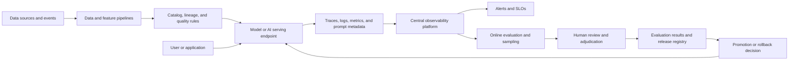

> **文档类型：** 数据、AI 和集成标准
> **规范性术语：** **MUST**、**MUST NOT**、**SHOULD**、**SHOULD NOT** 和 **MAY** 是要求级别。
> **适用范围：** 数据和 AI 系统的可观测性、评估、数据质量、模型质量、AI 安全、成本和事件操作。
> **例外流程：** 偏离要求需要记录风险评估、补偿控制、指定风险负责人和到期日期。

|控制领域|价值|
|---|---|
|文件编号 | `DAI-21` |
|负责人|云卓越中心 |
|审核周期|至少每年一次，并且在重大平台、提供商、数据、安全或运营模式发生变化之后 |
|证据|遥测模式、质量和评估结果、事件日志、仪表板和运营就绪证据 |

# 数据和 AI 可观测性、评估和质量运营

> **决策简述：** 监控从源到用户的完整路径，结合遥测、数据质量、模型评估、安全性、业务成果和成本。

## 目的

该标准定义了数据产品、机器学习系统、生成 AI 应用、模型端点、检索管道和自动化决策的最低可观测性和质量操作控制。它将技术遥测与数据质量、模型行为、用户结果、成本和风险联系起来。

传统的应用监控是必要的，但还不够。服务可以是健康的，同时返回陈旧的数据、不受支持的模式、无根据的答案、有偏见的分类或违反产品目标的昂贵响应。因此，平台必须监控从源数据到用户或下游决策的完整路径。

## 优质运营模式

质量通过四个反馈循环进行管理：

|循环|问题 |典型证据|
|---|---|---|
|数据|输入的内容是否可信且适合使用？ |新鲜度、完整性、模式、数据血缘、分布、有效性 |
|系统|该平台是否可用且高效？ |延迟、错误、饱和度、队列深度、成本、依赖关系健康状况 |
|模型|模型的行为是否在其批准的范围内？ |准确性、校准、漂移、groundedness、安全性、偏差指标 |
|产品 |该能力是否能产生预期的结果？ |任务成功、升级、纠正、采用、业务 KPI |

没有一个评分代表质量。每个生产 AI 能力都必须声明一个小型的、对决策有用的记分卡，并记录哪些信号是领先指标，哪些是发布门，哪些需要人工审查。

## 参考可观测性架构

遥测管道必须通过转换、模型调用、检索、工具调用、响应和结果来保留摄取或请求的相关性。在将数据导出到共享日志或评估存储之前进行脱敏和访问控制。

## 强制遥测

每个生产数据或 AI 功能 MUST 直接或通过批准的平台发出：

- 服务、管道、端点、模型、提示、索引和发布标识符；
- 不暴露敏感内容的请求或工作相关 ID；
- 开始时间、持续时间、结果、重试、超时、取消和错误分类；
- 允许测量的输入和输出大小或令牌计数；
- 依赖项名称、状态、延迟和重试次数；
- 资源、能力和成本维度；
- 数据资产、模式、分区或功能版本（如果适用）；
- 模型、环境、提示、检索和策略版本；和
- 隐私分类、保留类别和抽样决策。

默认情况下记录原始提示、文档、日志或输出 MUST NOT。当质量调查需要内容时，采集最小化、访问受控的样本，并记录保留期和法律依据。

## 数据质量控制

数据产品和 AI 功能应定义适合其用途的质量维度：

- **新鲜度：**最晚可接受的到达或更新时间。
- **完整性：** 存在所需的日志、字段、分区或事件。
- **有效性：**值符合架构和业务规则。
- **唯一性：**重复日志或事件保持在容忍范围内。
- **一致性：**相关系统在共享实体和密钥上达成一致。
- **分布：**范围和分类分布保持在预期范围内。
- **谱系：**来源和转换链是已知的。
- **隐私：** 保留分类、屏蔽、驻留、保留和删除控制。

质量检查应说明其严重性、阈值、所有者、操作以及是否阻止下游使用。不要让每一个警告都成为管道阻塞；不允许将严重的隐私或架构故障作为警告传递。

## 评估策略

评估分为三层：

### 线下评测

使用版本化、有代表性且访问控制的数据集。包括相关的正面、负面、边界、对抗性、长上下文、多语言和历史案例。记录评估器版本、数据集版本、指标、置信度或不确定性以及已知盲点。

### 生产前评估

针对将部署的确切模型、环境、提示、工具和索引运行契约测试、负载测试、安全测试、回归套件、检索测试和人工审查。测试故障模式，例如依赖性超时、格式错误的输入、部分检索、不可用的模型、速率限制和输出模式违规。

### 生产评估
使用合成探针、采样流量、用户反馈、人工裁决、业务成果和漂移监控的受控组合。在线评估不得在其批准的目的之外悄悄使用敏感的客户内容。当不需要原始内容时，使用匿名、采样或派生功能。

对于生成系统，至少评估：

- 基础或引文支持；
- 答案的相关性和完整性；
- 指令和模式的遵守；
- 拒绝和安全行为；
- 幻觉或无证据支持的说法发生率；
- 可测量的检索精度和召回率；
- 工具选择和工具结果处理；
- 延迟、令牌使用和成本；和
- 人为升级、纠正和放弃。

LLM 作为评判指标 MAY 加速分类，但必须根据人工审核进行校准，并且不得成为高影响力决策的唯一控制。

## 漂移检测

监测几种漂移：

|漂移类型|示例|响应 |
|---|---|---|
|架构漂移 |字段已删除或类型已更改 |封锁或隔离管道|
|数据漂移|功能分布变化 |调查来源和模型影响 |
|概念漂移|输入与结果变化之间的关系|重新评估模型和再培训需求 |
|检索漂移|指数新鲜度或相关性下降|重建、重新嵌入或修改检索 |
|行为漂移|安全、拒绝或响应方式改变 |检查模型、提示、依赖项或策略发布 |
|性能漂移|延迟、错误、成本或队列寿命增加 |扩展、优化或回滚 |

漂移阈值必须考虑季节性和样本量。对小随机样本发出告警会产生噪音；等待严重的业务影响会导致检测延迟。使用基线、置信度或最小量规则、所有者和响应手册。

## 发布质量关卡

发布门应该结合硬控制和基于风险的阈值：
```yaml
quality_gate:
  contract_tests: pass
  security_scan: pass
  data_quality: pass
  offline_regression:
    max_recall_regression: 0.02
    max_safety_regression: 0.00
  online_canary:
    min_requests: 1000
    max_p95_latency_ms: 1200
    max_error_rate: 0.01
    max_cost_per_request: 0.04
  human_review:
    required_for: [high-impact, safety-sensitive]
```
阈值只是示例，并非普世价值。服务所有者必须根据风险、基线可变性和产品 SLO 来证明这些值的合理性。

## 事件响应

AI 和数据事件应使用与其他生产事件相同的严重性和通信模型，并具有额外的质量和隐私维度。初始响应应该保存证据、减少伤害并恢复安全能力。

推荐顺序：

1. 确认信号并对可用性、质量、安全性、隐私或成本影响进行分类。
2、涉及发布时停止晋级或减少流量。
3. 使用安全回退、先前模型、缓存结果、手动审核或降级模式。
4. 保留相关 ID、发布参考、评估样本和变更记录。
5. 确定原因是数据、模型、提示、检索、工具、依赖性、策略还是平台。
6. 通过批准的交付路径进行更正或回滚。
7. 在恢复正常流量之前重新进行质量和安全检查。
8. 更新评估集、监控器、运行手册和所有者操作。

在授权调查保留最小化且访问控制的证据集之前，请勿删除失败的样本。

## 所有权和审查节奏

|资产|负责任的所有者 |最低审查 |
|---|---|---|
|数据契约和质量规则 |数据产品负责人|关于架构和源代码的更改；定期审查|
|模型和评估集|模型所有者|关于模型、数据或结果的变化 |
|端点遥测和 SLO | AI 平台和服务所有者|每月运营回顾|
|提示、检索和工具契约 | AI 应用所有者|每次发布以及质量事件发生后 |
|隐私和保留 |数据保护和安全所有者|生产前和分类变更时 |
|成本和容量|平台和 FinOps 所有者 |每月以及流量或模型更改后 |

## 验证

- [ ] 端到端跟踪将源、管道、检索、模型、工具、响应和结果关联起来。
- [ ] 敏感内容被有意脱敏、最小化、访问控制和保留。
- [ ] 数据质量规则具有阈值、所有者、严重性和操作。
- [ ] 离线、预生产和生产评估使用版本化证据。
- [ ] 质量门涵盖技术、模型、安全、隐私和成本信号。
- [ ] 漂移检测可区评分据、概念、检索、行为和性能漂移。
- [ ] 人工审查针对高风险用例校准自动评估器。
- [ ] 事件有后备、证据、沟通、恢复和学习路径。
- [ ] 仪表板区分模型版本、提示版本、索引版本和环境。

## 相关主题

- [AI 应用的生产运营](dai-production-operations-for-ai-applications.md)
- [企业数据治理、目录、数据血缘和质量标准](dai-enterprise-data-governance-catalog-lineage-and-quality.md)
- [企业 MLOps 平台和模型生命周期架构](dai-enterprise-mlops-platform-and-model-lifecycle.md)
- [Kubernetes 可观测性和 OpenTelemetry 标准](../applications-kubernetes/app-kubernetes-observability-and-opentelemetry-standards.md)
- [可观测性、日志记录和告警](../operations-reliability-finops/observability-logging-and-alerting.md)
- [如何构建集中式多云可观测性](../how-to-guides/how-to-build-centralized-multicloud-observability.md)

## 参考文档

- [在 Azure 中监控、评估和操作多Agentic AI 解决方案](https://learn.microsoft.com/en-us/training/paths/aaai-4-monitor-evaluate-operate-multi-agent-ai-solutions-azure/)
- [OpenTelemetry 语义约定](https://opentelemetry.io/docs/specs/semconv/)
- [OpenTelemetry GenAI 语义约定](https://opentelemetry.io/docs/specs/semconv/gen-ai/)
- [Azure Machine Learning 在线端点监控和部署指南](https://learn.microsoft.com/en-us/azure/machine-learning/how-to-deploy-online-endpoints?view=azureml-api-2)
