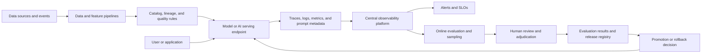

> **Document class:** Data, AI & Integration standard
> **Normative terms:** **MUST**, **MUST NOT**, **SHOULD**, **SHOULD NOT**, and **MAY** are requirements levels.
> **Applicability:** Observability, evaluation, data quality, model quality, AI safety, cost, and incident operations for data and AI systems.
> **Exception process:** Deviations require a documented risk assessment, compensating controls, named risk owner, and expiry date.

| Control field | Value |
|---|---|
| Document ID | `DAI-21` |
| Owner | Cloud Center of Excellence |
| Review cycle | At least annually and after material platform, provider, data, security, or operating-model changes |
| Evidence | Telemetry schema, quality and evaluation results, incident records, dashboards, and operational readiness evidence |

# Data and AI Observability, Evaluation, and Quality Operations

> **Decision in brief:** Observe the full path from source to user, combining telemetry, data quality, model evaluation, safety, business outcomes, and cost.

## Purpose

This standard defines the minimum observability and quality-operations controls for data products, machine-learning systems, generative-AI applications, model endpoints, retrieval pipelines, and automated decisions. It connects technical telemetry to data quality, model behavior, user outcomes, cost, and risk.

Traditional application monitoring is necessary but insufficient. A service can be healthy while returning stale data, unsupported schema, ungrounded answers, biased classifications, or an expensive response that violates the product objective. The platform must therefore observe the complete path from source data to user or downstream decision.

## Quality operating model

Quality is managed through four feedback loops:

| Loop | Question | Typical evidence |
|---|---|---|
| Data | Is the input trustworthy and fit for use? | Freshness, completeness, schema, lineage, distribution, validity |
| System | Is the platform available and efficient? | Latency, errors, saturation, queue depth, cost, dependency health |
| Model | Is the model behaving within its approved envelope? | Accuracy, calibration, drift, groundedness, safety, bias indicators |
| Product | Does the capability produce the intended outcome? | Task success, escalation, correction, adoption, business KPI |

No single score represents quality. Each production AI capability must declare a small, decision-useful scorecard and document which signals are leading indicators, which are release gates, and which require human review.

## Reference observability architecture



The telemetry pipeline must preserve correlation from ingestion or request through transformation, model invocation, retrieval, tool call, response, and outcome. Redaction and access control happen before data is exported to shared logs or evaluation stores.

## Mandatory telemetry

Every production data or AI capability MUST emit, directly or through an approved platform:

- service, pipeline, endpoint, model, prompt, index, and release identifiers;
- request or job correlation ID without exposing sensitive content;
- start time, duration, result, retry, timeout, cancellation, and error classification;
- input and output size or token counts where measurement is allowed;
- dependency name, status, latency, and retry count;
- resource, capacity, and cost dimensions;
- data asset, schema, partition, or feature version where applicable;
- model, environment, prompt, retrieval, and policy versions; and
- privacy classification, retention class, and sampling decision.

Raw prompts, documents, records, or outputs MUST NOT be logged by default. When content is required for a quality investigation, capture a minimized, access-controlled sample with a documented retention period and legal basis.

## Data quality controls

Data products and AI features should define quality dimensions appropriate to their use:

- **Freshness:** latest acceptable arrival or update time.
- **Completeness:** required records, fields, partitions, or events present.
- **Validity:** values conform to schema and business rules.
- **Uniqueness:** duplicate records or events remain within tolerance.
- **Consistency:** related systems agree on shared entities and keys.
- **Distribution:** ranges and categorical distributions remain within expected bounds.
- **Lineage:** the source and transformation chain are known.
- **Privacy:** classification, masking, residency, retention, and deletion controls hold.

A quality check should state its severity, threshold, owner, action, and whether it blocks downstream use. Do not make every warning a pipeline blocker; do not allow a critical privacy or schema failure to pass as a warning.

## Evaluation strategy

Evaluation has three layers:

### Offline evaluation

Use a versioned, representative, and access-controlled dataset. Include positive, negative, boundary, adversarial, long-context, multilingual, and historical cases where relevant. Record the evaluator version, dataset version, metrics, confidence or uncertainty, and known blind spots.

### Pre-production evaluation

Run contract tests, load tests, safety tests, regression suites, retrieval tests, and human review against the exact model, environment, prompt, tools, and index that will be deployed. Test failure modes such as dependency timeout, malformed input, partial retrieval, unavailable model, rate limit, and output-schema violation.

### Production evaluation

Use a controlled combination of synthetic probes, sampled traffic, user feedback, human adjudication, business outcomes, and drift monitoring. Online evaluation must not silently use sensitive customer content outside its approved purpose. Use anonymization, sampling, or derived features when raw content is unnecessary.

For generative systems, evaluate at least:

- groundedness or citation support;
- answer relevance and completeness;
- instruction and schema adherence;
- refusal and safety behavior;
- hallucination or unsupported-claim rate;
- retrieval precision and recall where measurable;
- tool selection and tool-result handling;
- latency, token usage, and cost; and
- human escalation, correction, and abandonment.

LLM-as-judge metrics MAY accelerate triage but must be calibrated against human review and must not be the sole control for high-impact decisions.

## Drift detection

Monitor several kinds of drift:

| Drift type | Example | Response |
|---|---|---|
| Schema drift | Field removed or type changed | Block or quarantine pipeline |
| Data drift | Feature distribution changes | Investigate source and model impact |
| Concept drift | Relationship between input and outcome changes | Re-evaluate model and retraining need |
| Retrieval drift | Index freshness or relevance declines | Rebuild, re-embed, or revise retrieval |
| Behavior drift | Safety, refusal, or response style changes | Inspect model, prompt, dependency, or policy release |
| Performance drift | Latency, errors, cost, or queue age increases | Scale, optimize, or roll back |

Drift thresholds must account for seasonality and sample size. Alerting on a small random sample creates noise; waiting for a severe business impact creates late detection. Use a baseline, confidence or minimum-volume rule, owner, and response playbook.

## Release quality gates

A release gate should combine hard controls and risk-based thresholds:

```yaml
quality_gate:
  contract_tests: pass
  security_scan: pass
  data_quality: pass
  offline_regression:
    max_recall_regression: 0.02
    max_safety_regression: 0.00
  online_canary:
    min_requests: 1000
    max_p95_latency_ms: 1200
    max_error_rate: 0.01
    max_cost_per_request: 0.04
  human_review:
    required_for: [high-impact, safety-sensitive]
```

Thresholds are examples, not universal values. The service owner must justify the values based on risk, baseline variability, and product SLOs.

## Incident response

AI and data incidents should use the same severity and communications model as other production incidents, with additional quality and privacy dimensions. The first response should preserve evidence, reduce harm, and restore a safe capability.

Recommended sequence:

1. Confirm the signal and classify availability, quality, security, privacy, or cost impact.
2. Stop promotion or reduce traffic when a release is implicated.
3. Use a safe fallback, prior model, cached result, manual review, or degraded mode.
4. Preserve correlation IDs, release references, evaluation samples, and change records.
5. Determine whether the cause is data, model, prompt, retrieval, tool, dependency, policy, or platform.
6. Correct or roll back through the approved delivery path.
7. Re-run quality and safety checks before restoring normal traffic.
8. Update the evaluation set, monitor, runbook, and owner actions.

Do not delete failing samples before an authorized investigation has preserved a minimized and access-controlled evidence set.

## Ownership and review cadence

| Asset | Accountable owner | Minimum review |
|---|---|---|
| Data contract and quality rules | Data product owner | On schema and source change; periodic review |
| Model and evaluation set | Model owner | On model, data, or outcome change |
| Endpoint telemetry and SLO | AI platform and service owner | Monthly operational review |
| Prompt, retrieval, and tool contract | AI application owner | Every release and after quality incident |
| Privacy and retention | Data protection and security owner | Before production and on classification change |
| Cost and capacity | Platform and FinOps owner | Monthly and after traffic or model change |

## Validation

- [ ] End-to-end traces correlate source, pipeline, retrieval, model, tool, response, and outcome.
- [ ] Sensitive content is redacted, minimized, access-controlled, and retained intentionally.
- [ ] Data quality rules have thresholds, owners, severity, and action.
- [ ] Offline, pre-production, and production evaluation use versioned evidence.
- [ ] Quality gates cover technical, model, safety, privacy, and cost signals.
- [ ] Drift detection distinguishes data, concept, retrieval, behavior, and performance drift.
- [ ] Human review calibrates automated evaluators for high-risk use cases.
- [ ] Incidents have fallback, evidence, communication, recovery, and learning paths.
- [ ] Dashboards distinguish model version, prompt version, index version, and environment.

## Related topics

- [Production Operations for AI Applications](dai-production-operations-for-ai-applications.md)
- [Enterprise Data Governance, Catalog, Lineage, and Quality Standard](dai-enterprise-data-governance-catalog-lineage-and-quality.md)
- [Enterprise MLOps Platform and Model Lifecycle Architecture](dai-enterprise-mlops-platform-and-model-lifecycle.md)
- [Kubernetes Observability and OpenTelemetry Standards](../applications-kubernetes/app-kubernetes-observability-and-opentelemetry-standards.md)
- [Observability, Logging, and Alerting](../operations-reliability-finops/observability-logging-and-alerting.md)
- [How to Build Centralized Multi-Cloud Observability](../how-to-guides/how-to-build-centralized-multicloud-observability.md)

## References

- [Monitor, evaluate, and operate multi-agent AI solutions in Azure](https://learn.microsoft.com/en-us/training/paths/aaai-4-monitor-evaluate-operate-multi-agent-ai-solutions-azure/)
- [OpenTelemetry semantic conventions](https://opentelemetry.io/docs/specs/semconv/)
- [OpenTelemetry GenAI semantic conventions](https://opentelemetry.io/docs/specs/semconv/gen-ai/)
- [Azure Machine Learning online endpoint monitoring and deployment guidance](https://learn.microsoft.com/en-us/azure/machine-learning/how-to-deploy-online-endpoints?view=azureml-api-2)
