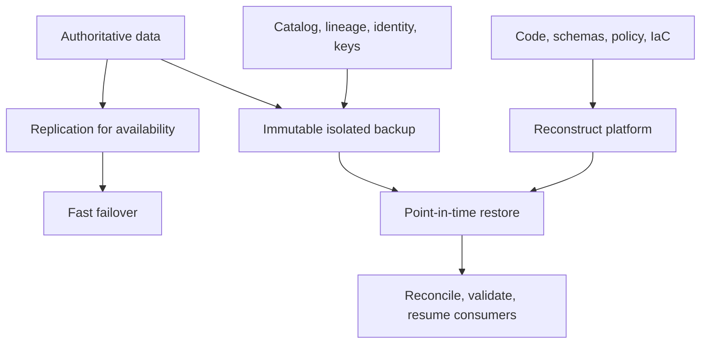

> **文档类型：** 数据、AI 和集成标准
> **规范性术语：** **MUST**、**MUST NOT**、**SHOULD**、**SHOULD NOT** 和 **MAY** 是要求级别。
> **适用范围：** 数据和 AI 平台免受删除、损坏、区域故障、勒索软件、操作员错误和依赖性丢失的影响。
> **例外流程：** 偏离要求需要记录风险评估、补偿控制、指定风险负责人和到期日期。

|控制领域|价值|
|---|---|
|文件编号 | `DAI-14` |
|负责人|云卓越中心 |
|审核周期|至少每年一次，并且在重大平台、提供商、数据、安全或运营模式发生变化之后 |
|证据|保护清单、备份策略、恢复测试、恢复练习和运营就绪证据|

# 数据平台弹性、备份和灾难恢复标准

> **决策简述：** 将可用性、复制、备份和灾难恢复设计为独立但协调的功能，并通过练习证明恢复。

## 目的

该标准可保护数据平台免受删除、损坏、区域故障、勒索软件、操作员错误和依赖性丢失的影响。高可用性、复制、备份和灾难恢复解决不同的问题，但 MUST 共同设计。

## 恢复模型

## 分层

每个产品 MUST 声明最大可容忍中断、RTO、RPO、恢复区域、最小保留还原点和恢复所有者。依赖性必须满足或超过产品目标。

|等级 |典型用途|建筑期待 |
|---|---|---|
|关键|安全、监管、收入关键 |多可用区、区域恢复、隔离备份、频繁演习 |
|重要|核心分析和运营 |自动恢复、经过测试的区域计划 |
|标准|可重建产品|受保护的源和配置、计划的恢复测试 |
|短暂的|开发/缓存 |从源头重新创建；没有不受支持的复苏承诺|

## 保护范围

保护原始数据和精选数据、数据库、对象版本、所需的流保留、架构、目录、数据血缘、编排状态、检查点、模型制品、功能定义、语义模型、策略、配置、IaC、密钥或记录在案的密钥恢复以及发布证据。

复制 MUST NOT 被视为备份，因为损坏和删除可以复制。为关键数据保留至少一份逻辑隔离、访问受限、不可变的副本。将备份管理与工作负载管理分开。

## 提供商映射

|能力|Azure|AWS | GCP |OCI |
|---|---|---|---|---|
|备份编排| Azure Backup/服务原生备份 | AWS Backup/服务原生备份 |备份和灾难恢复/服务原生备份 | OCI Backup/服务原生备份 |
|不可变对象保护 | Blob 不变性/版本控制 | S3 对象锁定/版本控制 |桶锁/版本控制 |对象存储保留/版本控制 |
|区域复制 |特定于服务的异地复制 |跨区域复制/服务 |双/多区域和服务复制 |跨区域复制/服务 |
|自动化| Azure DevOps/GitHub/IaC |Systems Manager/GitHub/IaC |Cloud Build/GitHub/IaC | OCI DevOps/GitHub/IaC |

## 恢复排序

按依赖顺序恢复身份和密钥、网络和 DNS、存储、目录和策略、编排、计算、产品和消费者。协调 MUST 在流量恢复之前比较恢复的计数、校验和、控制总数、质量结果、模型版本和最后处理的偏移量。

## 测试

根据层级定期执行组件恢复和全面服务恢复练习。包括不可用的主凭据、受损的管理员、损坏的最近备份、区域隔离、丢失密钥、架构不匹配和下游重放。记录实际 RTO/RPO、手动步骤、数据丢失、成本、缺陷和纠正负责人。

## 验证

确认每项关键资产都出现在保护清单中；监控备份成功；强制保留；工作负载管理员无法删除受保护的副本；干净的凭据可以恢复；恢复工作在隔离环境中进行。跟踪备份差距、未经测试的资产、恢复成功、恢复目标实现、不可变的覆盖范围以及逾期的纠正措施。

## 操作注意事项
数据产品所有者定义关键性并验证恢复的意义。平台团队自动化保护和恢复。安全控制隔离和勒索软件响应。财务批准持续恢复能力。检查提供商区域依赖性、出口时间和成本、数据主权、密钥恢复、容量预留和紧急访问。

## 故障域和依赖关系矩阵

恢复设计 MUST 识别可以独立失败的依赖项。至少，评估身份、密钥管理、DNS、私有连接、控制平面、对象存储、数据库、流、目录、编排、模型注册表、Artifact Registry 和可观测性。

|依赖|损失情景|恢复要求|
|---|---|---|
|身份联合|企业登录不可用 |经审核使用的云本地紧急访问|
|重点服务|密钥或权限不可用|受保护的密钥恢复和经过测试的解密路径|
|目录|赠款和元数据不可用|在受控访问恢复之前重建或恢复 |
|对象存储 |区域或逻辑腐败|隔离版本或副本加完整性检查|
|流检查点 |偏移量丢失或损坏|来自保留源的受控重播 |
|协调员|时间表和状态不可用 |从版本控制重建并协调活动运行 |
|模型或 Artifact Registry |已发布资产不可用 |不可变的复制制品和来源证明日志记录|

仅当最慢的关键依赖项能够满足它时，声明的 RTO 才有效。

## 备份隔离和勒索软件控制

关键备份 MUST 使用与普通工作负载操作员分开的管理边界。保护 SHOULD 包括不变性或一次写入保留、可用的多方删除控制、专用备份身份、受限网络路径、异常检测和独立清单。

不要使用相同的广泛特权自动化身份来进行生产变更和备份删除。紧急恢复凭证 SHOULD 存储和行使独立于正常联盟和 CI/CD。

## 恢复练习接受标准

仅当恢复的服务可用且值得信赖时，恢复练习才会成功。 演练日志 SHOULD 包括：

- 启动场景和假设的不可用依赖项；
- 选择的还原点和证据表明它早于损坏；
- 实际平台重建时间；
- 实际数据恢复和重放时间；
- 数据丢失间隔和最后确认的交易或偏移量；
- 记录计数、校验和、控制总数、模式版本和质量结果；
- 重新建立身份、策略、告警和审计导出；
- 消费者验证和业务负责人接受；
- 故障恢复或稳态转换计划；
- 缺陷、所有者和修复日期。

恢复文件但不恢复数据产品的测试不会验证产品 RTO。

## 恢复能力和成本
恢复区域和环境需要足够的配额、网络吞吐量、存储操作、计算、模型容量和数据库限制才能满足目标。记录容量是否持续配置、预留、预先批准或按需获取。

恢复成本预测 SHOULD 包括保留副本、不可变存储、传输、临时双重操作、高优先级计算、重新索引、重新嵌入、协调业务验证。

## 相关主题
- [治理数据平台架构](dai-governed-data-platform-architecture.md)
- [SQL、托管实例和数据库平台模式](dai-sql-managed-instance-and-database-platform-patterns.md)
- [DataOps CI/CD、测试和架构演进最佳实践](dai-dataops-cicd-testing-and-schema-evolution.md)

## 参考文档

- [Azure 数据平台灾难恢复](https://learn.microsoft.com/en-us/azure/architecture/data-guide/disaster-recovery/dr-for-azure-data-platform-architecture)
- [AWS 灾难恢复指南](https://docs.aws.amazon.com/whitepapers/latest/disaster-recovery-workloads-on-aws/disaster-recovery-options-in-the-cloud.html)
- [Google Cloud 灾难恢复规划指南](https://cloud.google.com/architecture/dr-scenarios-planning-guide)
- [OCI 灾难恢复策略](https://docs.oracle.com/en/solutions/oci-best-practices/plan-your-disaster-recovery-strategy.html)

## 相关仓库

- [andyxuan2010/azure-landingzone](https://github.com/andyxuan2010/azure-landingzone) — 提供隔离恢复环境所需的受管理的 Azure 基础架构基础。
- [andyxuan2010/oci-landingzone](https://github.com/andyxuan2010/oci-landingzone) — 为恢复模式提供可重复的 OCI 基础和存储基础设施。
