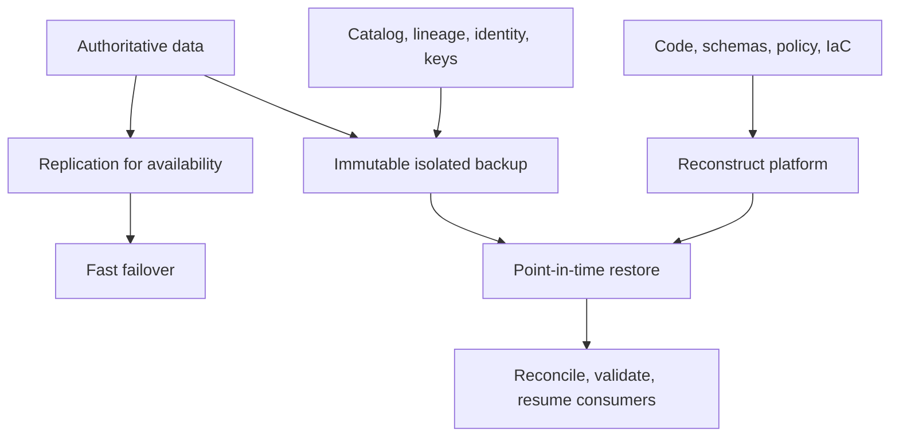

> **Document class:** Data, AI & Integration standard
> **Normative terms:** **MUST**, **MUST NOT**, **SHOULD**, **SHOULD NOT**, and **MAY** are requirements levels.
> **Applicability:** Data and AI platform protection from deletion, corruption, regional failure, ransomware, operator error, and dependency loss.
> **Exception process:** Deviations require a documented risk assessment, compensating controls, named risk owner, and expiry date.

| Control field | Value |
|---|---|
| Document ID | `DAI-14` |
| Owner | Cloud Center of Excellence |
| Review cycle | At least annually and after material platform, provider, data, security, or operating-model changes |
| Evidence | Protection inventory, backup policy, restore tests, recovery exercise, and operational readiness evidence |

# Data Platform Resilience, Backup, and Disaster Recovery Standard

> **Decision in brief:** Design availability, replication, backup, and disaster recovery as separate but coordinated capabilities, and prove recovery through exercises.

## Purpose

This standard protects data platforms from deletion, corruption, regional failure, ransomware, operator error, and dependency loss. High availability, replication, backup, and disaster recovery solve different problems and MUST be designed together.

## Recovery model

## Tiering

Each product MUST declare maximum tolerable outage, RTO, RPO, recovery region, minimum retained restore points, and recovery owner. Dependencies must meet or exceed the product objective.

| Tier | Typical use | Architecture expectation |
|---|---|---|
| Critical | Safety, regulated, revenue-critical | Multi-zone, regional recovery, isolated backup, frequent exercise |
| Important | Core analytics and operations | Automated restore, tested regional plan |
| Standard | Rebuildable products | Protected source and configuration, scheduled restore test |
| Ephemeral | Development/cache | Recreate from source; no unsupported recovery promise |

## Protection scope

Protect raw and curated data, databases, object versions, stream retention where required, schemas, catalogs, lineage, orchestration state, checkpoints, model artifacts, feature definitions, semantic models, policies, configurations, IaC, keys or documented key recovery, and release evidence.

Replication MUST NOT be treated as backup because corruption and deletion can replicate. Keep at least one logically isolated, access-restricted, immutable copy for critical data. Separate backup administration from workload administration.

## Provider mapping

| Capability | Azure | AWS | GCP | OCI |
|---|---|---|---|---|
| Backup orchestration | Azure Backup/service-native backup | AWS Backup/service-native backup | Backup and DR/service-native backup | OCI Backup/service-native backup |
| Immutable object protection | Blob immutability/versioning | S3 Object Lock/versioning | Bucket Lock/versioning | Object Storage retention/versioning |
| Regional replication | Service-specific geo replication | Cross-Region Replication/services | Dual/multi-region and service replication | Cross-region replication/services |
| Automation | Azure DevOps/GitHub/IaC | Systems Manager/GitHub/IaC | Cloud Build/GitHub/IaC | OCI DevOps/GitHub/IaC |

## Recovery sequencing

Recover identity and keys, network and DNS, storage, catalog and policy, orchestration, compute, products, and consumers in dependency order. Reconciliation MUST compare recovered counts, checksums, control totals, quality results, model versions, and last processed offsets before traffic resumes.

## Testing

Perform component restores regularly and full service recovery exercises according to tier. Include unavailable primary credentials, compromised administrator, corrupt recent backup, regional isolation, missing key, schema mismatch, and downstream replay. Record actual RTO/RPO, manual steps, data loss, cost, defects, and corrective owners.

## Validation

Confirm every critical asset appears in the protection inventory; backup success is monitored; retention is enforced; workload administrators cannot delete protected copies; clean credentials can restore; and recovery works in an isolated environment. Track backup gaps, untested assets, restore success, recovery objective attainment, immutable coverage, and overdue corrective actions.

## Operational considerations

Data-product owners define criticality and validate restored meaning. Platform teams automate protection and recovery. Security controls isolation and ransomware response. Finance approves sustained recovery capacity. Review provider region dependencies, egress time and cost, data sovereignty, key recovery, capacity reservations, and emergency access.

## Failure-Domain and Dependency Matrix

Recovery design MUST identify dependencies that can fail independently. At minimum, assess identity, key management, DNS, private connectivity, control plane, object storage, database, stream, catalog, orchestration, model registry, artifact registry, and observability.

| Dependency | Loss scenario | Recovery requirement |
|---|---|---|
| Identity federation | Enterprise sign-in unavailable | cloud-local emergency access with audited use |
| Key service | key or permission unavailable | protected key recovery and tested decrypt path |
| Catalog | grants and metadata unavailable | reconstruct or restore before governed access resumes |
| Object storage | regional or logical corruption | isolated version or replica plus integrity checks |
| Stream checkpoint | offsets lost or corrupt | controlled replay from retained source |
| Orchestrator | schedules and state unavailable | rebuild from version control and reconcile active runs |
| Model or artifact registry | released asset unavailable | immutable replicated artifact and provenance record |

The declared RTO is valid only if the slowest critical dependency can meet it.

## Backup Isolation and Ransomware Controls

Critical backups MUST use an administrative boundary separate from ordinary workload operators. Protection SHOULD include immutability or write-once retention, multi-party deletion controls where available, dedicated backup identities, restricted network paths, anomaly detection, and independent inventory.

Do not use the same broadly privileged automation identity for production mutation and backup deletion. Emergency restoration credentials SHOULD be stored and exercised independently from normal federation and CI/CD.

## Recovery Exercise Acceptance Criteria

A recovery exercise is successful only when the recovered service is usable and trustworthy. The exercise record SHOULD include:

- initiating scenario and assumed unavailable dependencies;
- selected restore point and evidence that it predates corruption;
- actual platform reconstruction time;
- actual data restore and replay time;
- data-loss interval and last confirmed transaction or offset;
- record counts, checksums, control totals, schema versions, and quality results;
- re-established identities, policies, alerts, and audit export;
- consumer validation and business-owner acceptance;
- failback or steady-state transition plan;
- defects, owners, and remediation dates.

A test that restores a file but does not resume the data product does not validate the product RTO.

## Recovery Capacity and Cost

Recovery regions and environments require enough quotas, network throughput, storage operations, compute, model capacity, and database limits to meet the objective. Document whether capacity is continuously provisioned, reserved, pre-approved, or obtained on demand.

Recovery cost forecasts SHOULD include retained replicas, immutable storage, transfer, temporary dual operation, high-priority compute, re-indexing, re-embedding, reconciliation, and business validation.

## Related topics
- [Governed Data Platform Architecture](dai-governed-data-platform-architecture.md)
- [SQL, Managed Instance, and Database Platform Patterns](dai-sql-managed-instance-and-database-platform-patterns.md)
- [DataOps CI/CD, Testing, and Schema Evolution Best Practices](dai-dataops-cicd-testing-and-schema-evolution.md)

## References

- [Azure data platform disaster recovery](https://learn.microsoft.com/en-us/azure/architecture/data-guide/disaster-recovery/dr-for-azure-data-platform-architecture)
- [AWS disaster recovery guidance](https://docs.aws.amazon.com/whitepapers/latest/disaster-recovery-workloads-on-aws/disaster-recovery-options-in-the-cloud.html)
- [Google Cloud disaster recovery planning guide](https://cloud.google.com/architecture/dr-scenarios-planning-guide)
- [OCI disaster recovery strategy](https://docs.oracle.com/en/solutions/oci-best-practices/plan-your-disaster-recovery-strategy.html)

## Related repos

- [andyxuan2010/azure-landingzone](https://github.com/andyxuan2010/azure-landingzone) — provides governed Azure infrastructure foundations required for isolated recovery environments.
- [andyxuan2010/oci-landingzone](https://github.com/andyxuan2010/oci-landingzone) — provides reproducible OCI foundation and storage infrastructure for recovery patterns.
