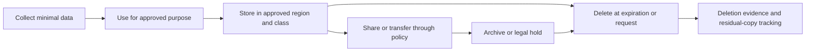
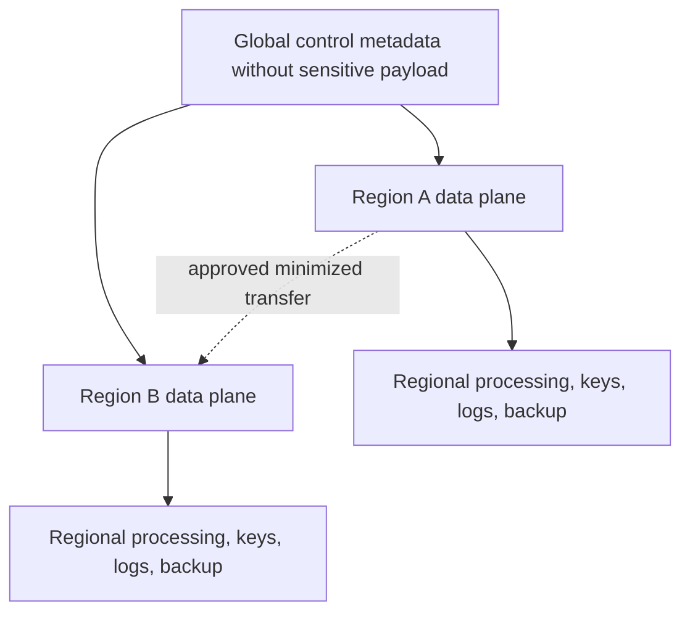
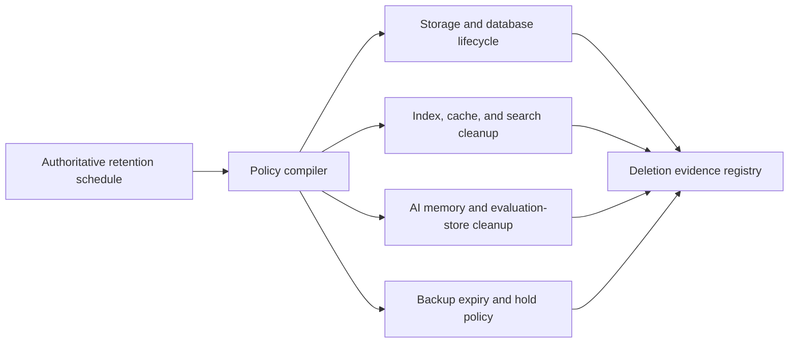

> **文档类型：** 数据、AI 和集成标准
> **规范性术语：** **MUST**、**MUST NOT**、**SHOULD**、**SHOULD NOT** 和 **MAY** 是要求级别。
> **适用范围：** 包含个人、敏感、受监管或驻留限制信息的云数据，包括派生数据、AI、日志、副本和备份数据。
> **例外流程：** 偏离要求需要记录风险评估、补偿控制、指定风险负责人和到期日期。

|控制领域|价值|
|---|---|
|文件编号 | `DAI-17` |
|负责人|云卓越中心 |
|审核周期|至少每年一次，并且在重大平台、提供商、数据、安全或运营模式发生变化之后 |
|证据|数据清单、隐私评估、保留计划、删除测试和运营就绪证据 |

# 数据隐私、驻留、保留和安全删除标准

> **简要决定：** 制定驻留要求、目的、保留、合法保留和删除明确的元数据。在主数据、派生数据、复制数据、AI、日志和备份数据中强制执行这些规则。

## 目的

该标准将法律、合同和企业隐私义务转换为可执行的数据平台控制。法律和隐私团队确定应用的义务；架构确保可以演示放置、处理、访问、传输、保留和删除。

## 数据生命周期

## 强制元数据

每个受监管的数据集 MUST 记录分类、个人/敏感类别、主题和区域、控制器/所有者、批准目的、应用的合法依据、存储和处理区域、传输机制、保留触发器和持续时间、合法保留、处理者、删除方法和下游产品。

## 控制要求

- 仅收集批准目的所需的字段，并禁止不兼容的二次使用。
- 除非经过特别批准并在可能的情况下进行不可逆转的转换，否则请将生产个人数据远离较低环境。
- 强制执行存储、处理、日志、备份、模型、支持访问和灾难恢复的驻留，而不仅仅是主数据库。
- 需要批准的跨境传输路径、加密、目的地控制、数据血缘和契约评估。
- 根据重新识别风险使用屏蔽、标记化、聚合或差分隐私。
- 根据权威计划自动应用保留，并暂停删除以进行有效的合法保留。
- 通过派生表、缓存、索引、导出、功能、提示、内存、备份和副本传播更正和删除。
- 保留证据，不得将禁止内容保留超过必要的时间。

## 区域架构

当主权应用时，优先选择区域处理单元。全局编录可能包含非敏感元数据，但示例、模式、日志或数据血缘属性本身可能会泄露敏感信息并需要审查。

## 提供商实现映射

|控制|Azure|AWS | GCP |OCI |
|---|---|---|---|---|
|区域策略| Azure Policy 和层次结构 |Organizations/SCP and region controls |Organization Policy/resource locations| IAM、配额、区域、隔间 |
|发现/分类|Purview|Macie/Glue/DataZone|Sensitive Data Protection/Dataplex|Data Safe/Data Catalog|
|关键控制| Key Vault/托管 HSM | KMS/CloudHSM |Cloud KMS/Cloud HSM |Vault |
|生命周期 |存储生命周期/服务保留| S3 生命周期/服务保留 |Cloud Storage 生命周期/服务保留|对象生命周期/服务保留 |

## 安全删除

为每个存储定义删除语义：立即逻辑删除、清除延迟、加密擦除、备份到期、不可变保留和提供商媒体处理。当技术上无法立即清除时，删除工作流程 MUST 识别派生副本并发出持久工作项。合法保留优先于普通删除，并且必须经过审核。

## 验证

跟踪从收集到产品、出口、AI 输入、日志、副本和备份的代表性敏感日志记录。测试拒绝区域部署、未经授权的导出、保留到期、合法保留、主题删除和证据生成。跟踪未分类资产、驻留违规、过度保留、删除完成时间、未解决的副本和未经授权的目的更改。

## 操作注意事项

隐私团队负责解释权和认可权；数据所有者负责目的和保留；平台团队实施策略和证据；安全监控访问和传输。每当重大服务发生变化时，重新评估提供商支持访问、子处理商、新区域、模型服务和备份架构。

## 保留执行架构

保留 MUST 可根据权威时间表强制执行，而不是手动复制到各个管道中。时间表 SHOULD 映射数据类和触发目的、主动保留、存档保留、合法保留行为和删除方法。

保留变更需要进行影响分析，因为缩短期限可能会降低可恢复性，而延长期限可能会违反最小化要求并增加违规风险。

## 衍生数据、非结构化数据和 AI 数据

删除范围 MUST 包括容易被忽视的表示：

- 提取文本、OCR、缩略图和文档片段；
- 嵌入、向量索引、重新排序特征和缓存；
- 特征存储值和训练或评估数据集；
- 提示、响应、跟踪、对话记忆和人工审核队列；
- 物化视图、临时查询结果、导出和本地分析文件；
- 死信队列、隔离区、检查点和重播存储中的数据。

即使原始文本无法直接读取，从个人数据派生的嵌入或模型特征仍然需要接受评估。删除工作流程 MUST 定义表示是否可以删除、重新生成或需要重新训练。

## 保护隐私的非生产数据

较低环境 SHOULD 默认使用合成数据。当需要生产衍生数据时，批准一个转换规范，该规范涵盖直接标识符、准标识符、自由文本、图像、稀有类别、日期偏移、地理精度和跨表的可链接性。

使用重新识别风险测试和功能测试标准来验证隐私转换。当生成的数据集仍然可以链接到个人时，屏蔽不得产生虚假的匿名声明。

## 删除证据模型

删除证据 SHOULD 识别请求或策略触发器、数据主体或产品范围、搜索的系统、删除操作、残留副本、合法保留、提供商清除延迟、完成时间和负责的审批者。不要将已删除的敏感内容本身放入证据日志中。

如果由于不可变备份或合法保留而无法立即删除，请记录残留位置、访问限制、预定到期时间和禁止恢复（批准的恢复目的除外）。

## 相关主题
- [企业数据治理、目录、数据血缘和质量标准](dai-enterprise-data-governance-catalog-lineage-and-quality.md)
- [AI 安全、身份和负责任的 AI](dai-ai-security-identity-and-responsible-ai.md)
- [数据平台弹性、备份和灾难恢复标准](dai-data-platform-resilience-backup-and-disaster-recovery.md)

## 参考文档

- [Azure 数据驻留](https://azure.microsoft.com/en-us/explore/global-infrastructure/data-residency/)
- [AWS 数据隐私](https://aws.amazon.com/compliance/data-privacy/)
- [Google Cloud 数据驻留](https://cloud.google.com/security/compliance/data-residency)
- [OCI 区域](https://www.oracle.com/cloud/public-cloud-regions/)

## 相关仓库

- [andyxuan2010/enterprise-ai-doc](https://github.com/andyxuan2010/enterprise-ai-doc) — 处理潜在敏感的企业文档，从而说明分类、保留和删除控制的适用范围。
