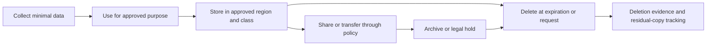
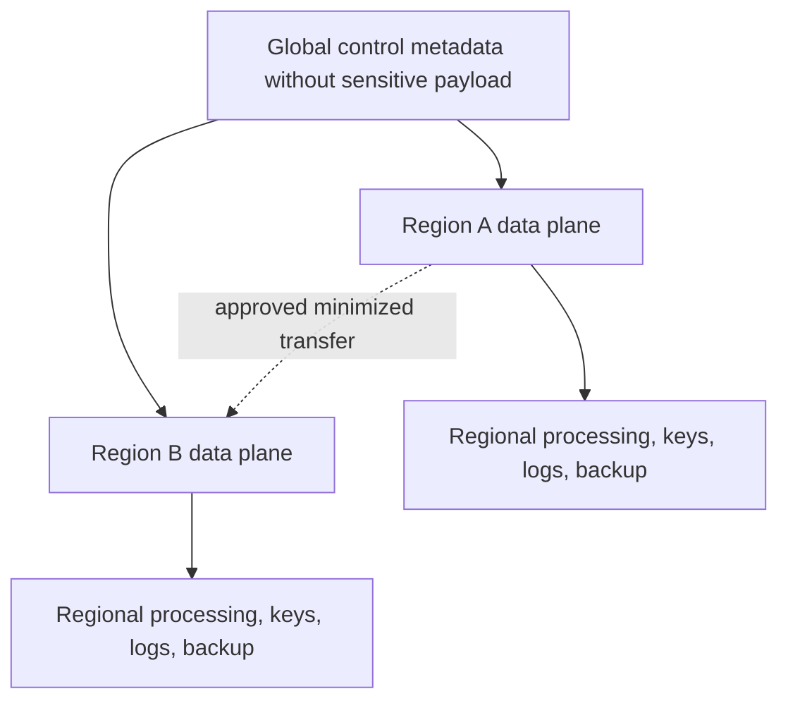
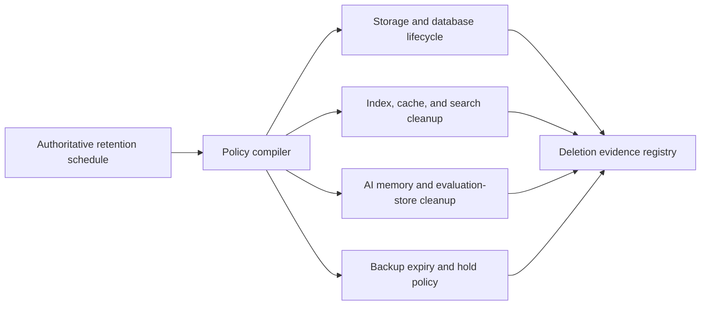

> **Document class:** Data, AI & Integration standard
> **Normative terms:** **MUST**, **MUST NOT**, **SHOULD**, **SHOULD NOT**, and **MAY** are requirements levels.
> **Applicability:** Cloud data containing personal, sensitive, regulated, or residency-constrained information, including derived, AI, log, replica, and backup data.
> **Exception process:** Deviations require a documented risk assessment, compensating controls, named risk owner, and expiry date.

| Control field | Value |
|---|---|
| Document ID | `DAI-17` |
| Owner | Cloud Center of Excellence |
| Review cycle | At least annually and after material platform, provider, data, security, or operating-model changes |
| Evidence | Data inventory, privacy assessment, retention schedule, deletion test, and operational readiness evidence |

# Data Privacy, Residency, Retention, and Secure Deletion Standard

> **Decision in brief:** Make residency, purpose, retention, legal hold, and deletion explicit metadata. Enforce them across primary, derived, replicated, AI, log, and backup data.

## Purpose

This standard converts legal, contractual, and enterprise privacy obligations into enforceable data-platform controls. Legal and privacy teams determine applicable obligations; architecture ensures placement, processing, access, transfer, retention, and deletion can be demonstrated.

## Data lifecycle

## Mandatory metadata

Each governed dataset MUST record classification, personal/sensitive categories, subjects and regions, controller/owner, approved purposes, lawful basis where applicable, storage and processing regions, transfer mechanism, retention trigger and duration, legal holds, processors, deletion method, and downstream products.

## Control requirements

- Collect only fields required for an approved purpose and prohibit incompatible secondary use.
- Keep production personal data out of lower environments unless specifically approved and irreversibly transformed where possible.
- Enforce residency for storage, processing, logs, backups, models, support access, and disaster recovery—not only the primary database.
- Require approved transfer paths, encryption, destination controls, lineage, and contractual assessment for cross-border movement.
- Use masking, tokenization, aggregation, or differential privacy according to re-identification risk.
- Apply retention automatically from an authoritative schedule and pause deletion for valid legal holds.
- Propagate correction and deletion through derived tables, caches, indexes, exports, features, prompts, memory, backups, and replicas.
- Retain evidence without retaining prohibited content longer than necessary.

## Regional architecture

Prefer regional processing cells when sovereignty applies. A global catalog may hold non-sensitive metadata, but samples, schemas, logs, or lineage properties can themselves reveal sensitive information and require review.

## Provider implementation mapping

| Control | Azure | AWS | GCP | OCI |
|---|---|---|---|---|
| Region policy | Azure Policy and hierarchy | Organizations/SCP and region controls | Organization Policy/resource locations | IAM, quotas, regions, compartments |
| Discovery/classification | Purview | Macie/Glue/DataZone | Sensitive Data Protection/Dataplex | Data Safe/Data Catalog |
| Key control | Key Vault/Managed HSM | KMS/CloudHSM | Cloud KMS/Cloud HSM | Vault |
| Lifecycle | Storage lifecycle/service retention | S3 lifecycle/service retention | Cloud Storage lifecycle/service retention | Object lifecycle/service retention |

## Secure deletion

Define deletion semantics for every store: immediate logical deletion, purge delay, cryptographic erasure, backup expiry, immutable retention, and provider media handling. A deletion workflow MUST identify derived copies and issue durable work items when immediate purge is technically impossible. Legal hold overrides ordinary deletion and must be audited.

## Validation

Trace a representative sensitive record from collection through products, exports, AI inputs, logs, replicas, and backup. Test denied-region deployment, unauthorized export, retention expiration, legal hold, subject deletion, and evidence generation. Track unclassified assets, residency violations, excessive retention, deletion completion time, unresolved copies, and unauthorized purpose changes.

## Operational considerations

Privacy owns interpretation and approval; data owners own purpose and retention; platform teams implement policy and evidence; security monitors access and transfer. Reassess provider support access, subprocessors, new regions, model services, and backup architecture whenever material services change.

## Retention Execution Architecture

Retention MUST be enforceable from an authoritative schedule, not copied manually into individual pipelines. The schedule SHOULD map data class and purpose to trigger, active retention, archive retention, legal-hold behavior, and deletion method.

Retention changes require impact analysis because shortening a period can delete recoverability, while extending it can violate minimization requirements and increase breach exposure.

## Derived, Unstructured, and AI Data

Deletion scope MUST include representations that are easy to overlook:

- extracted text, OCR, thumbnails, and document fragments;
- embeddings, vector indexes, reranking features, and caches;
- feature-store values and training or evaluation datasets;
- prompts, responses, traces, conversation memory, and human-review queues;
- materialized views, temporary query results, exports, and local analyst files;
- data in dead-letter queues, quarantine, checkpoints, and replay stores.

An embedding or model feature derived from personal data remains subject to assessment even when the original text is not directly readable. The deletion workflow MUST define whether the representation can be removed, regenerated, or requires retraining.

## Privacy-Preserving Non-Production Data

Lower environments SHOULD use synthetic data by default. When production-derived data is necessary, approve a transformation specification that covers direct identifiers, quasi-identifiers, free text, images, rare categories, date shifts, geographic precision, and linkability across tables.

Validate privacy transformations using re-identification risk tests and functional test criteria. Masking must not produce a false claim of anonymization when the resulting dataset can still be linked to individuals.

## Deletion Evidence Model

Deletion evidence SHOULD identify the request or policy trigger, data subject or product scope, systems searched, deletion actions, residual copies, legal holds, provider purge delays, completion time, and accountable approver. Do not place the deleted sensitive content itself in the evidence record.

Where immediate deletion is impossible because of immutable backup or legal hold, record the residual location, access restriction, scheduled expiry, and prohibition on restoration except under the approved recovery purpose.

## Related topics
- [Enterprise Data Governance, Catalog, Lineage, and Quality Standard](dai-enterprise-data-governance-catalog-lineage-and-quality.md)
- [AI Security, Identity, and Responsible AI](dai-ai-security-identity-and-responsible-ai.md)
- [Data Platform Resilience, Backup, and Disaster Recovery Standard](dai-data-platform-resilience-backup-and-disaster-recovery.md)

## References

- [Azure data residency](https://azure.microsoft.com/en-us/explore/global-infrastructure/data-residency/)
- [AWS data privacy](https://aws.amazon.com/compliance/data-privacy/)
- [Google Cloud data residency](https://cloud.google.com/security/compliance/data-residency)
- [OCI data regions](https://www.oracle.com/cloud/public-cloud-regions/)

## Related repos

- [andyxuan2010/enterprise-ai-doc](https://github.com/andyxuan2010/enterprise-ai-doc) — processes potentially sensitive enterprise documents and therefore illustrates where classification, retention, and deletion controls apply.
