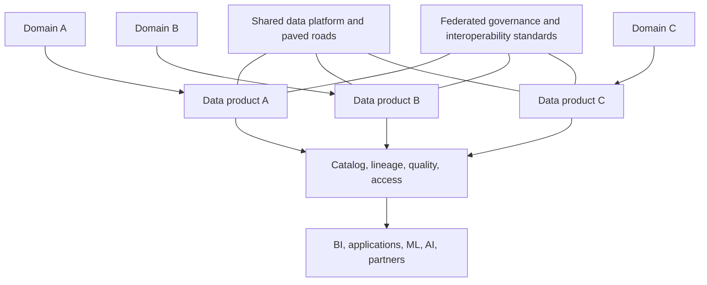
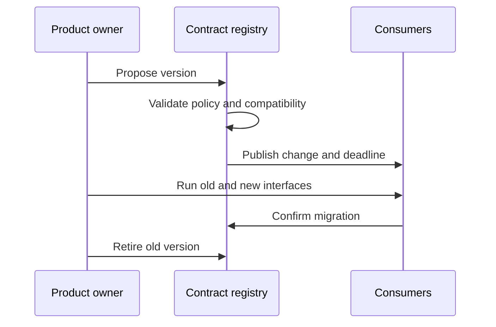

> **文档类型：** 数据、AI 和集成标准
> **规范性术语：** **MUST**、**MUST NOT**、**SHOULD**、**SHOULD NOT** 和 **MAY** 是要求级别。
> **适用范围：** 领域负责的数据产品、数据网格操作模型、机器可读契约、质量目标和消费者责任。
> **例外流程：** 偏离要求需要记录风险评估、补偿控制、指定风险负责人和到期日期。

|控制领域|价值|
|---|---|
|文件编号 | `DAI-15` |
|负责人|云卓越中心 |
|审核周期|至少每年一次，并且在重大平台、提供商、数据、安全或运营模式发生变化之后 |
|证据|数据产品契约、质量结果、所有权日志、消费者测试和运营就绪证据 |

# 数据产品、数据网格和数据契约指南

> **决策简述：** 将数据视为一种产品：由数据域负责、契约定义、可发现、质量支持、可互操作，并由自助服务平台支持。

## 目的

这些准则定义了域如何发布可信数据，而不会创建断开连接的湖、重复的定义或不兼容的接口。数据网格是一种结合领域所有权、产品思维、自助服务平台和联邦计算治理的运营模型；它不是产品购买或文件夹结构。

## 参考模型

## 产品标准

生产数据产品 MUST 提供：

- 稳定的产品 ID、所有者、域名、用途和支持渠道；
- 界面和机器可读模式；
- 业务定义、分类、允许的用途和保留；
- 新鲜度、可用性、质量和支持目标；
- 来源和转换血缘；
- 访问请求和授权模型；
- 版本控制、兼容性、弃用和事件处理；
- 成本分配和消费者清单。

## 契约示例
```yaml
product: customer-orders
version: 2.3.0
owner: commerce-data
interface: table
classification: confidential
compatibility: backward
slo:
  freshness_minutes: 30
  completeness_percent: 99.9
keys:
  - order_id
retention_days: 2555
```
契约 MUST 通过自动兼容性、所有权、策略和质量检查进行版本控制。即使物理类型保持不变，语义破坏性更改也算作破坏性更改。

## 所有权模型

数据域负责含义、来源正确性、产品质量、消费者沟通和生命周期。平台团队负责可复用的摄取、存储、目录、安全性、可观测性、契约验证和交付功能。联合治理定义了全局标识符、分类、互操作性、最低控制和争议解决。

## 多云实施

产品可以使用 Azure Storage/Fabric/Databricks、AWS S3/Redshift、GCP BigQuery/Cloud Storage 或 OCI Object Storage/Autonomous Database。持久契约 SHOULD 在交换边界使用可移植模式和开放格式。当存在导出、迁移和消费者影响策略时，特定于提供商的优化是可以接受的。

## 变化与消费

消费者 MUST 使用已发布的接口、尊重分类和用途、避免刮擦内部存储、报告质量问题并识别关键依赖项。当副本增加了持久的转换、独立的消费者或明确的责任时，它们就成为新产品。

## 采用方法

从一些高价值领域和产品开始，建立平台和契约标准，度量消费者成果，然后进行扩展。在所有权成熟和平台自动化存在之前，不要围绕数据网格重组企业。

## 验证

验证契约完整性、模式兼容性、质量 SLO、访问实施、可发现性、数据血缘、消费者清单、弃用通知和恢复。跟踪发现和访问的时间、SLO 达到情况、重大变更、不受支持的产品、未解决的质量事件、重用以及每个活跃消费者的成本。

## 操作注意事项

避免中心瓶颈和不受治理的域自治。将共享平台功能作为产品提供资金，分配负责任的域所有者，建立共享语义的架构论坛，并为未使用的产品提供退役工作流程。

## 数据产品就绪级别

使用就绪级别来避免将每个数据集标记为受支持的产品。

|水平|特点 |消费者期望|
|---|---|---|
|实验|所有者已知，界面可能会更改，无生产 SLO |仅评估|
|管理|契约、分类、基本质量和支持|限量生产使用|
|认证|完整的 SLO、数据血缘、兼容性、访问、恢复和事件流程 |企业生产使用|
|已弃用 |迁移目标和退休日期公布|没有新消费者|
|退休 |接口被禁用并处理残留数据|仅历史证据|

认证 MUST 是有依据的。没有工作质量、访问和支持控制的目录徽章不是认证。

## 契约执行点

契约 SHOULD 在多个阶段进行检查：

1. 生产者 CI 验证模式、语义、分类和所有权。
2. 摄取验证有效负载形状、所需元数据和兼容性。
3. 转型验证质量和协调。
4. 发布访问验证策略、新鲜度、版本和文档。
5. 消费者 CI 验证预期字段和声明的兼容性。
6. 运行时监控可检测新鲜度、数量和质量违规情况。

不要依赖存储架构但未集成到交付或运行时控件中的注册表。

## 依赖关系和事件处理

产品所有者 MUST 维护关键产品的消费者清单。消费者应声明其所需的版本、新鲜度依赖性、重要性和升级联系方式。这支持影响分析、计划退休和事件沟通。

当产品违反契约时：

——在目录中标记产品降级或暂停；
- 通知受影响的关键消费者；
- 防止晋级已知无效的版本；
- 区分迟到的、不完整的、语义错误的和未经授权的数据；
- 通过事件流程发布解决方法和恢复估计；
- 在宣布恢复之前完成对账。

## 联邦治理决策权

中央治理负责企业标识符、分类、最小元数据、互操作性和强制性安全控制。数据域负责业务语义、产品优先级、质量规则和消费者支持。平台团队负责可复用的执行、目录、可观测性和访问工作流程。

仅当相互冲突的定义对共享报告、监管或互操作性产生重大影响时，跨域术语或指标才需要指定决策论坛。不要集中每个本地定义。

## 相关主题
- [治理数据平台架构](dai-governed-data-platform-architecture.md)
- [企业数据治理、目录、数据血缘和质量标准](dai-enterprise-data-governance-catalog-lineage-and-quality.md)
- [DataOps CI/CD、测试和架构演进最佳实践](dai-dataops-cicd-testing-and-schema-evolution.md)

## 参考文档

- [Azure 数据网格指南](https://learn.microsoft.com/en-us/azure/cloud-adoption-framework/scenarios/cloud-scale-analytics/architectures/what-is-data-mesh)
- [AWS 数据网格策略](https://docs.aws.amazon.com/prescriptive-guidance/latest/strategy-data-mesh/introduction.html)
- [Google Cloud 数据网格架构](https://cloud.google.com/architecture/data-mesh)

## 相关仓库

- [andyxuan2010/enterprise-ai-doc](https://github.com/andyxuan2010/enterprise-ai-doc) — 演示了一个受控文档处理流程，可生成标准化、可复用的结构化数据。
