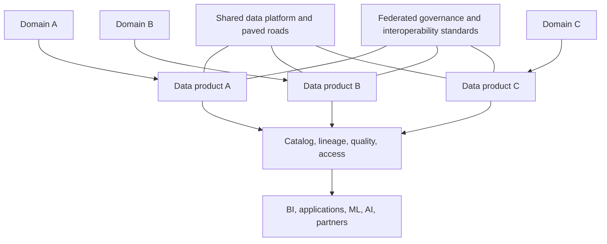
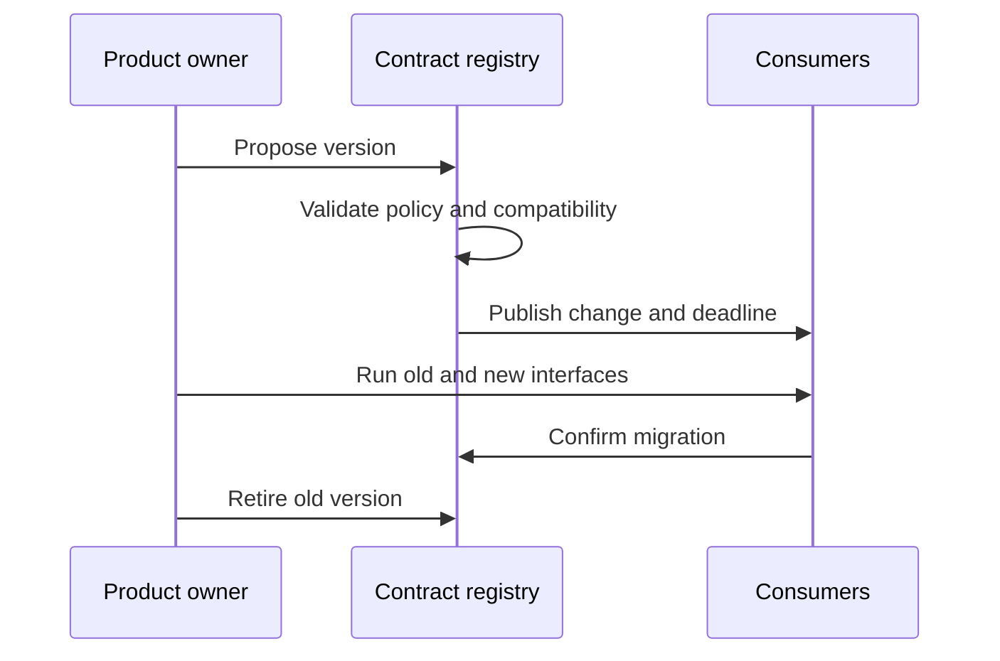

> **Document class:** Data, AI & Integration standard
> **Normative terms:** **MUST**, **MUST NOT**, **SHOULD**, **SHOULD NOT**, and **MAY** are requirements levels.
> **Applicability:** Domain-owned data products, data mesh operating models, machine-readable contracts, quality objectives, and consumer responsibilities.
> **Exception process:** Deviations require a documented risk assessment, compensating controls, named risk owner, and expiry date.

| Control field | Value |
|---|---|
| Document ID | `DAI-15` |
| Owner | Cloud Center of Excellence |
| Review cycle | At least annually and after material platform, provider, data, security, or operating-model changes |
| Evidence | Data-product contract, quality results, ownership record, consumer tests, and operational readiness evidence |

# Data Products, Data Mesh, and Data Contract Guidelines

> **Decision in brief:** Treat data as a product: domain-owned, contract-defined, discoverable, quality-backed, interoperable, and supported by a self-service platform.

## Purpose

These guidelines define how domains publish trustworthy data without creating disconnected lakes, duplicated definitions, or incompatible interfaces. Data mesh is an operating model combining domain ownership, product thinking, a self-service platform, and federated computational governance; it is not a product purchase or a folder structure.

## Reference model



## Product standard

A production data product MUST provide:

- stable product ID, owner, domain, purpose, and support channel;
- interface and machine-readable schema;
- business definitions, classification, permitted uses, and retention;
- freshness, availability, quality, and support objectives;
- source and transformation lineage;
- access request and authorization model;
- versioning, compatibility, deprecation, and incident process;
- cost allocation and consumer inventory.

## Contract example

```yaml
product: customer-orders
version: 2.3.0
owner: commerce-data
interface: table
classification: confidential
compatibility: backward
slo:
  freshness_minutes: 30
  completeness_percent: 99.9
keys:
  - order_id
retention_days: 2555
```

Contracts MUST be versioned with automated compatibility, ownership, policy, and quality checks. Semantic breaking changes count as breaking even when physical types remain unchanged.

## Ownership model

Domains own meaning, source correctness, product quality, consumer communication, and lifecycle. The platform team owns reusable ingestion, storage, catalog, security, observability, contract validation, and delivery capabilities. Federated governance defines global identifiers, classification, interoperability, minimum controls, and dispute resolution.

## Multi-cloud implementation

Products may use Azure storage/Fabric/Databricks, AWS S3/Redshift, GCP BigQuery/Cloud Storage, or OCI Object Storage/Autonomous Database. Durable contracts SHOULD use portable schemas and open formats at exchange boundaries. Provider-specific optimizations are acceptable when an export, migration, and consumer-impact strategy exists.

## Change and consumption



Consumers MUST use published interfaces, respect classification and purpose, avoid scraping internal storage, report quality issues, and identify critical dependencies. Copies become new products when they add durable transformation, independent consumers, or distinct accountability.

## Adoption approach

Start with a few high-value domains and products, establish the platform and contract standard, measure consumer outcomes, then expand. Do not reorganize the enterprise around data mesh before ownership maturity and platform automation exist.

## Validation

Verify contract completeness, schema compatibility, quality SLOs, access enforcement, discoverability, lineage, consumer inventory, deprecation notification, and recovery. Track time to discover and access, SLO attainment, breaking changes, unsupported products, unresolved quality incidents, reuse, and cost per active consumer.

## Operational considerations

Avoid central bottlenecks and ungoverned domain autonomy. Fund shared platform capabilities as products, assign accountable domain owners, establish an architecture forum for shared semantics, and provide a retirement workflow for unused products.

## Data Product Readiness Levels

Use readiness levels to avoid labeling every dataset as a supported product.

| Level | Characteristics | Consumer expectation |
|---|---|---|
| Experimental | owner known, interface may change, no production SLO | evaluation only |
| Managed | contract, classification, basic quality and support | limited production use |
| Certified | full SLO, lineage, compatibility, access, recovery, and incident process | enterprise production use |
| Deprecated | migration target and retirement date published | no new consumers |
| Retired | interface disabled and residual data handled | historical evidence only |

Certification MUST be evidence based. A catalog badge without working quality, access, and support controls is not certification.

## Contract Enforcement Points

Contracts SHOULD be checked at multiple stages:

1. Producer CI validates schema, semantics, classifications, and ownership.
2. Ingestion validates payload shape, required metadata, and compatibility.
3. Transformation validates quality and reconciliation.
4. Publication validates access policy, freshness, version, and documentation.
5. Consumer CI validates expected fields and declared compatibility.
6. Runtime monitoring detects freshness, volume, and quality violations.

Do not rely on a registry that stores schemas but is not integrated into delivery or runtime controls.

## Dependency and Incident Handling

A product owner MUST maintain a consumer inventory for critical products. Consumers should declare their required version, freshness dependency, criticality, and escalation contact. This supports impact analysis, planned retirement, and incident communication.

When a product violates its contract:

- mark the product degraded or suspended in the catalog;
- notify affected critical consumers;
- prevent promotion of known-invalid versions;
- distinguish late, incomplete, semantically wrong, and unauthorized data;
- publish workaround and restoration estimates through the incident process;
- complete reconciliation before declaring recovery.

## Federated Governance Decision Rights

Central governance owns enterprise identifiers, classification, minimum metadata, interoperability, and mandatory security controls. Domains own business semantics, product priorities, quality rules, and consumer support. The platform team owns reusable enforcement, catalog, observability, and access workflows.

A cross-domain term or metric requires a named decision forum only when conflicting definitions materially affect shared reporting, regulation, or interoperability. Do not centralize every local definition.

## Related topics
- [Governed Data Platform Architecture](dai-governed-data-platform-architecture.md)
- [Enterprise Data Governance, Catalog, Lineage, and Quality Standard](dai-enterprise-data-governance-catalog-lineage-and-quality.md)
- [DataOps CI/CD, Testing, and Schema Evolution Best Practices](dai-dataops-cicd-testing-and-schema-evolution.md)

## References

- [Azure data mesh guidance](https://learn.microsoft.com/en-us/azure/cloud-adoption-framework/scenarios/cloud-scale-analytics/architectures/what-is-data-mesh)
- [AWS data mesh strategy](https://docs.aws.amazon.com/prescriptive-guidance/latest/strategy-data-mesh/introduction.html)
- [Google Cloud data mesh architecture](https://cloud.google.com/architecture/data-mesh)

## Related repos

- [andyxuan2010/enterprise-ai-doc](https://github.com/andyxuan2010/enterprise-ai-doc) — demonstrates a governed document-processing flow that produces normalized, reusable structured data.
