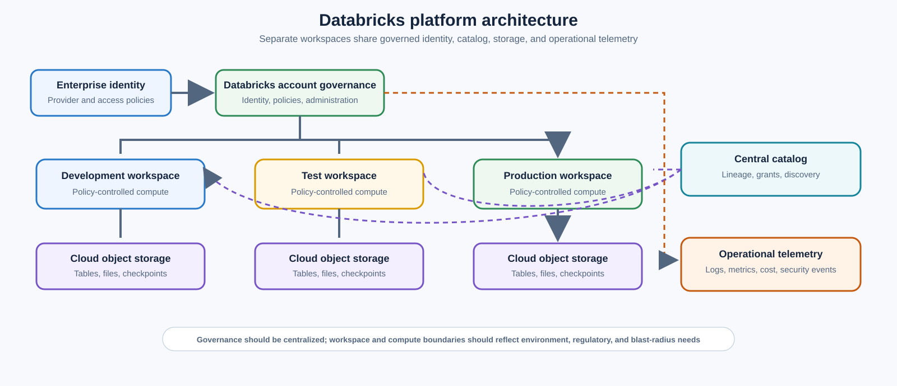
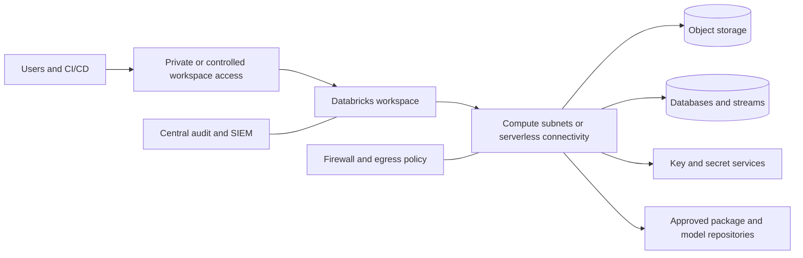
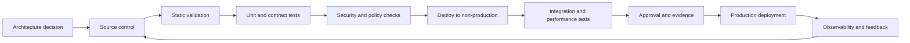

> **文档类型：**数据、AI 和集成架构参考模型
> **规范性术语：** **MUST**、**MUST NOT**、**SHOULD**、**SHOULD NOT** 和 **MAY** 是要求级别。
> **适用范围：** Azure、AWS 和 GCP 上的 Databricks Lakehouse 平台，将 OCI 视为集成环境。
> **例外流程：** 偏离要求需要记录风险评估、补偿控制、指定风险负责人和到期日期。

|控制领域|价值|
|---|---|
|文件编号 | `DAI-04` |
|负责人|云卓越中心 |
|审核周期|至少每年一次，并且在重大平台、提供商、数据、安全或运营模式发生变化之后 |
|证据|架构决策、工作区和策略配置、安全审查、验证结果和运营就绪证据 |

# Databricks 平台架构

> **决策简述：** 使用 Databricks 作为受管理的 Lakehouse 平台，具有独立的工作区、目录控制的访问、基于策略的计算和云原生存储。

## 目的

本文档定义了 Azure、AWS 和 GCP 上 Databricks 平台的批准架构。 Databricks 工作区本地托管在这三个云上。因此，OCI 被视为集成环境，而不是原生 Databricks 托管目标； OCI 原生 Spark 工作负载应评估 OCI Data Flow 或其他批准的平台。

## 平台模型

Databricks 实现具有不同的平面：

- **账户和治理平面：**身份、工作区分配、元存储、策略和集中管理；
- **控制平面：** 提供商运营的管理工作空间功能的服务；
- **计算平面：**经典、无服务器或客户控制的计算，具体取决于云和功能；
- **存储平面：**云对象存储、托管表、外部表、卷、检查点和制品；
- **集成平面：**摄取、编排、BI、CI/CD、模型服务和外部系统。

## 工作空间和元存储策略

将生产工作区与非生产工作区分开。额外的工作空间取决于监管边界、独立管理、网络隔离、区域性或实质上不同的爆炸半径。在没有治理模型的情况下为每个团队创建一个工作空间会产生碎片，应该避免。

中央目录和治理模型 SHOULD 控制跨工作区的数据和 AI 资产。目录设计 SHOULD 与稳定的业务或安全边界保持一致，而架构和对象代表域、产品、环境和生命周期阶段。

推荐的层次结构：

- 目录：主要数据域、监管边界或环境边界；
- 模式：产品或有界主题领域；
- 表/视图/卷/模型/功能：受治理资产；
- 标签：分类、所有者、保留、关键性和成本中心。

## 存储架构
云对象存储是 Lakehouse 数据的持久化记录系统。存储账户、存储桶和容器 MUST 按环境和敏感度隔离。应最大限度地减少用户对底层存储的直接访问；访问 SHOULD 通过目录权限以及经批准的外部位置或存储凭据进行。

使用开放表格式和事务元数据来实现可靠的更新、架构强制执行、时间旅行和可重现的管道。根据工作负载证据优化文件大小和布局。过多的分区和不受控制的小文件会降低成本和性能。

## 计算模式

|计算模式 |首选用途 |关键控制|
|---|---|---|
|作业计算 |预定的管道和可重复的工作负载|策略、自动终止、固定运行时、作业身份 |
|交互式计算|开发探索|严格配额、自动终止、有限数据访问 |
| SQL 仓库| BI 和 SQL 服务 |工作负载隔离、大小调整策略、查询监控 |
|无服务器计算 |获取批准和区域支持的弹性工作负载 |数据驻留审查、出口控制、预算限制 |
|专用机器学习计算 |训练或 GPU 工作负载 |批准的实例类型、利用率指标、模型治理 |

除非存在记录在案的技术限制，否则禁止运行连续生产流水线的共享通用集群。

## 网络架构

首选设计使用计算和云存储、数据库、密钥管理和批准的服务之间的私有连接。通过私有访问、IP 访问列表、条件访问或提供商等效控制来限制工作区公共访问。

出口 MUST 受到控制。库、包、模型制品和外部 API 是供应链和渗透路径。使用批准的包仓库、制品镜像、防火墙规则和私有端点。

## 身份和授权

使用身份联合和自动用户/组配置。人类访问 MUST 是基于组的；向个人直接拨款属于暂时例外。工作负载 SHOULD 使用服务主体、托管身份、IAM 角色或工作负载身份联合。

所需控制：

- 账户管理员与工作区管理员分开；
- 生产工作区管理受到严格限制；
- 集中执行集群或计算策略；
- 使用目录授权代替原始存储密钥；
- 存储在经批准的机密机构中的机密；
- 个人访问令牌最小化、短暂且受监控；
- 按工作负载和环境划分的服务身份；
- 定期权利审查和孤儿校长清理。

## 数据工程标准

流水线 MUST 是确定性的、可测试的和可监控的。批准的模式包括增量摄取、检查点流、声明式管道框架和版本化 SQL/Python/Scala 代码。笔记本可能是一个创作界面，但不能免除软件工程控制。

每个生产流水线都需要：

- 源契约和目标契约；
- 幂等重试行为；
- 模式演化策略；
- 质量期望和检疫；
- 数据血缘和运行元数据；
- 性能和成本基准；
- 所有者、SLO、告警和运行手册；
- 部署和回滚过程。

## ML 和 AI 平台控制

模型、提示、向量索引、特征、函数和评估数据集都是受治理资产。模型升级 MUST 包括训练数据和代码的数据血缘、评估证据、安全审查、运行时依赖性和回滚标准。必须主动测试功能泄漏、数据泄漏和未经授权的敏感属性。

模型服务 SHOULD 与实验分开。生产端点需要身份验证、速率限制、日志、偏差监控、滥用控制和成本归因。

## 多 Cloud Deploy 指南

|关注|Azure Databricks|AWS 上的 Databricks|GCP 上的 Databricks|OCI 集成|
|---|---|---|---|---|
|对象存储|ADLS Gen2|S3|Cloud Storage|通过批准的传输或网络集成进行对象存储|
|企业身份|Microsoft Entra ID 联合|IAM 和企业 IdP 联合|Cloud Identity/企业 IdP 联合|用于 OCI 端资产的 OCI IAM；对外部 Databricks 的联合访问|
|私有连接 |私有链接和 VNet 模式 | PrivateLink 和 VPC 模式 | Private Service Connect 和 VPC 模式 | FastConnect、DRG、服务网关和受控跨云连接 |
|原生 Spark 替代方案|Azure Databricks|Databricks 或 EMR|Databricks 或 Dataproc|OCI Data Flow|

跨云数据访问 SHOULD 谨慎采用，因为它引入了延迟、传输成本、可用性耦合和主权复杂性。将计算迁移到数据或发布受治理的产品，而不是重复扫描远程对象存储。

## 可观测性
收集账户、工作区、计算、作业、查询、目录、模型和访问遥测。至少，跟踪作业成功和持续时间、数据新鲜度、集群启动时间、利用率、DBU 或等效用量、云基础设施成本、查询延迟、失败的授权、令牌使用、数据泄露信号和每个产品的成本。

将系统表或等效审计源 SHOULD 导出到工作区管理员无法更改的安全控制目标。

## 成本架构

成本控制包括集群策略、批准的实例系列、自动终止、作业计算、无服务器预算、容错工作负载的现货/抢占容量、查询优化、文件压缩、工作负载隔离和成本分摊标签。必须在 Databricks 使用量和底层云基础设施之间联合度量成本。

## 跨领域的治理要求

平台 MUST 将数据产品、模型、提示、索引、管道和集成接口视为受治理资产。每项资产都需要一个负责任的所有者、分类、生命周期状态、批准的消费者、数据血缘、保留规则和运营目标。平台控制 MUST 通过策略即代码和基础设施即代码应用，而不是手动门户配置。

最低治理控制是：

1. 具有自动元数据收集功能的业务术语表和技术目录。
2. 摄取时的数据分类和转换后的重新分类。
3. 从源到转换、模型或索引、API 和消费者的端到端数据血缘。
4. 平台管理、数据管理、开发和生产运营之间的职责分离。
5. 用于管理操作和访问受监管数据的不可变审计日志。
6. 明确的保留、存档、合法保留和删除程序。
7、具有证据、审批、回滚能力的环境晋级。
8. 定期访问重新认证和控制有效性审查。

## 交付和生命周期标准

所有可部署资源 MUST 在版本控制中表示。合规的交付流程是：

生产变更 MUST 使用可重复的流水线、短期工作负载标识、同行评审和可审核的批准。紧急变更需要追溯相同的证据，MUST NOT 成为并行运营模式。

## 平台引导和工作区入驻

工作区创建 MUST 是一个可重复的平台工作流程，而不是一个孤立的管理员任务。工作流程 SHOULD 在授予消费者访问权限之前建立账户分配、工作区网络、目录绑定、身份同步、计算策略、机密集成、审计导出、预算和基线组。

最低入驻交易为：

1. 验证所请求的环境、区域、数据分类和监管概况。
2. 创建工作区或将工作区与批准的云边界和网络配置文件关联。
3. 绑定正确的元存储和允许的目录。
4. 为部署自动化提供服务身份和联合访问。
5. 应用计算、库、集群、SQL 仓库和无服务器策略。
6. 配置审计、成本、作业、查询和安全遥测。
7. 运行负面授权测试和代表性工作。
8. 记录工作区版本、所有者、支持级别和接受的证据。

工作空间漂移 SHOULD 通过账户级 API、Terraform、提供商原生 IaC 或批准的自动化进行协调。更改网络、目录、身份或审核配置的手动门户更改 MUST 被检测到，并通过正常发布路径恢复或合并。

## 运行时、库和依赖生命周期

生产工作负载 MUST 声明其 Databricks 运行时、语言依赖项、原生库、容器或环境规范以及支持窗口。对于关键工作负载，禁止在没有兼容性证据的情况下自动移动到新的运行时。

库控件 SHOULD 包括：

- 批准的包来源和制品镜像；
- 已发布包的校验和或签名验证；
- 开发和生产安装权限分离；
- 漏洞和许可证扫描；
- 语言生态系统支持的依赖锁定文件；
- 在运行时或库升级之前进行金丝雀测试；
- 到最后支持的环境的回滚路径。

平台团队 SHOULD 发布运行时采用日历，涵盖新运行时资格、默认版本更改、弃用和最终停用。工作负载所有者仍然负责根据该日历测试代码、连接器、UDF 和性能行为。

## 外部共享与数据交换

数据交换 MUST 使用目录管理的共享、批准的外部位置或数据产品接口。绕过目录策略、直接向存储桶或存储账户授予访问权限 SHOULD 被视为例外。

对于每个外部共享，记录提供商、接收者、对象、列、分类、目的、过期、允许的下游使用、撤销机制和访问证据。测试已撤销的收件人是否失去访问权限以及缓存或导出的副本是否根据管理数据契约进行处理。

## 相关主题
- [治理数据平台架构](dai-governed-data-platform-architecture.md)
- [企业数据治理、目录、数据血缘和质量标准](dai-enterprise-data-governance-catalog-lineage-and-quality.md)
- [DataOps CI/CD、测试和架构演进最佳实践](dai-dataops-cicd-testing-and-schema-evolution.md)
- [跨云数据共享、联邦和零拷贝架构](dai-cross-cloud-data-sharing-federation-and-zero-copy.md)

## 反模式
- 应用于所有环境和敏感性的一个共享工作区和元存储。
- 直接嵌入笔记本中的云存储访问密钥。
- 长期运行的交互式集群上的生产作业。
- 授予工作区管理员解决普通数据访问请求的权限。
- 从公共互联网不受限制的软件包安装。
- 当数据可以本地发布时，跨云读取用于常规处理。
- 将笔记本视为未经审查的生产制品。
- 在不结合 Databricks 和云提供商费用的情况下测量平台成本。

## 验证

- [ ] 已分配业务所有者、技术所有者、数据所有者和支持所有者。
- [ ] 记录数据分类、驻留、主权、保留和删除要求。
- [ ] 身份使用联合或托管工作负载身份；不允许嵌入凭据。
- [ ] 公共网络暴露被禁用，除非记录在案的例外情况得到批准。
- [ ] 定义了加密、密钥所有权、轮换和 break-glass 程序。
- [ ] 测试可用性、恢复、可扩展性和容量假设。
- [ ] 日志、指标、跟踪、数据血缘和成本分配在生产前实施。
- [ ] 执行部署、回滚、备份恢复和灾难恢复过程。
- [ ] 记录服务限制、配额、区域依赖性和特定于提供商的约束。
- [ ] 退出策略和可移植性边界是明确的。

## 参考文档

- [Azure Databricks 架构](https://learn.microsoft.com/azure/databricks/getting-started/architecture)
- [Databricks 参考架构](https://learn.microsoft.com/azure/databricks/lakehouse-architecture/reference)
- [Databricks 支持的云和区域](https://docs.databricks.com/aws/en/resources/supported-regions)
- [AWS 文档上的 Databricks](https://docs.databricks.com/aws/en/)
- [GCP 文档上的 Databricks](https://docs.databricks.com/gcp/en/)
- [OCI Data Flow 概述](https://docs.oracle.com/en-us/iaas/Content/data-flow/using/dfs_service_overview.htm)
