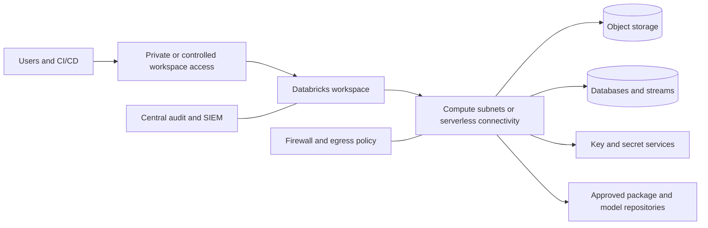
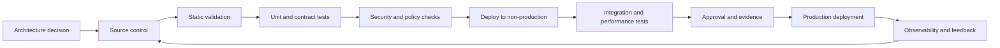

> **Document class:** Data, AI & Integration architecture reference model
> **Normative terms:** **MUST**, **MUST NOT**, **SHOULD**, **SHOULD NOT**, and **MAY** are requirements levels.
> **Applicability:** Databricks lakehouse platforms on Azure, AWS, and GCP, with OCI treated as an integration environment.
> **Exception process:** Deviations require a documented risk assessment, compensating controls, named risk owner, and expiry date.

| Control field | Value |
|---|---|
| Document ID | `DAI-04` |
| Owner | Cloud Center of Excellence |
| Review cycle | At least annually and after material platform, provider, data, security, or operating-model changes |
| Evidence | Architecture decision, workspace and policy configuration, security review, validation results, and operational readiness evidence |

# Databricks Platform Architecture

> **Decision in brief:** Use Databricks as a governed lakehouse platform with isolated workspaces, catalog-controlled access, policy-based compute, and cloud-native storage.

## Purpose

This document defines the approved architecture for Databricks platforms on Azure, AWS, and GCP. Databricks workspaces are natively hosted on those three clouds. OCI is therefore treated as an integration environment, not a native Databricks hosting target; OCI-native Spark workloads should evaluate OCI Data Flow or other approved platforms.

## Platform Model

A Databricks implementation has distinct planes:

- **account and governance plane:** identities, workspace assignment, metastore, policies, and centralized administration;
- **control plane:** provider-operated services that manage workspace functions;
- **compute plane:** classic, serverless, or customer-controlled compute depending on cloud and feature;
- **storage plane:** cloud object storage, managed tables, external tables, volumes, checkpoints, and artifacts;
- **integration plane:** ingestion, orchestration, BI, CI/CD, model serving, and external systems.

## Workspace and Metastore Strategy

Separate production from non-production workspaces. Additional workspaces are justified by regulatory boundaries, independent administration, network isolation, regionality, or materially different blast radius. Creating a workspace per team without a governance model produces fragmentation and should be avoided.

A central catalog and governance model SHOULD control data and AI assets across workspaces. Catalog design SHOULD align with stable business or security boundaries, while schemas and objects represent domains, products, environments, and lifecycle stages.

Recommended hierarchy:

- catalog: major data domain, regulatory boundary, or environment boundary;
- schema: product or bounded subject area;
- table/view/volume/model/function: governed asset;
- tags: classification, owner, retention, criticality, and cost center.

## Storage Architecture

Cloud object storage is the durable system of record for lakehouse data. Storage accounts, buckets, and containers MUST be segregated by environment and sensitivity. Direct user access to underlying storage SHOULD be minimized; access SHOULD flow through catalog permissions and approved external locations or storage credentials.

Use open table formats and transactional metadata for reliable updates, schema enforcement, time travel, and reproducible pipelines. Optimize file size and layout based on workload evidence. Excessive partitioning and uncontrolled small files degrade both cost and performance.

## Compute Patterns

| Compute pattern | Preferred use | Key controls |
|---|---|---|
| Job compute | Scheduled pipelines and repeatable workloads | policy, auto-termination, pinned runtime, job identity |
| Interactive compute | Development and exploration | strict quotas, auto-termination, limited data access |
| SQL warehouse | BI and SQL serving | workload isolation, sizing policy, query monitoring |
| Serverless compute | Elastic workloads where approved and regionally supported | data residency review, egress controls, budget limits |
| Dedicated ML compute | training or GPU workloads | approved instance types, utilization metrics, model governance |

Shared all-purpose clusters running continuous production pipelines are prohibited unless a documented technical constraint exists.

## Network Architecture

The preferred design uses private connectivity between compute and cloud storage, databases, key management, and approved services. Public ingress to workspaces SHOULD be restricted through private access, IP access lists, conditional access, or provider-equivalent controls.

Egress MUST be controlled. Libraries, packages, model artifacts, and external APIs are supply-chain and exfiltration paths. Use approved package repositories, artifact mirrors, firewall rules, and private endpoints.

## Identity and Authorization

Use identity federation and automated user/group provisioning. Human access MUST be group-based; direct grants to individuals are temporary exceptions. Workloads SHOULD use service principals, managed identities, IAM roles, or workload identity federation.

Required controls:

- account administrators separate from workspace administrators;
- production workspace administration tightly limited;
- cluster or compute policies enforced centrally;
- catalog grants used instead of raw storage keys;
- secrets stored in approved secret services;
- personal access tokens minimized, short-lived, and monitored;
- service identities separated by workload and environment;
- periodic entitlement review and orphaned-principal cleanup.

## Data Engineering Standard

Pipelines MUST be deterministic, testable, and observable. Approved patterns include incremental ingestion, checkpointed streaming, declarative pipeline frameworks, and versioned SQL/Python/Scala code. Notebooks may be an authoring interface but are not exempt from software engineering controls.

Each production pipeline requires:

- source and target contracts;
- idempotent retry behavior;
- schema evolution policy;
- quality expectations and quarantine;
- lineage and run metadata;
- performance and cost baseline;
- owner, SLO, alert, and runbook;
- deployment and rollback procedure.

## ML and AI Platform Controls

Models, prompts, vector indexes, features, functions, and evaluation datasets are governed assets. Model promotion MUST include lineage to training data and code, evaluation evidence, security review, runtime dependencies, and rollback criteria. Feature leakage, data leakage, and unauthorized sensitive attributes must be actively tested.

Model serving SHOULD be separated from experimentation. Production endpoints require authentication, rate limits, logging, drift monitoring, abuse controls, and cost attribution.

## Multi-Cloud Deployment Guidance

| Concern | Azure Databricks | Databricks on AWS | Databricks on GCP | OCI integration |
|---|---|---|---|---|
| Object storage | ADLS Gen2 | S3 | Cloud Storage | Object Storage through approved transfer or network integration |
| Enterprise identity | Microsoft Entra ID federation | IAM and enterprise IdP federation | Cloud Identity / enterprise IdP federation | OCI IAM for OCI-side assets; federated access to external Databricks |
| Private connectivity | Private Link and VNet patterns | PrivateLink and VPC patterns | Private Service Connect and VPC patterns | FastConnect, DRG, service gateways, and controlled cross-cloud connectivity |
| Native Spark alternative | Azure Databricks | Databricks or EMR | Databricks or Dataproc | OCI Data Flow |

Cross-cloud data access SHOULD be exceptional because it introduces latency, transfer cost, availability coupling, and sovereignty complexity. Move compute to data or publish governed products rather than repeatedly scanning remote object storage.

## Observability

Collect account, workspace, compute, job, query, catalog, model, and access telemetry. At minimum, track job success and duration, data freshness, cluster startup time, utilization, DBU or equivalent consumption, cloud infrastructure cost, query latency, failed grants, token use, data exfiltration signals, and cost per product.

System tables or equivalent audit feeds SHOULD be exported to a security-controlled destination that workspace administrators cannot alter.

## Cost Architecture

Cost controls include cluster policies, approved instance families, auto-termination, job compute, serverless budgets, spot/preemptible capacity for fault-tolerant workloads, query optimization, file compaction, workload isolation, and chargeback tags. Cost must be measured jointly across Databricks consumption and underlying cloud infrastructure.

## Cross-cutting governance requirements

The platform MUST treat data products, models, prompts, indexes, pipelines, and integration interfaces as governed assets. Each asset requires an accountable owner, classification, lifecycle state, approved consumers, lineage, retention rules, and operational objectives. Platform controls MUST be applied through policy-as-code and infrastructure-as-code rather than manual portal configuration.

Minimum governance controls are:

1. A business glossary and technical catalog with automated metadata harvesting.
2. Data classification at ingestion and reclassification after transformation.
3. End-to-end lineage from source through transformation, model or index, API, and consumer.
4. Segregation of duties between platform administration, data stewardship, development, and production operations.
5. Immutable audit logging for administrative actions and access to regulated data.
6. Explicit retention, archival, legal-hold, and deletion procedures.
7. Environment promotion with evidence, approval, and rollback capability.
8. Periodic access recertification and control-effectiveness reviews.

## Delivery and lifecycle standard

All deployable resources MUST be represented in version control. A compliant delivery flow is:

Production changes MUST use repeatable pipelines, short-lived workload identities, peer review, and auditable approvals. Emergency changes require the same evidence retrospectively and MUST not become a parallel operating model.

## Platform Bootstrap and Workspace Onboarding

Workspace creation MUST be a repeatable platform workflow rather than an isolated administrator task. The workflow SHOULD establish account assignment, workspace networking, catalog binding, identity synchronization, compute policies, secret integration, audit export, budgets, and baseline groups before consumer access is granted.

A minimum onboarding transaction is:

1. Validate the requested environment, region, data classification, and regulatory profile.
2. Create or associate the workspace with the approved cloud boundary and network profile.
3. Bind the correct metastore and permitted catalogs.
4. Provision service identities and federated access for deployment automation.
5. Apply compute, library, cluster, SQL warehouse, and serverless policies.
6. Configure audit, cost, job, query, and security telemetry.
7. Run negative authorization tests and a representative job.
8. Record the workspace version, owner, support tier, and accepted evidence.

Workspace drift SHOULD be reconciled through account-level APIs, Terraform, provider-native IaC, or approved automation. Manual portal changes that alter network, catalog, identity, or audit configuration MUST be detected and either reverted or incorporated through the normal release path.

## Runtime, Library, and Dependency Lifecycle

Production workloads MUST declare their Databricks runtime, language dependencies, native libraries, container or environment specification, and support window. Automatic movement to a new runtime without compatibility evidence is prohibited for critical workloads.

Library controls SHOULD include:

- approved package sources and artifact mirrors;
- checksum or signature verification for released packages;
- separation of development and production installation permissions;
- vulnerability and license scanning;
- dependency-lock files where the language ecosystem supports them;
- canary testing before runtime or library upgrades;
- a rollback path to the last supported environment.

Platform teams SHOULD publish a runtime adoption calendar covering new runtime qualification, default-version changes, deprecation, and final retirement. Workload owners remain responsible for testing code, connectors, UDFs, and performance behavior against that calendar.

## External Sharing and Data Exchange

Data exchange MUST use catalog-governed sharing, approved external locations, or data-product interfaces. Direct bucket or storage-account grants that bypass catalog policy SHOULD be treated as exceptions.

For every external share, record the provider, recipient, objects, columns, classification, purpose, expiration, allowed downstream use, revocation mechanism, and access evidence. Test that revoked recipients lose access and that cached or exported copies are handled under the governing data contract.

## Related topics

- [Governed Data Platform Architecture](dai-governed-data-platform-architecture.md)
- [Enterprise Data Governance, Catalog, Lineage, and Quality Standard](dai-enterprise-data-governance-catalog-lineage-and-quality.md)
- [DataOps CI/CD, Testing, and Schema Evolution Best Practices](dai-dataops-cicd-testing-and-schema-evolution.md)
- [Cross-Cloud Data Sharing, Federation, and Zero-Copy Architecture](dai-cross-cloud-data-sharing-federation-and-zero-copy.md)

## Anti-patterns
- One shared workspace and metastore for all environments and sensitivities.
- Direct cloud-storage access keys embedded in notebooks.
- Production jobs on long-running interactive clusters.
- Granting workspace administrator to solve ordinary data-access requests.
- Unrestricted package installation from the public internet.
- Cross-cloud reads for routine processing when data can be published locally.
- Treating notebooks as unreviewed production artifacts.
- Measuring platform cost without combining Databricks and cloud-provider charges.

## Validation

- [ ] Business owner, technical owner, data owner, and support owner are assigned.
- [ ] Data classification, residency, sovereignty, retention, and deletion requirements are documented.
- [ ] Identity uses federation or managed workload identity; no embedded credentials are permitted.
- [ ] Public network exposure is disabled unless a documented exception is approved.
- [ ] Encryption, key ownership, rotation, and break-glass procedures are defined.
- [ ] Availability, recovery, scalability, and capacity assumptions are tested.
- [ ] Logging, metrics, traces, lineage, and cost allocation are implemented before production.
- [ ] Deployment, rollback, backup restoration, and disaster-recovery procedures are exercised.
- [ ] Service limits, quotas, regional dependencies, and provider-specific constraints are recorded.
- [ ] Exit strategy and portability boundaries are explicit.

## References

- [Azure Databricks architecture](https://learn.microsoft.com/azure/databricks/getting-started/architecture)
- [Databricks reference architectures](https://learn.microsoft.com/azure/databricks/lakehouse-architecture/reference)
- [Databricks supported clouds and regions](https://docs.databricks.com/aws/en/resources/supported-regions)
- [Databricks on AWS documentation](https://docs.databricks.com/aws/en/)
- [Databricks on GCP documentation](https://docs.databricks.com/gcp/en/)
- [OCI Data Flow overview](https://docs.oracle.com/en-us/iaas/Content/data-flow/using/dfs_service_overview.htm)
