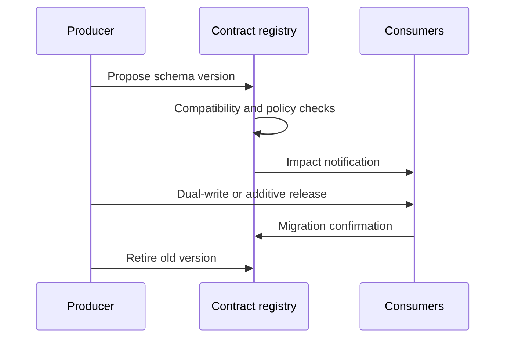

> **文档类型：** 数据、AI 和集成标准
> **规范性术语：** **MUST**、**MUST NOT**、**SHOULD**、**SHOULD NOT** 和 **MAY** 是要求级别。
> **适用范围：** 数据管道、模式、转换、策略、笔记本、语义模型和基础设施的版本化交付。
> **例外流程：** 偏离要求需要记录风险评估、补偿控制、指定风险负责人和到期日期。

|控制领域|价值|
|---|---|
|文件编号 | `DAI-11` |
|负责人|云卓越中心 |
|审核周期|至少每年一次，并且在重大平台、提供商、数据、安全或运营模式发生变化之后 |
|证据|发布清单、兼容性测试、部署证据、协调结果和运营就绪证据 |

# DataOps CI/CD、测试和架构演变最佳实践

> **简要决策：** 将数据和模式更改视为版本化版本，并具有自动兼容性测试、不可变制品、受控升级和协调。

## 目的

本指南为管道、模式、转换、策略、笔记本、语义模型和基础设施定义了可重复的交付系统。数据更改是发布，需要与应用代码相同的可追溯性以及显式的数据兼容性和协调控制。

## 交付架构

```mermaid
flowchart LR
    G[Git change] --> V[Lint, unit, schema, security tests]
    V --> B[Immutable release artifact]
    B --> D[Development deployment]
    D --> T[Integration and data-quality tests]
    T --> P[Production approval]
    P --> R[Production deployment]
    R --> O[Freshness, volume, quality, reconciliation]
    O -->|failure| X[Rollback, roll forward, or replay]
```

## 来源和制品标准

版本管道代码、基础设施、模式、契约、转换逻辑、测试、策略、配置模板和迁移脚本。环境值和机密 MUST 保留在可复用制品之外。发布日志 MUST 绑定源修订、制品摘要、测试证据、审批者、目标、迁移和结果。

## 测试层

|层 |示例 |
|---|---|
|静态|语法、风格、机密扫描、策略、依赖关系扫描 |
|单位 |转换函数、映射、业务规则 |
|契约|模式、可空性、语义、兼容性 |
|集成|源/目标连接和代表执行 |
|数据质量 |新鲜度、数量、有效性、唯一性、参照完整性 |
|和解|计数、总计、校验和、控制余额 |
|性能|吞吐量、分区行为、并发性、成本 |
|恢复|重试、幂等、重放、检查点恢复、回滚 |

合成或屏蔽测试数据 MUST 保留相关分布和边缘情况，而不会暴露生产日志记录。

## Schema 演化规则

- 将更改分类为向后兼容、向前兼容、破坏或仅语义。
- 在使生产者依赖它们之前添加可选字段。
- 对重命名、重新键入或删除的字段使用扩展和收缩迁移。
- 当事件、API、表和数据契约的使用者不同时，独立版本。
- 在破坏性变化之前发现消费者并发布弃用期限。
- 切勿依赖成功的 DDL 语句作为下游作业和报告保持正确的证据。

## 多云映射

|需要|Azure|AWS | GCP |OCI |
|---|---|---|---|---|
|编排|Data Factory、Fabric、Databricks |Glue、Step Functions、MWAA |Dataflow、Workflows、Composer |Data Integration、GoldenGate |
|持续集成/持续交付 | Azure DevOps/GitHub Actions | CodePipeline/GitHub Actions |Cloud Build/GitHub Actions | DevOps 服务/GitHub Actions |
|架构注册表|Event Hubs/Kafka 注册表模式 |Glue Schema Registry|发布/订阅模式 |流模式治理模式|
|质量|Fabric/Databricks/测试|Glue Data Quality/测试|Dataplex 数据质量/测试|Data Integration/测试|

## 部署和恢复

晋级相同的不可变 CodeArtifact，但生成特定于环境的计划和迁移证据。生产部署 MUST 使用最低权限工作负载身份、受保护的环境、并发控制和经过测试的故障路径。仅当旧代码保持数据兼容时才选择回滚；否则使用前滚校正或恢复和重放。

## 验证

证明兼容模式通过、破坏模式失败、中断的管道在没有重复的情况下恢复、重放产生预期结果、制品中不存在机密以及发布证据解析为已部署的修订版。跟踪失败的数据测试、逃逸的架构更改、部署失败率、恢复时间、协调差异和手动生产更改。

## 操作注意事项

流水线所有者负责代码和数据结果；平台团队负责运行器、模板、身份、制品保留和策略门。协调生产者和消费者团队之间的变更，冻结关键时期的不安全迁移，并为声明的重放窗口保留足够的源数据和检查点。

## 发布清单和证据包

每个生产版本 SHOULD 都会生成一个机器可读的清单，将已部署的数据系统状态与其审查的输入绑定在一起。
```yaml
release_id: data-orders-2026.08.04.3
source_revision: 8f4c2e1
artifact_digest: sha256:example
environment: production
schemas:
  - orders-event: 3.2.0
migrations:
  - 20260804_add_delivery_window
evidence:
  contract_tests: passed
  reconciliation: passed
  security_policy: passed
rollback_mode: roll-forward
```
证据包 SHOULD 保留渲染计划、模式差异、测试结果、迁移校验和、数据质量结果、部署身份、批准、开始和结束时间以及发布后协调。即使部署中途失败，证据也必须保持可用。

## 测试数据管理

测试数据是交付控制的一部分。团队 MUST 定义每个测试是否使用合成、生成、屏蔽、采样或类似生产的数据，以及必须保留哪些统计属性。

所需的控制包括：

- 默认情况下没有直接生产副本；
- 在可行的情况下进行不可逆的转换；
- 可重复生成的数据集的确定性种子；
- 空值、重复、延迟数据、无效编码、大值和倾斜的边缘情况；
- 具有预期输出的受控黄金数据集；
- 临时测试存储的过期和安全删除；
- 测试数据生成和生产数据管理的单独访问。

仅验证快乐路径记录在案的测试套件不足以保证模式和重放。

## 兼容性决策矩阵

|改变 |默认决定 |所需证据|
|---|---|---|
|添加可为空字段 |兼容 |生产者和消费者代表测试|
|添加默认必填字段 |有条件兼容|历史回填和序列化器验证|
|重命名字段 |除非存在别名，否则会中断 |双发布期与消费者迁移|
|扩大数字类型|有条件兼容 |下游引擎和语义模型测试|
|无需更改类型即可更改含义 |打破语义变化 |新契约版本和消费者认可|
|删除字段或表 |打破|消费者清单、退休期限和最终访问证据|

兼容性策略 MUST 包括语义，而不仅仅是物理模式形状。

## 环境晋级细则

CodeArtifact MAY 保持不变，但环境特定的连接、身份、数据量和策略需要在每个边界进行新的验证。非生产数据结果不是生产证据。

生产晋级 MUST 确认：

1. 目标模式和状态自规划以来没有改变。
2. 迁移顺序与当前部署的生产者和消费者兼容。
3.重放窗口和源保留可以支持恢复。
4. 所需的数据质量和协调控制处于活动状态。
5. 部署标识不能更改不相关的产品。
6. 对相同表、流或语义模型的并发发布被序列化。

## 相关主题
- [Azure Data Factory 和数据集成](dai-azure-data-factory-and-data-integration.md)
- [数据产品、数据网格和数据契约指南](dai-data-products-data-mesh-and-data-contracts.md)
- [数据平台弹性、备份和灾难恢复标准](dai-data-platform-resilience-backup-and-disaster-recovery.md)

## 参考文档

- [Azure Data Factory CI/CD](https://learn.microsoft.com/en-us/azure/data-factory/continuous-integration-delivery)
- [AWS 数据管道规范性指南](https://docs.aws.amazon.com/prescriptive-guidance/latest/modernization-data-persistence/)
- [Google Cloud Dataform](https://cloud.google.com/dataform/docs/overview)

## 相关仓库

- [andyxuan2010/cwb-adf-clientaccount](https://github.com/andyxuan2010/cwb-adf-clientaccount) — 演示通过 Azure Pipelines 进行 Azure Data Factory 交付。
- [andyxuan2010/ci-cd-template](https://github.com/andyxuan2010/ci-cd-template) — 用于 DataOps 控件的可复用工作流自动化模式。
