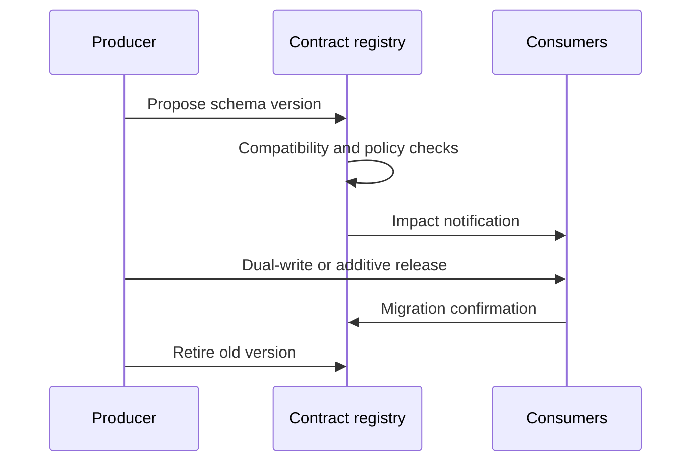

> **Document class:** Data, AI & Integration standard
> **Normative terms:** **MUST**, **MUST NOT**, **SHOULD**, **SHOULD NOT**, and **MAY** are requirements levels.
> **Applicability:** Versioned delivery of data pipelines, schemas, transformations, policies, notebooks, semantic models, and infrastructure.
> **Exception process:** Deviations require a documented risk assessment, compensating controls, named risk owner, and expiry date.

| Control field | Value |
|---|---|
| Document ID | `DAI-11` |
| Owner | Cloud Center of Excellence |
| Review cycle | At least annually and after material platform, provider, data, security, or operating-model changes |
| Evidence | Release manifest, compatibility tests, deployment evidence, reconciliation results, and operational readiness evidence |

# DataOps CI/CD, Testing, and Schema Evolution Best Practices

> **Decision in brief:** Treat data and schema changes as versioned releases with automated compatibility tests, immutable artifacts, controlled promotion, and reconciliation.

## Purpose

This guide defines a repeatable delivery system for pipelines, schemas, transformations, policies, notebooks, semantic models, and infrastructure. Data changes are releases and require the same traceability as application code plus explicit data compatibility and reconciliation controls.

## Delivery architecture

```mermaid
flowchart LR
    G[Git change] --> V[Lint, unit, schema, security tests]
    V --> B[Immutable release artifact]
    B --> D[Development deployment]
    D --> T[Integration and data-quality tests]
    T --> P[Production approval]
    P --> R[Production deployment]
    R --> O[Freshness, volume, quality, reconciliation]
    O -->|failure| X[Rollback, roll forward, or replay]
```



## Source and artifact standard

Version pipeline code, infrastructure, schemas, contracts, transformation logic, tests, policy, configuration templates, and migration scripts. Environment values and secrets MUST remain outside reusable artifacts. A release record MUST bind source revision, artifact digest, test evidence, approver, target, migration, and outcome.

## Test layers

| Layer | Examples |
|---|---|
| Static | Syntax, style, secret scan, policy, dependency scan |
| Unit | Transformation functions, mappings, business rules |
| Contract | Schema, nullability, semantic meaning, compatibility |
| Integration | Source/target connectivity and representative execution |
| Data quality | Freshness, volume, validity, uniqueness, referential integrity |
| Reconciliation | Counts, totals, checksums, control balances |
| Performance | Throughput, partition behavior, concurrency, cost |
| Recovery | Retry, idempotency, replay, checkpoint restoration, rollback |

Synthetic or masked test data MUST preserve relevant distributions and edge cases without exposing production records.

## Schema evolution rules

- Classify changes as backward compatible, forward compatible, breaking, or semantic-only.
- Add optional fields before making producers depend on them.
- Use expand-and-contract migrations for renamed, retyped, or removed fields.
- Version events, APIs, tables, and data contracts independently when their consumers differ.
- Discover consumers before destructive change and publish a deprecation deadline.
- Never rely on a successful DDL statement as proof that downstream jobs and reports remain correct.



## Multi-cloud mapping

| Need | Azure | AWS | GCP | OCI |
|---|---|---|---|---|
| Orchestration | Data Factory, Fabric, Databricks | Glue, Step Functions, MWAA | Dataform, Workflows, Composer | Data Integration, GoldenGate |
| CI/CD | Azure DevOps/GitHub Actions | CodePipeline/GitHub Actions | Cloud Build/GitHub Actions | DevOps service/GitHub Actions |
| Schema registry | Event Hubs/Kafka registry patterns | Glue Schema Registry | Pub/Sub schemas | Streaming schema governance patterns |
| Quality | Fabric/Databricks/tests | Glue Data Quality/tests | Dataplex data quality/tests | Data Integration/tests |

## Deployment and recovery

Promote the same immutable code artifact, but generate environment-specific plans and migration evidence. Production deployment MUST use least-privilege workload identity, protected environments, concurrency control, and a tested failure path. Choose rollback only when old code remains data-compatible; otherwise use roll-forward correction or restore-and-replay.

## Validation

Prove that a compatible schema passes, a breaking schema fails, an interrupted pipeline resumes without duplication, replay produces the expected result, secrets are absent from artifacts, and release evidence resolves to the deployed revision. Track failed data tests, escaped schema changes, deployment failure rate, recovery time, reconciliation differences, and manual production changes.

## Operational considerations

Pipeline owners own code and data outcomes; platform teams own runners, templates, identity, artifact retention, and policy gates. Coordinate changes across producer and consumer teams, freeze unsafe migrations during critical periods, and retain enough source data and checkpoints for the declared replay window.

## Release Manifest and Evidence Bundle

Every production release SHOULD produce a machine-readable manifest that binds the deployed data-system state to its reviewed inputs.

```yaml
release_id: data-orders-2026.08.04.3
source_revision: 8f4c2e1
artifact_digest: sha256:example
environment: production
schemas:
  - orders-event: 3.2.0
migrations:
  - 20260804_add_delivery_window
evidence:
  contract_tests: passed
  reconciliation: passed
  security_policy: passed
rollback_mode: roll-forward
```

The evidence bundle SHOULD retain rendered plans, schema diffs, test results, migration checksums, data-quality outcomes, deployment identity, approval, start and end time, and post-release reconciliation. Evidence must remain available even when the deployment failed partway through.

## Test-Data Management

Test data is part of the delivery control. Teams MUST define whether each test uses synthetic, generated, masked, sampled, or production-like data and which statistical properties must be preserved.

Required controls include:

- no direct production copy by default;
- irreversible transformation where feasible;
- deterministic seeds for reproducible generated datasets;
- edge cases for nulls, duplicates, late data, invalid encodings, large values, and skew;
- controlled golden datasets with expected outputs;
- expiration and secure deletion of temporary test stores;
- separate access for test-data generation and production data administration.

A test suite that validates only happy-path records is insufficient for schema and replay assurance.

## Compatibility Decision Matrix

| Change | Default decision | Required evidence |
|---|---|---|
| Add nullable field | Compatible | producer and representative consumer tests |
| Add required field with default | Conditionally compatible | historical backfill and serializer validation |
| Rename field | Breaking unless aliasing exists | dual-publish period and consumer migration |
| Widen numeric type | Conditionally compatible | downstream engine and semantic-model tests |
| Change meaning without type change | Breaking semantic change | new contract version and consumer approval |
| Remove field or table | Breaking | consumer inventory, retirement deadline, and final access evidence |

Compatibility policy MUST include semantics, not only physical schema shape.

## Environment Promotion Rules

Code artifacts MAY be promoted unchanged, but environment-specific connections, identities, data volumes, and policies require fresh validation at each boundary. A non-production data result is not production evidence.

Production promotion MUST confirm:

1. The target schema and state have not changed since planning.
2. The migration order is compatible with currently deployed producers and consumers.
3. The replay window and source retention can support recovery.
4. Required data-quality and reconciliation controls are active.
5. The deployment identity cannot alter unrelated products.
6. Concurrent releases to the same tables, streams, or semantic model are serialized.

## Related topics
- [Azure Data Factory and Data Integration](dai-azure-data-factory-and-data-integration.md)
- [Data Products, Data Mesh, and Data Contract Guidelines](dai-data-products-data-mesh-and-data-contracts.md)
- [Data Platform Resilience, Backup, and Disaster Recovery Standard](dai-data-platform-resilience-backup-and-disaster-recovery.md)

## References

- [Azure Data Factory CI/CD](https://learn.microsoft.com/en-us/azure/data-factory/continuous-integration-delivery)
- [AWS prescriptive guidance for data pipelines](https://docs.aws.amazon.com/prescriptive-guidance/latest/modernization-data-persistence/)
- [Google Cloud Dataform](https://cloud.google.com/dataform/docs/overview)

## Related repos

- [andyxuan2010/cwb-adf-clientaccount](https://github.com/andyxuan2010/cwb-adf-clientaccount) — demonstrates Azure Data Factory delivery through Azure Pipelines.
- [andyxuan2010/ci-cd-template](https://github.com/andyxuan2010/ci-cd-template) — provides reusable workflow automation patterns applicable to DataOps controls.
