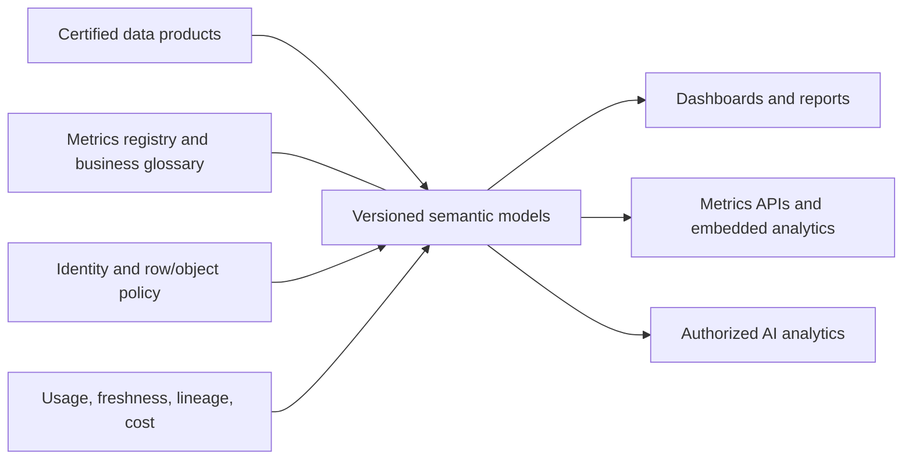
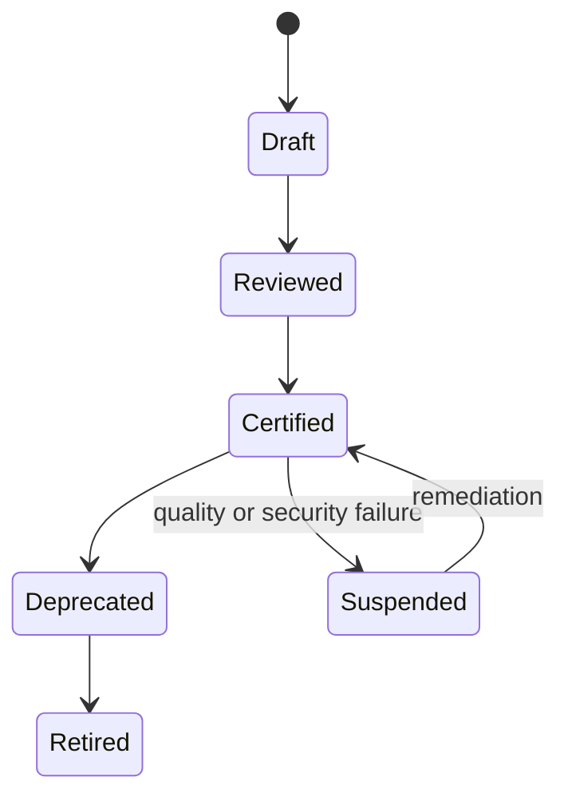

> **文档类型：**数据、AI 和集成架构参考模型
> **规范性术语：** **MUST**、**MUST NOT**、**SHOULD**、**SHOULD NOT** 和 **MAY** 是要求级别。
> **适用范围：** 企业 BI、语义模型、可复用指标、受监管的自助服务分析和经过认证的报告。
> **例外流程：** 偏离要求需要记录风险评估、补偿控制、指定风险负责人和到期日期。

|控制领域|价值|
|---|---|
|文件编号 | `DAI-18` |
|负责人|云卓越中心 |
|审核周期|至少每年一次，并且在重大平台、提供商、数据、安全或运营模式发生变化之后 |
|证据|语义模型契约、度量定义、访问审查、协调测试和运营就绪证据 |

# 企业 BI、语义层和指标治理架构

> **决策简述：** 在受控语义产品中定义一次度量，然后通过受控访问和生命周期管理发布经过认证的模型。

## 目的

该架构在受治理的数据产品和报告、仪表板、应用和 AI 之间创建了一致的业务含义。语义层不会取代数据质量或所有权；它提供可复用的维度、度量、安全性和查询行为。

## 参考架构

## 语义产品标准

每个生产模型 MUST 定义所有者、业务领域、粒度、维度、度量、时间语义、货币和单位、源产品、计算逻辑、安全策略、新鲜度、兼容性、认证和支持。指标名称 MUST 解析为其声明的业务上下文中的一个受管定义。

## 租户和生命周期

独立的个人探索、团队协作、认证生产和监管分析。生产模型和报告 MUST 通过版本控制和 CI/CD 进行部署，而不是在没有协调的情况下直接编辑。使用具有特定于环境的连接和身份的开发、测试和生产工作区或等效边界。

## 提供商映射

|能力|Azure|AWS | GCP |OCI |
|---|---|---|---|---|
|商业智能/语义 | Power BI/Fabric 语义模型 | QuickSight 数据集/主题 | Looker 模型/语义层 | Oracle Analytics 语义模型 |
|数据服务|Fabric/Synapse/Databricks|Redshift/Athena|BigQuery|Autonomous Data Warehouse|
|身份|Entra ID|IAM/Identity Center|Cloud IAM|OCI IAM|
|治理|Purview/Fabric|DataZone/Glue|Dataplex|Data Catalog|

## 访问和数据保护

在受控语义层或源附近强制执行行、列、对象和租户级安全性。切勿仅依赖隐藏的报表元素。测试每个角色、导出路径、API、缓存结果、订阅和 AI 集成的有效访问。根据分类限制下载和共享。

## 性能和成本

根据新鲜度、规模、安全性、并发性和成本选择导入、直接查询、实时连接或聚合模式。监控模型大小、刷新持续时间、查询延迟、并发性、缓存有效性、源负载、未使用的资产、许可证和容量饱和度。不要仅仅为了解决所有权问题而复制大型模型。

## 变更管理

根据控制总计、重命名或删除字段的兼容性、行级安全性、刷新、查询计划、可访问性和关键仪表板视觉效果测试计算。重大指标变更需要版本、消费者影响分析、并行可用性和停用日期。

## 验证

将受监管的指标与权威来源的总数进行协调；测试身份和导出路径；追踪仪表板字段的来源；模拟失败的刷新和陈旧的数据；并从源代码控制恢复语义模型。跟踪经过认证的内容使用、重复指标、陈旧资产、刷新失败、访问违规、查询 SLO 以及每个活跃消费者的成本。

## 操作注意事项

该分析平台负责租户、容量、部署、监控和黄金路径。域数据所有者认可含义。报告所有者负责自己的演示和消费者支持。建立一个仅针对跨域定义的度量委员会；本地域指标不应等待不必要的中央批准。

## 指标定义治理

受控度量定义 MUST 不仅仅包括一个公式。记录：

- 指标 ID、显示名称、所有者和业务上下文；
- 粮食、合格人口、分子、分母和排除；
- 时区、日历、周期结束和迟到数据行为；
- 货币、单位、换算来源和舍入；
- 源数据产品和所需版本；
- 安全和禁止规则；
- 新鲜度和协调目标；
- 批准的尺寸和钻孔路径；
- 兼容性、生效日期和退休策略。

同一标签 MAY 在不同的业务上下文中具有不同的有效定义，但上下文必须是显式的、可发现的。

## 语义部署和回滚
语义制品、计算代码、安全角色、连接绑定、刷新策略和报告依赖项 MUST 受版本控制。部署 SHOULD 提升经过测试的模型包，而不是在每个工作区中手动重新创建计算。

释放门 SHOULD 验证：

1. 模型语法和依赖解析。
2. 源契约兼容性。
3. 关键指标的控制总量协调。
4. 正面和负面角色的行级和对象级安全性。
5. 刷新持续时间和失败行为。
6. 查询延迟和源系统负载。
7. 报告和 API 兼容性。
8. 回滚到之前的模型版本。

当版本还更改源架构或不兼容地刷新状态时，回滚是不安全的；在这种情况下，请使用前向校正或并行模型版本。

## AI 和自然语言消费

从语义模型 MUST 生成查询、解释或摘要的 AI 功能使用经过认证的定义和有效的用户授权。 AI 层不得绕过行级安全性、隐藏列、导出限制或敏感度标签。

采集语义模型版本、指标 ID、生成的查询、用户上下文和引用的数据源以进行跟踪。高影响力的分析结论 SHOULD 公开控制指标定义和新鲜度时间戳。

## 自助服务边界

自助服务用户 MAY 在指定工作空间中创建本地测量和探索模型，但这些资产必须与经过认证的内容明确区分开。晋级到认证状态需要所有权、来源批准、测试、文档、访问审查和生命周期支持。

## 相关主题
- [治理数据平台架构](dai-governed-data-platform-architecture.md)
- [企业数据治理、目录、数据血缘和质量标准](dai-enterprise-data-governance-catalog-lineage-and-quality.md)
- [数据产品、数据网格和数据契约指南](dai-data-products-data-mesh-and-data-contracts.md)

## 参考文档

- [Power BI 企业语义模型](https://learn.microsoft.com/en-us/power-bi/connect-data/service-datasets-understand)
- [Amazon QuickSight 架构](https://docs.aws.amazon.com/quicksight/latest/user/welcome.html)
- [LookML 语义模型简介](https://docs.cloud.google.com/looker/docs/what-is-lookml)
- [Oracle Analytics 语义建模](https://docs.oracle.com/en/cloud/paas/analytics-cloud/acmdg/)
