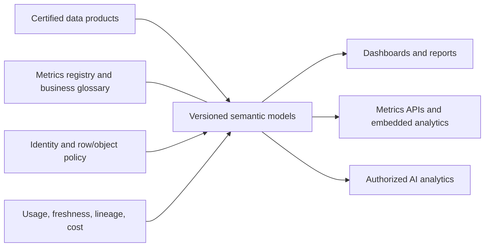
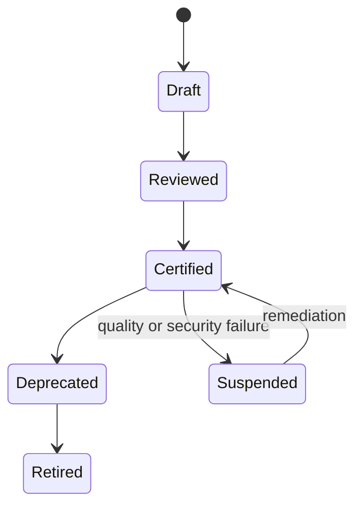

> **Document class:** Data, AI & Integration architecture reference model
> **Normative terms:** **MUST**, **MUST NOT**, **SHOULD**, **SHOULD NOT**, and **MAY** are requirements levels.
> **Applicability:** Enterprise BI, semantic models, reusable metrics, governed self-service analytics, and certified reporting.
> **Exception process:** Deviations require a documented risk assessment, compensating controls, named risk owner, and expiry date.

| Control field | Value |
|---|---|
| Document ID | `DAI-18` |
| Owner | Cloud Center of Excellence |
| Review cycle | At least annually and after material platform, provider, data, security, or operating-model changes |
| Evidence | Semantic model contract, metric definitions, access review, reconciliation tests, and operational readiness evidence |

# Enterprise BI, Semantic Layer, and Metrics Governance Architecture

> **Decision in brief:** Define metrics once in governed semantic products, then publish certified models through controlled access and lifecycle management.

## Purpose

This architecture creates consistent business meaning between governed data products and reports, dashboards, applications, and AI. A semantic layer does not replace data quality or ownership; it provides reusable dimensions, measures, security, and query behavior.

## Reference architecture

## Semantic product standard

Each production model MUST define owner, business domain, grain, dimensions, measures, time semantics, currency and units, source products, calculation logic, security policy, freshness, compatibility, certification, and support. A metric name MUST resolve to one governed definition within its declared business context.

## Tenancy and lifecycle

Separate personal exploration, team collaboration, certified production, and regulated analytics. Production models and reports MUST be deployed through version control and CI/CD, not edited directly without reconciliation. Use development, test, and production workspaces or equivalent boundaries with environment-specific connections and identities.

## Provider mapping

| Capability | Azure | AWS | GCP | OCI |
|---|---|---|---|---|
| BI/semantic | Power BI/Fabric semantic models | QuickSight datasets/topics | Looker models/semantic layer | Oracle Analytics semantic models |
| Data serving | Fabric/Synapse/Databricks | Redshift/Athena | BigQuery | Autonomous Data Warehouse |
| Identity | Entra ID | IAM/Identity Center | Cloud IAM | OCI IAM |
| Governance | Purview/Fabric | DataZone/Glue | Dataplex | Data Catalog |

## Access and data protection

Enforce row-, column-, object-, and tenant-level security close to the governed semantic layer or source. Never rely only on hidden report elements. Test effective access for each persona, export path, API, cached result, subscription, and AI integration. Restrict downloads and sharing according to classification.

## Performance and cost

Choose import, direct query, live connection, or aggregate modes based on freshness, scale, security, concurrency, and cost. Monitor model size, refresh duration, query latency, concurrency, cache effectiveness, source load, unused assets, licenses, and capacity saturation. Do not duplicate large models solely to work around ownership problems.

## Change management

Test calculations against control totals, compatibility of renamed or removed fields, row-level security, refresh, query plans, accessibility, and critical dashboard visuals. Breaking metric changes require a version, consumer impact analysis, parallel availability, and retirement date.

## Validation

Reconcile governed metrics to authoritative source totals; test identities and export paths; trace dashboard fields to source; simulate failed refresh and stale data; and restore a semantic model from source control. Track certified-content use, duplicate metrics, stale assets, failed refresh, access violations, query SLO, and cost per active consumer.

## Operational considerations

The analytics platform owns tenancy, capacity, deployment, monitoring, and paved roads. Domain data owners approve meaning. Report owners own presentation and consumer support. Establish a metrics council only for cross-domain definitions; local domain metrics should not wait on unnecessary central approval.

## Metric Definition Governance

A governed metric definition MUST include more than a formula. Record:

- metric ID, display name, owner, and business context;
- grain, eligible population, numerator, denominator, and exclusions;
- time zone, calendar, period close, and late-arriving-data behavior;
- currency, unit, conversion source, and rounding;
- source data products and required versions;
- security and suppression rules;
- freshness and reconciliation objective;
- approved dimensions and drill paths;
- compatibility, effective date, and retirement policy.

The same label MAY have different valid definitions in different business contexts, but the context must be explicit and discoverable.

## Semantic Deployment and Rollback

Semantic artifacts, calculation code, security roles, connection bindings, refresh policy, and report dependencies MUST be version controlled. Deployment SHOULD promote a tested model package rather than recreate calculations manually in each workspace.

A release gate SHOULD verify:

1. Model syntax and dependency resolution.
2. Source contract compatibility.
3. Control-total reconciliation for critical metrics.
4. Row- and object-level security for positive and negative personas.
5. Refresh duration and failure behavior.
6. Query latency and source-system load.
7. Report and API compatibility.
8. Rollback to the prior model version.

Rollback is unsafe when a release also changes source schemas or refresh state incompatibly; in that case use a forward correction or parallel model version.

## AI and Natural-Language Consumption

AI features that generate queries, explanations, or summaries from semantic models MUST use certified definitions and effective user authorization. The AI layer must not bypass row-level security, hidden columns, export restrictions, or sensitivity labels.

Capture the semantic model version, metric IDs, generated query, user context, and cited data sources for traceability. High-impact analytical conclusions SHOULD expose the governing metric definitions and freshness timestamp.

## Self-Service Boundaries

Self-service users MAY create local measures and exploratory models in designated workspaces, but those assets must be clearly distinguished from certified content. Promotion to certified status requires ownership, source approval, tests, documentation, access review, and lifecycle support.

## Related topics
- [Governed Data Platform Architecture](dai-governed-data-platform-architecture.md)
- [Enterprise Data Governance, Catalog, Lineage, and Quality Standard](dai-enterprise-data-governance-catalog-lineage-and-quality.md)
- [Data Products, Data Mesh, and Data Contract Guidelines](dai-data-products-data-mesh-and-data-contracts.md)

## References

- [Power BI enterprise semantic models](https://learn.microsoft.com/en-us/power-bi/connect-data/service-datasets-understand)
- [Amazon QuickSight architecture](https://docs.aws.amazon.com/quicksight/latest/user/welcome.html)
- [Introduction to LookML semantic models](https://docs.cloud.google.com/looker/docs/what-is-lookml)
- [Oracle Analytics semantic modeling](https://docs.oracle.com/en/cloud/paas/analytics-cloud/acmdg/)
