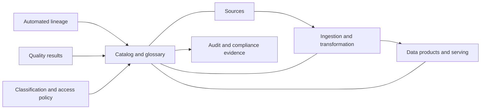
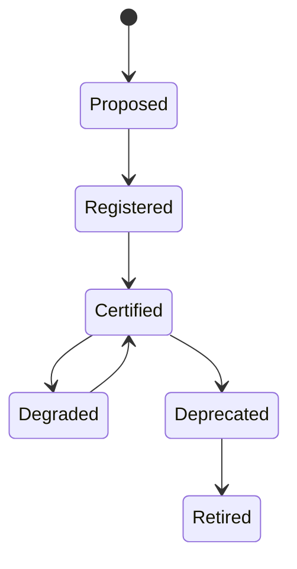

> **文档类型：** 数据、AI 和集成标准
> **规范性术语：** **MUST**、**MUST NOT**、**SHOULD**、**SHOULD NOT** 和 **MAY** 是要求级别。
> **适用范围：** 跨云平台的企业数据治理、目录、元数据、数据血缘、质量、访问和证据。
> **例外流程：** 偏离要求需要记录风险评估、补偿控制、指定风险负责人和到期日期。

|控制领域|价值|
|---|---|
|文件编号 | `DAI-10` |
|负责人|云卓越中心 |
|审核周期|至少每年一次，并且在重大平台、提供商、数据、安全或运营模式发生变化之后 |
|证据|治理策略、目录和数据血缘日志、质量结果、访问审查和运营就绪证据 |

# 企业数据治理、目录、数据血缘和质量标准

> **简要决定：** 使所有权、分类、数据血缘、质量、访问和生命周期元数据变得机器可读。在数据产品边界实施这些控制。

## 目的

该标准使企业数据在云平台上可发现、可理解、可信赖且可负责。它管理元数据和证据，同时允许提供商本地存储和处理引擎。

## 控制模型

## 强制性要求

- 每个生产数据资产 MUST 有业务所有者、技术所有者、管理员、分类、目的、保留规则和支持联系人。
- 元数据、模式、数据血缘、质量结果、访问策略和更改历史日志 MUST 是机器可读的。
- 敏感属性 MUST 在存储、查询、导出和下游产品中得到一致的分类和保护。
- Lineage MUST 涵盖技术上可行的来源、转换、产品、报告、功能、索引和重要 AI 输入。
- 生产数据产品 MUST 发布适合风险的新鲜度、完整性、有效性、唯一性和协调目标。
- 访问 MUST 使用组或工作负载身份，在享有特权的情况下受到时间限制，并定期进行审查。
- 对关键元数据和策略变更 MUST 进行审核。

## 操作角色

|角色 |问责制 |
|---|---|
|数据所有者|目的、可接受的用途、分类、访问决策 |
|数据管家|定义、质量规则、问题协调 |
|产品负责人|契约、SLO、消费者、生命周期 |
|平台团队|目录、扫描仪、数据血缘、策略集成、可靠性 |
|安全/隐私 |控制要求、调查、监管解释 |
|消费者 |批准使用、本地保护、缺陷报告 |

## 提供商能力映射

|能力|Azure|AWS | GCP |OCI |
|---|---|---|---|---|
|目录/治理|Microsoft Purview、Fabric 治理、Unity Catalog|Glue Data Catalog、Lake Formation、DataZone|Knowledge Catalog（原 Dataplex Universal Catalog）|OCI Data Catalog、Data Safe|
|血缘|Purview/Fabric/Databricks 血缘|OpenLineage 集成和服务元数据|Dataplex 血缘|Data Catalog 和集成元数据|
|策略|Entra、Purview 策略、服务 RBAC|IAM 和 Lake Formation|IAM 和策略标签|IAM 策略和 Data Safe|
|质量|Fabric/Databricks/数据流水线检查|Glue Data Quality 和数据流水线检查|Dataplex 数据质量|Data Integration 质量模式|

目录是索引和策略协调层；除非架构明确另有说明，否则源系统对于数据和执行仍然具有权威。

## 元数据和分类

所需的元数据包括稳定资产 ID、名称、描述、域、模式、所有者、来源、分类、驻留、保留、合法目的、质量状态、SLO、消费者和生命周期状态。使用公共、内部、机密和限制等企业分类法，然后将处理规则附加到分类中。

## 质量和谱系生命周期

质量规则应用于摄取、转换和产品边界。关键规则 MUST 隔离数据或阻止升级失败。严重程度较低的故障 MAY 继续具有可见的降级状态和负责任的修复期限。保留源到目标的色谱柱谱系以实现受监管或决策关键的属性。

## 实现方式

1. 定义分类法、所有权模型、最低元数据和认证标准。
2. 清单优先系统和机载自动元数据扫描仪。
3. 集成身份、分类、谱系和访问审查证据。
4. 添加可复用的质量规则库和生产者负责的 SLO。
5. 发布可搜索的产品和商业术语以及消费者反馈。
6. 度量覆盖范围、信任度、发布期限和无支持资产。

## 验证

对关键产品进行抽样并验证所有者、定义、分类、血统、质量结果、访问决策、保留和下游消费者。测试架构更改是否会更新数据血缘、触发契约验证并通知受影响的消费者。跟踪目录覆盖率、认证产品百分比、未知所有者、血统差距、质量 SLO 达到情况以及逾期访问审核。

## 操作注意事项

治理应该是联合的：中央团队定义最低限度的控制和共享工具；域负责自己的意义和质量。避免仅通过目录对象计数来度量成功。检查扫描仪凭据、元数据敏感性、区域复制、目录恢复、许可和摄取成本。

## 治理控制层

根据影响程度按比例实施治理。

|等级 |典型资产 |最小控制|
|---|---|---|
| 1 级 |受监管、决策关键、外部报告 |柱谱系、严格的质量门控、访问审查、恢复证据 |
| 2 级 |企业运营和分析产品|产品契约、自动化数据血缘、SLO、所有者和认证 |
|第 3 级 |团队管理的内部数据集|所有者、分类、保留、基本质量和可发现性 |
|第 4 级 |临时探索|范围隔离、过期、无生产依赖性 |

较低层不允许忽略安全或隐私控制。分层主要改变保障深度、支持、数据血缘粒度和认证证据。

## 元数据质量和漂移

元数据本身需要质量控制。验证所有者存在、分类词汇、源标识符、模式新鲜度、保留映射、消费者链接和生命周期状态。检测存储或查询引擎中存在但目录中不存在的资产。

推荐的元数据 SLO 包括：

- 在预期时间间隔内收获的生产资产的百分比；
- 有效所有者和分类的百分比；
- 部署后的血统新鲜度；
- 未解决的扫描仪错误；
- 过时的认证和逾期的审查；
- 与真实来源声明相冲突的资产。

不要用低质量的自动推理默默地覆盖管理员编写的业务元数据。

## 访问认证
访问审查 SHOULD 将目录上下文与源系统的有效权限结合起来。与实际表、存储桶、共享或服务授权不匹配的目录批准是不完整的。

审计日志 SHOULD 识别批准者、目的、用户或组、工作负载身份、范围、权限、上次使用、到期和例外。删除休眠拨款并调查已批准的小组或产品工作流程之外的直接拨款。

## 血统信心

数据血缘条目 SHOULD 指示它们是自动监控的、通过代码声明的、推断的还是手动策划的。关键决策不应依赖于未经验证的低置信度推断谱系。

对于无法自动解析的转换，需要在部署元数据中显式源和目标声明。即使商业友好的名称发生变化，也保留原始的技术标识符。

## 相关主题
- [治理数据平台架构](dai-governed-data-platform-architecture.md)
- [数据产品、数据网格和数据契约指南](dai-data-products-data-mesh-and-data-contracts.md)
- [数据隐私、驻留、保留和安全删除标准](dai-data-privacy-residency-retention-and-deletion.md)

## 参考文档

- [Microsoft Purview 治理文档](https://learn.microsoft.com/en-us/purview/)
- [AWS 数据治理](https://docs.aws.amazon.com/whitepapers/latest/data-classification/data-governance.html)
- [Google Cloud 知识目录（以前称为 Dataplex 通用目录）](https://cloud.google.com/dataplex/docs/catalog-overview)
- [OCI 数据目录](https://docs.oracle.com/en-us/iaas/data-catalog/home.htm)
