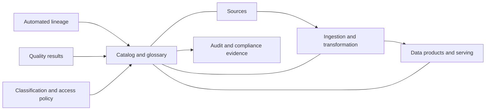
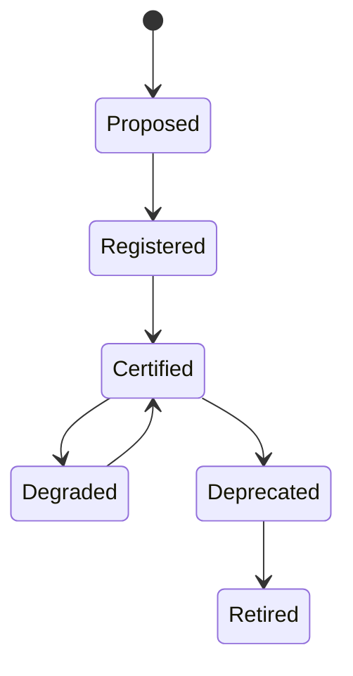

> **Document class:** Data, AI & Integration standard
> **Normative terms:** **MUST**, **MUST NOT**, **SHOULD**, **SHOULD NOT**, and **MAY** are requirements levels.
> **Applicability:** Enterprise data governance, catalog, metadata, lineage, quality, access, and evidence across cloud platforms.
> **Exception process:** Deviations require a documented risk assessment, compensating controls, named risk owner, and expiry date.

| Control field | Value |
|---|---|
| Document ID | `DAI-10` |
| Owner | Cloud Center of Excellence |
| Review cycle | At least annually and after material platform, provider, data, security, or operating-model changes |
| Evidence | Governance policy, catalog and lineage records, quality results, access review, and operational readiness evidence |

# Enterprise Data Governance, Catalog, Lineage, and Quality Standard

> **Decision in brief:** Make ownership, classification, lineage, quality, access, and lifecycle metadata machine-readable. Enforce those controls at data-product boundaries.

## Purpose

This standard makes enterprise data discoverable, understandable, trustworthy, and accountable across cloud platforms. It governs metadata and evidence while allowing provider-native storage and processing engines.

## Control model

## Mandatory requirements

- Every production data asset MUST have a business owner, technical owner, steward, classification, purpose, retention rule, and support contact.
- Metadata, schemas, lineage, quality results, access policy, and change history MUST be machine-readable.
- Sensitive attributes MUST be classified and protected consistently in storage, query, export, and downstream products.
- Lineage MUST cover source, transformations, products, reports, features, indexes, and material AI inputs where technically possible.
- Production data products MUST publish freshness, completeness, validity, uniqueness, and reconciliation objectives appropriate to risk.
- Access MUST use groups or workload identities, be time-bounded where privileged, and be periodically reviewed.
- Critical metadata and policy changes MUST be audited.

## Operating roles

| Role | Accountability |
|---|---|
| Data owner | Purpose, acceptable use, classification, access decisions |
| Data steward | Definitions, quality rules, issue coordination |
| Product owner | Contract, SLO, consumers, lifecycle |
| Platform team | Catalog, scanners, lineage, policy integration, reliability |
| Security/privacy | Control requirements, investigations, regulatory interpretation |
| Consumer | Approved use, local protection, defect reporting |

## Provider capability mapping

| Capability | Azure | AWS | GCP | OCI |
|---|---|---|---|---|
| Catalog/governance | Microsoft Purview, Fabric governance, Unity Catalog | Glue Data Catalog, Lake Formation, DataZone | Knowledge Catalog (formerly Dataplex Universal Catalog) | OCI Data Catalog, Data Safe |
| Lineage | Purview/Fabric/Databricks lineage | OpenLineage integrations and service metadata | Dataplex lineage | Data Catalog and integration metadata |
| Policy | Entra, Purview policies, service RBAC | IAM and Lake Formation | IAM and policy tags | IAM policies and Data Safe |
| Quality | Fabric/Databricks/data pipeline checks | Glue Data Quality and pipeline checks | Dataplex data quality | Data Integration quality patterns |

The catalog is an index and policy coordination layer; source systems remain authoritative for data and enforcement unless the architecture explicitly says otherwise.

## Metadata and classification

Required metadata includes stable asset ID, names, description, domain, schema, owners, source, classification, residency, retention, lawful purpose, quality status, SLO, consumers, and lifecycle state. Use an enterprise taxonomy such as public, internal, confidential, and restricted, then attach handling rules to classifications.

## Quality and lineage lifecycle

Quality rules run at ingestion, transformation, and product boundaries. Failed critical rules MUST quarantine data or block promotion. Lower-severity failures MAY continue with a visible degraded status and accountable remediation deadline. Preserve source-to-target column lineage for regulated or decision-critical attributes.

## Implementation approach

1. Define taxonomy, ownership model, minimum metadata, and certification criteria.
2. Inventory priority systems and onboard automated metadata scanners.
3. Integrate identity, classification, lineage, and access-review evidence.
4. Add reusable quality rule libraries and producer-owned SLOs.
5. Publish searchable products and business terms with consumer feedback.
6. Measure coverage, trust, issue age, and unsupported assets.

## Validation

Sample critical products and verify owner, definition, classification, lineage, quality results, access decision, retention, and downstream consumers. Test that a schema change updates lineage, triggers contract validation, and notifies affected consumers. Track catalog coverage, certified-product percentage, unknown owners, lineage gaps, quality-SLO attainment, and overdue access reviews.

## Operational considerations

Governance should be federated: central teams define minimum controls and shared tooling; domains own meaning and quality. Avoid measuring success by catalog object count alone. Review scanner credentials, metadata sensitivity, regional replication, catalog recovery, licensing, and ingestion cost.

## Governance Control Tiers

Apply governance proportionately to impact.

| Tier | Typical assets | Minimum control |
|---|---|---|
| Tier 1 | regulated, decision-critical, externally reported | column lineage, strict quality gates, access review, recovery evidence |
| Tier 2 | enterprise operational and analytical products | product contract, automated lineage, SLOs, owner and certification |
| Tier 3 | team-managed internal datasets | owner, classification, retention, basic quality and discoverability |
| Tier 4 | temporary exploration | isolated scope, expiry, no production dependency |

A lower tier is not permission to omit security or privacy controls. Tiering primarily changes assurance depth, support, lineage granularity, and certification evidence.

## Metadata Quality and Drift

Metadata itself requires quality controls. Validate owner existence, classification vocabulary, source identifiers, schema freshness, retention mapping, consumer links, and lifecycle state. Detect assets that exist in storage or query engines but are absent from the catalog.

Recommended metadata SLOs include:

- percentage of production assets harvested within the expected interval;
- percentage with valid owners and classifications;
- lineage freshness after deployment;
- unresolved scanner errors;
- stale certifications and overdue reviews;
- assets with conflicting source-of-truth claims.

Do not silently overwrite steward-authored business metadata with lower-quality automated inference.

## Access Certification

Access review SHOULD combine catalog context with effective permissions from the source system. A catalog approval that does not match actual table, bucket, share, or service authorization is incomplete.

Review records SHOULD identify the approver, purpose, users or groups, workload identities, scope, privilege, last use, expiration, and exceptions. Remove dormant grants and investigate direct grants outside approved group or product workflows.

## Lineage Confidence

Lineage entries SHOULD indicate whether they were automatically observed, declared by code, inferred, or manually curated. Critical decisions should not rely on low-confidence inferred lineage without validation.

For transformations that cannot be parsed automatically, require explicit source and target declarations in deployment metadata. Preserve the original technical identifiers even when business-friendly names change.

## Related topics
- [Governed Data Platform Architecture](dai-governed-data-platform-architecture.md)
- [Data Products, Data Mesh, and Data Contract Guidelines](dai-data-products-data-mesh-and-data-contracts.md)
- [Data Privacy, Residency, Retention, and Secure Deletion Standard](dai-data-privacy-residency-retention-and-deletion.md)

## References

- [Microsoft Purview governance documentation](https://learn.microsoft.com/en-us/purview/)
- [AWS data governance](https://docs.aws.amazon.com/whitepapers/latest/data-classification/data-governance.html)
- [Google Cloud Knowledge Catalog (formerly Dataplex Universal Catalog)](https://cloud.google.com/dataplex/docs/catalog-overview)
- [OCI Data Catalog](https://docs.oracle.com/en-us/iaas/data-catalog/home.htm)
