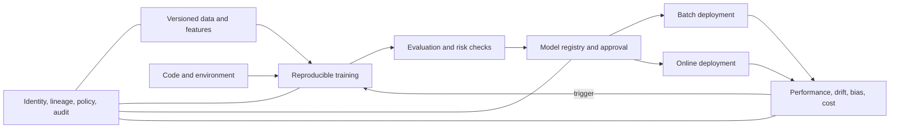

> **文档类型：**数据、AI 和集成架构参考模型
> **规范性术语：** **MUST**、**MUST NOT**、**SHOULD**、**SHOULD NOT** 和 **MAY** 是要求级别。
> **适用范围：** 机器学习实验、培训、注册、部署、监控、再培训和退役。
> **例外流程：** 偏离要求需要记录风险评估、补偿控制、指定风险负责人和到期日期。

|控制领域|价值|
|---|---|
|文件编号 | `DAI-12` |
|负责人|云卓越中心 |
|审核周期|至少每年一次，并且在重大平台、提供商、数据、安全或运营模式发生变化之后 |
|证据|模型数据血缘、评估结果、注册批准、部署测试、监控和运营就绪证据 |

# 企业 MLOps 平台和模型生命周期架构

> **简要决定：** 将实验与受控生产分开。仅晋级具有数据血缘、评估证据、批准、监控和回滚的版本化模型。

## 目的

这种架构将实验自由与受管理的生产交付分开。它涵盖预测和统计模型；基础模型应用仍受此类别的 AI 平台、安全和生产运营标准的约束。

## 参考架构

## 平台边界

单独的开发、验证和生产工作区或项目。生产训练和推理 MUST 使用受控身份、网络、注册表、数据集和镜像。交互式笔记本 MUST NOT 成为一种生产部署机制。

## 生命周期要求

1. 注册用例、所有者、目标人群、影响和验收标准。
2.版本代码、数据引用、特性、环境、参数和随机种子。
3. 记录实验并与批准的基线进行比较。
4. 评估性能、稳健性、隐私、安全性、公平性、可解释性和成本（如果适用）。
5. 注册具有数据血缘、签名、限制和批准状态的不可变模型制品。
6. 使用分阶段暴露和回滚标准通过 CI/CD 进行部署。
7. 监控输入漂移、概念漂移、性能、公平性、延迟、可用性和成本。
8. 仅通过批准的触发器和持续验证进行重新训练。
9. 有意淘汰端点、功能、数据集、凭证和保留的制品。

## 提供商能力映射

|能力|Azure|AWS | GCP |OCI |
|---|---|---|---|---|
|机器学习平台 | Azure Machine Learning | SageMaker AI |Vertex AI | OCI Data Science |
|实验/注册 | MLflow/Azure ML 注册表 | SageMaker 实验/注册 | Vertex AI 实验/注册 | MLflow 模式/模型目录 |
|特征管理|托管/离线特征模式 | SageMaker Feature Store | Vertex AI Feature Store |数据平台特征模式|
|服务|托管端点，AKS | SageMaker 端点、EKS |Vertex AI 端点，GKE |模型部署，OKE |
|监控| Azure ML/Monitor | SageMaker Model Monitor/CloudWatch |Vertex Model Monitoring / Cloud Monitoring|Data Science / Monitoring |

## 晋级门

|门 |最低限度的证据|
|---|---|
|技术|可重复的构建、扫描、单元和集成测试 |
|数据|批准的数据集版本、质量、数据血缘、允许使用 |
|模型|根据需要进行基线比较、稳健性、可解释性 |
|风险|影响评估、偏见/隐私/安全审查 |
|运营|容量、SLO、告警、回滚、操作手册、成本预测 |
|发布 |制品摘要、批准、目标、金丝雀结果 |

## 部署模式

对宽容的大容量工作负载使用批量评分；用于低延迟决策的同步端点；用于突发或长时间运行推理的异步队列；仅当连接或延迟需要时才进行边缘部署。影子、金丝雀和冠军挑战者版本可以降低风险，但需要预测关联和隐私控制。

## 验证

根据记录在案的输入重建模型；确认制品哈希和评估结果。测试数据漂移、不良功能、不可用的依赖项、容量耗尽、回滚和监控盲点。跟踪再现率、生产时间、模型寿命、未经批准的端点、漂移响应时间、错误告警、回滚成功和未使用的计算。

## 操作注意事项
机器学习平台团队负责黄金路径；模型所有者仍然对结果负责。强制执行 GPU 配额、空闲关闭、批准的基础镜像、包来源、私有数据路径以及模型作者和高影响力生产审批者之间的职责分离。

## 特征和数据集生命周期

训练和服务数据 MUST 支持版本控制或可解析为不可变的快照。记录提取时间、源版本、过滤器、特征定义、时间点连接、标签、排除和质量结果。

功能控制 SHOULD 包括：

- 所有者和商业含义；
- 在线和离线一致性测试；
- 新鲜度和无效行为；
- 泄漏和禁止属性测试；
- 默认值和缺失功能行为；
- 回填和重新计算程序；
- 保留和删除传播；
- 消费者和模型清单。

保留列名称但更改计算语义的功能更改是影响模型的版本。

## 模型包装和供应链

注册模型制品 SHOULD 附有推理代码、环境锁、基础镜像或运行时、签名、SBOM（如果适用）、模型卡、评估证据和兼容的输入/输出契约。

生产服务 MUST 拒绝未经批准或修改的制品。验证包来源，仅反序列化受信任的格式，扫描容器和原生依赖项，并限制训练和服务作业的出站网络访问。

## 再培训治理

再训练触发 可以是计划的、事件驱动的、基于漂移的或手动批准的。触发器开始新的候选者生命周期；它不授权自动生产更换。

在晋级之前，使用批准的数据集和操作限制将候选人与当前冠军进行比较。确认数据分布、标签、超参数、特征代码和依赖关系的变化已被理解。

自动再训练系统 MUST 防止被污染的反馈、丢失标签、瞬态漂移和重复失败的候选者。定义最大训练频率、预算、人工审核阈值以及暂停再训练的机制。

## 端点和批次兼容性

模型接口需要语义版本控制和消费者测试。记录特征顺序和类型、请求限制、响应模式、评分校准、阈值解释和错误行为。当消费者无法自动更新时，通过迁移窗口保留先前的端点版本。

## 相关主题
- [AI 应用的生产运营](dai-production-operations-for-ai-applications.md)
- [AI 安全、身份和负责任的 AI](dai-ai-security-identity-and-responsible-ai.md)
- [AI 与数据成本架构](dai-ai-and-data-cost-architecture.md)

## 参考文档

- [Azure MLOps 架构](https://learn.microsoft.com/en-us/azure/architecture/data-guide/technology-choices/machine-learning-operations-v2)
- [AWS MLOps 清单](https://docs.aws.amazon.com/prescriptive-guidance/latest/mlops-checklist/)
- [Google Cloud MLOps 架构](https://cloud.google.com/architecture/mlops-continuous-delivery-and-automation-pipelines-in-machine-learning)
- [OCI 机器学习生命周期指南](https://docs.oracle.com/en-us/iaas/Content/GSG/Reference/getting-started-as-data-scientist.htm)
