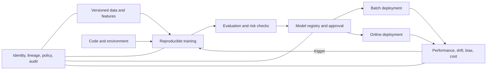

> **Document class:** Data, AI & Integration architecture reference model
> **Normative terms:** **MUST**, **MUST NOT**, **SHOULD**, **SHOULD NOT**, and **MAY** are requirements levels.
> **Applicability:** Machine-learning experimentation, training, registration, deployment, monitoring, retraining, and retirement.
> **Exception process:** Deviations require a documented risk assessment, compensating controls, named risk owner, and expiry date.

| Control field | Value |
|---|---|
| Document ID | `DAI-12` |
| Owner | Cloud Center of Excellence |
| Review cycle | At least annually and after material platform, provider, data, security, or operating-model changes |
| Evidence | Model lineage, evaluation results, registry approval, deployment tests, monitoring, and operational readiness evidence |

# Enterprise MLOps Platform and Model Lifecycle Architecture

> **Decision in brief:** Separate experimentation from governed production. Promote only versioned models with lineage, evaluation evidence, approval, monitoring, and rollback.

## Purpose

This architecture separates experimental freedom from governed production delivery. It covers predictive and statistical models; foundation-model applications remain subject to the AI platform, security, and production-operations standards in this category.

## Reference architecture

## Platform boundaries

Separate development, validation, and production workspaces or projects. Production training and inference MUST use controlled identities, networks, registries, datasets, and images. Interactive notebooks MUST NOT be a production deployment mechanism.

## Lifecycle requirements

1. Register the use case, owner, intended population, impact, and acceptance criteria.
2. Version code, data references, features, environment, parameters, and random seeds.
3. Record experiments and compare against an approved baseline.
4. Evaluate performance, robustness, privacy, security, fairness, explainability, and cost as applicable.
5. Register immutable model artifacts with lineage, signatures, limitations, and approval status.
6. Deploy through CI/CD using staged exposure and rollback criteria.
7. Monitor input drift, concept drift, performance, fairness, latency, availability, and cost.
8. Retrain only through an approved trigger and repeat validation.
9. Retire endpoints, features, datasets, credentials, and retained artifacts deliberately.

## Provider capability mapping

| Capability | Azure | AWS | GCP | OCI |
|---|---|---|---|---|
| ML platform | Azure Machine Learning | SageMaker AI | Vertex AI | OCI Data Science |
| Experiment/registry | MLflow/Azure ML registry | SageMaker Experiments/Registry | Vertex AI Experiments/Registry | MLflow patterns/Model Catalog |
| Feature management | Managed/offline feature patterns | SageMaker Feature Store | Vertex AI Feature Store | Data platform feature patterns |
| Serving | Managed endpoints, AKS | SageMaker endpoints, EKS | Vertex endpoints, GKE | Model Deployment, OKE |
| Monitoring | Azure ML/Monitor | SageMaker Model Monitor/CloudWatch | Vertex Model Monitoring/Cloud Monitoring | Data Science/Monitoring |

## Promotion gates

| Gate | Minimum evidence |
|---|---|
| Technical | Reproducible build, scan, unit and integration tests |
| Data | Approved dataset version, quality, lineage, permitted use |
| Model | Baseline comparison, robustness, explainability as required |
| Risk | Impact assessment, bias/privacy/security review |
| Operational | Capacity, SLO, alerts, rollback, runbook, cost forecast |
| Release | Artifact digest, approval, target, canary results |

## Deployment patterns

Use batch scoring for tolerant, high-volume workloads; synchronous endpoints for low-latency decisions; asynchronous queues for bursty or long-running inference; and edge deployment only when connectivity or latency requires it. Shadow, canary, and champion-challenger releases reduce risk but require prediction correlation and privacy controls.

## Validation

Rebuild a model from recorded inputs; confirm artifact hashes and evaluation results. Test data drift, bad features, unavailable dependencies, capacity exhaustion, rollback, and monitoring blind spots. Track reproducibility rate, time to production, model age, unapproved endpoints, drift-to-response time, false alerts, rollback success, and unused compute.

## Operational considerations

The ML platform team owns the paved road; model owners remain accountable for outcomes. Enforce GPU quotas, idle shutdown, approved base images, package provenance, private data paths, and separate duties between model author and high-impact production approver.

## Feature and Dataset Lifecycle

Training and serving data MUST be versioned or resolvable to an immutable snapshot. Record extraction time, source versions, filters, feature definitions, point-in-time joins, labels, exclusions, and quality results.

Feature controls SHOULD include:

- owner and business meaning;
- online and offline consistency tests;
- freshness and null behavior;
- leakage and prohibited-attribute tests;
- default-value and missing-feature behavior;
- backfill and recomputation procedure;
- retention and deletion propagation;
- consumer and model inventory.

A feature change that preserves the column name but changes calculation semantics is a model-impacting release.

## Model Packaging and Supply Chain

A registered model artifact SHOULD be accompanied by the inference code, environment lock, base image or runtime, signature, SBOM where applicable, model card, evaluation evidence, and compatible input/output contract.

Production serving MUST reject unapproved or modified artifacts. Validate package provenance, deserialize only trusted formats, scan container and native dependencies, and restrict outbound network access from training and serving jobs.

## Retraining Governance

Retraining triggers MAY be scheduled, event-driven, drift-based, or manually approved. A trigger begins a new candidate lifecycle; it does not authorize automatic production replacement.

Before promotion, compare the candidate with the current champion using the approved dataset and operational constraints. Confirm that changes in data distribution, labels, hyperparameters, feature code, and dependencies are understood.

Automatic retraining systems MUST protect against poisoned feedback, missing labels, transient drift, and repeated failed candidates. Define maximum training frequency, budget, human review thresholds, and a mechanism to suspend retraining.

## Endpoint and Batch Compatibility

Model interfaces require semantic versioning and consumer testing. Record feature order and types, request limits, response schema, score calibration, threshold interpretation, and error behavior. Preserve prior endpoint versions through the migration window when consumers cannot update atomically.

## Related topics
- [Production Operations for AI Applications](dai-production-operations-for-ai-applications.md)
- [AI Security, Identity, and Responsible AI](dai-ai-security-identity-and-responsible-ai.md)
- [AI and Data Cost Architecture](dai-ai-and-data-cost-architecture.md)

## References

- [Azure MLOps architecture](https://learn.microsoft.com/en-us/azure/architecture/data-guide/technology-choices/machine-learning-operations-v2)
- [AWS MLOps checklist](https://docs.aws.amazon.com/prescriptive-guidance/latest/mlops-checklist/)
- [Google Cloud MLOps architecture](https://cloud.google.com/architecture/mlops-continuous-delivery-and-automation-pipelines-in-machine-learning)
- [OCI machine-learning lifecycle guide](https://docs.oracle.com/en-us/iaas/Content/GSG/Reference/getting-started-as-data-scientist.htm)
