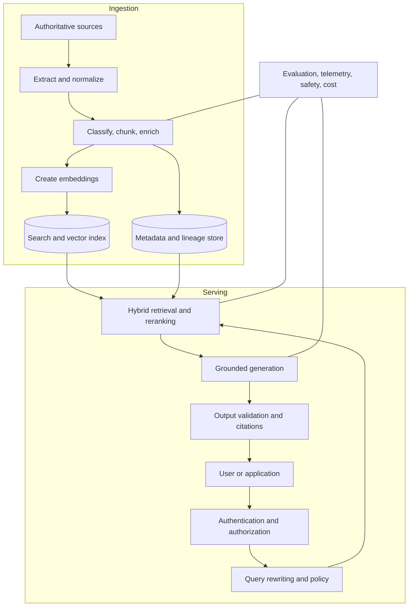
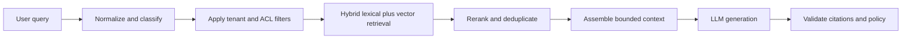
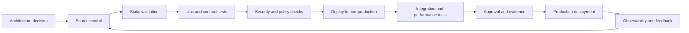

> **文档类型：**数据、AI 和集成实施指南
> **规范性术语：** **MUST**、**MUST NOT**、**SHOULD**、**SHOULD NOT** 和 **MAY** 是要求级别。
> **适用范围：** 企业 RAG、语义搜索、向量搜索、混合检索、grounding、授权和答案安全。
> **例外流程：** 偏离要求需要记录风险评估、补偿控制、指定风险负责人和到期日期。

|控制领域|价值|
|---|---|
|文件编号 | `DAI-06` |
|负责人|云卓越中心 |
|审核周期|至少每年一次，并且在重大平台、提供商、数据、安全或运营模式发生变化之后 |
|证据|检索和索引设计、授权测试、评估结果、安全审查和运营就绪证据 |

# 企业 RAG 和 AI 搜索

> **决策简述：** 将摄取与服务分开，在检索之前强制授权，并将检索到的内容和模型输出视为不可信。

## 目的

本文档定义了检索增强生成 (RAG)、语义搜索、向量搜索、混合检索和 grounding 答案应用的企业标准。 Azure AI Search 和 Azure OpenAI 是 Azure 参考实现；等效模式应用于 Amazon Bedrock Knowledge Bases和 OpenSearch、具有向量搜索或数据库向量功能的 Google Vertex AI 以及具有 Oracle AI 向量搜索的 OCI Generative AI。

RAG 可以提高 groundedness 和新鲜度。它不保证正确性、授权、完整性或安全性。

## 逻辑架构

生产 RAG 解决方案有两个独立的流程：摄取和服务。

摄取身份和服务身份 MUST 不同。索引管理权限和查询访问权限 MUST 分开。

## 源头治理

只有经过批准的权威来源才可以投入生产指标。每个来源都需要所有者、分类、更新方法、保留规则、法律依据和消费者范围。解决方案 MUST 保留源 URI 或标识符、文档版本、有效日期、访问控制元数据和摄取时间戳。

过时、被取代、删除或撤销访问权限的文档 MUST 在定义的目标内删除或逻辑删除。不能可靠地忘记内容的索引不适合受监管的使用。

## 分块和丰富

分块是检索设计决策，而不是固定的标记计数。针对代表性问题评估结构感知分块、重叠、父子检索、表格、代码、图像和元数据过滤器。

每个块 SHOULD 携带：

- 来源和版本；
- 标题、章节、页码或位置；
- 所有者和分类；
- 租户和权利元数据；
- 语言和内容类型；
- 有效日期和失效日期；
- 校验和与摄取运行；
- 父文件标识符；
- 引文显示字段。

请勿嵌入机密、凭据、隐藏评论或策略排除的内容。

## 检索管道

鲁棒的检索序列可以包括查询标准化、意图检测、分解、同义词扩展、元数据过滤、词汇检索、向量检索、融合、重新排序、多样性和上下文组装。

安全过滤器 MUST 在检索之前或检索期间应用，而不是在生成文本之后应用。对未经授权的答案进行后过滤是不可靠的。

## 授权感知检索

首选模型将企业组或应用权利映射到可过滤索引元数据。授权数据必须同步、版本化和测试。对于高敏感度系统，请在检索时使用安全调整以及对操作或完整文档访问进行源系统授权检查。

租户隔离模式包括：

- 单独的搜索服务或项目进行硬隔离；
- 每个租户单独的索引或敏感度边界；
- 与强制租户和 ACL 过滤器共享索引；
- 应用级分区加上加密或存储隔离。

共享索引设计需要测试证明过滤器不能被省略或覆盖。

## 搜索存储选型

|存储类型|优势|限制|
|---|---|---|
|托管搜索引擎|混合搜索、过滤器、排名、操作搜索功能|独立的数据生命周期和成本|
|带有向量的关系数据库|事务能力，系统更少|可能缺乏高级搜索和扩缩容功能|
| Lakehouse 向量索引|接近分析和机器学习资产 |服务延迟和功能集各不相同|
|专用向量数据库|专门的向量规模和特征|额外的治理和运营面|
|知识图加向量|关系感知检索 |建模和操作复杂性|

根据检索质量、过滤器、新鲜度、延迟、规模、区域性、运营和成本进行选择，而不仅仅是基准声明。

## 多云映射

|能力|Azure|AWS | GCP |OCI |
|---|---|---|---|---|
|搜索和向量检索| Azure AI Search | OpenSearch 服务、Aurora/RDS 向量选项、Bedrock Knowledge Bases | Vertex AI 向量搜索、AlloyDB/Cloud SQL/Spanner 向量功能 | Oracle AI Vector Search、OpenSearch 兼容选项（经批准） |
|基础模型| Azure OpenAI / Foundry 模型 |Bedrock|Vertex AI | OCI Generative AI |
|对象内容 | ADLS / Blob Storage | S3 | Cloud Storage | Object Storage |
|文件处理 | Azure AI Document Intelligence |文本摘要 |文档 AI |文档理解 |
|编排|Data Factory、Functions、Logic Apps|Glue、Lambda、Step Functions|Dataflow、Cloud Run、Workflows|Data Integration、Functions、Oracle Integration|

## 评估标准

评估 MUST 被分为检索、生成、安全和操作维度。

### 检索指标

- K 处的召回率和 K 处的精确度；
- 平均倒数排名或标准化贴现累积增益（如果有用）；
- 正确文档和正确段落检索；
- ACL 过滤器的正确性；
- 新鲜度和删除延迟；
- 零结果率和不相关结果率。

### 生成指标

- 脚踏实地或忠诚；
- 答案的相关性和完整性；
- 引文正确性和引文覆盖率；
- 拒绝正确性；
- 事实与来源的一致性；
- 特定任务的准确性。

### 运营指标

- 端到端延迟和检索延迟；
- 索引更新滞后；
- 令牌和查询成本；
- 节流和错误率；
- 缓存命中率；
- 可用性和恢复时间。

评估数据集 MUST 包括普通问题、模棱两可的问题、对抗性提示、未经授权的内容尝试、陈旧文档案例、相关的多语言内容以及“语料库中无答案”案例。

## 及时注入和内容威胁

检索到的内容是不受信任的输入。文档可能包含旨在覆盖应用策略、窃取数据或操纵工具的指令。缓解措施包括内容清理、源白名单、指令/数据分离、受限工具权限、提示注入检测、输出验证以及对后续操作的人工批准。

不允许检索到的内容直接选择凭据、执行代码、更改授权或调用高影响力工具。

## 引用和用户体验

答案 SHOULD 公开解析为授权源内容的引用。应用 SHOULD 区分引用的证据、生成的综合和不确定性。当证据不足时，它应该拒绝或声明语料库不支持某个答案，而不是发明一个答案。

## 索引操作

生产操作 MUST 涵盖增量更新、完全重建、蓝/绿索引交换、模式迁移、嵌入模型更改、删除传播、失败文档隔离和回滚。重新嵌入的成本可能很高，并且必须作为受控迁移进行规划。

## 跨领域的治理要求

平台 MUST 将数据产品、模型、提示、索引、管道和集成接口视为受治理资产。每项资产都需要一个负责任的所有者、分类、生命周期状态、批准的消费者、数据血缘、保留规则和运营目标。平台控制 MUST 通过策略即代码和基础设施即代码应用，而不是手动门户配置。

最低治理控制是：

1. 具有自动元数据收集功能的业务术语表和技术目录。
2. 摄取时的数据分类和转换后的重新分类。
3. 从源到转换、模型或索引、API 和消费者的端到端数据血缘。
4. 平台管理、数据管理、开发和生产运营之间的职责分离。
5. 用于管理操作和访问受监管数据的不可变审计日志。
6. 明确的保留、存档、合法保留和删除程序。
7、具有证据、审批、回滚能力的环境晋级。
8. 定期访问重新认证和控制有效性审查。

## 交付和生命周期标准

所有可部署资源 MUST 在版本控制中表示。合规的交付流程是：

生产变更 MUST 使用可重复的流水线、短期工作负载标识、同行评审和可审核的批准。紧急变更需要追溯相同的证据，且 MUST NOT 成为并行运行模型。

## 查询和上下文策略

服务层 SHOULD 在模型调用之前应用确定性策略。查询策略可以约束租户、源类别、时间范围、语言、内容类型、最大检索段落以及是否允许请求使用工具或外部搜索。

上下文汇编 MUST 强制执行：

- 仅限授权来源；
- 有界的令牌和文档预算；
- 多样性和重复数据删除；
- 源版本和新鲜度要求；
- 删除隐藏或禁止的字段；
- 系统策略和检索文本之间的明确分离；
- 索引迁移后的稳定引文标识符。

大上下文并不能替代检索质量。过多的上下文会增加延迟、成本、指令冲突和不支持的综合。

## 评估发布门

按用例而不是企业范围内的一个评分来定义最低发布阈值。对源解析、分块、嵌入、过滤器、排名、提示、模型或索引模式的生产更改 SHOULD 运行相同的受控基准。

门 SHOULD 在以下情况下失败：

- 在任何负面授权测试中返回未经授权的结果；
- 在新鲜度目标内无法检索到所需的来源；
- 引文支持低于应用阈值；
- 无答案的情况被转换为有信心的无支持的答案；
- 延迟或成本超出批准的范围；
- 一个子群体或语言经历了物质退化；
- 删除或撤销测试不会删除目标内的访问权限。

存储评估数据集版本、评分器版本、阈值、结果、审阅者和版本的已知限制。

## 嵌入和索引迁移

嵌入模型的变化会改变向量几何形状，并且需要受控的迁移。使用并行索引或版本化向量字段，通过可追踪批次重新处理内容，根据新旧索引评估检索，然后逐步切换流量。

迁移期间：

1. 保留源校验和与块 ID。
2. 跟踪解析或嵌入失败的文档。
3. 除非明确支持，否则防止混合嵌入空间作为一个索引进行查询。
4. 验证新索引中的授权元数据和删除状态。
5. 通过回滚窗口保留旧索引。
6. 根据保留和成本策略删除过时的向量。

## 相关主题

- [Azure OpenAI 平台架构](dai-azure-openai-platform-architecture.md)
- [AI 安全、身份和负责任的 AI](dai-ai-security-identity-and-responsible-ai.md)
- [AI 应用的生产运营](dai-production-operations-for-ai-applications.md)
- [数据隐私、驻留、保留和安全删除标准](dai-data-privacy-residency-retention-and-deletion.md)

## 反模式
- 不加区别地对共享驱动器建立索引，因为爬网程序可以访问它们。
- 仅在检索或生成后应用授权。
- 仅使用轶事演示问题进行评估。
- 当确切的术语、标识符或日期很重要时，单独使用向量相似性。
- 返回不支持生成的声明的引文。
- 在索引或缓存中无限期保留已删除的文档。
- 将所有检索到的内容视为可信指令。
- 重复重新嵌入整个语料库，无需成本和迁移控制。

## 验证

- [ ] 已分配业务所有者、技术所有者、数据所有者和支持所有者。
- [ ] 记录数据分类、驻留、主权、保留和删除要求。
- [ ] 身份使用联合或托管工作负载身份；不允许嵌入凭据。
- [ ] 公共网络暴露被禁用，除非记录在案的例外情况得到批准。
- [ ] 定义了加密、密钥所有权、轮换和 break-glass 程序。
- [ ] 测试可用性、恢复、可扩展性和容量假设。
- [ ] 日志、指标、跟踪、数据血缘和成本分配在生产前实施。
- [ ] 执行部署、回滚、备份恢复和灾难恢复过程。
- [ ] 记录服务限制、配额、区域依赖性和特定于提供商的约束。
- [ ] 退出策略和可移植性边界是明确的。

## 参考文档

- [Azure AI Search：RAG 概述](https://learn.microsoft.com/azure/search/retrieval-augmented-generation-overview)
- [Azure Architecture Center：安全多租户 RAG](https://learn.microsoft.com/azure/architecture/ai-ml/guide/secure-multitenant-rag)
- [Azure Architecture Center：RAG 解决方案设计与评估](https://learn.microsoft.com/azure/architecture/ai-ml/guide/rag/rag-solution-design-and-evaluation-guide)
- [AWS 生成式 AI 镜头：数据架构](https://docs.aws.amazon.com/wellarchitected/latest/generative-ai-lens/data-architecture.html)
- [GCP RAG 参考架构](https://cloud.google.com/architecture/rag-reference-architectures)
- [OCI 多云生成式 AI RAG 架构](https://docs.oracle.com/en/solutions/oci-multicloud-genai-rag/)
