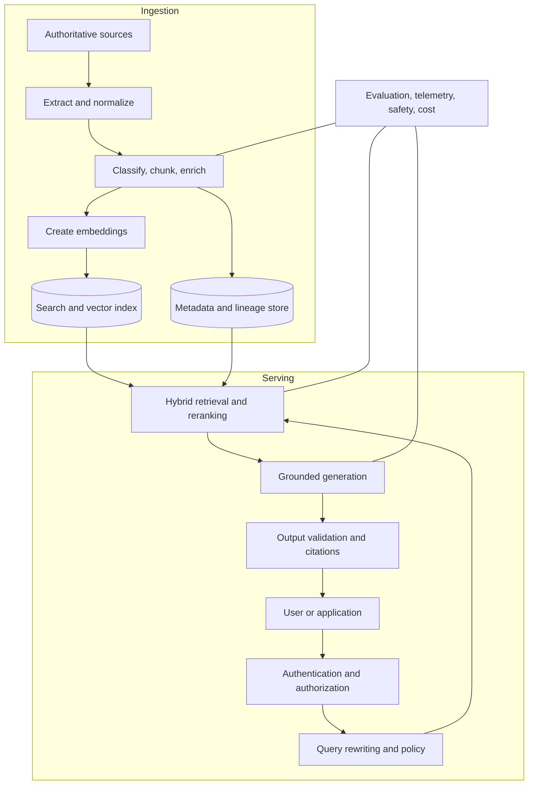
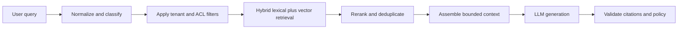
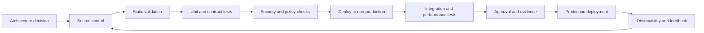

> **Document class:** Data, AI & Integration implementation guide
> **Normative terms:** **MUST**, **MUST NOT**, **SHOULD**, **SHOULD NOT**, and **MAY** are requirements levels.
> **Applicability:** Enterprise RAG, semantic search, vector search, hybrid retrieval, grounding, authorization, and answer safety.
> **Exception process:** Deviations require a documented risk assessment, compensating controls, named risk owner, and expiry date.

| Control field | Value |
|---|---|
| Document ID | `DAI-06` |
| Owner | Cloud Center of Excellence |
| Review cycle | At least annually and after material platform, provider, data, security, or operating-model changes |
| Evidence | Retrieval and index design, authorization tests, evaluation results, security review, and operational readiness evidence |

# Enterprise RAG and AI Search

> **Decision in brief:** Separate ingestion from serving, enforce authorization before retrieval, and treat retrieved content and model output as untrusted.

## Purpose

This document defines the enterprise standard for retrieval-augmented generation (RAG), semantic search, vector search, hybrid retrieval, and grounded-answer applications. Azure AI Search with Azure OpenAI is the Azure reference implementation; equivalent patterns apply to Amazon Bedrock knowledge capabilities and OpenSearch, Google Vertex AI with Vector Search or database vector capabilities, and OCI Generative AI with Oracle AI Vector Search.

RAG can improve grounding and freshness. It does not guarantee correctness, authorization, completeness, or safety.

## Logical Architecture

A production RAG solution has two separate flows: ingestion and serving.

The ingestion identity and serving identity MUST be distinct. Index administration and query access MUST be separate privileges.

## Source Governance

Only approved authoritative sources may enter production indexes. Each source requires an owner, classification, update method, retention rule, legal basis, and consumer scope. The solution MUST preserve source URI or identifier, document version, effective date, access-control metadata, and ingestion timestamp.

Documents that are obsolete, superseded, deleted, or access-revoked MUST be removed or tombstoned within a defined objective. An index that cannot reliably forget content is not suitable for regulated use.

## Chunking and Enrichment

Chunking is a retrieval design decision, not a fixed token count. Evaluate structure-aware chunking, overlap, parent-child retrieval, tables, code, images, and metadata filters against representative questions.

Each chunk SHOULD carry:

- source and version;
- title, section, and page or location;
- owner and classification;
- tenant and entitlement metadata;
- language and content type;
- effective and expiry dates;
- checksum and ingestion run;
- parent document identifier;
- citation display fields.

Do not embed secrets, credentials, hidden comments, or content excluded by policy.

## Retrieval Pipeline

A robust retrieval sequence may include query normalization, intent detection, decomposition, synonym expansion, metadata filtering, lexical retrieval, vector retrieval, fusion, reranking, diversity, and context assembly.

Security filters MUST be applied before or during retrieval, not after generated text is produced. Post-filtering an unauthorized answer is unreliable.

## Authorization-Aware Retrieval

The preferred model maps enterprise groups or application entitlements to filterable index metadata. Authorization data must be synchronized, versioned, and tested. For high-sensitivity systems, use security trimming at retrieval plus source-system authorization checks for actions or full-document access.

Tenant isolation patterns include:

- separate search service or project for hard isolation;
- separate index per tenant or sensitivity boundary;
- shared index with mandatory tenant and ACL filters;
- application-level partition plus cryptographic or storage isolation.

Shared-index designs require tests proving filters cannot be omitted or overridden.

## Search Store Selection

| Store type | Strength | Limitation |
|---|---|---|
| Managed search engine | hybrid search, filters, ranking, operational search features | separate data lifecycle and cost |
| Relational database with vectors | transactional proximity, fewer systems | may lack advanced search and scaling features |
| Lakehouse vector index | close to analytical and ML assets | serving latency and feature set vary |
| Dedicated vector database | specialized vector scale and features | extra governance and operational surface |
| Knowledge graph plus vector | relationship-aware retrieval | modeling and operational complexity |

Select based on retrieval quality, filters, freshness, latency, scale, regionality, operations, and cost—not benchmark claims alone.

## Multi-cloud mapping

| Capability | Azure | AWS | GCP | OCI |
|---|---|---|---|---|
| Search and vector retrieval | Azure AI Search | OpenSearch Service, Aurora/RDS vector options, Bedrock knowledge features | Vertex AI Vector Search, AlloyDB/Cloud SQL/Spanner vector capabilities | Oracle AI Vector Search, OpenSearch-compatible options where approved |
| Foundation models | Azure OpenAI / Foundry Models | Bedrock | Vertex AI | OCI Generative AI |
| Object content | ADLS / Blob Storage | S3 | Cloud Storage | Object Storage |
| Document processing | Azure AI Document Intelligence | Textract | Document AI | Document Understanding |
| Orchestration | Data Factory, Functions, Logic Apps | Glue, Lambda, Step Functions | Dataflow, Cloud Run, Workflows | Data Integration, Functions, Oracle Integration |

## Evaluation Standard

Evaluation MUST be split into retrieval, generation, safety, and operational dimensions.

### Retrieval metrics

- recall at K and precision at K;
- mean reciprocal rank or normalized discounted cumulative gain where useful;
- correct-document and correct-passage retrieval;
- ACL-filter correctness;
- freshness and deletion latency;
- zero-result and irrelevant-result rate.

### Generation metrics

- groundedness or faithfulness;
- answer relevance and completeness;
- citation correctness and citation coverage;
- refusal correctness;
- factual consistency against source;
- task-specific accuracy.

### Operational metrics

- end-to-end latency and retrieval latency;
- index update lag;
- token and query cost;
- throttling and error rate;
- cache hit rate;
- availability and recovery time.

Evaluation datasets MUST include ordinary questions, ambiguous questions, adversarial prompts, unauthorized-content attempts, stale-document cases, multilingual content where relevant, and “no answer in corpus” cases.

## Prompt Injection and Content Threats

Retrieved content is untrusted input. Documents may contain instructions intended to override application policy, exfiltrate data, or manipulate tools. Mitigations include content sanitization, source allowlists, instruction/data separation, restricted tool permissions, prompt-injection detection, output validation, and human approval for consequential actions.

Do not allow retrieved content to directly select credentials, execute code, change authorization, or invoke high-impact tools.

## Citations and User Experience

Answers SHOULD expose citations that resolve to authorized source content. The application SHOULD distinguish quoted evidence, generated synthesis, and uncertainty. When evidence is insufficient, it should refuse or state that the corpus does not support an answer rather than inventing one.

## Index Operations

Production operations MUST cover incremental updates, full rebuild, blue/green index swap, schema migration, embedding-model change, deletion propagation, failed-document quarantine, and rollback. Re-embedding can be expensive and must be planned as a controlled migration.

## Cross-cutting governance requirements

The platform MUST treat data products, models, prompts, indexes, pipelines, and integration interfaces as governed assets. Each asset requires an accountable owner, classification, lifecycle state, approved consumers, lineage, retention rules, and operational objectives. Platform controls MUST be applied through policy-as-code and infrastructure-as-code rather than manual portal configuration.

Minimum governance controls are:

1. A business glossary and technical catalog with automated metadata harvesting.
2. Data classification at ingestion and reclassification after transformation.
3. End-to-end lineage from source through transformation, model or index, API, and consumer.
4. Segregation of duties between platform administration, data stewardship, development, and production operations.
5. Immutable audit logging for administrative actions and access to regulated data.
6. Explicit retention, archival, legal-hold, and deletion procedures.
7. Environment promotion with evidence, approval, and rollback capability.
8. Periodic access recertification and control-effectiveness reviews.

## Delivery and lifecycle standard

All deployable resources MUST be represented in version control. A compliant delivery flow is:

Production changes MUST use repeatable pipelines, short-lived workload identities, peer review, and auditable approvals. Emergency changes require the same evidence retrospectively and MUST not become a parallel operating model.

## Query and Context Policy

The serving layer SHOULD apply deterministic policy before model invocation. A query policy may constrain tenant, source classes, time ranges, languages, content types, maximum retrieved passages, and whether the request is permitted to use tools or external search.

Context assembly MUST enforce:

- authorized sources only;
- bounded token and document budgets;
- diversity and deduplication;
- source-version and freshness requirements;
- removal of hidden or prohibited fields;
- clear separation between system policy and retrieved text;
- stable citation identifiers that survive index migration.

Large context is not a substitute for retrieval quality. Excess context can increase latency, cost, instruction conflicts, and unsupported synthesis.

## Evaluation Release Gates

Define minimum release thresholds by use case rather than one enterprise-wide score. A production change to source parsing, chunking, embeddings, filters, ranking, prompt, model, or index schema SHOULD run the same controlled benchmark.

A gate SHOULD fail when:

- unauthorized results are returned in any negative authorization test;
- required sources cannot be retrieved within the freshness objective;
- citation support falls below the application threshold;
- no-answer cases are converted into confident unsupported answers;
- latency or cost exceeds the approved envelope;
- a subgroup or language experiences material regression;
- deletion or revocation tests do not remove access within the objective.

Store evaluation dataset version, scorer version, thresholds, results, reviewer, and known limitations with the release.

## Embedding and Index Migration

Embedding-model changes alter vector geometry and require a controlled migration. Use a parallel index or versioned vector field, reprocess content with traceable batches, evaluate retrieval against the old and new index, then switch traffic progressively.

During migration:

1. Preserve source checksums and chunk IDs.
2. Track documents that fail parsing or embedding.
3. Prevent mixed embedding spaces from being queried as one index unless explicitly supported.
4. Verify authorization metadata and deletion state in the new index.
5. Retain the old index through the rollback window.
6. Delete obsolete vectors according to retention and cost policy.

## Related topics

- [Azure OpenAI Platform Architecture](dai-azure-openai-platform-architecture.md)
- [AI Security, Identity, and Responsible AI](dai-ai-security-identity-and-responsible-ai.md)
- [Production Operations for AI Applications](dai-production-operations-for-ai-applications.md)
- [Data Privacy, Residency, Retention, and Secure Deletion Standard](dai-data-privacy-residency-retention-and-deletion.md)

## Anti-patterns
- Indexing shared drives indiscriminately because the crawler can reach them.
- Applying authorization only after retrieval or generation.
- Evaluating only with anecdotal demo questions.
- Using vector similarity alone when exact terms, identifiers, or dates matter.
- Returning citations that do not support the generated claim.
- Retaining deleted documents indefinitely in indexes or caches.
- Treating all retrieved content as trusted instructions.
- Re-embedding the entire corpus repeatedly without cost and migration controls.

## Validation

- [ ] Business owner, technical owner, data owner, and support owner are assigned.
- [ ] Data classification, residency, sovereignty, retention, and deletion requirements are documented.
- [ ] Identity uses federation or managed workload identity; no embedded credentials are permitted.
- [ ] Public network exposure is disabled unless a documented exception is approved.
- [ ] Encryption, key ownership, rotation, and break-glass procedures are defined.
- [ ] Availability, recovery, scalability, and capacity assumptions are tested.
- [ ] Logging, metrics, traces, lineage, and cost allocation are implemented before production.
- [ ] Deployment, rollback, backup restoration, and disaster-recovery procedures are exercised.
- [ ] Service limits, quotas, regional dependencies, and provider-specific constraints are recorded.
- [ ] Exit strategy and portability boundaries are explicit.

## References

- [Azure AI Search: RAG overview](https://learn.microsoft.com/azure/search/retrieval-augmented-generation-overview)
- [Azure Architecture Center: Secure multitenant RAG](https://learn.microsoft.com/azure/architecture/ai-ml/guide/secure-multitenant-rag)
- [Azure Architecture Center: RAG solution design and evaluation](https://learn.microsoft.com/azure/architecture/ai-ml/guide/rag/rag-solution-design-and-evaluation-guide)
- [AWS Generative AI Lens: Data architecture](https://docs.aws.amazon.com/wellarchitected/latest/generative-ai-lens/data-architecture.html)
- [GCP RAG reference architectures](https://cloud.google.com/architecture/rag-reference-architectures)
- [OCI Multicloud Generative AI RAG architecture](https://docs.oracle.com/en/solutions/oci-multicloud-genai-rag/)
