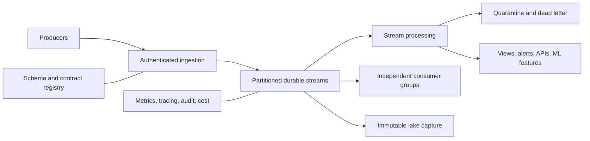
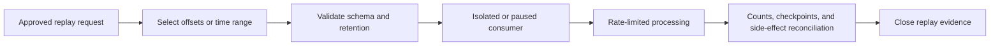

> **文档类型：**数据、AI 和集成架构参考模型
> **规范性术语：** **MUST**、**MUST NOT**、**SHOULD**、**SHOULD NOT** 和 **MAY** 是要求级别。
> **适用范围：** 跨云和混合平台的持久事件和实时处理，包括通知、命令、遥测和状态传输事件。
> **例外流程：** 偏离要求需要记录风险评估、补偿控制、指定风险负责人和到期日期。

|控制领域|价值|
|---|---|
|文件编号 | `DAI-13` |
|负责人|云卓越中心 |
|审核周期|至少每年一次，并且在重大平台、提供商、数据、安全或运营模式发生变化之后 |
|证据|事件契约、拓扑和容量模型、交付测试、重放结果和运营就绪证据 |

# 事件流和实时数据平台架构

> **简要决策：** 使用显式事件契约和持久流进行实时处理，并记录交付、排序、保留、重播和恢复语义。

## 目的

该架构定义了持久事件和实时处理的平台契约。它区分事件通知、状态迁移事件、遥测流和命令，以便团队选择适当的保留、排序、重播和耦合。

## 参考架构

## 事件契约

每个生产事件 MUST 定义事件 ID、类型、版本、来源、事件时间、相关性/因果 ID、分区键、分类、所有者、模式、兼容性规则、保留、消费者和支持目标。有效负载 MUST 排除机密和不必要的个人数据。

## 交付和订购

- 假设至少一次交付，除非完整的端到端系统证明并非如此。
- 消费者 MUST 使用稳定的事件或业务密钥实现幂等。
- 仅在记录在案的分区范围内保证订购。
- 仅在记录持久化处理状态后才会发生确认。
- 有界退避重试；将无法处理的事件连同上下文路由到隔离区。
- 保留商定的恢复和审核窗口的重播能力。

## 多云映射

|能力|Azure|AWS | GCP |OCI |
|---|---|---|---|---|
|托管流|Event Hubs|Kinesis Data Streams|Pub/Sub|OCI Streaming|
|Kafka 选项|Event Hubs Kafka/托管 Kafka|Amazon MSK|托管 Kafka 生态系统|OCI Streaming Kafka API|
|处理|Stream Analytics、Fabric、Databricks|Apache Flink 托管服务、Glue|Dataflow|Data Flow、Functions|
|路由|Event Grid、Service Bus|EventBridge、SNS/SQS|Eventarc、Pub/Sub|Events、Queues|
|归档|ADLS/Blob|S3|Cloud Storage|Object Storage|

## 容量和隔离

每秒事件的大小、每秒字节数、分区、保留、消费者滞后、连接和故障追赶。在配额或故障影响需要时，按命名空间、集群、账户、项目或租户隔离关键工作负载。防止一名消费者控制生产者保留或其他消费者检查点。

## 模式演变

默认情况下使用追加式、向后兼容的演进。重大更改需要新版本或主题、并行发布、消费者迁移证据和停用日期。在 CI 和入口处验证模式；不要使用不受控的 JSON 信封作为契约的替代品。

## 安全和网络

使用工作负载身份、最低权限发布/使用角色、私有连接、加密和经过审核的管理更改。按流和消费者组分别对生产者和消费者进行授权。将跨区域和跨云复制视为受驻留和出口审查的受控数据传输。

## 验证

测试重复、延迟、无序、畸形、超大和无法处理的事件；代理或区域故障；消费者重启；重播；配额耗尽；以及架构不兼容。验证恢复点损失和恢复时间。跟踪发布失败、端到端延迟、消费者延迟、重试率、隔离期限、分区偏差、丢失事件和单位成本。

## 操作注意事项

平台团队负责消息代理可靠性、配额、升级和黄金路径库。生产者负责契约和语义的正确性。消费者负责幂等性、滞后性和重放安全性。 Runbook 必须涵盖分区饱和、保留过期、证书或身份失败、复制滞后和意外事件泄露。

## 交易发布和消费
当数据库更新和事件发布必须代表一个业务操作时，请使用事务发件箱、更改数据采集发布或避免不协调的双重写入的其他模式。

更新数据库时，消费者 SHOULD 使用收件箱、幂等账本、事务检查点或等效机制，以便确认和持久状态一起移动。恰好一次声明 MUST 识别完整边界；仅消息代理级别的担保不会一次性产生外部副作用。

## 分区策略

分区键决定顺序、并行性、故障集中度和规模。使用测量的基数和流量分布来选择密钥。

避免使用以下键：

- 将大多数事件路由到一个分区；
- 实体生命周期内发生变化；
- 不必要地暴露敏感信息；
- 需要全球订购，但没有量化的需求；
- 防止消费者并行处理独立实体。

记录每个键的预期峰值速率、分区计数、增长假设和重新分区方法。分区数量的增加可能会改变订购和消费者行为，因此需要进行测试。

## 重播治理

重放是一种特权数据操作。重放请求 MUST 定义源范围、消费者、目的、目标环境、模式版本、副作用策略、重复数据删除方法、速率限制、成本估算和完成证据。

在没有证明幂等性或抑制外部操作的情况下，切勿将生产事件重播到主动的副作用消费者中。

## 数据丢失和滞后目标

为发布者接受度、消息代理持久性、端到端处理延迟和消费者恢复定义单独的目标。消息代理可能运行正常，而关键消费者却可能落后数天。

告警 SHOULD 区分正常批次滞后、处理失败、分区倾斜、过期保留风险和下游依赖性减慢。在滞后接近保留的重播窗口之前升级。

## 相关主题
- [Azure Data Factory 和数据集成](dai-azure-data-factory-and-data-integration.md)
- [DataOps CI/CD、测试和架构演进最佳实践](dai-dataops-cicd-testing-and-schema-evolution.md)
- [数据平台弹性、备份和灾难恢复标准](dai-data-platform-resilience-backup-and-disaster-recovery.md)

## 参考文档

- [Azure 事件驱动架构风格](https://learn.microsoft.com/en-us/azure/architecture/guide/architecture-styles/event-driven)
- [AWS 事件驱动架构](https://docs.aws.amazon.com/whitepapers/latest/serverless-multi-tier-architectures-api-gateway-lambda/event-driven-architecture.html)
- [Google Cloud Pub/Sub 架构](https://cloud.google.com/pubsub/architecture)
- [OCI Streaming](https://docs.oracle.com/en-us/iaas/Content/Streaming/home.htm)

## 相关仓库

- [andyxuan2010/cwb-adf-clientaccount](https://github.com/andyxuan2010/cwb-adf-clientaccount) — 提供可以使用受管理的流输入的数据集成交付示例。
