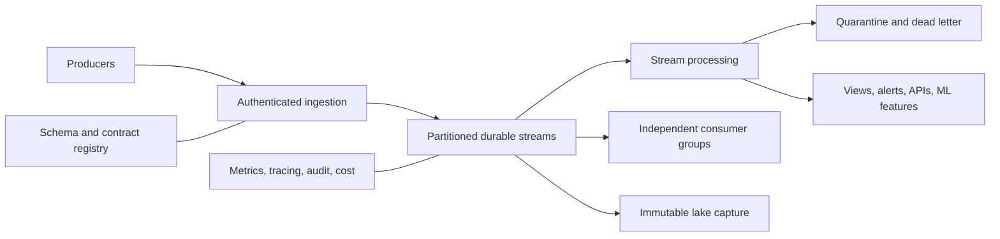
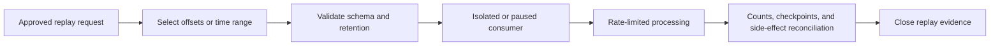

> **Document class:** Data, AI & Integration architecture reference model
> **Normative terms:** **MUST**, **MUST NOT**, **SHOULD**, **SHOULD NOT**, and **MAY** are requirements levels.
> **Applicability:** Durable events and real-time processing across cloud and hybrid platforms, including notifications, commands, telemetry, and state-transfer events.
> **Exception process:** Deviations require a documented risk assessment, compensating controls, named risk owner, and expiry date.

| Control field | Value |
|---|---|
| Document ID | `DAI-13` |
| Owner | Cloud Center of Excellence |
| Review cycle | At least annually and after material platform, provider, data, security, or operating-model changes |
| Evidence | Event contract, topology and capacity model, delivery tests, replay results, and operational readiness evidence |

# Event Streaming and Real-Time Data Platform Architecture

> **Decision in brief:** Use explicit event contracts and durable streams for real-time processing, with documented delivery, ordering, retention, replay, and recovery semantics.

## Purpose

This architecture defines the platform contract for durable events and real-time processing. It distinguishes event notification, state-transfer events, telemetry streams, and commands so teams choose appropriate retention, ordering, replay, and coupling.

## Reference architecture

## Event contract

Every production event MUST define event ID, type, version, source, event time, correlation/causation IDs, partition key, classification, owner, schema, compatibility rule, retention, consumers, and support objective. Payloads MUST exclude secrets and unnecessary personal data.

## Delivery and ordering

- Assume at-least-once delivery unless the complete end-to-end system proves otherwise.
- Consumers MUST be idempotent using stable event or business keys.
- Ordering is guaranteed only within a documented partition scope.
- Acknowledgement occurs only after durable processing state is recorded.
- Retry with bounded backoff; route poison events to quarantine with context.
- Preserve replay capability for the agreed recovery and audit window.

## Multi-cloud mapping

| Capability | Azure | AWS | GCP | OCI |
|---|---|---|---|---|
| Managed stream | Event Hubs | Kinesis Data Streams | Pub/Sub | OCI Streaming |
| Kafka option | Event Hubs Kafka/managed Kafka | Amazon MSK | Managed Kafka ecosystem | OCI Streaming Kafka API |
| Processing | Stream Analytics, Fabric, Databricks | Managed Service for Apache Flink, Glue | Dataflow | Data Flow, Functions |
| Routing | Event Grid, Service Bus | EventBridge, SNS/SQS | Eventarc, Pub/Sub | Events, Queue |
| Archive | ADLS/Blob | S3 | Cloud Storage | Object Storage |

## Capacity and isolation

Size for events per second, bytes per second, partitions, retention, consumer lag, connections, and failure catch-up. Isolate critical workloads by namespace, cluster, account, project, or tenancy where quotas or failure impact require it. Prevent one consumer from controlling producer retention or other consumer checkpoints.

## Schema evolution

Use additive, backward-compatible evolution by default. Breaking changes require a new version or topic, parallel publishing, consumer migration evidence, and retirement date. Validate schemas at CI and ingress; do not use an ungoverned JSON envelope as a substitute for a contract.

## Security and networking

Use workload identity, least-privilege publish/consume roles, private connectivity, encryption, and audited administrative changes. Authorize producers and consumers separately by stream and consumer group. Treat cross-region and cross-cloud replication as controlled data transfer subject to residency and egress review.

## Validation

Test duplicate, late, out-of-order, malformed, oversized, and poison events; broker or zone failure; consumer restart; replay; quota exhaustion; and schema incompatibility. Validate recovery-point loss and catch-up time. Track publish failure, end-to-end latency, consumer lag, retry rate, quarantine age, partition skew, dropped events, and unit cost.

## Operational considerations

Platform teams own broker reliability, quotas, upgrades, and paved-road libraries. Producers own contract and semantic correctness. Consumers own idempotency, lag, and replay safety. Runbooks must cover partition saturation, expired retention, certificate or identity failure, replication lag, and accidental event disclosure.

## Transactional Publication and Consumption

When a database update and event publication must represent one business action, use a transactional outbox, change-data-capture publication, or another pattern that avoids an uncoordinated dual write.

Consumers that update a database SHOULD use an inbox, idempotency ledger, transactional checkpoint, or equivalent mechanism so acknowledgement and durable state move together. Exactly-once claims MUST identify the full boundary; broker-level guarantees alone do not make external side effects exactly once.

## Partition Strategy

Partition keys determine ordering, parallelism, failure concentration, and scale. Select keys using measured cardinality and traffic distribution.

Avoid keys that:

- route most events to one partition;
- change during the entity lifecycle;
- expose sensitive information unnecessarily;
- require global ordering without a quantified need;
- prevent consumers from processing independent entities in parallel.

Record expected peak rate per key, partition count, growth assumptions, and repartitioning approach. A partition-count increase can alter ordering and consumer behavior and therefore requires testing.

## Replay Governance

Replay is a privileged data operation. A replay request MUST define source range, consumer, purpose, target environment, schema versions, side-effect policy, deduplication method, rate limit, cost estimate, and completion evidence.

Never replay production events into an active side-effecting consumer without proving idempotency or suppressing external actions.

## Data-Loss and Lag Objectives

Define separate objectives for publisher acceptance, broker durability, end-to-end processing latency, and consumer recovery. A broker can be healthy while a critical consumer is days behind.

Alerting SHOULD distinguish normal batch lag, processing failure, partition skew, expired retention risk, and downstream dependency slowdown. Escalate before lag approaches the retained replay window.

## Related topics
- [Azure Data Factory and Data Integration](dai-azure-data-factory-and-data-integration.md)
- [DataOps CI/CD, Testing, and Schema Evolution Best Practices](dai-dataops-cicd-testing-and-schema-evolution.md)
- [Data Platform Resilience, Backup, and Disaster Recovery Standard](dai-data-platform-resilience-backup-and-disaster-recovery.md)

## References

- [Azure event-driven architecture style](https://learn.microsoft.com/en-us/azure/architecture/guide/architecture-styles/event-driven)
- [AWS event-driven architecture](https://docs.aws.amazon.com/whitepapers/latest/serverless-multi-tier-architectures-api-gateway-lambda/event-driven-architecture.html)
- [Google Cloud Pub/Sub architecture](https://cloud.google.com/pubsub/architecture)
- [OCI Streaming](https://docs.oracle.com/en-us/iaas/Content/Streaming/home.htm)

## Related repos

- [andyxuan2010/cwb-adf-clientaccount](https://github.com/andyxuan2010/cwb-adf-clientaccount) — provides a data-integration delivery example that can consume governed streaming inputs.
