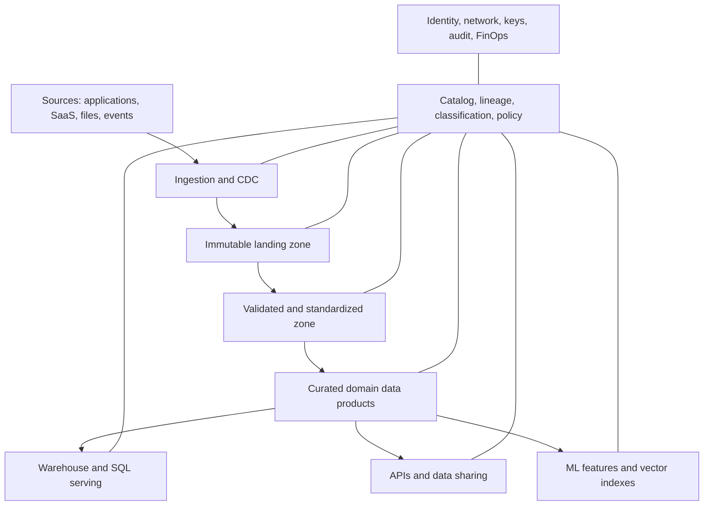
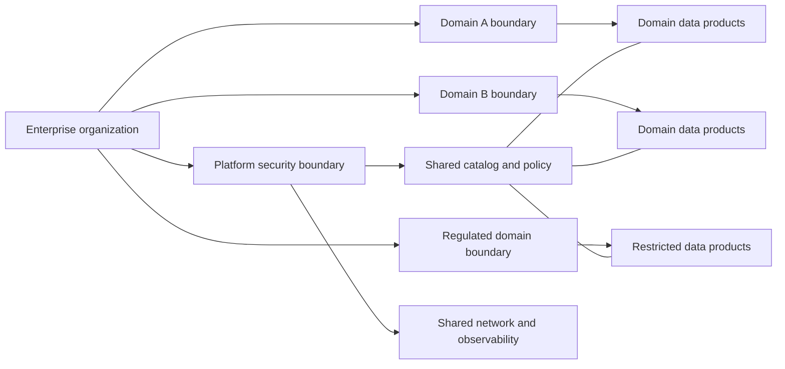
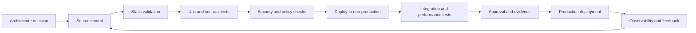

> **文档类型：**数据、AI 和集成架构参考模型
> **规范性术语：** **MUST**、**MUST NOT**、**SHOULD**、**SHOULD NOT** 和 **MAY** 是要求级别。
> **适用范围：** 跨 Azure、AWS、GCP 和 OCI 的企业数据平台，包括摄取、存储、处理、治理、交换和 AI 消费。
> **例外流程：** 偏离要求需要记录风险评估、补偿控制、指定风险负责人和到期日期。

|控制领域|价值|
|---|---|
|文件编号 | `DAI-01` |
|负责人|云卓越中心 |
|审核周期|至少每年一次，并且在重大平台、提供商、数据、安全或运营模式发生变化之后 |
|证据|架构决策、平台配置、安全审查、验证结果和运营就绪证据 |

# 治理数据平台架构

> **简要决定：** 使用具有集中护栏和由数据域负责的产品的联合数据平台。选择治理、质量和交换通用契约背后的云原生服务。

## 目的

本文档定义了经过批准的数据平台企业架构，这些平台跨 Azure、AWS、GCP 和 Oracle Cloud Infrastructure 摄取、存储、转换、管理、共享和提供分析和 AI 就绪数据。它建立了一个通用的控制模型，同时允许云原生实施选择。

目标不是单个中央数据仓库，也不是不受控制的域湖集合。目标是一个具有集中护栏、共享功能和域负责的数据产品的联合平台。

## 范围

该标准涵盖批量和流式摄取、对象存储、Lakehouse 和仓库处理、元数据和数据血缘、主数据和参考数据、数据质量、语义服务、数据交换和 AI 消费。 [DAI-03](./dai-sql-managed-instance-and-database-platform-patterns.md) 中涵盖了事务应用数据库。

## 架构位置

企业级 SHOULD 采用分层数据架构：

- **源层：**日志系统、SaaS 平台、合作伙伴源、设备、文件和外部数据。
- **摄取层：**批处理、更改数据采集、事件流、API 摄取和文件传输。
- **存储层：**不可变的落地、经过验证或一致的数据以及精选的数据产品。
- **处理层：** SQL、Spark、流处理、编排和数据质量。
- **治理平面：**目录、数据血缘、分类、策略、管理和审计。
- **服务层：**仓库、Lakehouse SQL、API、数据共享、语义模型、特征存储和向量索引。
- **消费层：** BI、分析、运营应用、ML、RAG 和外部消费者。

## 核心原则

1. **非托管数据集上的数据产品。** 生产数据集需要契约、所有者、质量目标、模式生命周期、访问策略和支持模型。
2. **在持久边界上使用开放格式。** 在可移植性很重要的情况下使用开放表和文件格式。当事实来源仍然可导出时，专有加速层是可以接受的。
3. **在可行的情况下将存储与计算分开。**这支持独立扩展、工作负载隔离和基于生命周期的成本控制。
4. **不可变的原始保留和受控重播。** 在法律和经济上合理的情况下保持源保真度。
5. **靠近数据的策略执行。** 授权必须一致地应用于 SQL、文件、API、笔记本、ML 和 AI 检索。
6. **元数据是产品的一部分。** 模式、数据血缘、分类、质量结果和业务含义不是可选文档。
7. **区域性是有意为之的。** 数据放置必须基于驻留、延迟、弹性和传输成本要求。
8. **平台护栏内的域自治。**域可以选择批准的引擎和模式，但不能绕过身份、加密、可观测性或治理控制。

## 数据区域标准

|区域|目的|可变性|最低控制|
|---|---|---:|---|
|落地|忠实来源的摄取和重放|仅追加|加密、源元数据、校验和、保留|
|隔离|无效、可疑或被策略阻止的数据|受控|限制访问、问题原因、修复工作流|
|标准化|类型化、去重、规范化数据|可重建|模式验证、质量规则、数据血缘|
|精选|符合业务的领域产品|版本化|产品契约、SLA/SLO、数据管理、语义定义|
|服务|面向消费者优化的投影|可重建|工作负载隔离、访问策略、新鲜度目标|
|归档|低成本长期保留|不可变|法律保留、生命周期策略、恢复测试|

## 多云能力映射

|能力|Azure|AWS | GCP |OCI |
|---|---|---|---|---|
|对象存储|Azure Data Lake Storage/Blob Storage|Amazon S3|Cloud Storage|OCI Object Storage|
|目录和治理|Microsoft Purview|AWS Glue Data Catalog 和 Lake Formation|Knowledge Catalog（原 Dataplex Universal Catalog）|OCI Data Catalog 和 Data Safe 功能|
|仓库|Azure Synapse Analytics 或 Fabric Warehouse|Amazon Redshift|BigQuery|Autonomous Data Warehouse|
|Lakehouse 处理|Azure Databricks / Fabric Spark|Databricks / EMR|Databricks / Dataproc|OCI Data Flow / Autonomous AI Lakehouse|
|流式处理|Event Hubs|Kinesis / MSK|Pub/Sub|OCI Streaming|
|集成|Data Factory|Glue、DMS、AppFlow、Step Functions|Data Fusion、Dataflow、Datastream、Workflows|Data Integration、GoldenGate、Oracle Integration|
|BI 和语义|Power BI / Fabric|QuickSight|Looker|Oracle Analytics Cloud|
该映射是功能性的，而不是功能等效的声明。产品选择 MUST 基于工作负载要求、区域可用性、安全功能、互操作性、团队能力和总成本。

## 租户和环境模型

首选模型使用单独的生产和非生产安全边界。高度监管或高爆炸半径的域 SHOULD 接收单独的账户、订阅、项目或隔间。只有在租户隔离、容量、成本分配和运营所有权得到证明的情况下，共享平台服务才可以集中化。

## 数据契约和产品要求

每个发布的数据产品 MUST 定义：

- 负责人和管家；
- 权威来源和允许的用途；
- 模式和语义定义；
- 分类和驻留；
- 新鲜度、完整性、有效性、唯一性和可用性目标；
- 兼容性和弃用策略；
- 消费者准入方式和权利模型；
- 数据血缘和转换逻辑；
- 事件、支持和升级路径；
- 单位成本和使用量指标。

架构更改 MUST 被分类为向后兼容、条件兼容或破坏。重大变更需要版本控制、消费者影响分析、迁移指南和弃用窗口。

## 安全架构

数据平面访问 MUST 使用基于身份的授权。网络隔离是一种附加控制，不能替代授权。管理控制平面、数据平面和用户开发环境 SHOULD 分开。

所需的控制包括支持的私有连接、强制的客户管理密钥、集中机密管理、出口控制、对不受信任文件的恶意软件扫描、敏感数据的行/列过滤、适当的动态屏蔽以及到安全控制目的地的不可变审计导出。

## 可靠性和恢复

数据流水线 MUST 是幂等的或安全可重放的。恢复目标必须区分平台恢复、数据补充和业务新鲜度。仅备份是不够的；必须测试恢复和重放。

关键数据产品 SHOULD 具备：

- 记录 RTO 和 RPO；
- 多区域服务部署（如果可用）；
- 仅当业务需求合理时才进行跨区域复制；
- 源到目标的协调；
- 毒消息和隔离处理；
- 流工作负载的检查点；
- 容量和配额告警；
- 部分故障和延迟数据的操作手册。

## 可观测性和服务管理

平台 MUST 采集管道状态、行或事件计数、延迟、新鲜度、质量结果、模式漂移、访问拒绝、查询性能、存储增长、计算利用率和单位成本。技术指标必须与产品级目标联系起来。

建议的 SLO 包括数据可用性、新鲜度延迟、管道成功完成、质量规则通过率、查询延迟、恢复时间以及具有完整所有权和数据血缘的资产百分比。

## 跨领域的治理要求

平台 MUST 将数据产品、模型、提示、索引、管道和集成接口视为受治理资产。每项资产都需要一个负责任的所有者、分类、生命周期状态、批准的消费者、数据血缘、保留规则和运营目标。平台控制 MUST 通过策略即代码和基础设施即代码应用，而不是手动门户配置。

最低治理控制是：

1. 具有自动元数据收集功能的业务术语表和技术目录。
2. 摄取时的数据分类和转换后的重新分类。
3. 从源到转换、模型或索引、API 和消费者的端到端数据血缘。
4. 平台管理、数据管理、开发和生产运营之间的职责分离。
5. 用于管理操作和访问受监管数据的不可变审计日志。
6. 明确的保留、存档、合法保留和删除程序。
7、具有证据、审批、回滚能力的环境晋级。
8. 定期访问重新认证和控制有效性审查。

## 交付和生命周期标准

所有可部署资源 MUST 在版本控制中表示。合规的交付流程是：

生产变更 MUST 使用可重复的流水线、短期工作负载标识、同行评审和可审核的批准。紧急变更需要追溯相同的证据，且 MUST NOT 成为并行运行模型。

## 平台服务目录

数据平台 SHOULD 发布可消费的功能，而不是仅公开原始云服务。典型的目录条目包括摄取、托管存储区域、转换计算、流处理、目录注册、数据质量执行、产品发布、数据共享、语义服务、特征管理、向量索引和恢复。

文档 SHOULD 说明各项能力：

- 支持的工作负载和数据类别；
- 请求输入和生成的输出；
- 身份、网络和关键行为；
- 配额、规模、区域可用性和成本单位；
- SLO、支持和恢复层；
- 版本控制和弃用；
- 消费者责任和禁止使用。

当团队需要未记录在案的管理员干预才能安全使用平台服务时，平台服务是不完整的。

## 数据产品入驻

产品接入 SHOULD 是自动化流程：

1.分配稳定的产品 ID 和所有者。
2. 注册目的、来源、分类、驻留和保留。
3. 验证契约和兼容性策略。
4. 提供批准的存储、计算、身份和网络路径。
5. 配置质量规则、数据血缘、审计、成本和告警。
6. 通过非生产进行部署并运行代表性验收测试。
7. 发布访问工作流程、支持、SLO 和消费者文档。
8.记录生产版本和认证证据。

平台 SHOULD 支持暂停、所有权转让、弃用和退役。没有生命周期自动化的产品创建会产生目录和存储债务。

## 引擎放置和工作负载隔离

根据数据形状、延迟、并发性、操作技能和成本来选择处理引擎。避免将每个转换发送到最灵活的引擎。

|工作负载|典型发动机特性 |
|---|---|
|轻量级的编排和操作|托管集成服务|
|大型 SQL 转换 |弹性仓库或 Lakehouse SQL |
|复杂的分布式改造 | Spark 或等效的分布式计算 |
|低延迟事件处理 |托管流引擎|
|交易服务|托管关系数据库或分布式数据库|
|搜索和检索 |专门构建的搜索或向量服务|

当一种工作负载可能损害另一工作负载时，通过计算池、仓库、队列、配额或账户分离交互式、计划、BI、ML 和恢复工作负载。

## 相关主题

- [数据产品、数据网格和数据契约指南](dai-data-products-data-mesh-and-data-contracts.md)
- [企业数据治理、目录、数据血缘和质量标准](dai-enterprise-data-governance-catalog-lineage-and-quality.md)
- [Azure Data Factory 和数据集成](dai-azure-data-factory-and-data-integration.md)
- [数据平台弹性、备份和灾难恢复标准](dai-data-platform-resilience-backup-and-disaster-recovery.md)

## 反模式
- 构建一个没有目录、所有权或生命周期控制的新数据湖。
- 将每个数据集复制到每个云中以实现理论上的可移植性。
- 使用仓库、湖泊或笔记本工作区作为通用集成总线。
- 授予广泛的存储账户或存储桶访问权限，而不是受控表、视图或产品访问权限。
- 将铜牌、银牌、金牌视为自行治理。
- 允许直接生产笔记本更改，无需源控制和升级。
- 发布具有未记录语义或没有消费者契约的数据。
- 在没有经过批准的驻留分析的情况下跨地区复制受监管的数据。

## Adoption Sequence

1. 建立组织、身份、网络、密钥、日志记录和成本分配基础。
2. 部署目录并定义所有权、分类和产品模板。
3. 端到端实现一种代表性批量产品和一种流式产品。
4. 自动化环境和管道部署。
5. 添加质量门、数据血缘、可观测性和运营 SLO。
6. 通过记录在案的产品发放流程加入域。
7. 度量采用情况、控制有效性、单位成本和消费者成果。

## 验证

- [ ] 已分配业务所有者、技术所有者、数据所有者和支持所有者。
- [ ] 记录数据分类、驻留、主权、保留和删除要求。
- [ ] 身份使用联合或托管工作负载身份；不允许嵌入凭据。
- [ ] 公共网络暴露被禁用，除非记录在案的例外情况得到批准。
- [ ] 定义了加密、密钥所有权、轮换和 break-glass 程序。
- [ ] 测试可用性、恢复、可扩展性和容量假设。
- [ ] 日志、指标、跟踪、数据血缘和成本分配在生产前实施。
- [ ] 执行部署、回滚、备份恢复和灾难恢复过程。
- [ ] 记录服务限制、配额、区域依赖性和特定于提供商的约束。
- [ ] 退出策略和可移植性边界是明确的。

## 参考文档

- [Microsoft Azure Architecture Center：数据架构](https://learn.microsoft.com/azure/architecture/data-guide/)
- [Azure Architecture Center：带有 Data Factory 的 Medallion 湖仓](https://learn.microsoft.com/azure/architecture/databases/architecture/azure-data-factory-on-azure-landing-zones-index)
- [AWS Well-Architected 的数据分析镜头](https://docs.aws.amazon.com/wellarchitected/latest/analytics-lens/)
- [AWS 现代数据架构](https://docs.aws.amazon.com/wellarchitected/latest/analytics-lens/modern-data-architecture.html)
- [GCP 架构中心](https://cloud.google.com/architecture)
- [GCP 知识目录](https://cloud.google.com/products/knowledge-catalog)
- [OCI 多云数据湖集成架构](https://docs.oracle.com/en/solutions/oci-multicloud-datalake/)
