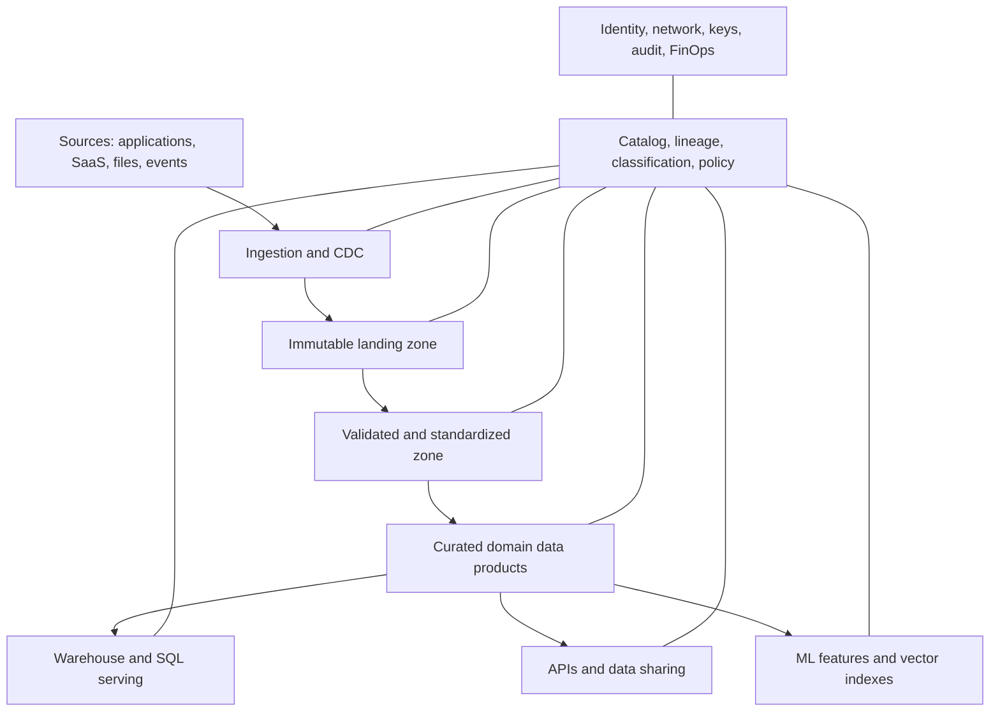
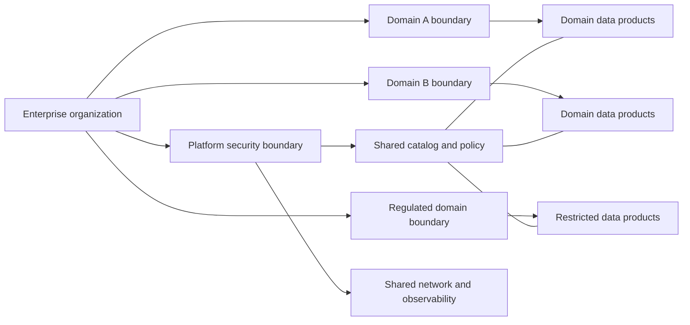
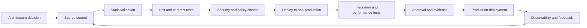

> **Document class:** Data, AI & Integration architecture reference model
> **Normative terms:** **MUST**, **MUST NOT**, **SHOULD**, **SHOULD NOT**, and **MAY** are requirements levels.
> **Applicability:** Enterprise data platforms across Azure, AWS, GCP, and OCI, including ingestion, storage, processing, governance, exchange, and AI consumption.
> **Exception process:** Deviations require a documented risk assessment, compensating controls, named risk owner, and expiry date.

| Control field | Value |
|---|---|
| Document ID | `DAI-01` |
| Owner | Cloud Center of Excellence |
| Review cycle | At least annually and after material platform, provider, data, security, or operating-model changes |
| Evidence | Architecture decision, platform configuration, security review, validation results, and operational readiness evidence |

# Governed Data Platform Architecture

> **Decision in brief:** Use a federated data platform with centralized guardrails and domain-owned products. Choose cloud-native services behind common contracts for governance, quality, and exchange.

## Purpose

This document defines the approved enterprise architecture for data platforms that ingest, store, transform, govern, share, and serve analytical and AI-ready data across Azure, AWS, GCP, and Oracle Cloud Infrastructure. It establishes a common control model while allowing cloud-native implementation choices.

The target is not a single central data warehouse and not an uncontrolled collection of domain lakes. The target is a federated platform with centralized guardrails, shared capabilities, and domain-owned data products.

## Scope

This standard covers batch and streaming ingestion, object storage, lakehouse and warehouse processing, metadata and lineage, master and reference data, data quality, semantic serving, data exchange, and AI consumption. Transactional application databases are covered in [DAI-03](./dai-sql-managed-instance-and-database-platform-patterns.md).

## Architectural Position

The enterprise SHOULD use a layered data architecture:

- **Source layer:** systems of record, SaaS platforms, partner feeds, devices, files, and external data.
- **Ingestion layer:** batch, change data capture, event streaming, API ingestion, and file transfer.
- **Storage layer:** immutable landing, validated or conformed data, and curated data products.
- **Processing layer:** SQL, Spark, stream processing, orchestration, and data quality.
- **Governance plane:** catalog, lineage, classification, policy, stewardship, and audit.
- **Serving layer:** warehouse, lakehouse SQL, APIs, data shares, semantic models, feature stores, and vector indexes.
- **Consumption layer:** BI, analytics, operational applications, ML, RAG, and external consumers.

## Core Principles

1. **Data products over unmanaged datasets.** A production dataset requires a contract, owner, quality objectives, schema lifecycle, access policy, and support model.
2. **Open formats at durable boundaries.** Use open table and file formats where portability matters. Proprietary acceleration layers are acceptable when the source of truth remains exportable.
3. **Separate storage from compute where practical.** This supports independent scaling, workload isolation, and lifecycle-based cost control.
4. **Immutable raw retention with controlled replay.** Preserve source fidelity where legally and economically justified.
5. **Policy enforcement close to the data.** Authorization must apply consistently across SQL, files, APIs, notebooks, ML, and AI retrieval.
6. **Metadata is part of the product.** Schemas, lineage, classifications, quality results, and business meaning are not optional documentation.
7. **Regionality is intentional.** Data placement must be based on residency, latency, resilience, and transfer-cost requirements.
8. **Domain autonomy within platform guardrails.** Domains can select approved engines and patterns but cannot bypass identity, encryption, observability, or governance controls.

## Data-Zone Standard

| Zone | Purpose | Mutability | Minimum controls |
|---|---|---:|---|
| Landing | Source-faithful ingestion and replay | Append-only | encryption, source metadata, checksum, retention |
| Quarantine | Invalid, suspicious, or policy-blocked data | Controlled | restricted access, issue reason, remediation workflow |
| Standardized | Typed, deduplicated, normalized data | Rebuildable | schema validation, quality rules, lineage |
| Curated | Business-conformed domain products | Versioned | product contract, SLA/SLO, stewardship, semantic definitions |
| Serving | Optimized projections for consumers | Rebuildable | workload isolation, access policy, freshness objectives |
| Archive | Low-cost long-term retention | Immutable | legal hold, lifecycle policy, restoration test |

## Multi-Cloud Capability Mapping

| Capability | Azure | AWS | GCP | OCI |
|---|---|---|---|---|
| Object storage | Azure Data Lake Storage / Blob Storage | Amazon S3 | Cloud Storage | OCI Object Storage |
| Catalog and governance | Microsoft Purview | AWS Glue Data Catalog and Lake Formation | Knowledge Catalog (formerly Dataplex Universal Catalog) | OCI Data Catalog and Data Safe capabilities |
| Warehouse | Azure Synapse Analytics or Fabric Warehouse | Amazon Redshift | BigQuery | Autonomous Data Warehouse |
| Lakehouse processing | Azure Databricks / Fabric Spark | Databricks / EMR | Databricks / Dataproc | OCI Data Flow / Autonomous AI Lakehouse |
| Streaming | Event Hubs | Kinesis / MSK | Pub/Sub | Streaming |
| Integration | Data Factory | Glue, DMS, AppFlow, Step Functions | Data Fusion, Dataflow, Datastream, Workflows | Data Integration, GoldenGate, Oracle Integration |
| BI and semantic | Power BI / Fabric | QuickSight | Looker | Oracle Analytics Cloud |

The mapping is functional, not a claim of feature equivalence. Product selection MUST be based on workload requirements, regional availability, security capabilities, interoperability, team competence, and total cost.

## Tenancy and Environment Model

The preferred model uses separate production and non-production security boundaries. Highly regulated or high-blast-radius domains SHOULD receive separate accounts, subscriptions, projects, or compartments. Shared platform services may be centralized only when tenant isolation, capacity, cost allocation, and operational ownership are proven.

## Data Contracts and Product Requirements

Every published data product MUST define:

- owner and steward;
- authoritative source and allowed uses;
- schema and semantic definitions;
- classification and residency;
- freshness, completeness, validity, uniqueness, and availability targets;
- compatibility and deprecation policy;
- consumer access method and entitlement model;
- lineage and transformation logic;
- incident, support, and escalation path;
- unit-cost and consumption metrics.

Schema changes MUST be classified as backward compatible, conditionally compatible, or breaking. Breaking changes require versioning, consumer impact analysis, migration guidance, and a deprecation window.

## Security Architecture

Data-plane access MUST use identity-based authorization. Network isolation is an additional control, not a substitute for authorization. Administrative control planes, data planes, and user development environments SHOULD be separated.

Required controls include private connectivity where supported, customer-managed keys where mandated, centralized secrets management, egress control, malware scanning for untrusted files, row/column filtering for sensitive data, dynamic masking where appropriate, and immutable audit export to a security-controlled destination.

## Reliability and Recovery

Data pipelines MUST be idempotent or safely replayable. Recovery objectives must distinguish between platform restoration, data rehydration, and business freshness. Backup alone is insufficient; restoration and replay must be tested.

Critical data products SHOULD have:

- documented RTO and RPO;
- multi-zone service deployment where available;
- cross-region copies only when justified by business requirements;
- source-to-target reconciliation;
- poison-message and quarantine handling;
- checkpointing for streaming workloads;
- capacity and quota alarms;
- runbooks for partial failure and delayed data.

## Observability and Service Management

The platform MUST capture pipeline status, row or event counts, latency, freshness, quality results, schema drift, access denials, query performance, storage growth, compute utilization, and unit cost. Technical metrics must be linked to product-level objectives.

Recommended SLOs include data availability, freshness delay, successful pipeline completion, quality-rule pass rate, query latency, recovery time, and percentage of assets with complete ownership and lineage.

## Cross-cutting governance requirements

The platform MUST treat data products, models, prompts, indexes, pipelines, and integration interfaces as governed assets. Each asset requires an accountable owner, classification, lifecycle state, approved consumers, lineage, retention rules, and operational objectives. Platform controls MUST be applied through policy-as-code and infrastructure-as-code rather than manual portal configuration.

Minimum governance controls are:

1. A business glossary and technical catalog with automated metadata harvesting.
2. Data classification at ingestion and reclassification after transformation.
3. End-to-end lineage from source through transformation, model or index, API, and consumer.
4. Segregation of duties between platform administration, data stewardship, development, and production operations.
5. Immutable audit logging for administrative actions and access to regulated data.
6. Explicit retention, archival, legal-hold, and deletion procedures.
7. Environment promotion with evidence, approval, and rollback capability.
8. Periodic access recertification and control-effectiveness reviews.

## Delivery and lifecycle standard

All deployable resources MUST be represented in version control. A compliant delivery flow is:

Production changes MUST use repeatable pipelines, short-lived workload identities, peer review, and auditable approvals. Emergency changes require the same evidence retrospectively and MUST not become a parallel operating model.

## Platform Service Catalog

The data platform SHOULD publish consumable capabilities rather than expose only raw cloud services. Typical catalog entries include ingestion, managed storage zones, transformation compute, stream processing, catalog registration, data-quality execution, product publication, data sharing, semantic serving, feature management, vector indexing, and recovery.

Each capability SHOULD document:

- supported workload and data classes;
- request inputs and generated outputs;
- identity, network, and key behavior;
- quotas, scale, regional availability, and cost unit;
- SLO, support, and recovery tier;
- versioning and deprecation;
- consumer responsibilities and prohibited use.

A platform service is incomplete when teams need undocumented administrator intervention to use it safely.

## Data Product Onboarding

Onboarding a product SHOULD be an automated transaction:

1. Allocate a stable product ID and owners.
2. Register purpose, sources, classification, residency, and retention.
3. Validate the contract and compatibility policy.
4. Provision approved storage, compute, identities, and network paths.
5. Configure quality rules, lineage, audit, cost, and alerts.
6. Deploy through non-production and run representative acceptance tests.
7. Publish access workflow, support, SLOs, and consumer documentation.
8. Record the production version and certification evidence.

The platform SHOULD also support suspension, ownership transfer, deprecation, and retirement. Product creation without lifecycle automation creates catalog and storage debt.

## Engine Placement and Workload Isolation

Select processing engines based on data shape, latency, concurrency, operational skill, and cost. Avoid sending every transformation to the most flexible engine.

| Workload | Typical engine characteristic |
|---|---|
| Lightweight orchestration and movement | managed integration service |
| Large SQL transformation | elastic warehouse or lakehouse SQL |
| Complex distributed transformation | Spark or equivalent distributed compute |
| Low-latency event processing | managed streaming engine |
| Transactional serving | managed relational or distributed database |
| Search and retrieval | purpose-built search or vector service |

Separate interactive, scheduled, BI, ML, and recovery workloads through compute pools, warehouses, queues, quotas, or accounts when one workload can impair another.

## Related topics

- [Data Products, Data Mesh, and Data Contract Guidelines](dai-data-products-data-mesh-and-data-contracts.md)
- [Enterprise Data Governance, Catalog, Lineage, and Quality Standard](dai-enterprise-data-governance-catalog-lineage-and-quality.md)
- [Azure Data Factory and Data Integration](dai-azure-data-factory-and-data-integration.md)
- [Data Platform Resilience, Backup, and Disaster Recovery Standard](dai-data-platform-resilience-backup-and-disaster-recovery.md)

## Anti-patterns
- Building a new data lake without catalog, ownership, or lifecycle controls.
- Copying every dataset into every cloud for theoretical portability.
- Using a warehouse, lake, or notebook workspace as a universal integration bus.
- Granting broad storage-account or bucket access instead of governed table, view, or product access.
- Treating bronze, silver, and gold labels as governance by themselves.
- Allowing direct production notebook changes without source control and promotion.
- Publishing data with undocumented semantics or no consumer contract.
- Replicating regulated data across regions without an approved residency analysis.

## Adoption Sequence

1. Establish organization, identity, network, key, logging, and cost-allocation foundations.
2. Deploy the catalog and define ownership, classification, and product templates.
3. Implement one representative batch product and one streaming product end to end.
4. Automate environment and pipeline deployment.
5. Add quality gates, lineage, observability, and operational SLOs.
6. Onboard domains through a documented product-vending process.
7. Measure adoption, control effectiveness, unit cost, and consumer outcomes.

## Validation

- [ ] Business owner, technical owner, data owner, and support owner are assigned.
- [ ] Data classification, residency, sovereignty, retention, and deletion requirements are documented.
- [ ] Identity uses federation or managed workload identity; no embedded credentials are permitted.
- [ ] Public network exposure is disabled unless a documented exception is approved.
- [ ] Encryption, key ownership, rotation, and break-glass procedures are defined.
- [ ] Availability, recovery, scalability, and capacity assumptions are tested.
- [ ] Logging, metrics, traces, lineage, and cost allocation are implemented before production.
- [ ] Deployment, rollback, backup restoration, and disaster-recovery procedures are exercised.
- [ ] Service limits, quotas, regional dependencies, and provider-specific constraints are recorded.
- [ ] Exit strategy and portability boundaries are explicit.

## References

- [Microsoft Azure Architecture Center: Data architectures](https://learn.microsoft.com/azure/architecture/data-guide/)
- [Azure Architecture Center: Medallion lakehouse with Data Factory](https://learn.microsoft.com/azure/architecture/databases/architecture/azure-data-factory-on-azure-landing-zones-index)
- [AWS Well-Architected Data Analytics Lens](https://docs.aws.amazon.com/wellarchitected/latest/analytics-lens/)
- [AWS Modern Data Architecture](https://docs.aws.amazon.com/wellarchitected/latest/analytics-lens/modern-data-architecture.html)
- [GCP Architecture Center](https://cloud.google.com/architecture)
- [GCP Knowledge Catalog](https://cloud.google.com/products/knowledge-catalog)
- [OCI Multicloud Data Lake Integration Architecture](https://docs.oracle.com/en/solutions/oci-multicloud-datalake/)
