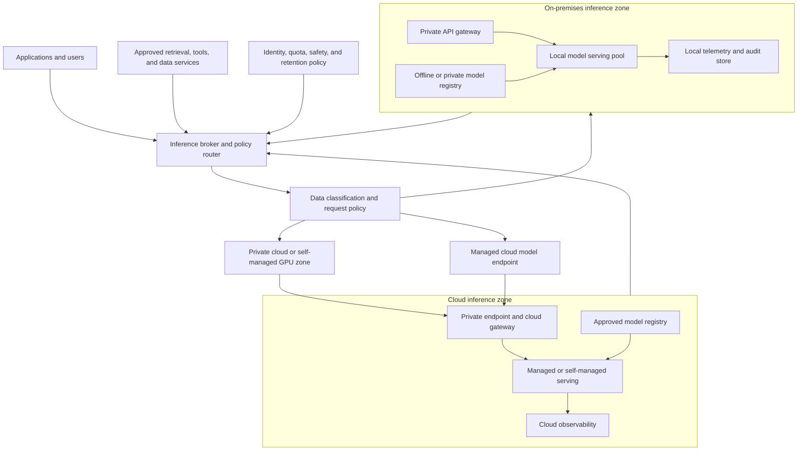

> **文档类型：**数据、AI 和集成架构参考模型
> **规范性术语：** **MUST**、**MUST NOT**、**SHOULD**、**SHOULD NOT** 和 **MAY** 是要求级别。
> **适用范围：** 在工作站、私有基础设施、公共云、托管 API 和混合代理上进行开放式和托管 LLM 的企业部署。
> **例外流程：** 偏离要求需要记录风险评估、补偿控制、指定风险负责人和到期日期。

|控制领域|价值|
|---|---|
|文件编号 | `DAI-22` |
|负责人|云卓越中心 |
|审核周期|至少每年一次，并且在重大平台、提供商、数据、安全或运营模式发生变化之后 |
|证据|布局决策、模型和数据审查、容量模型、安全审查、评估结果和运营就绪证据 |

# 本地和云端 LLM：完全控制与托管服务

> **决策简述：** 根据工作负载契约和权衡选择本地、私有云、云运营、托管或混合放置，而不是根据单一隐私或规模假设。

## 目的

本文提供了一个完整的架构和决策框架，用于在本地、私有基础设施、组织运营的云基础设施上或通过托管云 AI 服务部署大型语言模型 (LLM)。它是为企业架构师、AI 平台团队、安全和隐私专业人员以及运营领导者编写的，他们必须决定推理、模型制品、提示、检索数据和评估工作负载应在何处运行。

这个决定不仅仅是“本地隐私”与“云扩展”的问题。本地部署可以改善对网络路径和数据处理的控制，同时产生 GPU 采购、电源、冷却、驱动程序、模型分发、服务软件、补丁、容量、可用性和专家支持的义务。托管云服务可以减少基础设施运营，同时引入提供商依赖性、区域可用性限制、基于使用的成本、服务配额、数据处理条款以及对服务运行时的较少控制。

正确的设计可以是单个布局或组合：

- 针对高度敏感、断开连接、低延迟或可预测工作负载的本地推理；
- 私有云或托管 GPU 基础设施，提供专用容量和更强的网络控制；
- 托管模型 API，用于弹性通用功能和快速产品交付；
- 具有云原生治理的组织负责的模型的托管模型端点；和
- 混合代理，根据数据分类、质量、延迟、容量和策略路由每个请求。

该架构必须明确权衡，并保留更改放置的选项，而不会丢失模型、提示、评估、安全性和操作证据。

## 术语和重要区别

###开源、开放权重、商业模式服务

这些术语不可互换：

|术语 |意义|建筑寓意|
|---|---|---|
|开源软件 |代码可在定义使用、修改和分发权利的许可证下使用 |可以检查或重建服务堆栈，具体取决于其许可证和依赖项 |
|开放式重量模型|模型权重可根据模型特定条款获取 |权重可以下载和提供，但使用、重新分发、托管、安全或商业条款仍然应用 |
|可用源模型 |某些代码或重量有限制 |将许可证视为契约，而不是无限制使用的假设 |
|管理模型服务|提供商托管并操作模型端点 |组织使用 API，并且必须审查数据处理、保留、区域、配额和可用性条款 |
|自管理云推理 |组织在云计算上运行服务堆栈 |它保留了更多的运行时控制，但仍然取决于云硬件、网络、配额和提供商可用性 |

必须审查模型卡、许可证、可接受使用策略、标记器、安全指南和分发条款，以获取准确的模型修订版本。 “无需互联网连接即可运行”并不意味着“可以在没有许可证或安全控制的情况下使用”。将批准的许可证、模型标识符、修订版本、校验和与决策记录与模型发布一起存储。

### 推理放置

“本地”可以包括开发人员工作站、服务器机房、私有数据中心、断开连接的站点、并置 GPU 集群或私有 Kubernetes 集群。 “云”可以包括托管 API、托管在线端点、专用虚拟机、GPU 节点池或私有云服务。记录实际的控制边界，而不是单独使用位置标签。

## 决策维度

### 数据控制和驻留

评估整个数据路径，而不仅仅是提示正文：

- 用户提示和对话历史记录；
- 上传的文档、检索块、嵌入和向量索引；
- 工具参数和工具结果；
- 模型输入输出日志；
- 遥测、跟踪、错误消息和支持包；
- 模型权重、适配器、分词器和提示模板；
- 备份、快照、缓存、故障转储和临时文件；和
- 人类评估样本和红队制品。

本地部署可以简化数据路径控制，但不会自动提供加密、访问分离、保留、脱敏或安全删除。正确配置后，Cloud Deploy 可以提供强大的控制，但架构必须验证区域、数据处理术语、私有连接、提供商保留行为、日志记录默认值、支持访问和跨区域故障转移。

对每个资产进行分类并定义其允许的放置：

|资产|公众或低敏感度 |保密|限制或监管|
|---|---|---|---|
|提示|托管 API 或本地 |批准的私有端点或本地|本地/断开连接，除非例外情况获取批准 |
|检索内容 |带有控件的托管服务|私有网络和批准区域 |本地索引或受控私有服务|
|模型权重 |批准登记 |私有注册中心或托管模型服务 |受控注册表、静态加密、限制导出 |
|评估数据|外部测试装置|私有评估服务|本地评估飞地和准入审查|
|遥测|集中脱敏 |私有工作空间和保留|最小化本地证据加上控制摘要|

该表是一项起始策略，不能替代法律、监管或威胁模型审查。

### 质量和模型选择

放置并不决定模型质量。使用实际任务、语言、上下文、安全性、结构化输出、工具使用、延迟和成本要求来比较候选模型。对于受限任务，具有域检索和良好评估集的较小局部模型可以胜过较大的通用模型。

日志记录：

- 模型系列、尺寸、版本和许可证；
- 基本模型、指令调整、适配器、量化和分词器；
- 上下文窗口和最大输出；
- 支持的语言、模式和工具调用行为；
- 离线质量、安全性和稳健性结果；
- 量化或推测解码造成的质量损失；
- 故障模式和不安全用例；
- 模型、提示、检索、工具版本兼容性；和
- 退役、更换和回滚计划。

不要将本地量化模型与每秒仅使用令牌的云模型进行比较。包括任务质量、p95 延迟、并发性、每个有用结果的成本、失败率、人工纠正和数据处理风险。

### 成本和利用率

本地成本大多是固定的或基于容量的：

- GPU 和服务器购买或租用；
- 网络、机架、电力、冷却和设施成本；
- 存储、备份和高速本地数据移动；
- GPU 驱动、支持和硬件维护；
- 服务平台、可观测性和安全操作；
- 故障、升级和增长的备用容量；和
- 员工时间和专业技能。

云成本可能是可变的或保留的：

- 模型输入和输出令牌或请求；
- GPU 或端点运行时；
- 存储和模型传输；
- 网络出口和私有连接；
- 管理监控和安全服务；
- 微调、评估和批处理作业；和
- 提供商支持或预留容量。

计算工作负载预期寿命内的总拥有成本。对于本地硬件，将年度成本除以高效的加速器时间或有用的推理结果，而不是除以理论 GPU 时间。对于云服务，包括空闲最小容量、重试、长上下文、输出令牌、评估流量和数据出口。

### 延迟和容量

LLM 表现取决于：

- 首个令牌时间（TTFT）；
- 令牌间延迟（ITL）或输出令牌率；
- 提示长度和输出长度；
- 并发和排队；
- 批处理和调度程序行为；
- 模型精度和量化；
- GPU 内存和内存带宽；
- CPU 预处理、分词器和检索延迟；
- 工具和数据的网络路径；和
- 冷启动或模型加载时间。

使用特定于工作负载的配置文件定义服务目标：
```text
request_latency = queue_wait
                + admission_and_auth
                + retrieval_and_tool_time
                + model_prefill_time
                + model_decode_time
                + postprocess_time
```
进行基准测试时使用代表性提示和并发性。简短的提示基准可以隐藏长检索上下文的成本。单用户基准测试可以隐藏排队和 KV 缓存压力。

## 参考架构

在将敏感内容发送到目的地之前，代理必须做出放置决定。当首选目的地无法满足策略时，请求可能会被拒绝、脱敏、本地汇总或路由到能力较低的模型。

## 部署模式

### 模式 A：开发人员工作站或团队设备

此模式对于快速开发、离线配置文件开发、本地编码帮助和小型内部工具非常有用。 Ollama 或 llama.cpp 提供了一个简单的本地服务器；工作站或小型服务器提供 CPU、集成 GPU 或一个独立 GPU。

优点：

- 安装快速，平台开销低；
- 没有本地使用的远程提示路径；
- 对于早期评估和离线开发有用；和
- 简单的模型或量化实验。

风险：

- 模型和运行时版本不一致；
- 薄弱的身份、审计和补丁控制；
- 本地磁盘、缓存和日志暴露；
- 没有可靠的高可用性；
- 隐藏使用未经批准的模型；和
- 困难的支持和容量预测。

仅将此模式用于开发或明确分类的低风险工作负载。团队设备在超出实验范围之前需要托管更新、加密存储、访问控制、模型允许列表、本地 API 边界和记录在案的所有者。

### 模式 B：专用裸机推理服务器

私有服务器提供可预测的 GPU 容量、本地存储、网络隔离和稳定的服务堆栈。它应用于受监管或断开连接的环境、可预测的低延迟需求以及本地数据移动主导请求成本的工作负载。

设计必须包括：

- 需要时提供冗余电源和网络；
- GPU 和主机故障监控；
- 备用或更换策略；
- 驱动程序和固件生命周期；
- 模型存储和校验和验证；
- 安全启动、磁盘加密和受限管理；
- API 边界的 TLS 和身份验证；
- 队列、并发和速率限制；
- 配置备份，不一定只是模型缓存；和
- 可以在替换硬件上恢复端点的恢复过程。

vLLM 非常适合 GPU 支持的 OpenAI 兼容服务和连续批处理。 llama.cpp 对于 GGUF 量化模型、CPU 加 GPU 混合执行、广泛的硬件支持和小规模部署非常有用。 Ollama 针对开发人员和团队的简单性进行了优化。根据吞吐量、模型格式、硬件、多 GPU、API 和支持要求（而不是品牌偏好）选择运行时。

### 模式C：虚拟化 GPU 或私有云集群

虚拟化 GPU 可以提高硬件利用率和租户分离，但它们增加了虚拟机管理程序、驱动程序、许可证和性能注意事项。确认工作负载是否需要完全 GPU 访问、MIG 式分区、vGPU 或分时。模型服务延迟对内存带宽、PCIe 拓扑、NUMA 布局以及其他租户的干扰很敏感。
使用资源类和调度策略来分离交互式推理、批量评估、嵌入、微协调开发。建立最小和最大 GPU 分配、队列策略、优先级和噪声邻居响应。 GPU 共享不得破坏数据隔离或使延迟 SLO 无法解释。

### 模式 D：Kubernetes 推理平台

Kubernetes 提供调度、服务发现、部署、策略和多租户控制，但它不会自动使 GPU 推理变得简单。该平台需要：

- NVIDIA GPU Operator 或等效的设备管理层；
- 节点功能发现和兼容的驱动程序/运行时版本；
- 带有污点和标签的 GPU 节点池；
- 模型缓存或本地存储策略；
- 提供运行时服务，例如 vLLM、TGI 或 llama.cpp；
- KServe、Ray Serve 或其他需要的生命周期和路由层；
- 配额、优先级、拓扑和中断控制；
- 机密和模型注册表访问；
- GPU、队列、令牌和端点指标；和
- 保留容量的升级和耗尽行为。

当组织已经很好地运行 Kubernetes 并且需要多租户平台功能、可重复部署或多个推理服务时，请使用 Kubernetes。不要使用 Kubernetes 来隐藏容量模型、所有权或运营就绪的缺乏。

### 模式 E：气隙或断开推理

气隙部署需要制品供应链，而不仅仅是本地服务器。准备批准的迁移流程：

- 模型权重和分词器；
- 模型卡、许可证和可接受的使用条款；
- 容器镜像和 SBOM；
- Python、系统和 GPU 运行时依赖项；
- 舵图和清单；
- 漏洞和恶意软件扫描；
- 签名、校验和与来源证明；
- 评估套件和测试工具；和
- 离线文档和恢复包。

断开连接的环境必须具有本地注册表、包镜像、时间源、证书颁发机构、身份源、遥测接收器和补丁进程。如果服务堆栈依赖于在启动时下载代码或权重，则模型不能被视为可部署。

## Cloud Deploy 模式

### 托管模型 API

当提供商提供合适的模型和合规性状态时，托管 API 是实现生产级能力的最快途径。应用通过批准的网关调用提供商端点，并提供身份、配额、安全配置、记录策略和成本归因。

该架构必须记录：

- 数据处理和保留条款；
- 端点区域和故障转移区域；
- 私有连接和出口控制；
- 模型和 API 版本策略；
- 提供商配额和速率限制行为；
- 提示、输出和工具日志配置；
- 内容安全和滥用监控；
- 提供商事件和支持流程；和
- 可移植性或后备计划。

托管 API 减少了基础设施责任，而不是应用责任。应用仍然需要超时、重试、幂等性、输出验证、提示版本控制、质量评估和用户影响监控。

### 组织负责的模型的托管在线端点
此模式为团队提供了托管运行时、扩展、端点身份、日志记录和部署抽象，同时保留对模型制品和推理代码的更多控制。当模型需要自定义预处理、私有网络或模型注册表工作流程时，它非常有用。

对金丝雀和蓝/绿流量使用端点部署或修订。在更改部署版本时保持端点 URI 稳定。可用性和升级的实例大小计数，而不仅仅是平均流量。采集部署日志、模型加载时间、准备情况、CPU/GPU/内存、请求指标和质量信号。

### 自管理云 GPU

此模式在云 GPU VM 或 Kubernetes 上运行 vLLM、TGI、llama.cpp、Ollama、Triton、KServe 或其他堆栈。当模型或运行时不能作为托管服务使用时，或者当团队需要精确的服务行为时，它是合适的。

云自我管理仍然需要镜像强化、驱动程序兼容性、模型制品控制、私有网络、身份、日志、自动扩缩容、配额管理、修补、备份和容量规划。仅当需求和模型生命周期证明合理时才使用保留或承诺的容量；否则，保持明确的缩减或关闭策略。

## 硬件和内存大小

### 模型权重

从粗略的重量估计开始：
```text
weight_memory ≈ parameter_count × bytes_per_parameter
```
对于 BF16 或 FP16，典型的未压缩值约为每个参数 2 个字节；对于 FP32，每个参数约为 4 个字节。量化格式使用更少的位，但包括元数据和特定于运行时的开销。 7B 模型在量化时可能适合几 GB，但总服务要求还包括 KV 缓存、激活、框架开销、分词器、CUDA 工作区、批处理和操作系统。

### KV 缓存和上下文

长上下文和并行请求可能比模型权重占用更多的内存。内存规划必须包括：

- 最大提示和输出令牌；
- 并发序列数；
- KV cache 精度；
- 前缀缓存行为；
- 批量调度程序；
- 推测性解码或适配器；和
- 检索和工具有效负载大小。

使用基准测试工具来确定确切模型和运行时的安全并发性。不要因为一个请求需要一个大窗口而全局增加上下文长度；提供单独的端点或强制执行每个请求的预算。

### 硬件配置文件

将仅包含 CPU 的主机用于小型量化模型、离线批处理或断开连接的回退。单个 16-24 GB GPU 对于许多 3B-8B 量化模型来说是实用的开发和小团队配置。当保留 KV 缓存空间时，48-80 GB GPU 支持更大的上下文或并发。多 GPU 和多节点服务需要经过验证的互连、分布式运行时、调度程序和故障行为。这些是规划配置文件，而不是保证：模型架构、量化、分词器、上下文和运行时版本可以极大地改变结果。

## 安全架构

### 网络

仅通过经过身份验证的网关公开模型服务器。服务进程应绑定到私有接口，在网关或服务网格边界使用 TLS，并将出口限制到批准的注册表、遥测、检索存储和工具。

对于本地部署：

- 将推理服务器放置在专用 Security Zones；
- 将模型管理与应用调用分开；
- 限制租户之间东西向流量；
- 阻止来自用户网络的模型服务管理端口；
- 使用私有注册表和包镜像；
- 通过即时访问保护管理界面；和
- 定义离线安全更新的路径。

对于 Cloud Deploy，当数据分类需要时使用私有端点或私有网络。私有端点不会自动保护应用；身份、授权、日志、DNS、出口和端点策略仍必须配置。

### 身份和授权

分开：

1.模型注册表读取并发布；
2.服务部署管理；
3.端点调用；
4、及时遥测调查；
5.评估数据获取；和
6. GPU 主机或集群管理。

使用工作负载身份、服务账户、托管身份或短期令牌。模型端点应强制执行租户、项目、模型、令牌、请求率和并发配额。不要跨应用共享一个管理员 API 密钥。

### 供应链

将模型文件视为与可执行文件相邻的制品。验证：

- 来源和模型卡来源证明；
- 许可和可接受的使用条款；
- 校验和或摘要；
- 安全张量或支持的模型格式；
- 嵌入式或自定义代码要求；
- 分词器和配置兼容性；
- 容器、Python、系统和驱动程序依赖项；
- 漏洞和恶意软件扫描；和
- 支持的签名或证明。

避免默认启用任意远程代码。如果模型需要自定义代码，请对其进行审查，固定修订版，扫描依赖项，然后在受限的构建和服务环境中运行它。

## 可观测性和评估

每个推理请求都应该可追溯到模型发布、端点修订、提示或系统策略、检索索引和消费者。采集：

- 请求计数、成功、错误、超时和取消；
- TTFT、输出令牌率、总延迟和队列等待；
- 输入和输出令牌计数或有效负载大小；
- 批量大小、并发性、缓存命中和准入拒绝；
- GPU 内存、利用率、功率、温度和节流；
- 模型负载、冷启动和准备时间；
- 检索、工具、网关和安全依赖延迟；
- 成本或能源归属；和
- 质量、安全、模式和用户结果信号采样。

默认情况下不记录原始提示或输出。使用脱敏、抽样、数据分类、保留、访问控制和明确的评估同意。生产质量监控应包括任务成功、grounding、拒绝、模式遵守、安全、人为纠正和偏差（如果适用）。

## 可用性和恢复

定义每个放置的故障域：

|失败|本地响应 |云响应 |
|---|---|---|
|进程崩溃| Supervisor 或 Orchestrator 重启 |端点或 Pod 重启 |
| GPU 故障 |耗尽主机、无法备用、恢复服务 |更换虚拟机/节点或迁移流量 |
|模型制品损坏|验证摘要并恢复本地注册表副本 |从批准的注册表或之前的部署中提取 |
|注册表中断 |使用缓存的批准制品 |使用区域或私有镜像 |
|网络隔离|只提供本地模式或安全降级 |私有端点或区域后备|
|容量耗尽|根据策略排队、棚屋或路由 |自动扩缩容、配额增加或托管后备 |
|糟糕的模型发布 |恢复之前的端点修订版 |将流量迁移到之前的部署 |

备份配置、清单、策略、模型元数据、评估结果和注册表索引。对于断开连接或受监管的环境，在事件发生后从公共中心重建权重并不是可接受的恢复计划。

## 混合路由和回退

混合消息代理可以根据以下因素进行路由：

- 数据分类；
- 所需的模型或工具能力；
- 地理位置和驻留；
- 延迟和可用性；
- 本地容量和排队年龄；
- 用户或租户策略；
- 成本预算；和
- 同意外部处理。

后备必须是策略安全的。如果受限请求无法在本地得到服务，则拒绝或提供本地降级响应；不要默默地将其发送到云 API。对于低敏感度请求，在身份验证和配额检查后可能允许云回退。记录路由决策而不暴露内容。

## 实施路线图
### 第 1 阶段：受监管的评估

创建模型目录、许可证审查、评估集、安全边界和基准测试工具。在本地运行一个小型模型，并通过批准的网关运行一个托管模型。比较质量、延迟、成本、数据处理和操作员工作负载。

### 第 2 阶段：受控飞行员

选择低风险的内部用例。部署私有端点、强制执行身份验证和配额、使用模型白名单、集成遥测并运行故障演习。建立服务所有者和支持路径。

### 第三阶段：生产基础

添加镜像和模型供应链控制、HA 或备用容量、备份、修补、事件响应、发布升级、漂移检测、容量预测和质量运营。发布支持的服务堆栈和硬件配置文件。

### 第 4 阶段：投资组合路由

仅当本地和云路径具有独立的 SLO、质量门、数据策略和证据后，才能引入混合路由。使用策略引擎而不是分散在消费者之间的特定于应用的路由逻辑。

## 反模式

- 在共享服务器上运行未经批准的模型，因为它是“本地的”。
- 将开放重量许可视为无限制的商业许可。
- 在生产启动时下载模型或代码，而不是使用经过验证的制品。
- 将推理端口直接暴露给用户或公司网络。
- 仅针对模型权重调整大小，而忽略 KV 缓存、并发性和故障余量。
- 将受限提示发送到云后备或默认遥测存储。
- 在没有评估、回滚、所有权和支持证据的情况下推出模型。
- 在组织可以安全运行服务和 GPU 堆栈之前安装 Kubernetes。
- 假设托管服务消除了重试、输出验证、质量监控或成本控制。

## 验证

- [ ] 根据数据、质量、延迟、成本、规模和控制要求来选择每个工作负载的布局。
- [ ] 准确记录在案的模型修订、许可证、模型卡、标记器和可接受的使用条款。
- [ ] 模型和运行时制品可在需要时进行验证、扫描和离线恢复。
- [ ] GPU、CPU、内存、KV cache、并发、存储和网络容量进行基准测试。
- [ ] 端点访问由租户或工作负载进行身份验证、授权、速率限制和隔离。
- [ ] 敏感数据无法通过回退或遥测到达未经批准的云路径。
- [ ] 服务运行时和模型版本通过批准的发布流程进行升级。
- [ ] 指标包括 TTFT、输出速率、队列、错误、GPU 运行状况、成本和质量信号。
- [ ] 模型、提示、检索、端点回滚已经过测试。
- [ ] 补丁、漏洞、备份、事件和恢复操作均已明确负责人并纳入计划。
- [ ] 使用高效工作负载结果对本地和云 TCO 进行比较。

## 操作注意事项
AI 平台团队负责服务标准、模型目录、运行时镜像、注册表、身份、端点策略、可观测性和容量指导。模型所有者负责评估、模型风险、限制和报废权。应用所有者负责请求行为、用户结果、数据最小化和消费者 SLO。安全、隐私、法律和 FinOps 团队审查各自的风险和成本。

在模型大小、上下文、流量、数据分类、法规、硬件、提供商条款、质量或运营成本发生重大变化后审查放置情况。保留决策记录，说明工作负载为何是本地、云或混合，以及何时应重新审视该决策。

## 相关主题

- [AI 模型服务、推理和端点架构](dai-ai-model-serving-inference-and-endpoint-architecture.md)
- [数据和 AI 可观测性、评估和质量运营](dai-data-and-ai-observability-evaluation-and-quality-operations.md)
- [Azure OpenAI 平台架构](dai-azure-openai-platform-architecture.md)
- [企业 MLOps 平台和模型生命周期架构](dai-enterprise-mlops-platform-and-model-lifecycle.md)
- [AI 应用的生产运营](dai-production-operations-for-ai-applications.md)
- [为 Azure 和混合服务器构建企业 Ansible 自动化平台](../hands-on-lab/build-enterprise-ansible-automation-platform-for-azure-and-hybrid-servers.md)
- [Kubernetes 工作负载调度、配额和容量规划](../applications-kubernetes/app-kubernetes-workload-scheduling-quotas-and-capacity-planning.md)

## 参考文档

- [vLLM OpenAI 兼容服务器](https://docs.vllm.ai/en/latest/serving/online_serving/openai_compatible_server/)
- [vLLM Docker 部署](https://docs.vllm.ai/en/latest/deployment/docker/)
- [vLLM 数据并行部署](https://docs.vllm.ai/en/stable/serving/data_parallel_deployment/)
- [文本生成推理架构](https://huggingface.co/docs/text-generation-inference/main/architecture)
- [llama.cpp 服务器](https://github.com/ggml-org/llama.cpp/blob/master/tools/server/README.md)
- [llama.cpp 支持后端和量化](https://github.com/ggml-org/llama.cpp)
- [Ollama REST API 和本地部署](https://github.com/ollama/ollama)
- [KServe 模型服务平台](https://kserve.github.io/website/)
- [NVIDIA GPU Operator](https://docs.nvidia.com/datacenter/cloud-native/gpu-operator/latest/)
- [Azure Machine Learning 在线端点](https://learn.microsoft.com/en-us/azure/machine-learning/how-to-deploy-online-endpoints?view=azureml-api-2)
