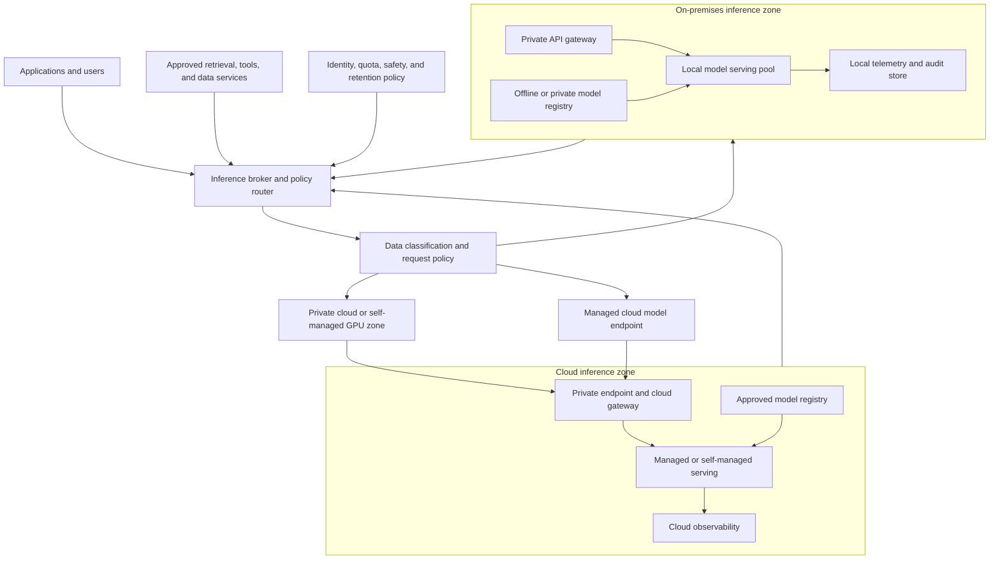

> **Document class:** Data, AI & Integration architecture reference model
> **Normative terms:** **MUST**, **MUST NOT**, **SHOULD**, **SHOULD NOT**, and **MAY** are requirements levels.
> **Applicability:** Enterprise deployment of open-weight and managed LLMs on workstations, private infrastructure, public cloud, managed APIs, and hybrid brokers.
> **Exception process:** Deviations require a documented risk assessment, compensating controls, named risk owner, and expiry date.

| Control field | Value |
|---|---|
| Document ID | `DAI-22` |
| Owner | Cloud Center of Excellence |
| Review cycle | At least annually and after material platform, provider, data, security, or operating-model changes |
| Evidence | Placement decision, model and data review, capacity model, security review, evaluation results, and operational readiness evidence |

# LLMs On-Premises and in the Cloud: Full Control vs. Managed Services

> **Decision in brief:** Choose local, private-cloud, cloud-operated, managed, or hybrid placement from the workload contract and tradeoffs, not from a single privacy or scale assumption.

## Purpose

This article provides a complete architecture and decision framework for deploying large language models (LLMs) locally, on private infrastructure, on cloud infrastructure that the organization operates, or through a managed cloud AI service. It is written for enterprise architects, AI platform teams, security and privacy professionals, and operations leaders who must decide where inference, model artifacts, prompts, retrieval data, and evaluation workloads should run.

The decision is not simply “on-premises for privacy” versus “cloud for scale.” A local deployment may improve control over network paths and data handling while creating obligations for GPU procurement, power, cooling, drivers, model distribution, serving software, patching, capacity, availability, and specialist support. A managed cloud service may reduce infrastructure operations while introducing provider dependency, regional availability constraints, usage-based cost, service quotas, data-processing terms, and less control over the serving runtime.

The correct design can be a single placement or a portfolio:

- local inference for highly sensitive, disconnected, low-latency, or predictable workloads;
- private cloud or colocated GPU infrastructure for dedicated capacity and stronger network control;
- managed model APIs for elastic general-purpose capabilities and fast product delivery;
- managed model endpoints for organization-owned models with cloud-native governance; and
- a hybrid broker that routes each request according to data classification, quality, latency, capacity, and policy.

The architecture must make the tradeoff explicit and preserve the option to change placement without losing model, prompt, evaluation, security, and operational evidence.

## Terminology and important distinctions

### Open source, open weight, and commercial model services

These terms are not interchangeable:

| Term | Meaning | Architecture implication |
|---|---|---|
| Open-source software | Code is available under a license that defines use, modification, and distribution rights | Serving stack can be inspected or rebuilt, subject to its license and dependencies |
| Open-weight model | Model weights are available under model-specific terms | Weights may be downloaded and served, but use, redistribution, hosting, safety, or commercial terms still apply |
| Source-available model | Some code or weights are available with restrictions | Treat the license as a contract, not as an assumption of unrestricted use |
| Managed model service | Provider hosts and operates the model endpoint | The organization consumes an API and must review data processing, retention, region, quota, and availability terms |
| Self-managed cloud inference | Organization operates the serving stack on cloud compute | It retains more runtime control but still depends on cloud hardware, network, quotas, and provider availability |

The model card, license, acceptable-use policy, tokenizer, safety guidance, and distribution terms must be reviewed for the exact model revision. “Runs without an internet connection” does not mean “may be used without license or safety controls.” Store the approved license, model identifier, revision, checksum, and decision record with the model release.

### Inference placement

“On-premises” can include a developer workstation, a server room, a private datacenter, a disconnected site, a colocated GPU cluster, or a private Kubernetes cluster. “Cloud” can include a managed API, a managed online endpoint, a dedicated virtual machine, a GPU node pool, or a private cloud service. Document the actual control boundary rather than using a location label alone.

## Decision dimensions

### Data control and residency

Evaluate the entire data path, not only the prompt body:

- user prompt and conversation history;
- uploaded documents, retrieval chunks, embeddings, and vector indexes;
- tool parameters and tool results;
- model input and output logs;
- telemetry, traces, error messages, and support bundles;
- model weights, adapters, tokenizer, and prompt templates;
- backups, snapshots, caches, crash dumps, and temporary files; and
- human evaluation samples and red-team artifacts.

Local deployment can simplify data-path control but does not automatically provide encryption, access separation, retention, redaction, or secure deletion. Cloud deployment can provide strong controls when configured correctly, but the architecture must validate region, data-processing terms, private connectivity, provider retention behavior, logging defaults, support access, and cross-region failover.

Classify each asset and define its allowed placement:

| Asset | Public or low sensitivity | Confidential | Restricted or regulated |
|---|---|---|---|
| Prompt | Managed API or local | Approved private endpoint or local | Local/disconnected unless exception is approved |
| Retrieval content | Managed service with controls | Private network and approved region | Local index or controlled private service |
| Model weights | Approved registry | Private registry or managed model service | Controlled registry, encrypted at rest, restricted export |
| Evaluation data | External test set | Private evaluation service | Local evaluation enclave and access review |
| Telemetry | Centralized with redaction | Private workspace and retention | Minimized local evidence plus controlled summary |

The table is a starting policy, not a substitute for legal, regulatory, or threat-model review.

### Quality and model choice

Placement does not determine model quality. Compare model candidates using the actual task, language, context, safety, structured-output, tool-use, latency, and cost requirements. A smaller local model with domain retrieval and a good evaluation set can outperform a larger general-purpose model for a constrained task.

Record:

- model family, size, revision, and license;
- base model, instruction tuning, adapter, quantization, and tokenizer;
- context window and maximum output;
- supported languages, modalities, and tool-calling behavior;
- offline quality, safety, and robustness results;
- quality loss from quantization or speculative decoding;
- failure modes and unsafe-use cases;
- model, prompt, retrieval, and tool version compatibility; and
- retirement, replacement, and rollback plan.

Do not compare a local quantized model with a cloud model using only tokens per second. Include task quality, p95 latency, concurrency, cost per useful outcome, failure rate, human correction, and data-handling risk.

### Cost and utilization

On-premises costs are mostly fixed or capacity-based:

- GPU and server acquisition or lease;
- network, rack, power, cooling, and facility cost;
- storage, backup, and high-speed local data movement;
- GPU driver, support, and hardware maintenance;
- serving platform, observability, and security operations;
- spare capacity for failure, upgrades, and growth; and
- staff time and specialist skills.

Cloud costs may be variable or reserved:

- model input and output tokens or requests;
- GPU or endpoint runtime;
- storage and model transfer;
- network egress and private connectivity;
- managed monitoring and security services;
- fine-tuning, evaluation, and batch jobs; and
- provider support or reserved capacity.

Calculate total cost of ownership over the expected life of the workload. For local hardware, divide the annual cost by productive accelerator hours or useful inference outcomes, not by theoretical GPU hours. For cloud services, include idle minimum capacity, retries, long contexts, output tokens, evaluation traffic, and data egress.

### Latency and capacity

LLM performance depends on:

- time to first token (TTFT);
- inter-token latency (ITL) or output token rate;
- prompt length and output length;
- concurrency and queueing;
- batching and scheduler behavior;
- model precision and quantization;
- GPU memory and memory bandwidth;
- CPU preprocessing, tokenizer, and retrieval latency;
- network path to tools and data; and
- cold-start or model-load time.

Define the service target with a workload-specific profile:

```text
request_latency = queue_wait
                + admission_and_auth
                + retrieval_and_tool_time
                + model_prefill_time
                + model_decode_time
                + postprocess_time
```

Use representative prompts and concurrency when benchmarking. A short prompt benchmark can hide the cost of long retrieval context. A single-user benchmark can hide queueing and KV-cache pressure.

## Reference architecture



The broker must make a placement decision before sensitive content is sent to a destination. A request may be rejected, redacted, summarized locally, or routed to a lower-capability model when the preferred destination cannot satisfy the policy.

## Deployment patterns

### Pattern A: Developer workstation or team appliance

This pattern is useful for prompt development, offline prototyping, local coding assistance, and small internal tools. Ollama or llama.cpp provides a simple local server; a workstation or small server provides CPU, integrated GPU, or one discrete GPU.

Advantages:

- fast installation and low platform overhead;
- no remote prompt path for local use;
- useful for early evaluation and disconnected development; and
- easy model or quantization experimentation.

Risks:

- inconsistent model and runtime versions;
- weak identity, audit, and patch control;
- local disk, cache, and log exposure;
- no reliable high availability;
- hidden use of unapproved models; and
- difficult support and capacity forecasting.

Use this pattern only for development or explicitly classified low-risk workloads. A team appliance needs managed updates, encrypted storage, access control, a model allowlist, a local API boundary, and a documented owner before it is used beyond experimentation.

### Pattern B: Dedicated bare-metal inference server

A dedicated server provides predictable GPU capacity, local storage, network isolation, and a stable serving stack. It is appropriate for regulated or disconnected environments, predictable low-latency demand, and workloads where local data movement dominates request cost.

The design must include:

- redundant power and network where required;
- GPU and host failure monitoring;
- spare or replacement strategy;
- driver and firmware lifecycle;
- model storage and checksum verification;
- secure boot, disk encryption, and restricted administration;
- TLS and authentication at the API boundary;
- queue, concurrency, and rate limits;
- backup of configuration, not necessarily model caches only; and
- a recovery process that can restore the endpoint on replacement hardware.

vLLM is a strong fit for GPU-backed OpenAI-compatible serving and continuous batching. llama.cpp is useful for GGUF quantized models, CPU plus GPU hybrid execution, broad hardware support, and small-footprint deployments. Ollama optimizes for developer and team simplicity. Choose the runtime based on throughput, model format, hardware, multi-GPU, API, and support requirements rather than brand preference.

### Pattern C: Virtualized GPU or private cloud cluster

Virtualized GPUs can improve hardware utilization and tenant separation, but they add hypervisor, driver, license, and performance considerations. Confirm whether the workload needs full GPU access, MIG-style partitioning, vGPU, or time sharing. Model-serving latency is sensitive to memory bandwidth, PCIe topology, NUMA placement, and interference from other tenants.

Use resource classes and scheduling policy to separate interactive inference, batch evaluation, embedding, fine-tuning, and development. Establish minimum and maximum GPU allocations, queue policy, priority, and a noisy-neighbor response. GPU sharing must not defeat data isolation or make latency SLOs impossible to explain.

### Pattern D: Kubernetes inference platform

Kubernetes provides scheduling, service discovery, rollout, policy, and multi-tenant controls, but it does not automatically make GPU inference simple. The platform needs:

- NVIDIA GPU Operator or an equivalent device-management layer;
- node feature discovery and compatible driver/runtime versions;
- GPU node pools with taints and labels;
- model cache or local storage strategy;
- serving runtime such as vLLM, TGI, or llama.cpp;
- KServe, Ray Serve, or another lifecycle and routing layer where needed;
- quota, priority, topology, and disruption controls;
- secrets and model registry access;
- GPU, queue, token, and endpoint metrics; and
- upgrade and drain behavior that preserves capacity.

Use Kubernetes when the organization already operates it well and needs multi-tenant platform features, repeatable deployment, or multiple inference services. Do not use Kubernetes to hide a lack of capacity model, ownership, or operational readiness.

### Pattern E: Air-gapped or disconnected inference

An air-gapped deployment requires an artifact supply chain, not just a local server. Prepare an approved transfer process for:

- model weights and tokenizer;
- model card, license, and acceptable-use terms;
- container images and SBOMs;
- Python, system, and GPU runtime dependencies;
- Helm charts and manifests;
- vulnerability and malware scans;
- signatures, checksums, and provenance attestations;
- evaluation sets and test harnesses; and
- offline documentation and recovery packages.

The disconnected environment must have a local registry, package mirror, time source, certificate authority, identity source, telemetry sink, and patch process. A model cannot be considered deployable if the serving stack depends on downloading code or weights at startup.

## Cloud deployment patterns

### Managed model API

A managed API is the fastest path to a production capability when the provider offers a suitable model and compliance posture. The application calls a provider endpoint through an approved gateway, with identity, quotas, safety configuration, logging policy, and cost attribution.

The architecture must document:

- data processing and retention terms;
- endpoint region and failover region;
- private connectivity and egress controls;
- model and API version policy;
- provider quota and rate-limit behavior;
- prompt, output, and tool logging configuration;
- content-safety and abuse monitoring;
- provider incident and support process; and
- portability or fallback plan.

Managed APIs reduce infrastructure responsibility, not application responsibility. The application still needs timeouts, retries, idempotency, output validation, prompt versioning, quality evaluation, and user-impact monitoring.

### Managed online endpoint for an organization-owned model

This pattern gives the team a managed runtime, scaling, endpoint identity, logging, and deployment abstraction while retaining more control over the model artifact and inference code. It is useful when a model requires custom preprocessing, private networking, or a model registry workflow.

Use endpoint deployments or revisions for canary and blue/green traffic. Keep the endpoint URI stable while changing the deployment version. Size instance count for availability and upgrades, not only average traffic. Capture deployment logs, model load time, readiness, CPU/GPU/memory, request metrics, and quality signals.

### Self-managed cloud GPU

This pattern runs vLLM, TGI, llama.cpp, Ollama, Triton, KServe, or another stack on cloud GPU VMs or Kubernetes. It is appropriate when the model or runtime is not available as a managed service, or when the team needs exact serving behavior.

Cloud self-management still requires image hardening, driver compatibility, model artifact control, private networking, identity, logging, autoscaling, quota management, patching, backup, and capacity planning. Use reserved or committed capacity only when demand and model lifecycle justify it; otherwise keep an explicit scale-down or shutdown strategy.

## Hardware and memory sizing

### Model weights

Start with a rough weight estimate:

```text
weight_memory ≈ parameter_count × bytes_per_parameter
```

Typical uncompressed values are approximately 2 bytes per parameter for BF16 or FP16 and 4 bytes per parameter for FP32. Quantized formats use fewer bits but include metadata and runtime-specific overhead. A 7B model may fit in several gigabytes when quantized, but the total serving requirement also includes KV cache, activations, framework overhead, tokenizer, CUDA workspace, batching, and the operating system.

### KV cache and context

Long contexts and parallel requests can consume more memory than the model weights. Memory planning must include:

- maximum prompt and output tokens;
- number of concurrent sequences;
- KV-cache precision;
- prefix caching behavior;
- batch scheduler;
- speculative decoding or adapters; and
- retrieval and tool payload size.

Use a benchmark harness to determine the safe concurrency for the exact model and runtime. Do not increase context length globally because one request needs a large window; provide a separate endpoint or enforce per-request budgets.

### Hardware profiles

Use a CPU-only host for small quantized models, offline batch, or a disconnected fallback. A single 16–24 GB GPU is a practical development and small-team profile for many 3B–8B quantized models. A 48–80 GB GPU supports larger context or concurrency when KV-cache headroom is reserved. Multi-GPU and multi-node serving require validated interconnect, distributed-runtime, scheduler, and failure behavior. These are planning profiles, not guarantees: model architecture, quantization, tokenizer, context, and runtime version can materially change the result.

## Security architecture

### Network

Expose the model server only through an authenticated gateway. The serving process should bind to a private interface, use TLS at the gateway or service mesh boundary, and restrict egress to approved registries, telemetry, retrieval stores, and tools.

For on-premises deployments:

- place inference servers in a dedicated security zone;
- separate model administration from application invocation;
- restrict east-west traffic between tenants;
- block model-serving admin ports from user networks;
- use private registry and package mirrors;
- protect management interfaces with just-in-time access; and
- define the path for offline security updates.

For cloud deployments, use private endpoints or private networking when the data classification requires it. A private endpoint does not automatically secure the application; identity, authorization, logging, DNS, egress, and endpoint policy must still be configured.

### Identity and authorization

Separate:

1. model registry read and publish;
2. serving deployment administration;
3. endpoint invocation;
4. prompt and telemetry investigation;
5. evaluation data access; and
6. GPU host or cluster administration.

Use workload identity, service accounts, managed identity, or short-lived tokens. Model endpoints should enforce tenant, project, model, token, request-rate, and concurrency quotas. Do not share one administrator API key across applications.

### Supply chain

Treat model files as executable-adjacent artifacts. Verify:

- source and model-card provenance;
- license and acceptable-use terms;
- checksum or digest;
- safe tensor or supported model format;
- embedded or custom code requirements;
- tokenizer and configuration compatibility;
- container, Python, system, and driver dependencies;
- vulnerability and malware scans; and
- signature or attestation where supported.

Avoid enabling arbitrary remote code by default. If a model requires custom code, review it, pin the revision, scan dependencies, and run it in a constrained build and serving environment.

## Observability and evaluation

Every inference request should be traceable to a model release, endpoint revision, prompt or system policy, retrieval index, and consumer. Capture:

- request count, success, error, timeout, and cancellation;
- TTFT, output token rate, total latency, and queue wait;
- input and output token counts or payload sizes;
- batch size, concurrency, cache hit, and admission rejection;
- GPU memory, utilization, power, temperature, and throttling;
- model load, cold start, and readiness time;
- retrieval, tool, gateway, and safety dependency latency;
- cost or energy attribution; and
- sampled quality, safety, schema, and user-outcome signals.

Do not log raw prompts or outputs by default. Use redaction, sampling, data classification, retention, access control, and explicit evaluation consent. Production quality monitoring should include task success, groundedness, refusal, schema adherence, safety, human correction, and drift where applicable.

## Availability and recovery

Define the failure domain for each placement:

| Failure | Local response | Cloud response |
|---|---|---|
| Process crash | Supervisor or orchestrator restart | Endpoint or pod restart |
| GPU failure | Drain host, fail to spare, restore service | Replace VM/node or shift traffic |
| Model artifact corruption | Verify digest and restore local registry copy | Pull from approved registry or prior deployment |
| Registry outage | Use cached approved artifact | Use regional or private mirror |
| Network isolation | Serve local-only mode or safe degradation | Private endpoint or regional fallback |
| Capacity exhaustion | Queue, shed, or route according to policy | Autoscale, quota increase, or managed fallback |
| Bad model release | Restore prior endpoint revision | Shift traffic to prior deployment |

Back up configuration, manifests, policy, model metadata, evaluation results, and registry indexes. Rebuilding weights from a public hub after an incident is not an acceptable recovery plan for a disconnected or regulated environment.

## Hybrid routing and fallback

A hybrid broker may route based on:

- data classification;
- required model or tool capability;
- geography and residency;
- latency and availability;
- local capacity and queue age;
- user or tenant policy;
- cost budget; and
- consent for external processing.

Fallback must be policy-safe. If a restricted request cannot be served locally, reject or provide a local degraded response; do not silently send it to a cloud API. For low-sensitivity requests, a cloud fallback may be allowed after authentication and quota checks. Log the routing decision without exposing the content.

## Implementation roadmap

### Phase 1: Governed evaluation

Create a model catalog, license review, evaluation set, security boundary, and benchmark harness. Run one small model locally and one managed model through an approved gateway. Compare quality, latency, cost, data handling, and operator effort.

### Phase 2: Controlled pilot

Select a low-risk internal use case. Deploy a private endpoint, enforce authentication and quotas, use a model allowlist, integrate telemetry, and run a failure drill. Establish a service owner and a support path.

### Phase 3: Production foundation

Add image and model supply-chain controls, HA or spare capacity, backup, patching, incident response, release promotion, drift detection, capacity forecasts, and quality operations. Publish supported serving stacks and hardware profiles.

### Phase 4: Portfolio routing

Introduce hybrid routing only after local and cloud paths have independent SLOs, quality gates, data policies, and evidence. Use a policy engine rather than application-specific routing logic scattered across consumers.

## Anti-patterns

- Running an unapproved model on a shared server because it is “local.”
- Treating an open-weight license as unrestricted commercial permission.
- Downloading models or code at production startup instead of using verified artifacts.
- Exposing an inference port directly to a user or corporate network.
- Sizing only for model weights while ignoring KV cache, concurrency, and failure headroom.
- Sending restricted prompts to a cloud fallback or default telemetry store.
- Rolling out a model without evaluation, rollback, ownership, and support evidence.
- Installing Kubernetes before the organization can operate the serving and GPU stack safely.
- Assuming a managed service removes retries, output validation, quality monitoring, or cost controls.

## Validation

- [ ] Placement is selected per workload using data, quality, latency, cost, scale, and control requirements.
- [ ] Exact model revision, license, model card, tokenizer, and acceptable-use terms are recorded.
- [ ] Model and runtime artifacts are verifiable, scanned, and recoverable offline where required.
- [ ] GPU, CPU, memory, KV cache, concurrency, storage, and network capacity are benchmarked.
- [ ] Endpoint access is authenticated, authorized, rate-limited, and isolated by tenant or workload.
- [ ] Sensitive data cannot reach an unapproved cloud path through fallback or telemetry.
- [ ] Serving runtime and model version are promoted through an approved release process.
- [ ] Metrics include TTFT, output rate, queueing, errors, GPU health, cost, and quality signals.
- [ ] Model, prompt, retrieval, and endpoint rollback have been tested.
- [ ] Patch, vulnerability, backup, incident, and recovery operations are owned and scheduled.
- [ ] On-premises and cloud TCO are compared using productive workload outcomes.

## Operational considerations

The AI platform team owns serving standards, model catalog, runtime images, registry, identity, endpoint policy, observability, and capacity guidance. The model owner owns evaluation, model risk, limitations, and retirement. The application owner owns request behavior, user outcomes, data minimization, and consumer SLOs. Security, privacy, legal, and FinOps teams review their respective risks and costs.

Review placement after a material change in model size, context, traffic, data classification, regulation, hardware, provider terms, quality, or operating cost. Keep a decision record for why a workload is local, cloud, or hybrid and when that decision should be revisited.

## Related topics

- [AI Model Serving, Inference, and Endpoint Architecture](dai-ai-model-serving-inference-and-endpoint-architecture.md)
- [Data and AI Observability, Evaluation, and Quality Operations](dai-data-and-ai-observability-evaluation-and-quality-operations.md)
- [Azure OpenAI Platform Architecture](dai-azure-openai-platform-architecture.md)
- [Enterprise MLOps Platform and Model Lifecycle Architecture](dai-enterprise-mlops-platform-and-model-lifecycle.md)
- [Production Operations for AI Applications](dai-production-operations-for-ai-applications.md)
- [Build an Enterprise Ansible Automation Platform for Azure and Hybrid Servers](../hands-on-lab/build-enterprise-ansible-automation-platform-for-azure-and-hybrid-servers.md)
- [Kubernetes Workload Scheduling, Quotas, and Capacity Planning](../applications-kubernetes/app-kubernetes-workload-scheduling-quotas-and-capacity-planning.md)

## References

- [vLLM OpenAI-compatible server](https://docs.vllm.ai/en/latest/serving/online_serving/openai_compatible_server/)
- [vLLM Docker deployment](https://docs.vllm.ai/en/latest/deployment/docker/)
- [vLLM data-parallel deployment](https://docs.vllm.ai/en/stable/serving/data_parallel_deployment/)
- [Text Generation Inference architecture](https://huggingface.co/docs/text-generation-inference/main/architecture)
- [llama.cpp server](https://github.com/ggml-org/llama.cpp/blob/master/tools/server/README.md)
- [llama.cpp supported backends and quantization](https://github.com/ggml-org/llama.cpp)
- [Ollama REST API and local deployment](https://github.com/ollama/ollama)
- [KServe model-serving platform](https://kserve.github.io/website/)
- [NVIDIA GPU Operator](https://docs.nvidia.com/datacenter/cloud-native/gpu-operator/latest/)
- [Azure Machine Learning online endpoints](https://learn.microsoft.com/en-us/azure/machine-learning/how-to-deploy-online-endpoints?view=azureml-api-2)
