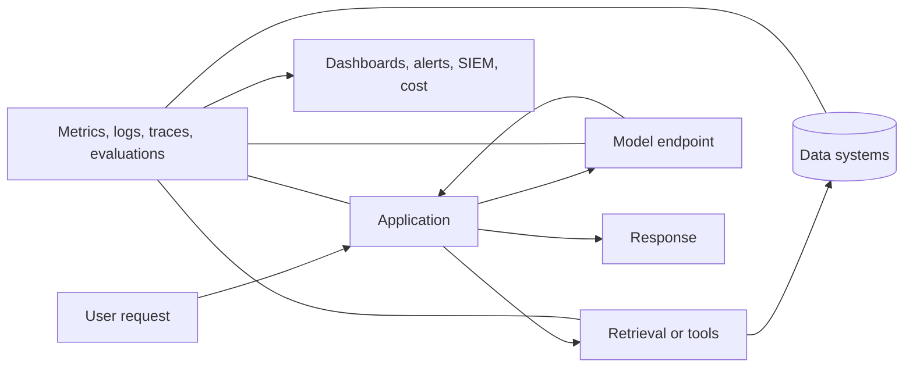
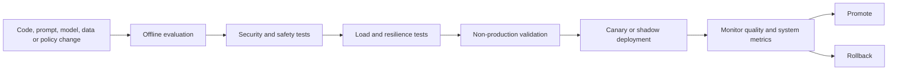
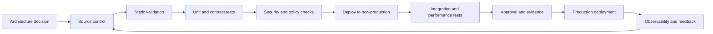

> **文档类型：**数据、AI 和集成实施指南
> **规范性术语：** **MUST**、**MUST NOT**、**SHOULD**、**SHOULD NOT** 和 **MAY** 是要求级别。
> **适用范围：** 生产 AI 应用，包括基础模型、RAG、代理、预测 ML 和 AI 辅助工作流程。
> **例外流程：** 偏离要求需要记录风险评估、补偿控制、指定风险负责人和到期日期。

|控制领域|价值|
|---|---|
|文件编号 | `DAI-07` |
|负责人|云卓越中心 |
|审核周期|至少每年一次，并且在重大平台、提供商、数据、安全或运营模式发生变化之后 |
|证据|运营模型、服务遥测、评估结果、事件测试和运营就绪证据 |

# AI 应用的生产运营

> **决策简述：** 将 AI 应用作为软件服务和质量管理的概率系统来运行。使模型、提示、检索、安全、成本和事件信号可操作。

## 目的

本文档定义了 AI 应用的生产操作标准，包括基础模型应用、RAG、代理、预测机器学习和 AI 辅助工作流程。AI 应用是具有传统软件依赖性的概率系统；它们需要软件 SRE 和模型质量操作。

## 运营模式

生产型 AI 服务需要明确的所有权：

- 应用代码和用户体验；
- 模型或提供商依赖性；
- 提示和编排逻辑；
- 检索和数据管道；
- 评估数据集和质量门；
- 安全控制；
- 基础设施和网络；
- 事件响应和客户支持；
- 成本和容量。

任何生产服务都不能依赖“AI 团队”作为未定义的升级目标。

## 端到端的可观测性

每个请求 SHOULD 都携带跨应用、网关、检索、模型、工具调用和下游写入的相关标识符。遥测必须具有隐私意识：默认情况下记录结构化元数据，并且仅在经过批准、访问控制、时间限制的条件下记录原始内容。

## 服务级别目标

AI SLO 必须结合系统和质量维度。

### 系统 SLO

- 可用性；
- 延迟和首个令牌时间（TTFT）；
- 请求成功率；
- 节流率；
- 检索新鲜度；
- 工具调用完成；
- 排队延迟；
- 恢复时间。

### 质量 SLO

- 任务成功率；
- 回答有据性和引用正确性；
- 关键场景的检索召回；
——不安全输出率；
- 正确拒绝率；
- 幻觉或无证据支持的说法发生率；
- 人为升级率；
- 与批准的评估集的偏差。

质量 SLO 需要定期抽样评估，并且不能从正常运行时间推断。

## 发布生命周期

对提示、检索配置、分块、嵌入、模型、安全过滤器、工具权限和评估逻辑的更改属于生产更改。它们需要版本控制和证据，而不是门户中的非正式调整。

## 运营评估

使用三种互补的评估模式：

1. **离线回归：** 在发布之前修复并版本化数据集。
2. **在线监控：** 通过隐私控制对生产交互进行采样。
3. **人工审查：** 对高影响力、模糊性或新颖案例的专家评估。

评估结果必须按语言、租户、任务类型、用户群体、文档类型和模型版本（如果相关）进行细分。聚合平均值可以隐藏严重的子组失败。

## 事件分类

|类别 |示例 |主要响应 |
|---|---|---|
|可用性 |提供商中断、DNS 故障、配额耗尽 |故障转移、降级、队列、通信 |
|品质 |错误答案、检索回归、模型行为变化 |禁用功能、回滚、收紧范围 |
|安全|有害输出、提示注入、策略绕过 |遏制、撤销访问、保留证据 |
|安全|数据泄露、未经授权的工具操作、凭证泄露 |安全事件流程、轮换、隔离|
|数据|过时的索引、损坏的嵌入、丢失源 |重建、重播、协调 |
|成本|失控循环、过多上下文、重试风暴 |电路中断、配额、预算控制|
|合规|保留或违反驻留要求|停止处理、法律/隐私升级 |

运行手册 MUST 识别安全降级模式。示例包括仅限搜索的结果、较小的批准模型、延迟的异步处理、禁用工具、限制上下文或人为升级。

## 容量和配额管理

容量规划必须包括每分钟的请求数、每分钟的令牌数、并发性、上下文分布、输出长度、检索查询、向量索引吞吐量、工具调用扇出和提供程序配额。平均使用量不足；突发和重试行为的设计。

所需的控制包括应用配额、租户预算、背压、有界队列、断路器、请求卸载、提供商配额监控和预先批准的容量升级。

## 可靠性模式

- 对每个外部依赖项使用超时。
- 仅重试具有指数退避和抖动的可重试故障。
- 确保工具调用是幂等的或受事务标识符保护。
- 通过步骤和成本限制防止递归代理或工具循环。
- 仅在授权、新鲜度和隐私允许的情况下缓存。
- 在租户、应用和关键级别之间使用隔板。
- 根据相同的任务和安全标准验证后备模型。
- 测试区域和提供商故障转移；不要假设兼容的输出。

## 代理操作

代理应用会增加操作风险，因为模型可以选择操作。每个代理 MUST 有：

- 明确的工具许可名单；
- 最低权限工具身份；
- 参数验证和模式执行；
- 最大步数、持续时间和成本；
- 人类对高影响力行动的认可；
- 不可变的操作审计；
- 模拟或试运行模式；
- 支持安全重放的操作标识符；
- 终止和终止开关控制。

代理不得直接接收广泛的管理员凭据或不受限制的网络访问。

## 数据和模型漂移

对于预测 ML，监控特征分布、标签漂移、校准、性能和偏差。对于生成 AI，监控语料库新鲜度、检索分布、提示分布、拒绝行为、引用质量和模型版本行为。

漂移告警 SHOULD 触发调查，而不是自动重新训练或未经验证的模型替换。

## 安全监控

检测异常令牌量、重复的策略违规、提示注入模式、跨租户检索尝试、异常工具使用、数据泄露指示器、新的出站目的地、意外的模型更改、禁用的安全设置和特权配置更改。

安全遥测数据必须导出到应用团队管理边界之外控制的目的地。

## 成本运营

跟踪每个成功任务的成本，而不仅仅是每个令牌的成本。包括模型推理、嵌入、检索、存储、计算、网络、日志、人工审核和失败/重试请求。成本异常应与版本和流量变化相关。

## 多云运营等效性

运营模式是提供商中立的。 Azure Monitor、CloudWatch、GCP Operations 和 OCI Observability 提供不同的实现，但所有环境 MUST 提供相关遥测、受保护的审计日志、SLO 仪表板、配额告警、事件集成和成本分配。

## 跨领域的治理要求

平台 MUST 将数据产品、模型、提示、索引、管道和集成接口视为受治理资产。每项资产都需要一个负责任的所有者、分类、生命周期状态、批准的消费者、数据血缘、保留规则和运营目标。平台控制 MUST 通过策略即代码和基础设施即代码应用，而不是手动门户配置。

最低治理控制是：

1. 具有自动元数据收集功能的业务术语表和技术目录。
2. 摄取时的数据分类和转换后的重新分类。
3. 从源到转换、模型或索引、API 和消费者的端到端数据血缘。
4. 平台管理、数据管理、开发和生产运营之间的职责分离。
5. 用于管理操作和访问受监管数据的不可变审计日志。
6. 明确的保留、存档、合法保留和删除程序。
7、具有证据、审批、回滚能力的环境晋级。
8. 定期访问重新认证和控制有效性审查。

## 交付和生命周期标准

所有可部署资源 MUST 在版本控制中表示。合规的交付流程是：

生产变更 MUST 使用可重复的流水线、短期工作负载标识、同行评审和可审核的批准。紧急变更需要追溯相同的证据，且 MUST NOT 成为并行运行模型。

## 更改分类

AI 发布 SHOULD 对变更资产进行分类，因为每个类别需要不同的证据。

|改变 |额外验证 |
|---|---|
|模型或提供商版本 |质量、安全性、延迟、成本、后备兼容性 |
|系统提示或策略|拒绝、注射、任务成功、禁止使用测试|
|检索来源或索引 | ACL、新鲜度、引用、删除、相关性测试 |
|嵌入或排序模型 |并行索引和检索回归|
|工具或代理权限 |授权、论证、批准、幂等性测试 |
|评估逻辑|记分器校准和历史比较|
|安全设置|假阳性和假阴性审查|
|配额或路由|负载、租户隔离和故障模式测试 |

仅配置的更改可能与应用代码更改一样重要，并且 MUST 使用相同的发布证据和回滚规则。

## 标准遥测模式

遥测 SHOULD 使用稳定字段，因此操作可以比较提供商和版本。推荐字段包括请求 ID、租户、应用、用例、模型部署、提示版本、检索版本、工具版本、策略决策、输入和输出单元、延迟阶段、重试、安全结果、质量样本状态、成本估算和最终结果。

请勿使用高基数原始提示文本作为标签或指标维度。敏感内容属于具有显式保留的受限诊断工作流程。

## 事件证据和取证

对于 AI 质量、安全或工具事件，请保留：

- 应用、模型、提示、策略、索引和工具版本；
- 经过认证的参与者和授权决定；
- 检索到的源标识符和校验和；
- 工具请求、批准、执行结果和副作用；
- 跟踪时间和提供商相关 ID；
- 评估结果和可比较的先前行为；
- 活动临近时配置发生变化；
- 遏制行动和证书撤销。

仅在必要时并在原始交互的数据分类下存储内容样本。

## 质量错误预算

在质量 SLO 可度量的情况下，定义一个错误预算来控制发布速度和纠正工作。例如，即使可用性保持健康，重复的引用失败或不安全操作块也可能需要冻结功能扩展。

质量错误预算 SHOULD 按关键任务和风险层进行细分。不要将高影响力的失败平均化为大量低风险的成功请求。

## 相关主题

- [Azure OpenAI 平台架构](dai-azure-openai-platform-architecture.md)
- [企业 RAG 和 AI 搜索](dai-enterprise-rag-and-ai-search.md)
- [Agent AI 平台架构与工具治理](dai-agentic-ai-platform-architecture-and-tool-governance.md)
- [AI 与数据成本架构](dai-ai-and-data-cost-architecture.md)

## 反模式
- 由于 HTTP 成功率很高，因此宣布 AI 服务健康。
- 直接在生产中更新提示或模型，无需版本控制。
- 记录所有用户内容以简化调试。
- 允许无限制的代理循环或重试。
- 在没有质量和安全验证的情况下故障转移到不同的模型。
- 在没有数据投毒防护的情况下根据生产反馈自动重新训练。
- 对每个单独的模型拒绝发出告警，而不是有意义的比率和模式。
- 在没有失败请求、检索、工具和可观测性开销的情况下测量成本。

## 验证

- [ ] 系统和质量 SLO 具有所有者和告警阈值。
- [ ] 离线评估通过版本化基准。
- [ ] 金丝雀、回滚和kill switch 程序经过测试。
- [ ] 配额耗尽和提供商中断已测试降级模式。
- [ ] 测试提示注入、未经授权的检索和工具误用。
- [ ] 跟踪和审计数据受隐私控制且防篡改。
- [ ] 每个任务和每个租户的成本可见。
- [ ] 待命运行手册涵盖可用性、质量、安全性、信息安全、数据和成本事件。
- [ ] 每个生产模型、提示、索引、工具和策略版本都是可发现的。

## 参考文档

- [Azure Well-Architected Framework：AI 工作负载架构模式](https://learn.microsoft.com/azure/well-architected/ai/architecture-pattern)
- [Azure Architecture Center：通过网关监控 Azure OpenAI](https://learn.microsoft.com/azure/architecture/ai-ml/guide/azure-openai-gateway-monitoring)
- [AWS Well-Architected 的生成式 AI 镜头](https://docs.aws.amazon.com/wellarchitected/latest/generative-ai-lens/)
- [Google Cloud Well-Architected Framework：AI 和 ML 视角](https://docs.cloud.google.com/architecture/framework/perspectives/ai-ml)
- [OCI Generative AI 文档](https://docs.oracle.com/en-us/iaas/Content/generative-ai/home.htm)
