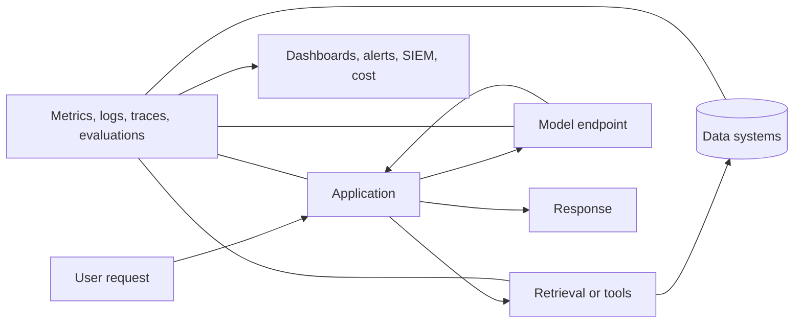
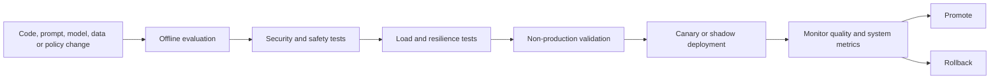
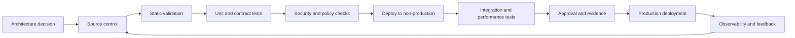

> **Document class:** Data, AI & Integration implementation guide
> **Normative terms:** **MUST**, **MUST NOT**, **SHOULD**, **SHOULD NOT**, and **MAY** are requirements levels.
> **Applicability:** Production AI applications, including foundation models, RAG, agents, predictive ML, and AI-assisted workflows.
> **Exception process:** Deviations require a documented risk assessment, compensating controls, named risk owner, and expiry date.

| Control field | Value |
|---|---|
| Document ID | `DAI-07` |
| Owner | Cloud Center of Excellence |
| Review cycle | At least annually and after material platform, provider, data, security, or operating-model changes |
| Evidence | Operating model, service telemetry, evaluation results, incident tests, and operational readiness evidence |

# Production Operations for AI Applications

> **Decision in brief:** Operate AI applications as both software services and quality-managed probabilistic systems. Make model, prompt, retrieval, safety, cost, and incident signals operational.

## Purpose

This document defines the production operating standard for AI-enabled applications, including foundation-model applications, RAG, agents, predictive ML, and AI-assisted workflows. AI applications are probabilistic systems with conventional software dependencies; they require both software SRE and model-quality operations.

## Operating Model

A production AI service requires clear ownership across:

- application code and user experience;
- model or provider dependency;
- prompt and orchestration logic;
- retrieval and data pipelines;
- evaluation datasets and quality gates;
- safety controls;
- infrastructure and network;
- incident response and customer support;
- cost and capacity.

No production service may depend on an “AI team” as an undefined escalation target.

## End-to-End Observability

Each request SHOULD carry a correlation identifier across application, gateway, retrieval, model, tool calls, and downstream writes. Telemetry must be privacy-aware: log structured metadata by default and raw content only under approved, access-controlled, time-limited conditions.

## Service-Level Objectives

AI SLOs must combine system and quality dimensions.

### System SLOs

- availability;
- latency and time to first token;
- successful request rate;
- throttling rate;
- retrieval freshness;
- tool-call completion;
- queue delay;
- recovery time.

### Quality SLOs

- task success rate;
- groundedness and citation correctness;
- retrieval recall for critical scenarios;
- unsafe output rate;
- correct refusal rate;
- hallucination or unsupported-claim rate;
- human escalation rate;
- drift against approved evaluation sets.

Quality SLOs require periodic sampled evaluation and cannot be inferred from uptime.

## Release Lifecycle

Changes to prompts, retrieval configuration, chunking, embeddings, models, safety filters, tool permissions, and evaluation logic are production changes. They require versioning and evidence, not informal tuning in a portal.

## Evaluation in Operations

Use three complementary evaluation modes:

1. **Offline regression:** fixed and versioned datasets before release.
2. **Online monitoring:** sampled production interactions with privacy controls.
3. **Human review:** expert assessment for high-impact, ambiguous, or novel cases.

Evaluation results must be segmented by language, tenant, task type, user cohort, document type, and model version where relevant. Aggregate averages can hide severe subgroup failure.

## Incident Taxonomy

| Category | Examples | Primary response |
|---|---|---|
| Availability | provider outage, DNS failure, quota exhaustion | failover, degrade, queue, communicate |
| Quality | incorrect answers, retrieval regression, model behavior change | disable feature, rollback, tighten scope |
| Safety | harmful output, prompt injection, policy bypass | contain, revoke access, preserve evidence |
| Security | data leakage, unauthorized tool action, credential compromise | security incident process, rotate, isolate |
| Data | stale index, corrupted embeddings, missing source | rebuild, replay, reconcile |
| Cost | runaway loop, excessive context, retry storm | circuit break, quota, budget control |
| Compliance | retention or residency violation | stop processing, legal/privacy escalation |

Runbooks MUST identify safe degradation modes. Examples include search-only results, smaller approved model, delayed asynchronous processing, disabling tools, limiting context, or human escalation.

## Capacity and Quota Management

Capacity planning must include requests per minute, tokens per minute, concurrency, context distribution, output length, retrieval queries, vector index throughput, tool-call fan-out, and provider quotas. Average usage is insufficient; design for burst and retry behavior.

Required controls include application quotas, tenant budgets, backpressure, bounded queues, circuit breakers, request shedding, provider quota monitoring, and pre-approved capacity escalation.

## Reliability Patterns

- Use timeouts for every external dependency.
- Retry only retryable faults with exponential backoff and jitter.
- Ensure tool calls are idempotent or protected by transaction identifiers.
- Prevent recursive agent or tool loops with step and cost limits.
- Cache only when authorization, freshness, and privacy permit.
- Use bulkheads between tenants, applications, and criticality levels.
- Validate fallback models against the same task and safety criteria.
- Test regional and provider failover; do not assume compatible outputs.

## Agent Operations

Agentic applications increase operational risk because the model can select actions. Every agent MUST have:

- explicit tool allowlist;
- least-privilege tool identity;
- argument validation and schema enforcement;
- maximum steps, duration, and cost;
- human approval for high-impact actions;
- immutable action audit;
- simulation or dry-run mode;
- replay-safe action identifiers;
- termination and kill-switch controls.

An agent must not directly receive broad administrator credentials or unrestricted network access.

## Data and Model Drift

For predictive ML, monitor feature distribution, label drift, calibration, performance, and bias. For generative AI, monitor corpus freshness, retrieval distribution, prompt distribution, refusal behavior, citation quality, and model-version behavior.

Drift alerts SHOULD trigger investigation, not automatic retraining or model replacement without validation.

## Security Monitoring

Detect unusual token volume, repeated policy violations, prompt-injection patterns, cross-tenant retrieval attempts, abnormal tool use, data exfiltration indicators, new outbound destinations, unexpected model changes, disabled safety settings, and privileged configuration changes.

Security telemetry must be exported to a destination controlled outside the application team's administrative boundary.

## Cost Operations

Track cost per successful task, not only cost per token. Include model inference, embeddings, retrieval, storage, compute, networking, logging, human review, and failed/retried requests. Cost anomalies should be correlated with releases and traffic changes.

## Multi-Cloud Operational Equivalence

The operating model is provider-neutral. Azure Monitor, CloudWatch, GCP Operations, and OCI Observability provide different implementations, but all environments MUST deliver correlated telemetry, protected audit logs, SLO dashboards, quota alarms, incident integration, and cost allocation.

## Cross-cutting governance requirements

The platform MUST treat data products, models, prompts, indexes, pipelines, and integration interfaces as governed assets. Each asset requires an accountable owner, classification, lifecycle state, approved consumers, lineage, retention rules, and operational objectives. Platform controls MUST be applied through policy-as-code and infrastructure-as-code rather than manual portal configuration.

Minimum governance controls are:

1. A business glossary and technical catalog with automated metadata harvesting.
2. Data classification at ingestion and reclassification after transformation.
3. End-to-end lineage from source through transformation, model or index, API, and consumer.
4. Segregation of duties between platform administration, data stewardship, development, and production operations.
5. Immutable audit logging for administrative actions and access to regulated data.
6. Explicit retention, archival, legal-hold, and deletion procedures.
7. Environment promotion with evidence, approval, and rollback capability.
8. Periodic access recertification and control-effectiveness reviews.

## Delivery and lifecycle standard

All deployable resources MUST be represented in version control. A compliant delivery flow is:

Production changes MUST use repeatable pipelines, short-lived workload identities, peer review, and auditable approvals. Emergency changes require the same evidence retrospectively and MUST not become a parallel operating model.

## Change Classification

AI releases SHOULD classify the changed assets because each class requires different evidence.

| Change | Additional validation |
|---|---|
| Model or provider version | quality, safety, latency, cost, fallback compatibility |
| System prompt or policy | refusal, injection, task success, prohibited-use tests |
| Retrieval source or index | ACL, freshness, citation, deletion, relevance tests |
| Embedding or ranking model | parallel index and retrieval regression |
| Tool or agent permission | authorization, argument, approval, idempotency tests |
| Evaluation logic | scorer calibration and historical comparison |
| Safety setting | false-positive and false-negative review |
| Quota or routing | load, tenant isolation, and failure-mode testing |

A configuration-only change can be as consequential as an application-code change and MUST use the same release evidence and rollback discipline.

## Standard Telemetry Schema

Telemetry SHOULD use stable fields so operations can compare providers and versions. Recommended fields include request ID, tenant, application, use case, model deployment, prompt version, retrieval version, tool version, policy decision, input and output units, latency stages, retries, safety result, quality sample status, cost estimate, and final outcome.

Do not use high-cardinality raw prompt text as a label or metric dimension. Sensitive content belongs in a restricted diagnostic workflow with explicit retention.

## Incident Evidence and Forensics

For AI quality, safety, or tool incidents, preserve:

- application, model, prompt, policy, index, and tool versions;
- authenticated actor and authorization decision;
- retrieved source identifiers and checksums;
- tool request, approval, execution result, and side effects;
- trace timing and provider correlation IDs;
- evaluation results and comparable prior behavior;
- configuration changes near the event;
- containment actions and credential revocations.

Store content samples only when necessary and under the data classification of the original interaction.

## Error Budgets for Quality

Where a quality SLO is measurable, define an error budget that governs release pace and corrective work. For example, repeated citation failures or unsafe-action blocks may require freezing feature expansion even when availability remains healthy.

Quality error budgets SHOULD be segmented by critical task and risk tier. Do not average a high-impact failure into large volumes of low-risk successful requests.

## Related topics

- [Azure OpenAI Platform Architecture](dai-azure-openai-platform-architecture.md)
- [Enterprise RAG and AI Search](dai-enterprise-rag-and-ai-search.md)
- [Agentic AI Platform Architecture and Tool Governance](dai-agentic-ai-platform-architecture-and-tool-governance.md)
- [AI and Data Cost Architecture](dai-ai-and-data-cost-architecture.md)

## Anti-patterns
- Declaring an AI service healthy because HTTP success rate is high.
- Updating prompts or models directly in production without versioning.
- Logging all user content to simplify debugging.
- Allowing unbounded agent loops or retries.
- Failing over to a different model without quality and safety validation.
- Auto-retraining on production feedback without poisoning controls.
- Alerting on every individual model refusal rather than meaningful rates and patterns.
- Measuring cost without failed requests, retrieval, tools, and observability overhead.

## Validation

- [ ] System and quality SLOs have owners and alert thresholds.
- [ ] Offline evaluation passes against a versioned benchmark.
- [ ] Canary, rollback, and kill-switch procedures are tested.
- [ ] Quota exhaustion and provider outage have tested degradation modes.
- [ ] Prompt injection, unauthorized retrieval, and tool misuse are tested.
- [ ] Trace and audit data are privacy-controlled and tamper-resistant.
- [ ] Cost per task and per tenant is visible.
- [ ] On-call runbooks cover availability, quality, safety, security, data, and cost incidents.
- [ ] Every production model, prompt, index, tool, and policy version is discoverable.

## References

- [Azure Well-Architected Framework: AI workload architecture pattern](https://learn.microsoft.com/azure/well-architected/ai/architecture-pattern)
- [Azure Architecture Center: Monitoring Azure OpenAI through a gateway](https://learn.microsoft.com/azure/architecture/ai-ml/guide/azure-openai-gateway-monitoring)
- [AWS Well-Architected Generative AI Lens](https://docs.aws.amazon.com/wellarchitected/latest/generative-ai-lens/)
- [Google Cloud Well-Architected Framework: AI and ML perspective](https://docs.cloud.google.com/architecture/framework/perspectives/ai-ml)
- [OCI Generative AI documentation](https://docs.oracle.com/en-us/iaas/Content/generative-ai/home.htm)
