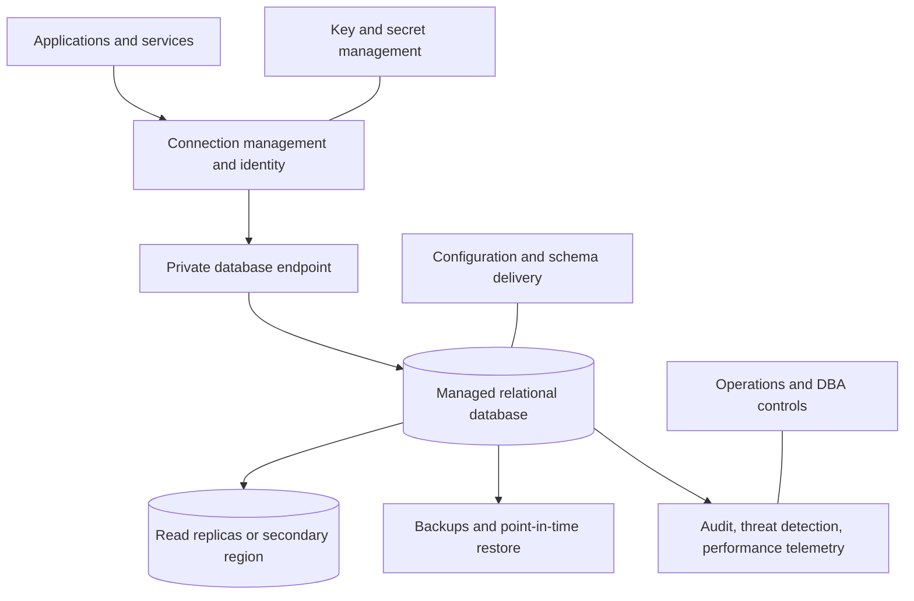
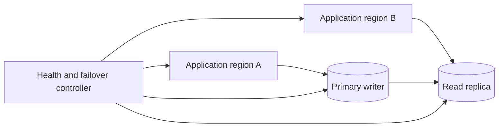
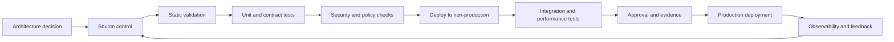

> **文档类型：**数据、AI 和集成架构参考模型
> **规范性术语：** **MUST**、**MUST NOT**、**SHOULD**、**SHOULD NOT** 和 **MAY** 是要求级别。
> **适用范围：** 跨受支持的云托管关系数据库托管、迁移、安全性、弹性和平台操作。
> **例外流程：** 偏离要求需要记录风险评估、补偿控制、指定风险负责人和到期日期。

|控制领域|价值|
|---|---|
|文件编号 | `DAI-03` |
|负责人|云卓越中心 |
|审核周期|至少每年一次，并且在重大平台、提供商、数据、安全或运营模式发生变化之后 |
|证据|架构决策、数据库拓扑和配置、安全审查、恢复测试和运营就绪证据 |

# SQL、托管实例和数据库平台模式

> **决策简述：** 首先从工作负载契约中选择数据库，然后选择托管关系服务。保留虚拟机托管的数据库以满足托管选项无法满足的要求。

## 目的

本文档定义了关系数据库托管的批准模式，其中 Azure SQL 数据库和 Azure SQL 托管实例作为主要的 Azure 示例。它还将等效决策点映射到 Amazon RDS 和 Aurora、GCP SQL 和 AlloyDB 以及 OCI Database services。

第一个决定不是“选择哪种数据库产品”。第一个决策是工作负载契约：引擎兼容性、事务语义、延迟、规模、可用性、恢复、操作控制和迁移容忍度。

## 平台选择模型

|要求 |首选模式|
|---|---|
|具有每服务数据库或每租户数据库的新云原生应用 |托管数据库服务或弹性池 |
|现有的 SQL Server 应用需要实例范围的功能和高兼容性 | Azure SQL 托管实例或托管 SQL Server 等效项 |
|完整的操作系统、代理或不支持的扩展控制 |虚拟机上的数据库，例外 |
|大规模分析扫描 |仓库还是lakehouse，而不是事务数据库|
|全球分布式键值或文档访问 |专门构建的分布式数据库 |
|兼容 PostgreSQL 的高吞吐量事务工作负载 |托管 PostgreSQL 或云优化兼容引擎 |

## 参考架构

## Azure SQL 模式指南

### Azure SQL 数据库

将 Azure SQL 数据库用于可在数据库范围的功能内运行的现代应用。它通常是首选的 Azure PaaS 选项，因为它最大限度地减少了基础设施管理，并支持独立数据库扩展、无服务器或预配计算选项（如果可用）、弹性池、自动备份和平台管理的高可用性。

### Azure SQL 托管实例

当工作负载需要近乎完整的 SQL Server 实例兼容性、跨数据库功能、类似 SQL 代理的调度、实例级构造或在有限的应用更改的情况下进行迁移时，请使用托管实例。托管实例比单个托管数据库有更多的网络、子网、容量、维护和部署考虑因素；不应仅仅因为源是 SQL Server 就选择它。

### Azure Virtual Machines 上的 SQL Server

仅当 PaaS 兼容性差距较大且已记录在案时才使用虚拟机。然后，工作负载团队负责操作系统强化、补丁协调、集群设计、备份验证、存储布局、防病毒排除以及更多的恢复工程。

## 多云映射

|工作负载需求 |Azure|AWS | GCP |OCI |
|---|---|---|---|---|
|托管 SQL Server | Azure SQL Database / Managed Instance | Amazon RDS for SQL Server | Cloud SQL for SQL Server | SQL Server 替代方案的 Base Database Service 需要显式设计；Oracle Database 是原生焦点|
|托管 PostgreSQL | Azure Database for PostgreSQL | RDS for PostgreSQL / Aurora PostgreSQL | Cloud SQL for PostgreSQL / AlloyDB | OCI Database，在适用的情况下提供 PostgreSQL 和 HeatWave 兼容选项 |
|托管 MySQL | Azure Database for MySQL | RDS for MySQL / Aurora MySQL | Cloud SQL for MySQL | MySQL HeatWave |
|托管 Oracle Database|Azure VM 上的 Oracle 或合作伙伴/互连模式|用于 Oracle 的 RDS|裸机/VM 或合作伙伴模式|Autonomous Database/Base Database Service/Exadata Database Service|
|跨区域读取扩展 |支持的地理副本/故障转移组 | Aurora 全球数据库/只读副本 |按服务划分的跨区域副本和 HA 选项 |自治数据卫士和特定于服务的副本|

功能相似并不意味着相同的事务行为、故障转移语义、扩展支持、限制或许可。迁移评估 MUST 明确验证这些。

## 数据库拓扑模式

### 单区域、多区域

当提供商提供区域弹性服务放置时，可用于大多数生产工作负载。确认所选层、区域和维护配置是否确实支持所需的区域行为。

### 跨区域恢复

当业务影响证明区域恢复合理时使用。定义故障转移是自动还是操作员控制、预期数据丢失、DNS 或连接字符串行为、写入重定向和故障恢复过程。跨区域复制并不能消除逻辑损坏；仍然需要备份和时间点恢复。

### 单写入器的主动/主动应用
应用可以跨区域主动/主动运行，而数据库保留一个写入区域。应用 MUST 处理路由、过时读取、重试、事务重放和故障转移收敛。

## 身份和访问

应用 SHOULD 在支持的情况下使用平台身份和基于令牌的数据库身份验证。人工管理 SHOULD 使用联邦身份、特权访问工作流程和有时限的提升。共享 SQL 登录是一个遗留的例外。

所需控制：

- 独立的运行时和部署身份；
- 最低权限的数据库角色；
- 没有应用所有权或服务器管理员权限；
- 托管 Vault 以存储不可避免的凭证；
- 无需重新部署应用即可进行凭证轮换；
- 经审计的特权操作；
- break-glass 身份的保护、测试和监控。

## 网络架构

生产数据库 SHOULD 使用私有端点、私有服务访问或专用子网。私有 DNS 必须被视为依赖链的一部分，并从每个应用网络进行测试。公共端点需要记录在案的例外、狭窄的防火墙规则、TLS 实施和补偿控制。

连接池或提供商支持的代理 SHOULD 用于高并发和无服务器应用。如果没有池化，短期应用实例可能会在达到 CPU 或存储限制之前耗尽数据库会话。

## 架构和变更管理

架构更改是软件版本。它们 MUST 根据实际数据量进行版本控制、审查和测试，并通过环境进行晋级。使用扩展和收缩技术实现零停机或低停机时间变更：

1.添加向后兼容的结构。
2. 部署写入或读取两个版本的代码。
3. 回填并验证。
4.切换消费者。
5. 删除回滚窗口后过时的结构。

破坏性更改需要经过验证的备份和恢复计划。除非在受控的紧急程序下，否则禁止直接手动改变生产。

## 性能工程

性能工作 MUST 从工作负载证据开始：查询计划、等待统计、锁定行为、存储延迟、CPU、内存、并发和连接压力。盲目提高服务等级并不是一种调整策略。

所需的实践包括索引和统计管理、参数敏感的查询分析、有界结果集、显式事务范围、连接池、合理的读/写分离，以及具有类似生产的并发和数据分布的负载测试。

## 备份、恢复和灾难恢复

团队 MUST 记录：

- 自动备份保留和长期保留要求；
- 时间点恢复粒度；
- 备份加密和密钥依赖关系；
- 跨区域复制要求；
- 代表性数据库大小的恢复时间；
- 应用恢复排序；
- 恢复后的完整性检查；
- 故障转移和故障恢复过程。

在执行和测量恢复之前，备份策略不会得到验证。

## 迁移模式

|模式|描述 |风险|
|---|---|---|
|重新托管 |以最小的更改移动数据库引擎和拓扑 |承担遗留运营负担|
|重构平台 |通过有限的更改迁移到托管实例或托管引擎 |隐藏的兼容性差距|
|重构 |更改架构、访问模式或引擎 |最大的变化，潜在的最大利益|
|复制然后剪切|使用 CDC 最大限度地减少停机 |双运行复杂性与协调|
|绞杀者 |逐渐移动有界域 |需要明确的数据所有权和同步|

迁移计划 MUST 包括兼容性评估、性能基线、数据验证、安全模型转换、切换演练、回滚标准和切换后稳定。

## 跨领域的治理要求

平台 MUST 将数据产品、模型、提示、索引、管道和集成接口视为受治理资产。每项资产都需要一个负责任的所有者、分类、生命周期状态、批准的消费者、数据血缘、保留规则和运营目标。平台控制 MUST 通过策略即代码和基础设施即代码应用，而不是手动门户配置。

最低治理控制是：

1. 具有自动元数据收集功能的业务术语表和技术目录。
2. 摄取时的数据分类和转换后的重新分类。
3. 从源到转换、模型或索引、API 和消费者的端到端数据血缘。
4. 平台管理、数据管理、开发和生产运营之间的职责分离。
5. 用于管理操作和访问受监管数据的不可变审计日志。
6. 明确的保留、存档、合法保留和删除程序。
7、具有证据、审批、回滚能力的环境晋级。
8. 定期访问重新认证和控制有效性审查。

## 交付和生命周期标准

所有可部署资源 MUST 在版本控制中表示。合规的交付流程是：

生产变更 MUST 使用可重复的流水线、短期工作负载标识、同行评审和可审核的批准。紧急变更需要追溯相同的证据，且 MUST NOT 成为并行运行模型。

## 租户和隔离模式

明确选择数据库租约。

|模式|优势|主要风险 |
|---|---|---|
|每个租户的数据库 |强大的数据和生命周期分离|操作计数和连接开销|
|每个租户的架构 |适度的逻辑分离|共享绩效和管理|
|带有租户密钥的共享表 |大规模高效 |授权缺陷影响广泛|
|每个产品的实例 |独立容量及维护|更高的成本和平台扩张|
|共享弹性池|变量数据库的成本效率|吵闹邻居和池限制管理 |

共享表设计 MUST 在每个查询路径上强制执行租户身份，并测试缺失的过滤器、特权旁路、导出、支持工具和后台作业。高敏感或可独立恢复的租户 SHOULD 采用更强的隔离。

## 连接和故障转移行为

应用 MUST 定义它们对连接丢失、瞬态错误、故障转移和读取副本延迟的响应。所需的实践包括有界超时、提供商建议的重试分类、连接池重置、仅在安全时重试事务以及不会使数据库过载的运行状况检查。

故障转移测试 SHOULD 验证：

- DNS 和私有端点解析；
- 驱动程序重新连接和身份验证令牌刷新；
- 飞行中的交易行为；
- 读/写路由和过时读容忍；
- 池耗尽和恢复；
- 工作、迁移和 CDC 行为；
- 监控和事件通知。

在提供程序层成功但使应用断开连接的数据库故障转移并不是成功的恢复。

## 数据库平台验收

在托管数据库服务或模式进入企业目录之前，请验证：

1. 支持的引擎、版本、扩展、区域、可用区和维护行为。
2. 私有连接、DNS、身份认证、加密和审计。
3. 备份保留、时间点恢复、跨区域恢复、关键依赖。
4. 配额、存储增长、IOPS、连接、副本和扩展持续时间。
5. 升级、补丁、参数和证书生命周期。
6. 成本分配、许可条款、监控和支持。
7. 使用可导出模式和数据的迁移和退出机制。
8. 通过 IaC 和受控部署流水线提供自动化支持。

## 相关主题

- [治理数据平台架构](dai-governed-data-platform-architecture.md)
- [DataOps CI/CD、测试和架构演进最佳实践](dai-dataops-cicd-testing-and-schema-evolution.md)
- [数据平台弹性、备份和灾难恢复标准](dai-data-platform-resilience-backup-and-disaster-recovery.md)
- [数据隐私、驻留、保留和安全删除标准](dai-data-privacy-residency-retention-and-deletion.md)

## 反模式
- 选择托管实例只是因为源使用 SQL Server。
- 将事务数据库视为企业集成或分析平台。
- 对应用、部署流水线和操作员使用一个管理员登录名。
- 允许“临时”访问公共网络，没有期限和所有权。
- 依赖异地复制，无需测试故障转移和应用重新连接。
- 扩展计算以隐藏丢失的索引、过多的查询或不良的连接处理。
- 在生产中手动运行架构更改。
- 假设托管服务意味着提供商负责数据恢复和应用连续性。

## 验证

- [ ] 已分配业务所有者、技术所有者、数据所有者和支持所有者。
- [ ] 记录数据分类、驻留、主权、保留和删除要求。
- [ ] 身份使用联合或托管工作负载身份；不允许嵌入凭据。
- [ ] 公共网络暴露被禁用，除非记录在案的例外情况得到批准。
- [ ] 定义了加密、密钥所有权、轮换和 break-glass 程序。
- [ ] 测试可用性、恢复、可扩展性和容量假设。
- [ ] 日志、指标、跟踪、数据血缘和成本分配在生产前实施。
- [ ] 执行部署、回滚、备份恢复和灾难恢复过程。
- [ ] 记录服务限制、配额、区域依赖性和特定于提供商的约束。
- [ ] 退出策略和可移植性边界是明确的。

## 参考文档

- [Azure Architecture Center：数据库架构设计](https://learn.microsoft.com/azure/architecture/databases/)
- [Azure SQL 托管实例 Well-Architected 指南](https://learn.microsoft.com/azure/well-architected/service-guides/azure-sql-managed-instance)
- [Amazon RDS 文档](https://docs.aws.amazon.com/AmazonRDS/latest/UserGuide/Welcome.html)
- [Amazon Aurora 文档](https://docs.aws.amazon.com/AmazonRDS/latest/AuroraUserGuide/CHAP_AuroraOverview.html)
- [GCP SQL 文档](https://cloud.google.com/sql/docs)
- [Google AlloyDB 文档](https://cloud.google.com/alloydb/docs)
- [OCI Database documentation](https://docs.oracle.com/en-us/iaas/Content/Database/home.htm)
