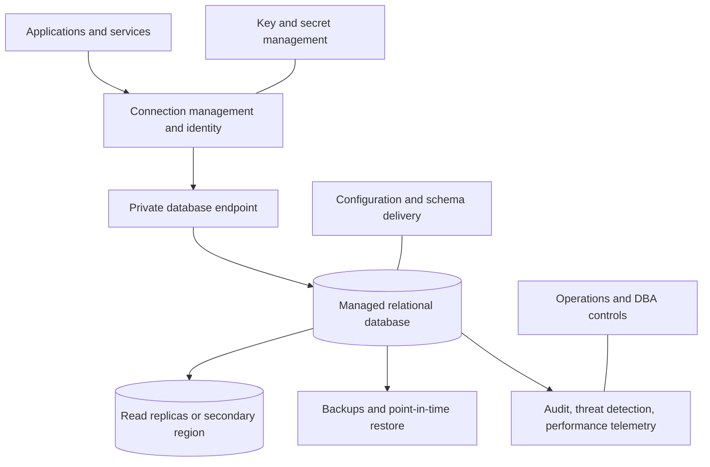
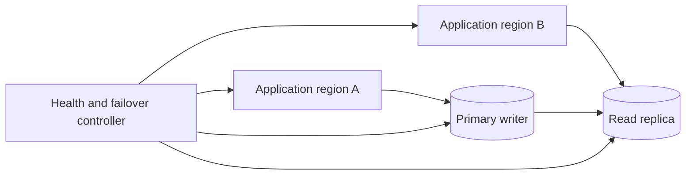
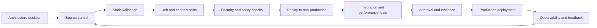

> **Document class:** Data, AI & Integration architecture reference model
> **Normative terms:** **MUST**, **MUST NOT**, **SHOULD**, **SHOULD NOT**, and **MAY** are requirements levels.
> **Applicability:** Managed relational database hosting, migration, security, resilience, and platform operations across supported clouds.
> **Exception process:** Deviations require a documented risk assessment, compensating controls, named risk owner, and expiry date.

| Control field | Value |
|---|---|
| Document ID | `DAI-03` |
| Owner | Cloud Center of Excellence |
| Review cycle | At least annually and after material platform, provider, data, security, or operating-model changes |
| Evidence | Architecture decision, database topology and configuration, security review, recovery tests, and operational readiness evidence |

# SQL, Managed Instance, and Database Platform Patterns

> **Decision in brief:** Select the database from the workload contract first, then choose a managed relational service. Reserve VM-hosted databases for requirements the managed options cannot meet.

## Purpose

This document defines approved patterns for relational database hosting, with Azure SQL Database and Azure SQL Managed Instance as the primary Azure examples. It also maps equivalent decision points to Amazon RDS and Aurora, GCP SQL and AlloyDB, and OCI Database services.

The first decision is not “which database product.” The first decision is the workload contract: engine compatibility, transaction semantics, latency, scale, availability, recovery, operational control, and migration tolerance.

## Platform Selection Model

| Requirement | Preferred pattern |
|---|---|
| New cloud-native application with database-per-service or database-per-tenant | Managed database service or elastic pool |
| Existing SQL Server application requiring instance-scoped features and high compatibility | Azure SQL Managed Instance or managed SQL Server equivalent |
| Full OS, agent, or unsupported extension control | Database on virtual machines, by exception |
| Massive analytical scans | Warehouse or lakehouse, not the transactional database |
| Globally distributed key-value or document access | Purpose-built distributed database |
| PostgreSQL-compatible high-throughput transactional workload | Managed PostgreSQL or cloud-optimized compatible engine |

## Reference Architecture

## Azure SQL Pattern Guidance

### Azure SQL Database

Use Azure SQL Database for modern applications that can operate within database-scoped capabilities. It is usually the preferred Azure PaaS option because it minimizes infrastructure administration and supports independent database scaling, serverless or provisioned compute options where available, elastic pooling, automated backups, and platform-managed high availability.

### Azure SQL Managed Instance

Use Managed Instance when the workload requires near-complete SQL Server instance compatibility, cross-database capabilities, SQL Agent-like scheduling, instance-level constructs, or migration with limited application change. Managed Instance has more network, subnet, capacity, maintenance, and deployment considerations than a single managed database; it should not be selected merely because the source is SQL Server.

### SQL Server on Azure Virtual Machines

Use virtual machines only when PaaS compatibility gaps are material and documented. The workload team then owns operating-system hardening, patch coordination, clustering design, backup validation, storage layout, antivirus exclusions, and substantially more recovery engineering.

## Multi-cloud mapping

| Workload need | Azure | AWS | GCP | OCI |
|---|---|---|---|---|
| Managed SQL Server | Azure SQL Database / Managed Instance | Amazon RDS for SQL Server | Cloud SQL for SQL Server | Base Database Service for SQL Server alternatives require explicit design; Oracle Database is the native focus |
| Managed PostgreSQL | Azure Database for PostgreSQL | RDS for PostgreSQL / Aurora PostgreSQL | Cloud SQL for PostgreSQL / AlloyDB | OCI Database with PostgreSQL and HeatWave-compatible choices where applicable |
| Managed MySQL | Azure Database for MySQL | RDS for MySQL / Aurora MySQL | Cloud SQL for MySQL | MySQL HeatWave |
| Managed Oracle Database | Oracle on Azure VM or partner/interconnect patterns | RDS for Oracle | Bare metal/VM or partner patterns | Autonomous Database / Base Database Service / Exadata Database Service |
| Cross-region read scaling | Geo-replicas / failover groups where supported | Aurora Global Database / read replicas | Cross-region replicas and HA options by service | Autonomous Data Guard and service-specific replicas |

Functional similarity does not imply identical transaction behavior, failover semantics, extension support, limits, or licensing. Migration assessment MUST validate these explicitly.

## Database Topology Patterns

### Single-Region, Multi-Zone

Use for most production workloads when the provider offers zone-resilient service placement. Confirm whether the selected tier, region, and maintenance configuration actually support the required zone behavior.

### Cross-Region Recovery

Use when business impact justifies regional recovery. Define whether failover is automatic or operator-controlled, expected data loss, DNS or connection-string behavior, write redirection, and failback procedure. Cross-region replication does not eliminate logical corruption; backups and point-in-time restore remain required.

### Active/Active Application with Single Writer

Applications may run active/active across regions while the database retains one write region. The application MUST handle routing, stale reads, retry, transaction replay, and failover convergence.

## Identity and Access

Applications SHOULD use platform identities and token-based database authentication where supported. Human administration SHOULD use federated identity, privileged access workflows, and time-bound elevation. Shared SQL logins are a legacy exception.

Required controls:

- separate runtime and deployment identities;
- least-privilege database roles;
- no application ownership or server-administrator privileges;
- managed vault for unavoidable credentials;
- credential rotation without application redeployment;
- audited privileged operations;
- break-glass identities protected, tested, and monitored.

## Network Architecture

Production databases SHOULD use private endpoints, private service access, or private subnets. Private DNS must be treated as part of the dependency chain and tested from every application network. Public endpoints require a documented exception, narrow firewall rules, TLS enforcement, and compensating controls.

Connection pooling or a provider-supported proxy SHOULD be used for high-concurrency and serverless applications. Without pooling, short-lived application instances can exhaust database sessions before CPU or storage limits are reached.

## Schema and Change Management

Schema changes are software releases. They MUST be versioned, reviewed, tested against realistic data volumes, and promoted through environments. Use expand-and-contract techniques for zero- or low-downtime change:

1. Add backward-compatible structures.
2. Deploy code that writes or reads both versions.
3. Backfill and validate.
4. Switch consumers.
5. Remove obsolete structures after the rollback window.

Destructive changes require verified backups and a recovery plan. Direct manual production changes are prohibited except under controlled emergency procedure.

## Performance Engineering

Performance work MUST start with workload evidence: query plans, wait statistics, lock behavior, storage latency, CPU, memory, concurrency, and connection pressure. Blindly increasing service tier is not a tuning strategy.

Required practices include index and statistics management, parameter-sensitive query analysis, bounded result sets, explicit transaction scope, connection pooling, read/write separation where justified, and load tests with production-like concurrency and data distribution.

## Backup, Restore, and Disaster Recovery

The team MUST document:

- automated backup retention and long-term retention requirements;
- point-in-time restore granularity;
- backup encryption and key dependencies;
- cross-region copy requirements;
- restoration time for representative database sizes;
- application recovery sequencing;
- integrity checks after restore;
- failover and failback procedures.

A backup policy is not validated until a restore has been executed and measured.

## Migration Patterns

| Pattern | Description | Risk |
|---|---|---|
| Rehost | Move database engine and topology with minimal change | carries legacy operational burden |
| Replatform | Move to managed instance or managed engine with limited changes | hidden compatibility gaps |
| Refactor | Change schema, access patterns, or engine | highest change, potentially highest benefit |
| Replicate then cut over | Use CDC to minimize outage | dual-running complexity and reconciliation |
| Strangler | Move bounded domains gradually | requires clear data ownership and synchronization |

Migration plans MUST include compatibility assessment, performance baseline, data validation, security model conversion, cutover rehearsal, rollback criteria, and post-cutover stabilization.

## Cross-cutting governance requirements

The platform MUST treat data products, models, prompts, indexes, pipelines, and integration interfaces as governed assets. Each asset requires an accountable owner, classification, lifecycle state, approved consumers, lineage, retention rules, and operational objectives. Platform controls MUST be applied through policy-as-code and infrastructure-as-code rather than manual portal configuration.

Minimum governance controls are:

1. A business glossary and technical catalog with automated metadata harvesting.
2. Data classification at ingestion and reclassification after transformation.
3. End-to-end lineage from source through transformation, model or index, API, and consumer.
4. Segregation of duties between platform administration, data stewardship, development, and production operations.
5. Immutable audit logging for administrative actions and access to regulated data.
6. Explicit retention, archival, legal-hold, and deletion procedures.
7. Environment promotion with evidence, approval, and rollback capability.
8. Periodic access recertification and control-effectiveness reviews.

## Delivery and lifecycle standard

All deployable resources MUST be represented in version control. A compliant delivery flow is:

Production changes MUST use repeatable pipelines, short-lived workload identities, peer review, and auditable approvals. Emergency changes require the same evidence retrospectively and MUST not become a parallel operating model.

## Tenancy and Isolation Patterns

Choose database tenancy explicitly.

| Pattern | Strength | Primary risk |
|---|---|---|
| Database per tenant | strong data and lifecycle separation | operational count and connection overhead |
| Schema per tenant | moderate logical separation | shared performance and administration |
| Shared tables with tenant key | efficient at scale | authorization defects have broad impact |
| Instance per product | independent capacity and maintenance | higher cost and platform sprawl |
| Shared elastic pool | cost efficiency for variable databases | noisy-neighbor and pool-limit management |

Shared-table designs MUST enforce tenant identity at every query path and test for missing filters, privileged bypass, exports, support tools, and background jobs. High-sensitivity or independently recoverable tenants SHOULD use stronger isolation.

## Connection and Failover Behavior

Applications MUST define how they react to connection loss, transient error, failover, and read-replica lag. Required practices include bounded timeouts, provider-recommended retry classification, connection-pool reset, transaction retry only when safe, and health checks that do not overload the database.

Failover tests SHOULD verify:

- DNS and private endpoint resolution;
- driver reconnect and authentication-token refresh;
- in-flight transaction behavior;
- read/write routing and stale-read tolerance;
- pool exhaustion and recovery;
- job, migration, and CDC behavior;
- monitoring and incident notification.

A database failover that succeeds at the provider layer but leaves applications disconnected is not a successful recovery.

## Database Platform Acceptance

Before a managed database service or pattern enters the enterprise catalog, validate:

1. Supported engines, versions, extensions, regions, zones, and maintenance behavior.
2. Private connectivity, DNS, identity authentication, encryption, and audit.
3. Backup retention, point-in-time restore, cross-region recovery, and key dependencies.
4. Quotas, storage growth, IOPS, connections, replicas, and scaling duration.
5. Upgrade, patch, parameter, and certificate lifecycle.
6. Cost allocation, license terms, monitoring, and support.
7. Migration and exit mechanisms using exportable schemas and data.
8. Automation support through IaC and controlled deployment pipelines.

## Related topics

- [Governed Data Platform Architecture](dai-governed-data-platform-architecture.md)
- [DataOps CI/CD, Testing, and Schema Evolution Best Practices](dai-dataops-cicd-testing-and-schema-evolution.md)
- [Data Platform Resilience, Backup, and Disaster Recovery Standard](dai-data-platform-resilience-backup-and-disaster-recovery.md)
- [Data Privacy, Residency, Retention, and Secure Deletion Standard](dai-data-privacy-residency-retention-and-deletion.md)

## Anti-patterns
- Selecting Managed Instance solely because the source uses SQL Server.
- Treating a transactional database as an enterprise integration or analytics platform.
- Using one administrator login for applications, deployment pipelines, and operators.
- Allowing public network access “temporarily” without expiry and ownership.
- Relying on geo-replication without testing failover and application reconnection.
- Scaling compute to conceal missing indexes, excessive queries, or poor connection handling.
- Running schema changes manually in production.
- Assuming managed service means the provider owns data recovery and application continuity.

## Validation

- [ ] Business owner, technical owner, data owner, and support owner are assigned.
- [ ] Data classification, residency, sovereignty, retention, and deletion requirements are documented.
- [ ] Identity uses federation or managed workload identity; no embedded credentials are permitted.
- [ ] Public network exposure is disabled unless a documented exception is approved.
- [ ] Encryption, key ownership, rotation, and break-glass procedures are defined.
- [ ] Availability, recovery, scalability, and capacity assumptions are tested.
- [ ] Logging, metrics, traces, lineage, and cost allocation are implemented before production.
- [ ] Deployment, rollback, backup restoration, and disaster-recovery procedures are exercised.
- [ ] Service limits, quotas, regional dependencies, and provider-specific constraints are recorded.
- [ ] Exit strategy and portability boundaries are explicit.

## References

- [Azure Architecture Center: Database architecture design](https://learn.microsoft.com/azure/architecture/databases/)
- [Azure SQL Managed Instance Well-Architected guidance](https://learn.microsoft.com/azure/well-architected/service-guides/azure-sql-managed-instance)
- [Amazon RDS documentation](https://docs.aws.amazon.com/AmazonRDS/latest/UserGuide/Welcome.html)
- [Amazon Aurora documentation](https://docs.aws.amazon.com/AmazonRDS/latest/AuroraUserGuide/CHAP_AuroraOverview.html)
- [GCP SQL documentation](https://cloud.google.com/sql/docs)
- [Google AlloyDB documentation](https://cloud.google.com/alloydb/docs)
- [OCI Database documentation](https://docs.oracle.com/en-us/iaas/Content/Database/home.htm)
