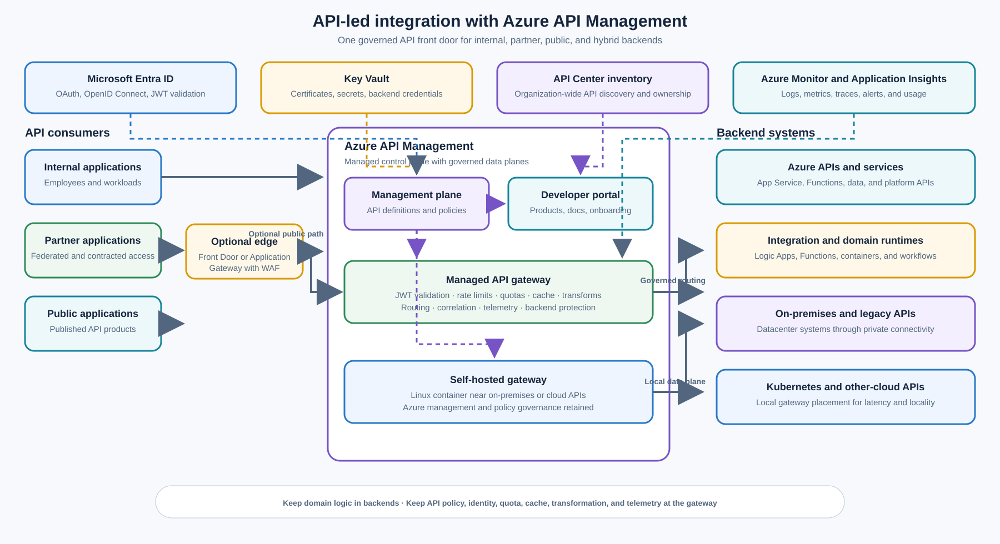

> **Document class:** Enterprise architecture reference model
> **Normative terms:** **MUST**, **MUST NOT**, **SHOULD**, **SHOULD NOT**, and **MAY** are requirements levels.
> **Applicability:** Internal, partner, and public APIs backed by Azure, on-premises, Kubernetes, or other cloud platforms.
> **Exception process:** Deviations require a documented risk assessment, compensating controls, named risk owner, and expiry date.

| Control field | Value |
|---|---|
| Document ID | `ES-01` |
| Owner | Cloud Center of Excellence |
| Review cycle | At least annually and after material API Management, identity, network, or backend changes |
| Evidence | API product and policy definitions, architecture decision record, security review, gateway tests, and operational readiness review |

# API-Led Integration — Azure API Management

> **Decision in brief:** Use APIM as the shared API facade and policy boundary. Keep business logic in the backend and use private connectivity when the API’s risk or topology requires it.

## Purpose

This architecture uses Azure API Management (APIM) as the controlled front door for APIs used by employees, partners, public clients, and internal applications. It provides a consistent API contract and policy boundary while allowing the implementation to remain on Azure compute, on-premises systems, Kubernetes, or another cloud.

The design standardizes authentication and JWT validation, rate limiting, quotas, caching, request and response transformations, API discovery, lifecycle governance, and telemetry. It also provides a migration seam around legacy systems so consumers can adopt stable APIs without waiting for every backend to be replatformed.

APIM is a hybrid and multicloud API management platform. Its gateway is a runtime proxy and policy enforcement point; its management plane and developer portal provide configuration, publication, discovery, and consumer onboarding. APIM MUST NOT become an application runtime or a hidden integration monolith. Substantial business logic, long-running orchestration, data transformation workflows, and domain authorization belong in an appropriate backend or integration service.

## Scope and design outcomes

Use this model when an organization needs to:

- publish internal APIs to employees or workload teams;
- expose partner APIs with controlled onboarding, products, subscriptions, and quotas;
- expose approved public APIs without coupling consumers to backend topology;
- present a consistent interface over Azure and non-Azure backends;
- validate OAuth 2.0 or OpenID Connect access tokens at the API boundary;
- apply cross-cutting policies such as throttling, caching, header normalization, and protocol transformation;
- provide a central API catalog, documentation, and ownership model; or
- modernize a legacy system incrementally through a stable facade.

The target outcomes are:

- every published API has an owner, lifecycle state, contract, audience, and support path;
- consumers use a governed API hostname rather than direct backend addresses;
- authentication, authorization inputs, quotas, and observability are applied consistently;
- backend location and implementation can change without unnecessary consumer changes;
- policy changes are versioned, reviewed, tested, and promoted through environments; and
- the gateway remains predictable, fast, and limited to cross-cutting concerns.

## Context and decision drivers

Point-to-point integration creates a growing set of client-specific credentials, network paths, retry behaviors, protocol assumptions, and undocumented dependencies. Directly publishing backend endpoints also exposes implementation details and makes it difficult to apply consistent controls across teams.

The architecture is driven by the following constraints and quality attributes:

- **Audience separation:** Internal, partner, and public consumers have different trust, support, onboarding, and quota requirements.
- **Backend diversity:** A single API estate may span App Service, Functions, AKS, virtual machines, SaaS systems, datacenter services, and another cloud.
- **Identity enforcement:** The gateway must reject invalid or incorrectly scoped tokens before forwarding requests. Backend authorization remains necessary for resource-level and business decisions.
- **Controlled change:** API contracts, versions, policies, and products must be promoted without silently breaking consumers.
- **Private connectivity:** Private APIs should use approved virtual-network, private-link, ExpressRoute, VPN, or equivalent paths rather than public exposure.
- **Legacy modernization:** A facade should allow a legacy protocol or data model to be replaced in stages, without embedding an unmaintainable domain workflow in gateway policy.
- **Operational evidence:** Request outcomes, latency, backend failures, policy decisions, capacity, and consumer usage must support incident response and service-level objectives.
- **Cost and scale:** Tier, capacity, regional placement, self-hosted gateway footprint, cache behavior, and traffic shape must be selected from measured demand.

## Options considered

### Direct client-to-backend exposure

This option is simple for a single application but creates duplicated authentication, throttling, transformation, logging, and retry behavior. It exposes backend topology and makes partner or public onboarding inconsistent. It is acceptable only for tightly bounded private service-to-service calls where an API gateway is not part of the required control boundary.

### Application-owned gateway or reverse proxy

An application team can operate a gateway or reverse proxy close to its service. This may be appropriate for a specialized protocol, an application-specific aggregation layer, or a very small deployment. It should not replace a shared API governance model when multiple teams, consumers, products, or trust zones need common controls.

### Service mesh ingress

A service mesh can provide workload-to-workload identity, traffic policy, and telemetry inside a cluster. It is not a substitute for an enterprise API product catalog, partner onboarding, public API management, or a cross-environment API facade. Use it as a complementary east-west control where Kubernetes workloads require it.

### Integration workflow or custom adapter as the front door

Logic Apps, Functions, or a custom adapter may be the correct runtime for orchestration, asynchronous workflows, or substantial data transformation. Placing that logic directly in APIM policy increases latency, testing complexity, policy blast radius, and operational ambiguity. Use APIM in front of the runtime when the workflow is consumed through a governed API.

### Selected direction: Azure API Management

Use APIM as the shared API facade and policy enforcement layer. Use its managed gateway for Azure-hosted or centrally reachable APIs. Use the self-hosted gateway when the data plane should run close to APIs in a datacenter, Kubernetes cluster, or another cloud while the organization retains Azure-based management and governance. Place WAF, edge routing, private connectivity, and backend runtimes in their appropriate layers.

## Reference architecture

The managed gateway is the default data plane for APIs reachable through the selected Azure network design. The self-hosted gateway is a Linux-based containerized data plane deployed near the backend; it is commonly run on Kubernetes. Both gateways remain subject to centrally managed API definitions, products, policies, and release controls. Network placement, DNS, firewall rules, and private connectivity MUST prevent consumers from bypassing the approved gateway path.

The optional edge boundary is for internet-facing protection and routing. Application Gateway or Front Door with WAF can inspect and route public traffic before APIM; APIM then applies API-specific authentication, authorization inputs, quotas, transformations, caching, and backend routing. Do not treat APIM as a replacement for a WAF, global edge, general-purpose load balancer, or application runtime.

## API audience and product model

Represent consumer intent through products, groups, subscriptions, and explicit access policies. A shared APIM instance MAY serve multiple audiences, but the API platform must preserve clear ownership and trust boundaries.

| Audience | Typical entry path | Required controls | Publication model |
|---|---|---|---|
| Internal | Private DNS and managed gateway or approved internal endpoint | Entra ID, workload identity, least-privilege authorization, consumer quotas, private connectivity | Internal product with group-based visibility |
| Partner | Public edge or private partner connection followed by APIM | Federated identity or client credentials, partner-specific product, quotas, contract, support contact, threat monitoring | Controlled onboarding and explicit subscription approval |
| Public | Public edge followed by APIM | JWT or approved credential validation, abuse controls, rate limits, versioning, threat protection, public documentation | Public product with published terms and support path |

Do not use a subscription key as the only authorization mechanism for sensitive APIs. Subscription keys identify an application or product subscription and support usage management; they do not replace token validation, backend authorization, or network controls. For APIs that handle sensitive data or privileged operations, require a validated token and enforce scopes, roles, audience, tenant, and resource authorization appropriate to the operation.

## API contract and lifecycle

Publish an API from a reviewed OpenAPI, WSDL, GraphQL, gRPC, or other supported contract as applicable. The contract should define:

- resource and operation semantics;
- authentication and authorization requirements;
- error shape, correlation identifiers, and retry guidance;
- idempotency and concurrency behavior;
- pagination, filtering, and response-size expectations;
- rate-limit headers and quota behavior;
- data classification and sensitive fields; and
- owner, support path, deprecation policy, and versioning strategy.

Use products to package APIs for a consumer audience and the developer portal to publish documentation, onboarding, subscriptions, and interactive discovery. Use API Center as the organization-wide inventory when the estate includes APIs outside APIM or when discovery must span lifecycle stages and deployment locations. The portal and catalog are complementary: the portal explains how an approved consumer uses an API, while the inventory establishes what exists, who owns it, and where it is deployed.

Version APIs deliberately. Prefer additive, backward-compatible changes within a version. Introduce a new version when the contract or semantics break existing consumers, publish a migration period, measure remaining usage, and remove the old version only after owner-approved evidence supports retirement. A gateway rewrite or transformation can bridge a temporary compatibility gap, but it MUST NOT conceal an indefinitely unsupported contract.

## Authentication and authorization

The gateway should perform early request authentication and coarse authorization before a request reaches a backend:

- Validate JWT signature, issuer, audience, expiry, and required claims against the approved identity provider configuration.
- Require scopes or roles appropriate to the API product and operation.
- Separate employee, partner, customer, and workload identity issuers unless a documented federation model gives equivalent assurance.
- Reject missing, malformed, expired, incorrectly issued, or incorrectly scoped tokens with consistent error behavior.
- Use mutual TLS or another approved client-authentication mechanism where partner assurance, device identity, or private connectivity requires it.
- Resolve secrets, certificates, and signing configuration through an approved secret-management pattern; do not place long-lived credentials in source control or unprotected policy text.
- Forward only the claims and headers that a backend is designed to trust, and prevent consumers from spoofing gateway-added identity headers.

Gateway validation is necessary but not sufficient. The backend MUST authorize the requested resource and operation using the subject, tenant, service identity, or claims it trusts. A valid token proves an identity or delegated grant; it does not by itself prove that the caller may read a particular customer record or execute a business operation.

## Policy and transformation boundaries

Use APIM policies for deterministic, bounded, cross-cutting behavior:

- route selection and backend selection;
- JWT, subscription, certificate, or IP-based checks;
- rate limiting, concurrency limits, and quotas;
- response caching for safe and correctly scoped operations;
- header normalization, correlation IDs, and protocol mediation;
- XML/JSON or other bounded request and response transformations;
- validation of content type, size, method, and required parameters; and
- controlled retries or circuit-breaking behavior where the operation and failure semantics permit it.

Keep these concerns out of the gateway policy layer:

- multi-step domain workflows;
- long-running or asynchronous orchestration;
- complex joins across systems;
- authoritative business rules that require domain ownership;
- large payload processing or document transformation;
- transaction coordination across independent systems; and
- persistent state that is required to make a business decision.

Use Logic Apps, Functions, containerized services, an application runtime, a messaging workflow, or a purpose-built integration service for those responsibilities. APIM can front that runtime and expose it as a governed API, but it should not become the runtime itself.

## Backend connectivity and legacy modernization

The backend contract should remain independent of the physical location of the implementation. Prefer private connectivity for private APIs and document the complete path, including DNS, routing, firewall, TLS, and source identity.

For Azure backends, use the approved virtual-network, private endpoint, service endpoint, or public ingress pattern for the selected service. For on-premises backends, use ExpressRoute, site-to-site VPN, or an approved private integration path. For Kubernetes and other clouds, deploy the self-hosted gateway close to the APIs when locality, latency, egress control, or regulatory requirements make a centralized gateway unsuitable.

The self-hosted gateway does not remove the need for a resilient local design. Provide:

- redundant gateway replicas across nodes or failure domains;
- controlled access to the Azure management and configuration endpoints;
- local certificate, secret, and identity handling that follows the platform standard;
- network policies and firewall rules that restrict gateway-to-backend traffic;
- a documented behavior when the gateway cannot reach the management plane; and
- a tested upgrade, rollback, and emergency-support procedure.

For legacy modernization, start with a narrow facade around a stable business capability. Preserve required legacy semantics while translating protocol, authentication, headers, or payload shapes at the boundary. Move domain behavior into a replacement runtime incrementally, compare old and new behavior, and retire the legacy route only after consumer and operational evidence supports the change. Do not publish a thin facade that merely exposes every legacy table or internal endpoint without a consumer-oriented contract.

## Security, resilience, and cost

### Security

- Keep public ingress behind approved WAF, DDoS, and edge controls where the threat model requires them.
- Use private APIM and backend paths for internal and sensitive APIs wherever practical.
- Apply least-privilege RBAC to the management plane, workspaces, API definitions, products, policies, and named values.
- Protect certificates, client secrets, signing material, and backend credentials with Key Vault or an equivalent approved service.
- Set request-size, response-size, timeout, and content-type limits to reduce abuse and resource exhaustion.
- Redact tokens, secrets, sensitive headers, and regulated payload fields from logs and traces.
- Monitor policy changes, subscription creation, key rotation, backend changes, and unusual consumer behavior.

### Resilience and performance

- Select a production tier and capacity model using measured request rate, payload size, concurrency, policy cost, cache hit ratio, and backend latency.
- Use multi-region APIM or an approved edge failover pattern when the business service-level objective requires regional resilience.
- Define whether a failure should fail open, fail closed, return a cached response, or route to a fallback backend; do not leave this implicit.
- Bound retries and avoid retry amplification across consumers, APIM, service mesh, and backend clients.
- Cache only responses that are safe, correctly keyed, appropriately authorized, and valid for the defined freshness period.
- Test managed and self-hosted gateway upgrades, configuration propagation, node loss, identity-provider failure, backend failure, and management-plane unavailability.

### Cost

The major cost drivers are APIM tier and capacity, region count, self-hosted gateway infrastructure, public edge and WAF usage, private connectivity, telemetry ingestion, cache services, and backend execution. Do not select a tier only from request count. Include the number of APIs, policy complexity, payload size, concurrency, availability target, network topology, and operational support model. Review idle or duplicate API instances, unmanaged self-hosted gateway clusters, excessive diagnostic retention, and low-value cache entries.

## Operational considerations

The API platform team owns the APIM service, tier, network integration, gateway lifecycle, shared policy baselines, portal configuration, catalog integration, and platform telemetry. API product teams own their contracts, backend behavior, operation-level authorization, consumer documentation, SLOs, and deprecation plans. Security and governance teams define identity, data protection, logging, and exception requirements.

Every API should have an operational record containing the owner, product, version, backend, data classification, audience, dependency list, support path, SLO, quota, escalation path, and retirement date or review date. Manage API and policy definitions as code where possible, validate them in CI, and promote them through environments with approvals appropriate to the risk.

Monitor at least:

- request volume, status code, latency, backend latency, and gateway latency;
- authentication failures, authorization failures, quota responses, and policy errors;
- cache hit ratio, response size, timeout, retry, and circuit-breaker behavior;
- backend health, dependency saturation, connection failures, and DNS/TLS errors;
- consumer and product usage by API version, tenant, and geography where appropriate;
- gateway CPU, memory, replica health, configuration synchronization, and certificate expiry; and
- management-plane changes, subscription changes, policy changes, and anomalous access.

Incident runbooks should distinguish an APIM gateway failure from an identity-provider failure, edge/WAF block, network path failure, backend failure, policy regression, and consumer contract violation. Capture the correlation ID and gateway policy context needed to trace a request without retaining unnecessary sensitive payload data.

## Validation

- [ ] Each API has an accountable owner, audience, product, contract, version, support path, and lifecycle state.
- [ ] Internal, partner, and public access paths are explicitly separated and tested.
- [ ] JWT issuer, signature, audience, expiry, scopes, roles, and tenant claims are validated according to the API contract.
- [ ] Backend authorization is enforced independently of gateway token validation.
- [ ] Rate limits, quotas, request limits, caching rules, and transformations have evidence-based values and tests.
- [ ] Consumers cannot bypass APIM to reach protected backends.
- [ ] Private connectivity, DNS, routing, firewall, TLS, and source identity are verified for each backend location.
- [ ] Self-hosted gateway replicas, management-plane connectivity, configuration synchronization, upgrades, and rollback are tested.
- [ ] Public APIs use approved edge, WAF, DDoS, and threat-monitoring controls.
- [ ] API definitions and policies are versioned, reviewed, promoted through environments, and recoverable.
- [ ] Portal documentation and organization-wide API inventory identify the API owner and deployment location.
- [ ] Gateway policy contains no substantial business logic, long-running workflow, or hidden persistent state.
- [ ] Failure behavior is tested for identity, gateway, network, backend, cache, and management-plane outages.
- [ ] Dashboards, alerts, runbooks, support contacts, and deprecation evidence are ready before production publication.

## Related topics

- [Load Balancing and Application Gateway Patterns](../networking-identity-security/nis-load-balancing-and-application-gateway-patterns.md)
- [Cloud Identity and Access Architecture](../networking-identity-security/nis-cloud-identity-and-access-architecture.md)
- [Application Identity, Authentication, and Easy Auth](../applications-kubernetes/app-application-identity-authentication-and-easy-auth.md)
- [Azure Data Factory and Data Integration](../data-ai-integration/dai-azure-data-factory-and-data-integration.md)

## References

- [Azure API Management — Overview and Key Concepts](https://learn.microsoft.com/en-us/azure/api-management/api-management-key-concepts)
- [Basic enterprise integration on Azure](https://learn.microsoft.com/en-us/azure/architecture/reference-architectures/enterprise-integration/basic-enterprise-integration)
- [Protect APIs by using Application Gateway and API Management](https://learn.microsoft.com/en-us/azure/architecture/web-apps/api-management/architectures/protect-apis)
- [Azure API Management landing zone architecture](https://learn.microsoft.com/en-us/azure/architecture/example-scenario/apps/publish-internal-apis-externally)
- [Architecture best practices for Azure API Management](https://learn.microsoft.com/en-us/azure/well-architected/service-guides/azure-api-management)
