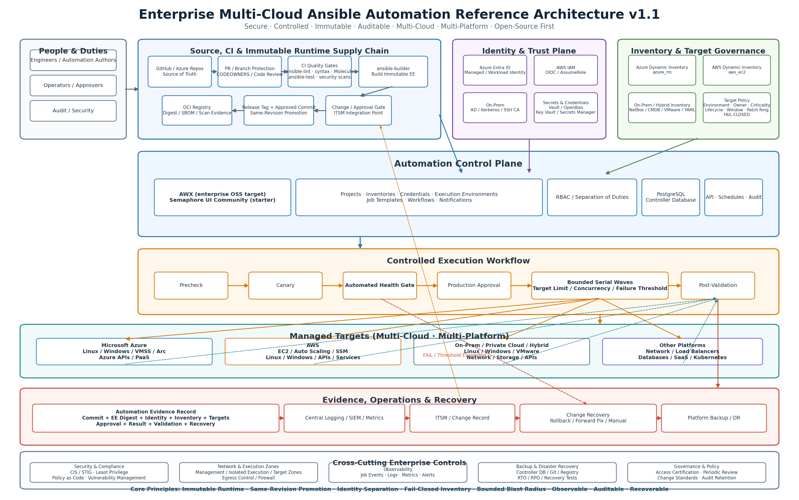

# 企业多云 Ansible 自动化参考架构

> **文档类型：**企业架构参考模型
> **规范性术语：** **MUST**、**MUST NOT**、**SHOULD**、**SHOULD NOT** 和 **MAY** 是要求级别。
> **适用范围：** 跨 Azure、AWS、GCP、OCI、本地、混合、Linux、Windows、网络和 API 驱动目标的企业 Ansible 自动化。
> **例外流程：** 偏离要求需要记录风险评估、补偿控制、指定风险负责人和到期日期。

|控制领域|价值|
|---|---|
|文件编号 | `ES-09` |
|负责人|云卓越中心 |
|版本 | `1.1` |
|审核周期|至少每年一次，并且在重大控制器、Ansible、集合、身份、网络或目标平台发生变化之后 |
|证据|架构决策记录、平台契约、清单策略、控制器配置、CI 结果、执行证据、恢复测试和运营就绪审核 |

> **决策简述：** 使用 Git、不可变执行环境、受管清单、分离身份和有限执行来管理混合和多云目标。保持控制器对象可替换，以便 Semaphore 可以演进到 AWX，而无需重写自动化内容。

## 变更摘要

- 晋级不可变的执行环境和镜像摘要固定到强制架构控制。
- 添加了平台契约和正式的运营模式分离。
- 添加身份分离作为独立的身份和信任平面。
- 将清单定义为具有故障关闭行为的安全边界。
- 添加了受控的相同修订和相同执行环境摘要提升。
- 添加了控制器对象约束、金丝雀执行、运行状况门、有界波次和故障阈值。
- 添加了结构化自动化证据、ITSM/变更关联和变更恢复。
- 添加了与 HOL-05 一致的正式验证和验收标准。

## 执行摘要

目标不仅仅是部署具有 Web UI 的 Ansible 服务器。它是为了建立一个可持续的企业自动化平台，可以跨生产、QA、开发和实验室环境管理 Azure、AWS、GCP、OCI 和本地资源，同时支持 Linux、Windows、网络设备和 API 驱动的平台，并与 GitHub 或 Azure DevOps 干净集成。

推荐的原则是：

1. **Git 是自动化内容的真实来源。** Playbook、角色、集合、清单配置、执行环境定义和 CI 配置均受版本控制。
2. **将 Ansible 内容与控制器解耦。** 业务逻辑不得嵌入 Semaphore/AWX UI 对象中。控制器应该管理项目、凭证、清单、模板、时间表、RBAC、审计和执行。
3. **优先选择 AWX 作为长期企业开源控制平面；使用 Semaphore Community 作为轻量级起点。** Semaphore Community 简单、轻量级，并获取 MIT 许可，但当前产品在付费版本中提供了 Project Runners、HA 和 Extended RBAC 等功能。 AWX 较重，需要 Kubernetes，但它是更强大的长期企业开源控制平面候选者。[R1][R2][R18][R19][R33][R34]
4. **首选动态清单。** 对于 Azure 使用 `azure.azcollection.azure_rm`，对于 AWS 使用 `amazon.aws.aws_ec2`。对于 GCP 和 OCI，请使用经批准的提供商清单插件或 API 集成，并在需要时由 CMDB 进行补充。在本地使用静态 YAML、NetBox/CMDB 或 VMware 清单。云环境不应依赖于手动维护的 IP 列表。[R8][R9]
5. **保持 Playbook 精简，并将可复用逻辑放入角色和集合中。** 常见的企业功能应集中到内部集合中，例如 `company.platform`。
6. **使生产执行可重现。** 固定 `ansible-core`、集合、Python 依赖项，并使用 Ansible 执行环境容器来避免依赖项漂移。[R20]
7. **CI 验证；默认情况下，它不应自动改变生产。** PR 流水线执行 linting、语法验证、Molecule/Ansible-test 和安全扫描。合并/标记后，控制器同步代码，并通过批准、受控模板或计划触发生产执行。
8. **永远不要在 Git 中存储明文凭证。** 最低基线是 Ansible Vault；更成熟的完全开源设计可以评估 OpenBao。 Semaphore 社区包括加密的密钥存储，但外部 HashiCorp Vault 集成是一项付费功能，不得假定为免费社区功能的一部分。[R5][R35][R21]

**v1.1 强化目标**：此版本将 HOL-05 中演示的企业验收标准从实施指南提升到显式架构控制。平台必须能够证明完整的信任链：`Code -> Validation -> Immutable Runtime -> Approved Inventory -> Identity -> Canary -> Approval -> Bounded Execution -> Validation -> Evidence -> Recovery`。相同的源版本和相同的执行环境摘要应通过 dev/test/staging/prod 进行升级，而不是重建或允许在环境之间漂移。

来源标记（例如 [R1]）链接到本文末尾的支持参考文档。

## 设计原则

1. **事实来源**：GitHub 或 Azure Repos 是自动化内容、平台 IaC、EE 定义和 CI 策略的权威来源。
2. **与控制器无关的内容**：Playbook、角色、集合、清单策略和测试不得依赖于专有的控制器 UI 逻辑。
3. **不可变的运行时**：生产作业在可追溯到镜像摘要的执行环境中执行；标签用于发现，摘要用于生产固定。
4. **同一修订版本晋级**：仅将经过测试的提交、Collection 版本和 EE 摘要提升到下一个环境。
5. **最小权限和身份分离**：工程师、CI 发布者、控制器服务、云 API、目标连接和审批者身份使用单独的身份或至少使用不同的权限边界。
6. **清单是安全边界**：清单不仅仅是一份资产清单；它定义了执行范围。动态清单解析失败时必须安全失败。
7. **有界爆炸半径**：生产变更必须使用限制、串行/并发控制、故障阈值、金丝雀和健康门。
8. **设计证据**：每次生产执行都必须产生与 Git 提交、EE 摘要、身份、清单、目标、批准、结果和恢复相关的证据。
9. **恢复是变更设计的一部分**：每个高风险自动化都必须定义回滚、前向修复或手动恢复。
10. **开源优先、可替换层**：现在优先考虑免费/开源组件，同时保持 Git、Collections、EE、Inventory 和 CI 可移植，以避免控制器或 Secret Manager 锁定。

## 参考仓库分析

### `semaphoreui/semaphore`

仓库：[semaphoreui/semaphore](https://github.com/semaphoreui/semaphore)

**用途**：主要的 Semaphore UI 项目。它为 Ansible、Terraform/OpenTofu/Terragrunt、PowerShell、Shell 和 Python 提供 Web UI/API。它支持仓库、清单、变量组、密钥存储、计划和团队等概念。主仓库已获取 MIT 许可。[R1][R3]

**重用什么**：

- 容器化部署模式和配置模型。
- 用于生产的 PostgreSQL 而不是 SQLite。
- HTTPS 反向代理。
- Git 仓库集成。
- 密钥存储和凭证加密。
- 项目、清单、模板和进度表对象模型。
- API 驱动的操作。

**不能假设什么**：

- 社区并不等同于完整的企业产品。当前文档将高可用性置于企业中，将项目运行器/运行器标签置于专业方向，将扩展 RBAC 置于企业中。[R33][R34][R4]
- 因此，如果未来的设计需要执行节点独立位于 Azure、AWS、GCP、OCI 和本地 Security Zones，Semaphore Community 可能会成为一个限制。

**在最终架构中的作用**：

- 第一阶段/小团队：有效的控制平面。
- 长期企业设计：保留作为轻量级控制器选项，但不要使自动化资产依赖于 Semaphore 特定的对象。

**评估**：平台强大，部署方便；免费版的企业扩展边界必须尽早设计。

### `semaphoreui/semaphore-demo`

仓库：[semaphoreui/semaphore-demo](https://github.com/semaphoreui/semaphore-demo)

**用途**：官方演示和示例仓库，包含 Ansible 角色、清单、集合和 Playbook，以及 Terraform、Terragrunt、PowerShell、Shell 和压力测试示例。[R10]

**优势**：

- 非常适合验证 Semaphore 如何提取 Git 仓库并执行任务。
- 在一个项目中演示多种自动化工具。
- 包括可运行的示例。

**弱点**：

- 它不是企业参考架构。
- 环境隔离、机密管理、CI 质量门、集合版本控制、动态清单和生产发布控制不完整。
- 它不应该被原封不动地分叉为生产仓库。

**最终架构中的角色**：仅限 PoC 和任务模板示例源。

### `adfinis/ansible-collection-semaphoreui`

仓库：[adfinis/Ansible-collection-semaphoreui](https://github.com/adfinis/ansible-collection-semaphoreui)

**用途**：部署和管理 Semaphore UI 的 Ansible 集合。它支持 Docker Compose、Semaphore 服务器和运行器、SQLite/PostgreSQL/MySQL 以及可选的 Caddy HTTPS。该集合使用 GPL-3.0 或更高版本。[R11]

**优势**：

- 核心思想是正确的：**自动化平台本身必须作为代码进行管理**。
- 将服务器和运行器清单组分开。
- 包括面向生产的 PostgreSQL 和 HTTPS 概念。
- 包含 Molecule 和 Ansible-lint 结构，可用作集合工程参考。

**弱点**：

- 它比 Semaphore 主项目小得多，不应被视为权威的平台生命周期标准。
- Runner 功能仍然取决于 Semaphore 产品版本。

**最终架构中的角色**：`automation-platform-iac` 仓库的参考。即使控制器后来更改为 AWX，也保留“控制器作为 CodeDeploy”原则。

### `geerlingguy/ansible-for-devops`

仓库：[geerlingguy/Ansible-for-devops](https://github.com/geerlingguy/ansible-for-devops)

**目的**：Jeff Geerling 的 *Ansible for DevOps* 的教学示例，涵盖基本 Playbook、多主机编排、Docker、Kubernetes 和许多其他场景。[R12]

**优势**：

- 大量可读示例。
- 非常适合学习清单、角色、编排、CI 和分子模式。
- 成熟的社区使用。

**关键限制**：

仓库自述文件明确指出**并非所有 Playbook 都遵循 Ansible 的所有最佳实践**。因此，它是一种学习资源，而不是生产基线。[R12]

**最终架构中的角色**：仅限编码模式/参考库。

### `ansible-lockdown/*`

组织：[Ansible-lockdown](https://github.com/ansible-lockdown)

**目的**：基于 Ansible 的 CIS/STIG 强化。当前公开内容涵盖多个 Linux 和 Windows 版本以及 AWS、Azure、网络和应用平台。一些仓库包括 Molecule、linting、pre-commit 和 GitHub Actions。[R13][R14]

**优势**：

- 成熟的安全基线内容结构。
- 对于企业 Windows/Linux 强化很有价值。
- 角色结构、默认值、变量、任务、处理程序和分子测试都是有用的参考。

**关键风险**：

- CIS/STIG 修复具有侵入性，绝不能仅仅因为它来自社区仓库而将其部署到生产中。
- 基准版本必须与组织批准的基准相匹配。
- 某些角色明确不支持或不应依赖检查模式。 Windows Server 2022 CIS 仓库警告修复可能会产生意想不到的后果，并且不会将检查模式视为可靠的验证路径。[R15]
**在最终架构中的作用**：可选的 `security_baseline` / `compliance` 层，通过实验室 -> 开发 -> QA -> 生产进行验证。

### 五个仓库的综合结论

|仓库 |适合作为直接的企业基准|最佳使用 |请勿盲目抄袭|
|---|---|---|---|
| `semaphoreui/semaphore` |部分|控制平面、API、清单、时间表、Key Vault |付费 HA/Runners/RBAC 假设 |
| `semaphoreui/semaphore-demo` |没有 |演示、PoC、集成 |生产仓库结构|
| `adfinis/ansible-collection-semaphoreui` |部分|控制器即代码、Compose、PostgreSQL、HTTPS |将其视为官方企业生命周期工具 |
| `geerlingguy/ansible-for-devops` |没有 |编码模式和学习 |假设每个例子都是最佳实践|
| `ansible-lockdown/*` |可选组件| CIS/STIG 角色、分子、linting |未经验证的生产强化 |

正确的企业方法是构建**您自己的自动化平台和自动化内容仓库**。

## 架构决策和控制平面策略

**决定**：使用**AWX**作为长期完全开源的企业控制平面目标，并使用**Semaphore UI Community**作为更轻的起始选项。无论选择何种控制器，核心自动化资产都必须保持与控制器无关。

控制平面选择不得更改以下资产：

- Git 仓库和分支/批准策略；
- 内部 Ansible 集合和角色；
- 动态清单策略；
- 执行环境和 OCI Container Registry；
- CI 质量门；
- 机密提供商抽象；
- 证据模式和变化相关性。

### 第 1 阶段：Semaphore UI 社区

适合以下情况：

- 从大约 10-100 多个主机开始。
- 一个或少数运营团队。
- Azure/AWS/本地网络已通过 VPN、ExpressRoute、Direct Connect、SD-WAN 或企业 WAN 连接。
- 控制器的主动-主动 HA 不是强制性的。
- 细粒度的自定义 RBAC 不是强制性的。

推荐部署：
```text
Reverse Proxy / TLS
        |
Semaphore UI Community
        |
PostgreSQL
        |
Ansible + Python dependencies
        |
Reachable Azure / AWS / GCP / OCI / on-premises networks
```
最低生产基准：

- PostgreSQL，而不是 SQLite。
- HTTPS。
- 当前社区功能满足要求的 OIDC/LDAP，否则需要强本地身份验证。
- 单独备份 Key Vault 加密密钥。[R5]
- Git 仓库的 SSH 部署密钥或范围令牌。
- 日志和数据库备份。
- 仅从控制节点公开所需的网络端口。

### 企业开源目标：AWX

AWX 是 Red Hat Ansible Automation Platform 中与控制器技术相关的上游开源项目。当前官方安装路径使用 Kubernetes 上的 AWX Operator。 AWX 作业使用容器化执行环境来实现依赖性一致性和隔离。[R18][R19][R20]

更适合：

- 多个团队。
- 更复杂的清单、项目、模板和工作流程。
- 多环境编排和批准。
- 标准化执行环境。
- 已经运营 Kubernetes/AKS/EKS/on-prem Kubernetes 的组织。

复杂性成本：

- 比 Semaphore 重得多。
- Kubernetes、PostgreSQL、存储、入口、备份和升级成为平台职责。
- AWX 是社区软件，不提供 Red Hat AAP 的商业 SLA。

**建议**：对于个人/小团队平台，请从 Semaphore 开始。对于具有现有 Kubernetes 能力的共享企业平台，直接从 AWX 开始更具防御性。

**迁移原则**：Semaphore -> AWX 迁移应主要影响项目/清单/凭证/模板/工作流对象，而不需要重写 Playbook 和角色。

## 平台运营模式及平台契约

企业自动化平台首先是一个**操作模型**，然后才是软件部署。在生产使用之前必须定义平台契约。

|角色 |核心职责|不应授予的默认访问权限 |
|---|---|---|
|平台团队|控制器、EE 供应链、清单集成、RBAC、日志、备份/DR |申请业务审批|
|自动化作者 |集合、角色、Playbook、测试、文档 |任意生产凭证或目标 |
|运营|受控作业/工作流程执行、事件处理、维护窗口 |受保护的代码修改或任意凭据 |
|安全|基线、机密策略、RBAC 策略、合规性要求 |例行应用更改执行 |
|审批者/变更经理 |生产审批、变更关联|直接修改 Playbook|
|审计师|证据和审计查询|突变特权 |

平台契约必须至少记录：支持的操作系统和连接方法、云 API 范围、目标权限、环境边界、清单权限、EE 构建和升级路径、日志/输出/机密保留、最大目标计数、最大并发、故障阈值、恢复所有者和清理所有者。

**反模式**：一个团队同时控制代码合并、生产凭证、生产审批和无限制执行。对于关键生产环境，通过 RBAC、分支保护、代码所有者和工作流审批来分离这些职责。
## 企业逻辑架构

该架构将源/CI、运行时供应链、身份与信任、清单、控制平面、执行、证据/ITSM 和恢复视为单独但相互验证的层。



**关键数据流**：工程师通过 Pull Request 提交变更； CI 验证内容并构建不可变的 EE；批准的提交和 EE 摘要被提升到控制器；控制器使用单独的身份来解析清单和机密；工作流程通过预检查 -> 金丝雀 -> 健康门 -> 批准 -> 有界波次 -> 后验证执行；证据被发送到中央日志记录/SIEM 和 ITSM/变更记录。

## 信任和身份架构

身份必须与机密存储分离，并设计为信任平面。至少，分离以下身份：

|身份 |典型特权|
|---|---|
|工程师|创建分支/PR；没有直接的生产凭证访问|
| CI 出版商 |拉取代码、运行测试、推送 EE；没有目标登录 |
|控制器服务 |同步项目并启动批准的工作流程 |
| Azure API 身份 |清单读取或显式声明的 Azure 突变范围 |
| AWS API 身份 |清单读取或显式声明的 AWS IAM 角色 |
| GCP API 身份 |清单读取或显式声明的 GCP 突变范围 |
| OCI API 身份 |清单读取或显式声明的 OCI 突变范围 |
|目标连接身份 | SSH/PSRP/WinRM/网络设备访问 |
|操作员|执行受控模板 |
|审批人 |批准生产；无需目标管理员权限 |

更喜欢 Azure 的托管身份或工作负载身份联合；更喜欢 AWS 的 OIDC/AssumeRole 式短期凭证；对 GCP 使用工作负载联邦身份验证或服务账户模拟；使用 OCI 的实例/资源主体或范围用户身份；对于本地 Windows，在控制器/EE 支持和验证的情况下使用 AD/Kerberos/gMSA；对于 Linux，使用受控的 SSH 密钥或 SSH CA 模式。

**明确禁止**：一名高特权服务主体或 IAM 用户执行清单、云突变、机密检索、服务器登录和生产部署。

## 仓库架构

不要将所有内容都放在一个仓库中。至少使用三个仓库。

### 仓库 A：`automation-platform-iac`

负责控制平面本身。
```text
automation-platform-iac/
+-- README.md
+-- docs/
+-- semaphore/                 # Phase 1 only
|   +-- compose/
|   +-- config/
|   \-- ansible/
+-- awx/                       # target architecture
|   +-- operator/
|   +-- kustomize/
|   \-- manifests/
+-- reverse-proxy/
+-- monitoring/
+-- backup/
\-- pipelines/
```
### 仓库 B：`ansible-automation-content`

这是最重要的长期资产。
```text
ansible-automation-content/
+-- README.md
+-- ansible.cfg
+-- requirements.yml
+-- inventories/
|   +-- prod/
|   |   +-- azure_rm.yml
|   |   +-- aws_ec2.yml
|   |   +-- onprem.yml
|   |   +-- group_vars/
|   |   \-- host_vars/
|   +-- qa/
|   +-- dev/
|   \-- lab/
+-- playbooks/
|   +-- linux/
|   |   +-- baseline.yml
|   |   +-- patch.yml
|   |   \-- collect_facts.yml
|   +-- windows/
|   |   +-- baseline.yml
|   |   +-- patch.yml
|   |   \-- collect_facts.yml
|   +-- network/
|   +-- cloud/
|   \-- orchestration/
+-- collections/
|   \-- ansible_collections/
|       \-- company/
|           \-- platform/
|               +-- galaxy.yml
|               +-- roles/
|               +-- plugins/
|               +-- playbooks/
|               \-- tests/
+-- tests/
|   +-- molecule/
|   \-- integration/
+-- .github/workflows/         # if GitHub
+-- azure-pipelines.yml        # if ADO
+-- .ansible-lint
+-- .yamllint
\-- docs/
```
### 仓库 C：`ansible-execution-environments`
```text
ansible-execution-environments/
+-- base/
|   +-- execution-environment.yml
|   +-- requirements.yml
|   +-- requirements.txt
|   \-- bindep.txt
+-- windows/
+-- network/
+-- cloud/
\-- pipelines/
```
执行环境将 `ansible-core`、Azure/AWS/GCP/OCI/Windows/网络集合和 Python SDK 锁定到版本化容器镜像中。[R20]

**附加要求**：控制器对象定义、执行环境定义和自动化内容应分为仓库或至少所有权域。平台部署仓库不得与应用自动化内容的发布节奏耦合。

## 清单架构

不要将 `prod + dev + qa` 合并到一个巨大的清单中。 Ansible 自己的指南警告说，混合环境会增加目标错误和机密访问风险。[R22]

使用环境作为第一个隔离边界：
```text
inventories/
+-- prod/
+-- qa/
+-- dev/
\-- lab/
```
在每个环境中，组合多个清单源：
```text
prod/
+-- azure_rm.yml
+-- aws_ec2.yml
+-- gcp.yml
+-- oci.yml
+-- onprem.yml
+-- group_vars/
\-- host_vars/
```
推荐的组分类：
```text
env_prod
env_nonprod
cloud_azure
cloud_aws
cloud_gcp
cloud_oci
cloud_onprem
os_linux
os_windows
os_network
region_canadacentral
region_ca_central_1
site_montreal
role_web
role_database
role_domain_controller
business_app_x
patch_ring_1
patch_ring_2
```
对于 Azure 使用 `azure.azcollection.azure_rm`，对于 AWS 使用 `amazon.aws.aws_ec2`。对于 GCP 和 OCI，请使用经批准的提供商清单插件或 API 集成，并在需要时由 CMDB 进行补充。[R8][R9]

对于 VMware，请注意，旧的 `community.vmware.vmware_vm_inventory` 插件已弃用，并已移至较新的 `vmware.vmware` 集合。不应围绕已弃用的插件设计新平台。[R23]

### 清单作为安全边界

每个目标应至少携带 `environment`、`owner`、`cloud`、`region`、`os_family`、`criticality`、`maintenance_window`、`lifecycle_state` 和 `patch_ring` 元数据。生产目标应该由这些属性来策略驱动，而不是默认为 `all`。

动态清单必须**失败关闭**。以下情况应中止作业而不是扩大目标范围：API/CMDB 不可用、结果意外为空、未经授权的目标、停用的目标、来自其他环境的目标或丢失关键元数据。

使用 CI 或控制器预检查进行清单架构验证、预期计数防护和跨环境检测。

## 多云集成

多云差异应由集合、清单插件和身份适配器吸收，而不是作为跨业务 Playbook 的特定于提供商的分支进行复制。

|平台|清单|首选身份/验证 |典型管理范围|
|---|---|---|---|
|Azure| `azure.azcollection.azure_rm`，由 Azure Resource Graph/CMDB 补充 |托管身份/工作负载身份联合| VM、NIC、NSG、资源标签、PaaS API |
|AWS | `amazon.aws.aws_ec2`，辅以 AWS API/CMDB | OIDC / AssumeRole / 实例角色 | EC2、标签、安全组、AWS 服务 |
| GCP |经批准的提供商清单插件/API，由 CMDB 补充 |工作负载身份联合/服务账户模拟 |计算、标签和托管服务 |
|OCI |经批准的提供商清单插件/API，由 CMDB 补充 |实例/资源主体或范围内的用户身份 |计算、定义标签和托管服务 |
|本地 | NetBox、CMDB、VMware 清单、Git YAML | AD/Kerberos、SSH 密钥/CA、平台凭据 | Linux/Windows、网络、VMware、设备 |

云资源 API 自动化和来宾操作系统自动化应保持分层。例如，Azure VM 资源配置属于 Azure Collection/API 自动化，而 Windows 来宾修补属于 `ansible.windows`/`community.windows`；不要将两者合并为一个大的、难以测试的角色。

## 多平台连接

|目标|推荐连接 |笔记|
|---|---|---|
| Linux/Unix | SSH |基于密钥的身份验证； sudo/成为需要的地方 |
| Windows 域 | PSRP/WinRM + Kerberos |建议在域环境中使用 Kerberos； PSRP 协商可以优先选择 Kerberos |
| Windows 本地 | HTTPS + NTLM/基本或 SSH |不要在不安全的 HTTP 上使用 Basic/NTLM |
|网络设备| `network_cli` / `httpapi` / `netconf` |取决于平台集合|
| Azure/AWS/GCP/OCI API |本地执行+ SDK/API 模块|使用最低权限云身份 |
| VMware / 设备|集合/API 插件|避免过多的外壳包装 |

Ansible 正式支持 Windows 的 PSRP、WinRM 和 SSH。生产 Ansible 控制节点应运行在 Linux/POSIX 上； Windows 不应用作生产 Ansible 控制节点。[R16][R17]

## 集合和角色

不要将所有可复用逻辑无限期地累积在平面 `roles/` 目录下。随着平台的成熟，创建内部集合，例如：
```text
company.platform
company.windows
company.linux
company.cloud
company.network
```
标准集合可以包含：
```text
collection/
+-- galaxy.yml
+-- docs/
+-- plugins/
+-- roles/
+-- playbooks/
+-- tests/
\-- meta/
```
这与支持的 Ansible 集合结构相匹配。[R24]

原则：

- Playbook=编排。
- 角色=可复用的配置行为。
- Collection = 版本化的企业自动化产品。
- 固定所有外部集合版本。
- 不要在生产中直接使用 `latest`。
- 在生产升级之前运行回归测试。

## 执行环境供应链

这是区分小型 Ansible 设置与企业实施的关键组件之一。

问题：在控制器上直接使用 `pip install` 和 `ansible-galaxy install` 会导致依赖性漂移。

解决方案：使用`ansible-builder`搭建执行环境：
```text
EE image
+-- pinned ansible-core
+-- azure.azcollection
+-- amazon.aws
+-- ansible.windows
+-- microsoft.ad
+-- ansible.netcommon
+-- vendor network collections
+-- Python Azure SDK
+-- boto3/botocore
+-- pypsrp / requests-kerberos
\-- company collections
```
CI 构建和扫描流程：
```text
Git -> ansible-builder -> OCI image -> vulnerability scan -> registry -> AWX/controller
```
Ansible Builder 文档明确将执行环境定位为可在 AWX、本地开发和 CI 中重用的可移植、一致的环境。[R20]

### 执行环境要求

生产 EE 不能仅依赖 `:latest` 或可变标签。 CI 应记录和发布：源提交、`ansible-builder` 版本、基础镜像摘要、集合锁/版本、Python/系统依赖项锁、SBOM、机密/依赖项/镜像扫描结果以及最终镜像摘要。

推荐链条：
```text
execution-environment.yml
        -> ansible-builder
        -> tests
        -> SBOM + vulnerability scan
        -> OCI registry
        -> immutable sha256 digest
        -> controller job template
```
生产控制人员参考摘要；标签可以充当版本别名，但不能是唯一的可追溯性标识符。

## CI/CD 和 GitHub/Azure DevOps 集成

标准工作流程：
```text
Feature branch
   -> Pull Request
   -> YAML lint
   -> ansible-lint
   -> ansible-playbook --syntax-check
   -> Molecule / ansible-test
   -> security & secret scan
   -> build Execution Environment
   -> container vulnerability scan
   -> review / approval
   -> merge main
   -> release tag
   -> controller project sync
   -> controlled deployment
```
### GitHub

推荐：

- 受保护的分支/需要审查。
- 使用 GitHub Actions 进行验证/构建；在 AWX/Semaphore 中保持生产执行。
- 当 CI 必须访问 Azure/AWS 时，优先选择 OIDC/工作负载身份联合而不是长期的云机密。 GitHub 记录了对 Azure 和 AWS 等提供商的 OIDC 信任。[R25][R26]

### Azure DevOps

推荐：

- Azure 仓库 + Azure Pipelines。
- 用于流水线标准的可复用 YAML 模板。
- 具有批准/检查的生产环境。
- 最低权限的服务连接。
- 使用工作负载身份联合进行 Azure 身份验证； Microsoft 目前建议使用 WIF 而不是长期客户端机密。[R27][R28][R29]

**关键原则**：不要将`merge main = patch every production host`设计为默认值。生产变更应通过明确的环境门槛、批准或受控时间表。

**推荐的质量门**：拉取请求应运行 YAML/模式验证、`ansible-lint`、`ansible-playbook --syntax-check`、Molecule/`ansible-test`（如果适用）、机密扫描和依赖项/许可证扫描。 EE 流水线还运行镜像扫描、SBOM 生成和再现性检查。 GitHub Actions 和 Azure Pipelines 应实施等效的控制，而不是不同的安全标准。

## 发布晋级模型

生产发布对象不是“当前主目录上的任何内容”；它是一个可追踪的自动化版本。

自动化版本应至少绑定：
```yaml
release: 2026.08.27.1
source_commit: a739e41
collection_versions:
  company.platform: 2.4.1
execution_environment:
  image: registry.example.com/ansible-ee
  digest: sha256:...
inventory_policy_version: 3
change_reference: CHG0012345
```
升级模型：`dev -> test -> staging -> production` 使用相同的源提交和相同的 EE 摘要。如果 EE 在登台后重建，它将成为新版本并且必须重新验证。生产不得直接跟踪`main HEAD`。

使用 Git 标签/发布清单作为控制器同步和批准的输入。

## 机密管理

### 基线

用途：

- 用于控制器连接凭据的 Semaphore/AWX 凭据存储。
- Ansible Vault 用于存储必须存在于 Git 中的加密变量。
- `no_log: true` 用于可能暴露机密的任务。
- 切勿以明文变量存储 SSH 私钥、Windows 管理员密码或云凭据。

Ansible Vault 仅保护静态数据；解密的机密在执行过程中仍然需要小心处理。[R21]

### 更成熟的完全开源目标

OpenBao 是 Linux 基金会/OpenSSF 生态系统下的开源 Secret Manager，获取 MPL-2.0 许可，是未来独立机密平面的候选者。[R30][R31]

注意：Ansible `community.hashi_vault` 集合正式针对 HashiCorp Vault API。 OpenBao 源自 Vault，旨在高度兼容的方向，但企业使用必须验证所需的具体认证方法和机密引擎；兼容性不能被视为无条件的。

机密提供商只是存储层，并不能取代身份分离。凭证模板应仅公开作业所需的字段，并尽可能使用 `no_log`、输出脱敏和短期凭证。对于开源优先路由，Ansible Vault 是基准，OpenBao 是更成熟的外部 Secret Manager 选项； Azure Key Vault/AWS Secrets Manager 可以是云平台选项，但会引入服务成本/依赖性。

## 控制器对象模型

控制器对象是受控平台契约，而不是自由形式的 GUI 组合。至少定义：项目、清单、凭证、执行环境、作业模板、工作流模板、通知和团队/角色。

生产作业模板应修复或严格限制：

- 项目和批准的修订/发布；
- Playbook 路径；
- 清单/环境；
- 凭证类型；
- 执行环境摘要；
- 允许`limit`；
- 允许调查/额外费用；
- 超时、并发和失败阈值。

**默认情况下**不允许操作员选择任意凭据、项目修订、Playbook 路径或跨环境清单。更喜欢通过 API/IaC 并进行代码审查来创建控制器对象。

## 工作流程编排

企业工作流程应使用通用阶段模型：
```text
Precheck
  -> Canary
  -> Automated Validation / Health Gate
  -> Approval
  -> Wave 1
  -> Health Gate
  -> Wave N
  -> Post-validation
  -> Evidence
```
预检查应验证连接、操作系统/平台、维护窗口、磁盘/容量、关键服务状态、清单所有权、目标计数和发布元数据。健康门不能只依赖`failed=0`；它还应包括应用/服务运行状况、遥测或外部监控结果。

失败时，工作流必须显式输入三个路径之一：`stop`、`rollback/forward-fix` 或 `manual intervention`。

## 金丝雀和有界部署

金丝雀和有界执行是高风险生产自动化的通用模式，而不仅仅是修补。

控制包括：

- `limit`：明确的目标范围；
- `serial`或控制器并发：限制同时突变；
- 金丝雀：从一个或一小部分代表性子集开始；
- 健康门：金丝雀和每波之后的自动验证；
- `max_fail_percentage`或等效控制器故障阈值；
- 维护窗口；
- 紧急停止/取消；
- 事后验证。

生产自动化必须满足：**无无限爆炸半径**。对于第 1 层系统，在清单层和模板层限制目标范围，以便单个参数错误无法扩大执行范围。

## 补丁管理

Linux：

- 发布版感知角色。
- Ubuntu/Debian 通过 apt。
- RHEL/Rocky/Alma/Amazon Linux 通过 dnf/yum。
- 补丁环。
- 单独的重启和健康验证。
- 首先是非生产，然后是生产金丝雀，然后是批次。

Windows：使用 `ansible.windows.win_updates`，它支持安全/关键/更新汇总类别、托管更新服务器（例如 WSUS）以及重新启动处理。[R32]

建议发布波次：
```text
Ring 0: lab
Ring 1: dev/QA
Ring 2: production canary
Ring 3: production batch A
Ring 4: production batch B
```
所需控制：

- 维护窗口。
- 预检查。
- 排空/停止服务挂钩。
- 修补。
- 重新启动。
- 事后检查。
- 应用健康验证。
- 故障阈值/停止条件。

补丁工作流程应使用第 18/19 节中的通用工作流程模型。 Windows 重启、Linux 内核更新或云实例替换等差异由角色/集合处理，而发布、批准、金丝雀、健康门、波次和证据保持一致。

## 安全、CIS 和 STIG

默认情况下，`ansible-lockdown` 不应该是每次运行时执行的全局角色。使用专用结构：
```text
playbooks/security/
+-- audit.yml
+-- cis-remediate-linux.yml
+-- cis-remediate-windows.yml
\-- verify.yml
```
执行模型：
```text
Audit -> report -> approve exception -> remediate -> reboot if required -> verify -> evidence
```
每个基准必须绑定到：

- 操作系统版本。
- 基准版本。
- 组织例外。
- 测试证据。
- 回滚/修复计划。

## RBAC 和职责分离

最低榜样：

|角色 |权限模型|
|---|---|
|平台管理员|管理控制器/平台；没有默认的商业操作系统变更权|
|自动化开发人员|修改代码并开启 PR；没有直接的生产执行|
|操作员|运行批准的作业模板 |
|安全操作员|运行合规性/强化模板 |
|审计员|只读作业历史/证据 |

Semaphore 社区具有内置的团队角色，但细粒度扩展 RBAC 目前是企业功能。[R4]

因此，如果 RBAC 是强制性的企业控制，长期设计应该：

- 评估 AWX；或
- 购买必要的 Semaphore 企业能力；或
- 将关键审批关口置于 GitHub/ADO 环境中，而不是仅依赖 Semaphore 社区 UI。

职责分离必须映射到 Git 和控制器层：代码作者无法通过 UI 绕过拉取请求；批准者不需要目标管理机密；凭证管理员不会自动成为作业操作员；审计员具有只读证据访问权限。

## 网络和执行区域

最大的实际多云约束通常不是 Ansible 本身；这是网络可达性。

控制器对目标的要求包括：

- Linux：TCP/22。
- Windows WinRM：首选具有安全配置的 TCP/5985/5986。
- Windows SSH：使用时为 TCP/22。
- 网络设备：特定于平台的 SSH/API/NETCONF 端口。
- Azure/AWS API：出站 HTTPS/443。
- GitHub/ADO/registry：出站 HTTPS/443。

推荐的逻辑区域：
```text
Management Zone
   |
   +-- Azure Hub / Management VNet
   +-- AWS Shared Services VPC
   +-- On-prem Management VLAN
```
如果一个中央控制器无法安全地到达所有区域，则长期控制器必须支持靠近目标网络的执行。此要求是尽早评估 AWX 或企业运行器模型的主要原因。

网络区域设计必须验证**控制路径**（Git/Registry/IdP/Secret/DB/API）和**执行路径**（EE -> 目标）。 AWX 执行节点/网格或等效执行区域功能适合 Azure/AWS/GCP/OCI/本地/DMZ 分段；如果选择 Semaphore Community，请验证其免费功能是否满足所需的隔离执行模型，而不是假设存在商业运行器功能。

## 可观测性

最低日志记录要求：

- 工作结果。
- 谁执行的。
- 执行时间。
- Git 提交/标签。
- 清单/环境。
- 目标主机。
- 更改/失败/无法访问状态。
- 标准输出/标准错误保留。

推荐集成：

- Prometheus/Grafana 用于平台指标。
- Loki/ELK/OpenSearch 用于控制器/系统日志。
- 用于安全/合规事件的 SIEM。

Git 提交 ID 必须可从作业日志中追踪，才能建立完整的 `code -> approval -> execution -> result` 链。

可观测性应区分三个数据类：控制器平台运行状况、自动化作业遥测和托管服务/应用运行状况。后两者共同构成健康门控。日志系统必须避免存储机密值，同时保留足够的证据用于审计和事件关联。

## 自动化证据模型

日志与证据不同。定义一个结构化的 `AutomationEvidenceRecord` 至少包含：
```yaml
change_id: CHG0012345
repository_url: https://github.com/company/ansible-automation-content
source_commit: a739e41
release: 2026.08.27.1
execution_environment_digest: sha256:...
controller_workflow_id: 12981
controller_job_id: 13721
requested_by: userA
approved_by: userB
executed_as: ansible-prod
inventory_source: azure_rm
environment: production
targets: [vm-prod-01, vm-prod-02]
start_time: ...
end_time: ...
changed: 2
failed: 0
precheck: pass
health_gate: pass
recovery_action: none
```
证据可以发送到 SIEM/日志系统、对象存储或在 ITSM 中索引/附加，但需要保留和访问控制策略。审计应允许 `change_id` 或 `job_id` 追溯提交、EE 摘要、目标、身份、批准和结果。

## 变更管理集成

变更管理是外部控制平面集成点；不要将 ITSM 逻辑硬编码到每个角色中。

推荐接口：
```text
Automation Release
   -> Change Request / Approval
   -> Controller Workflow
   -> Evidence Record
   -> Change Update / Closure
```
在当前的开源阶段，GitHub/Azure DevOps 环境批准加上更改引用字段就足够了。稍后与 ServiceNow、Jira Service Management 或其他 ITSM 集成不应需要重写底层角色。生产工作流程应需要 `change_id` 或等效参考并将其保存为证据。

## 更改恢复

您必须区分**变更恢复**和**平台灾难恢复**。

变更恢复解决了自动化执行但业务结果不可接受或在变更过程中执行失败的情况：

- 配置文件：恢复之前的受控制品；
- 软件包：使用提供商支持的降级或前向修复；
- Windows/Linux 补丁：根据操作系统/产品支持策略回滚/卸载/重新镜像；
- 证书/身份：通常更喜欢前向恢复；
- 数据库/架构：需要专门的迁移/恢复规划；
- 网络：采集之前状态并在支持的情况下使用检查点/提交确认。

每个高风险角色/工作流程必须在自述文件或元数据中声明 `recovery_strategy` 并在实验室/测试中对其进行验证。不要将“Ansible 幂等”与“自动可逆”混淆。

## 平台备份与容灾

Git 是自动化代码的真实来源，但它并不是一个完整的平台备份。

备份：

- PostgreSQL。
- 控制器加密密钥。
- 控制器配置。
- OIDC/LDAP 配置。
- 清单/凭证元数据。
- 执行环境定义。
- OpenBao 数据（如果使用）。
- TLS 证书/私钥或自动重建过程。

灾难恢复目标：
```text
Rebuild platform from IaC
+ Restore PostgreSQL
+ Restore encryption/secrets material
+ Pull automation content from Git
+ Pull/rebuild EE images
= Recovered control plane
```
平台灾难恢复范围包括控制器数据库、控制器配置/对象定义、注册表/EE 可用性、机密提供商连接、Git 可用性和证据存储。按生产关键性定义 RPO/RTO。平台恢复后，验证控制器版本、清单和凭据是否未发生变化。

## 验证

HOL-05 动手实验室成功标准成为最低平台验收测试。在投入生产之前，至少证明：

- [ ] 仓库不包含明文机密；
- [ ] EE 根据固定的、经过审查的定义构建，并且可以在本地/CI 中复制；
- [ ] CI 阻止语法、lint、测试、机密、依赖项或镜像扫描失败；
- [ ]同源修订版和 EE 摘要经过测试和晋级；
- [ ] 动态清单失败关闭并且无法意外扩展到所有主机；
- [ ] 未经授权的用户无法选择生产凭证/清单；
- [ ] 作业模板使用固定的 Playbook 和有界的目标范围；
- [ ] 故意失败的金丝雀阻止了下一波；
- [ ] 生产模拟使用有界并发、限制和故障阈值；
- [ ] 在幂等性应用的情况下，第二次合规运行不会产生意外的更改；
- [ ] 证据将来源、运行时间、身份、目标、批准和结果关联起来；
- [ ] 恢复已执行或行使；
- [ ] 清理会删除/过期实验室身份、机密、控制器对象和测试资源。

这些是架构验收标准，而不是可选的“最佳实践”。

## 实施路线图

### 第 0 阶段：仓库基础

- 创建`automation-platform-iac`。
- 创建`ansible-automation-content`。
- 创建`ansible-execution-environments`。
- 定义分支/PR 策略。

### 第一阶段：实验室

- Semaphore 社区 + PostgreSQL。
- 两台 Linux + 两台 Windows 演示主机。
- GitHub 或 ADO 集成。
- Linux SSH。
- Windows PSRP/WinRM。
- 静态清单。

### 第 2 阶段：多环境

- 单独的开发/质量保证/产品清单。
- Azure 动态清单。
- AWS 动态清单。
- GCP 和 OCI 提供商清单集成。
- 组分类。
- 凭证隔离。

### 第 3 阶段：CI 质量门

- 亚姆林特。
- Ansible-lint。
- 语法检查。
- 分子。
- 机密扫描。
- 执行环境构建。

### 第四阶段：企业运营

- 修补环。
- 标准基线角色。
- 健康检查。
- 日程安排。
- 审计/证据。
- OpenBao 评估。

### 第 5 阶段：控制平面决策

当出现以下任一情况时，正式评估向 AWX 的迁移：

- 多个独立团队共享平台。
- 需要复杂的工作流程。
- 需要更强的执行隔离。
- 需要更强大的 RBAC。
- 需要大规模容器化执行环境。
- 执行必须跨隔离的 Security Zones 进行扩展。

###第6阶段：受控企业发布

- 发布清单和同版本晋级。
- EE 摘要固定、SBOM 和镜像扫描。
- 作为代码的控制器对象。
- Canary/健康门/有界波次工作流程。
- 证据架构和变更参考。
- 恢复练习和正式验收测试。

## 最终仓库结构
至少使用三个核心仓库；较大的组织可以进一步拆分集合：
```text
automation-platform-iac/
+-- controller/
|   +-- awx/                  # or semaphore/
|   +-- objects/              # projects, inventories, templates, workflows
|   \-- rbac/
+-- kubernetes/               # if AWX operator is used
+-- database/
+-- reverse-proxy/
+-- backup/
+-- observability/
\-- docs/

ansible-execution-environments/
+-- base/
|   +-- execution-environment.yml
|   +-- requirements.yml
|   +-- requirements.txt
|   \-- bindep.txt
+-- linux/
+-- windows/
+-- cloud/
+-- network/
+-- tests/
\-- .github/ or azure-pipelines/

ansible-automation-content/
+-- inventories/
|   +-- dev/
|   +-- test/
|   +-- staging/
|   \-- prod/
+-- inventory_plugins/
+-- playbooks/
|   +-- linux/
|   +-- windows/
|   +-- cloud/
|   +-- network/
|   \-- workflows/
+-- collections/
|   \-- ansible_collections/company/platform/
|       +-- roles/
|       +-- plugins/
|       +-- playbooks/
|       +-- tests/
|       \-- docs/
+-- release/
|   \-- release-manifest.yml
+-- schemas/
|   +-- inventory.schema.json
|   \-- evidence.schema.json
+-- tests/
+-- .ansible-lint
+-- ansible.cfg
\-- README.md
```
**对于大型组织**：将 `company.linux`、`company.windows`、`company.cloud`、`company.network` 和 `company.security` 拆分为独立的 Collection 仓库，留下 `ansible-automation-content` 用于精简 Playbook 和发布编排。

## 技术矩阵

|层 |推荐|
|---|---|
|自动化语言 |Ansible |
|源代码控制| GitHub 或 Azure 仓库 |
| CI | GitHub Actions 或 Azure Pipelines |
|启动控制器|Semaphore UI 社区 |
|企业 OSS 目标| AWX |
|控制器数据库 | PostgreSQL |
|执行包装| Ansible-builder / 执行环境 |
| Linux 传输 | SSH |
| Windows 传输 | PSRP/WinRM + Kerberos 或 SSH |
|Azure 清单| `azure.azcollection.azure_rm` |
| AWS 清单| `amazon.aws.aws_ec2` |
| GCP/OCI 清单 |经批准的提供商清单插件/API，由 CMDB 补充 |
| Windows 集合 | `ansible.windows` + `microsoft.ad` |
|网络收藏| `ansible.netcommon` + 提供商集合 |
|机密基线| Ansible Vault + 控制器加密凭证存储 |
|未来 OSS 机密平面|OpenBao |
|合规|验证后的 Ansible-lockdown |
|测试| Ansible-lint + 分子 + Ansible-test |
|注册中心 |企业 OCI Container Registry/GHCR/ACR/ECR 等|

其他企业控制：发布清单、SBOM、证据架构、ITSM 集成点、运行状况门和恢复元数据是架构标准的一部分。

## 架构决策和 ADR

如果当前资产只有数十台主机，部署 AWX 会立即引入大量 Kubernetes 运营开销。 **Semaphore 社区 + PostgreSQL + Git + 标准化 Ansible 仓库** 是可防御的第一阶段。

然而，如果最终状态明确是共享的企业多云自动化控制平面，那么未来的架构一定不会受到 Semaphore Community 的免费功能边界的约束。最重要的设计决策是：

> **将持久值放在 Git、Ansible 集合、清单、测试和执行环境中，而不是放在任何单个控制器 UI 中。**

这允许阶段 1 使用 Semaphore，阶段 5 迁移到 AWX，同时更改控制平面，而不是重写 Linux、Windows、Azure、AWS、GCP、OCI 和本地自动化内容。

---

将关键决策正式记录为 ADR：

| ADR |决定|
|---|---|
| ADR-001 | Git 是真理的源泉；业务逻辑不存储在控制器中|
| ADR-002 | AWX 是长期 OSS 企业控制器； Semaphore 社区已启动 |
| ADR-003 |生产运行时使用不可变的 EE 摘要 |
| ADR-004 |动态清单失败关闭|
| ADR-005 |同一修订版本晋级 |
| ADR-006 |身份分离/最小特权 |
| ADR-007 |金丝雀+有界波次是高风险生产自动化的默认方式 |
| ADR-008 |证据模式和变更关联是强制性的 |
| ADR-009 |变更恢复与平台灾难恢复是分开的 |
| ADR-010 |自动化内容仍然与控制器无关|

## 相关主题

- [Ansible 自动化架构参考模型](../infra-architecture/ansible-automation-architecture-reference-model.md)
- [为 Azure 和混合服务器构建企业 Ansible 自动化平台](../hands-on-lab/build-enterprise-ansible-automation-platform-for-azure-and-hybrid-servers.md)
- [流水线即代码标准和可复用模板](../ci-cd-automation/pipeline-as-code-standards-and-reusable-templates.md)
- [基础设施和应用健康状况监控](../operations-reliability-finops/infrastructure-and-application-health-monitoring.md)
- [如何管理机密、证书和密钥](../how-to-guides/how-to-manage-secrets-certificates-and-keys.md)

## 参考文档

- [Semaphore UI 主仓库和许可证](https://github.com/semaphoreui/semaphore)
- [Semaphore UI 定价/版本指南](https://semaphoreui.com/pricing)
- [Semaphore UI 文档](https://semaphoreui.com/docs)
- [Semaphore 团队和扩展 RBAC](https://semaphoreui.com/docs/user-guide/team)
- [Semaphore 加密密钥/凭证加密](https://semaphoreui.com/docs/admin-guide/security/encryption)
- [Semaphore 密钥存储](https://semaphoreui.com/docs/user-guide/key-store)
- [Semaphore 仓库](https://semaphoreui.com/docs/user-guide/repositories)
- [Ansible Azure 动态清单：`azure.azcollection.azure_rm`](https://docs.ansible.com/projects/ansible/latest/collections/azure/azcollection/azure_rm_inventory.html)
- [Ansible AWS 动态清单：`amazon.aws.aws_ec2`](https://docs.ansible.com/projects/ansible/latest/collections/amazon/aws/docsite/aws_ec2_guide.html)
- [Semaphore 演示仓库](https://github.com/semaphoreui/semaphore-demo)
- [Adfinis Semaphore Ansible 集合](https://github.com/adfinis/ansible-collection-semaphoreui)
- [DevOps 示例的 Ansible](https://github.com/geerlingguy/ansible-for-devops)
- [Ansible Lockdown 组织](https://github.com/ansible-lockdown)
- [Ansible Lockdown Ubuntu 22 CIS 仓库](https://github.com/ansible-lockdown/UBUNTU22-CIS)
- [Ansible 锁定 Windows Server 2022 CIS 仓库](https://github.com/ansible-lockdown/Windows-2022-CIS)
- [Ansible Windows 连接指南](https://docs.ansible.com/projects/ansible-core/devel/os_guide/windows_winrm.html)
- [使用 Ansible 管理 Windows 主机](https://docs.ansible.com/projects/ansible/latest/os_guide/intro_windows.html)
- [AWX 操作员](https://github.com/ansible/awx-operator)
- [AWX Operator 基本安装](https://github.com/ansible/awx-operator/blob/devel/docs/installation/basic-install.md)
- [Ansible Builder /执行环境](https://ansible.readthedocs.io/projects/builder/en/latest/)
- [Ansible Vault](https://docs.ansible.com/projects/ansible/latest/vault_guide/vault.html)
- [Ansible 一般提示：单独的暂存和生产清单](https://docs.ansible.com/projects/ansible/latest/tips_tricks/ansible_tips_tricks.html)
- [VMware 清单插件弃用/迁移](https://docs.ansible.com/projects/ansible/latest/collections/community/vmware/vmware_vm_inventory_inventory.html)
- [Ansible 集合结构](https://docs.ansible.com/projects/ansible-core/devel/dev_guide/developing_collections_structure.html)
- [GitHub Actions OIDC 参考](https://docs.github.com/en/actions/reference/security/oidc)
- [GitHub OIDC 与 Azure](https://docs.github.com/en/actions/how-tos/secure-your-work/security-harden-deployments/oidc-in-azure)
- [Azure Pipelines 批准和检查](https://learn.microsoft.com/en-us/azure/devops/pipelines/process/approvals)
- [Azure Pipelines 安全 YAML 模板](https://learn.microsoft.com/en-us/azure/devops/pipelines/security/templates)
- [Azure DevOps 工作负载联邦身份验证服务连接](https://learn.microsoft.com/en-us/azure/devops/pipelines/library/connect-to-azure)
- [OpenBao 官网](https://openbao.org/)
- [OpenBao 源码和 MPL-2.0 许可证](https://github.com/openbao/openbao)
- [`ansible.windows.win_updates`](https://docs.ansible.com/projects/ansible/latest/collections/ansible/windows/win_updates_module.html)
- [Semaphore 项目运行器（专业版）](https://semaphoreui.com/docs/user-guide/projects/runners)
- [Semaphore 高可用性（企业）](https://semaphoreui.com/docs/admin-guide/ha)
- [Semaphore 安全/HashiCorp Vault 集成（专业版）](https://semaphoreui.com/docs/admin-guide/security)

- [Semaphore UI 定价/版本指南](https://semaphoreui.com/pricing)
- [Semaphore UI 文档](https://semaphoreui.com/docs)
- [Semaphore 团队和扩展 RBAC](https://semaphoreui.com/docs/user-guide/team)
- [Semaphore 加密密钥/凭证加密](https://semaphoreui.com/docs/admin-guide/security/encryption)
- [Semaphore 密钥存储](https://semaphoreui.com/docs/user-guide/key-store)
- [Semaphore 仓库](https://semaphoreui.com/docs/user-guide/repositories)
- [Ansible Azure 动态清单：`azure.azcollection.azure_rm`](https://docs.ansible.com/projects/ansible/latest/collections/azure/azcollection/azure_rm_inventory.html)
- [Ansible AWS 动态清单：`amazon.aws.aws_ec2`](https://docs.ansible.com/projects/ansible/latest/collections/amazon/aws/docsite/aws_ec2_guide.html)
- [Semaphore 演示仓库](https://github.com/semaphoreui/semaphore-demo)
- [Adfinis Semaphore Ansible 集合](https://github.com/adfinis/ansible-collection-semaphoreui)
- [DevOps 示例的 Ansible](https://github.com/geerlingguy/ansible-for-devops)
- [Ansible Lockdown 组织](https://github.com/ansible-lockdown)
- [Ansible Lockdown Ubuntu 22 CIS 仓库](https://github.com/ansible-lockdown/UBUNTU22-CIS)
- [Ansible 锁定 Windows Server 2022 CIS 仓库](https://github.com/ansible-lockdown/Windows-2022-CIS)
- [Ansible Windows 连接指南](https://docs.ansible.com/projects/ansible-core/devel/os_guide/windows_winrm.html)
- [使用 Ansible 管理 Windows 主机](https://docs.ansible.com/projects/ansible/latest/os_guide/intro_windows.html)
- [AWX 操作员](https://github.com/ansible/awx-operator)
- [AWX Operator 基本安装](https://github.com/ansible/awx-operator/blob/devel/docs/installation/basic-install.md)
- [Ansible Builder /执行环境](https://ansible.readthedocs.io/projects/builder/en/latest/)
- [Ansible Vault](https://docs.ansible.com/projects/ansible/latest/vault_guide/vault.html)
- [Ansible 一般提示：单独的暂存和生产清单](https://docs.ansible.com/projects/ansible/latest/tips_tricks/ansible_tips_tricks.html)
- [VMware 清单插件弃用/迁移](https://docs.ansible.com/projects/ansible/latest/collections/community/vmware/vmware_vm_inventory_inventory.html)
- [Ansible 集合结构](https://docs.ansible.com/projects/ansible-core/devel/dev_guide/developing_collections_structure.html)
- [GitHub Actions OIDC 参考](https://docs.github.com/en/actions/reference/security/oidc)
- [GitHub OIDC 与 Azure](https://docs.github.com/en/actions/how-tos/secure-your-work/security-harden-deployments/oidc-in-azure)
- [Azure Pipelines 批准和检查](https://learn.microsoft.com/en-us/azure/devops/pipelines/process/approvals)
- [Azure Pipelines 安全 YAML 模板](https://learn.microsoft.com/en-us/azure/devops/pipelines/security/templates)
- [Azure DevOps 工作负载联邦身份验证服务连接](https://learn.microsoft.com/en-us/azure/devops/pipelines/library/connect-to-azure)
- [OpenBao 官网](https://openbao.org/)
- [OpenBao 源码和 MPL-2.0 许可证](https://github.com/openbao/openbao)
- [`ansible.windows.win_updates`](https://docs.ansible.com/projects/ansible/latest/collections/ansible/windows/win_updates_module.html)
- [Semaphore 项目运行器（专业版）](https://semaphoreui.com/docs/user-guide/projects/runners)
- [Semaphore 高可用性（企业）](https://semaphoreui.com/docs/admin-guide/ha)
- [Semaphore 安全/HashiCorp Vault 集成（专业版）](https://semaphoreui.com/docs/admin-guide/security)

## 源对齐注释

此 v1.1 修订版与 [HOL-05，“为 Azure 和混合服务器构建企业 Ansible 自动化平台”](../hands-on-lab/build-enterprise-ansible-automation-platform-for-azure-and-hybrid-servers.md)，版本 1.0，最后更新于 2026 年 8 月 13 日进行了交叉检查。 HOL-05 用作执行环境、清单、身份、受控升级、金丝雀执行、证据、恢复和清理的实施和验收配置文件。

## 许可和使用说明

本文档是参考架构，而不是产品认证、安全批准或提供商支持承诺。在生产部署之前，验证 Ansible 版本、集合兼容性、控制器版本限制、网络和防火墙设计、身份验证方法、CIS/STIG 基准版本以及组织特定的变更管理、审计和合规性要求。

<!-- 本文中使用的源标记链接定义。 -->
[R1]：https://github.com/semaphoreui/semaphore UI 主仓库和许可证”
[R2]：https://semaphoreui.com/pricing UI 定价和版本指南”
[R3]：https://semaphoreui.com/docs UI 文档”
[R4]：https://semaphoreui.com/docs/user-guide/team 团队和扩展 RBAC”
[R5]：https://semaphoreui.com/docs/admin-guide/security/encryption 加密密钥和凭证加密”
[R6]：https://semaphoreui.com/docs/user-guide/key-store 密钥存储”
[R7]：https://semaphoreui.com/docs/user-guide/repositories 仓库”
[R8]：https://docs.ansible.com/projects/ansible/latest/collections/azure/azcollection/azure_rm_inventory.html Azure 动态清单”
[R9]：https://docs.ansible.com/projects/ansible/latest/collections/amazon/aws/docsite/aws_ec2_guide.html AWS 动态清单”
[R10]：https://github.com/semaphoreui/semaphore-demo 演示仓库”
[R11]：https://github.com/adfinis/ansible-collection-semaphoreui Semaphore Ansible 集合”
[R12]：https://github.com/geerlingguy/ansible-for-devops DevOps 示例的 Ansible”
[R13]：https://github.com/ansible-lockdown Lockdown 组织”
[R14]：https://github.com/ansible-lockdown/UBUNTU22-CIS Lockdown Ubuntu 22 CIS 仓库”
[R15]：https://github.com/ansible-lockdown/Windows-2022-CIS Lockdown Windows Server 2022 CIS 仓库”
[R16]：https://docs.ansible.com/projects/ansible-core/devel/os_guide/windows_winrm.html 《Ansible Windows 连接指南》
[R17]：https://docs.ansible.com/projects/ansible/latest/os_guide/intro_windows.html Ansible 管理 Windows 主机”
[R18]：https://github.com/ansible/awx-operator 操作员”
[R19]：https://github.com/ansible/awx-operator/blob/devel/docs/installation/basic-install.md Operator 基本安装”
[R20]：https://ansible.readthedocs.io/projects/builder/en/latest/ Builder 和执行环境”
[R21]：https://docs.ansible.com/projects/ansible/latest/vault_guide/vault.html Vault”
[R22]：https://docs.ansible.com/projects/ansible/latest/tips_tricks/ansible_tips_tricks.html 环境分离指南”
[R23]：https://docs.ansible.com/projects/ansible/latest/collections/community/vmware/vmware_vm_inventory_inventory.html 清单插件指南”
[R24]：https://docs.ansible.com/projects/ansible-core/devel/dev_guide/developing_collections_structure.html 集合结构”
[R25]：https://docs.github.com/en/actions/reference/security/oidc Actions OIDC 参考”
[R26]：https://docs.github.com/en/actions/how-tos/secure-your-work/security-harden-deployments/oidc-in-azure OIDC 与 Azure”
[R27]：https://learn.microsoft.com/en-us/azure/devops/pipelines/process/approvals Pipelines 批准和检查”
[R28]：https://learn.microsoft.com/en-us/azure/devops/pipelines/security/templates Pipelines 安全 YAML 模板”
[R29]：https://learn.microsoft.com/en-us/azure/devops/pipelines/library/connect-to-azure DevOps 工作负载身份联合服务连接”
[R30]：https://openbao.org/ 官方站点》
[R31]：https://github.com/openbao/openbao 源码和 MPL-2.0 许可证”
[R32]：https://docs.ansible.com/projects/ansible/latest/collections/ansible/windows/win_updates_module.html
[R33]：https://semaphoreui.com/docs/user-guide/projects/runners 项目运行器”
[R34]：https://semaphoreui.com/docs/admin-guide/ha 高可用性”
[R35]：https://semaphoreui.com/docs/admin-guide/security 安全和 HashiCorp Vault 集成”
