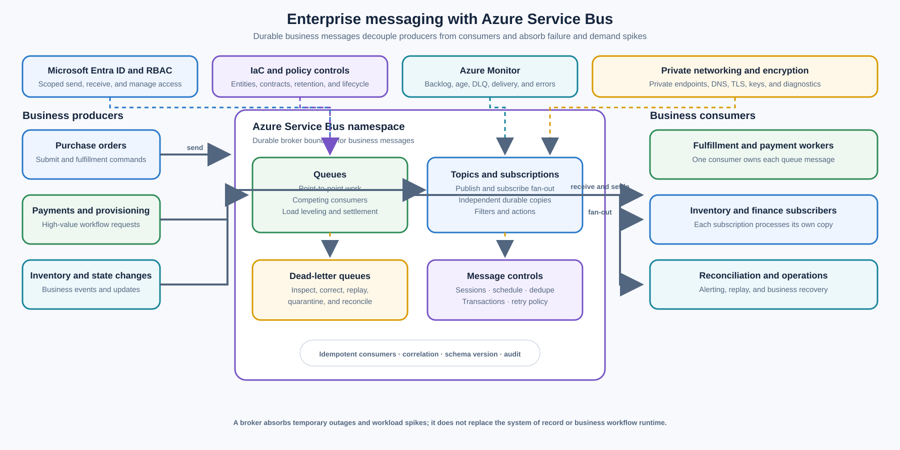

> **Document class:** Enterprise architecture reference model
> **Normative terms:** **MUST**, **MUST NOT**, **SHOULD**, **SHOULD NOT**, and **MAY** are requirements levels.
> **Applicability:** Business messages that require durable buffering, controlled delivery, workflow decoupling, or reliable publish/subscribe fan-out.
> **Exception process:** Deviations require a documented risk assessment, compensating controls, named risk owner, and expiry date.

| Control field | Value |
|---|---|
| Document ID | `ES-02` |
| Owner | Cloud Center of Excellence |
| Review cycle | At least annually and after material Service Bus, identity, network, or message-contract changes |
| Evidence | Message contract, entity and policy definitions, consumer tests, failure tests, security review, and operational readiness review |

# Enterprise Messaging — Azure Service Bus

> **Decision in brief:** Use Service Bus for durable business work and commands. Make consumers idempotent, define dead-letter recovery, and do not treat the broker as the system of record.

## Purpose

This architecture uses Azure Service Bus as the enterprise broker for business messages that must survive temporary producer or consumer outages, absorb workload spikes, and preserve a controlled handoff between independent systems. It supports point-to-point processing with queues and publish/subscribe fan-out with topics and subscriptions.

Typical messages include purchase orders, payment instructions, provisioning requests, inventory updates, shipment commands, and workflow state changes. Producers submit a contract-defined message and continue independently; consumers retrieve, process, and settle messages according to their own capacity and availability.

Service Bus is a messaging broker, not a business workflow engine or system of record. The producer or domain service remains authoritative for business state. Consumers MUST be idempotent and MUST persist their business result or an auditable processing record outside the broker when the outcome matters beyond message retention.

## Scope and design outcomes

Use this model when a workload needs to:

- decouple a producer from a consumer in time and availability;
- distribute independent work across competing consumers;
- publish one business message to multiple independently owned subscribers;
- route poison or unprocessable messages to a dead-letter queue for investigation;
- prevent accidental duplicate sends when a client is uncertain whether a send succeeded;
- schedule a message for future processing;
- preserve processing order for related messages through sessions;
- atomically receive and settle a message while sending resulting messages within the supported transaction boundary; or
- buffer intermittent demand so a downstream service can process at a safe rate.

The target outcomes are:

- every queue, topic, and subscription has an owner, purpose, schema, retention, and support path;
- messages are durable enough for the business recovery objective and carry correlation and idempotency data;
- consumers can retry transient failures without creating unbounded poison-message loops;
- dead-lettered messages are visible, actionable, and recoverable through a controlled procedure;
- workload spikes and temporary downstream outages create bounded backlog instead of synchronous failure cascades;
- ordered processing is applied only to the business key that requires it; and
- message health, age, backlog, delivery attempts, and settlement failures are observable.

## Context and decision drivers

Synchronous calls couple the availability and latency of the caller to every downstream dependency. A producer that must wait for an unavailable payment, provisioning, or inventory service may time out, retry the same operation, or fail a user-facing request even when the work could safely complete later.

The decision is driven by:

- **Reliability:** High-value business messages must not be lost merely because a consumer is unavailable for a period.
- **Temporal decoupling:** Producers and consumers should not need to be online or scaled identically at the same time.
- **Load leveling:** Traffic bursts should become observable backlog that workers can drain at a controlled rate.
- **Fan-out:** Multiple consumers may independently need a copy of a business event without the producer managing one queue per consumer.
- **Failure isolation:** A single malformed or repeatedly failing message must not block unrelated work indefinitely.
- **Ordering and correlation:** Related messages may need ordered handling or a shared session key without imposing global ordering on the whole workload.
- **Auditability:** Message identity, producer, consumer, outcome, and retry history must support reconciliation and incident investigation.
- **Security:** Message data, credentials, network paths, and administrative actions require explicit ownership and least privilege.

## Options considered

### Synchronous API call

Use an API when the caller needs an immediate response, request validation, or a synchronous read. An API is a poor substitute for a durable business command when the downstream service can be temporarily unavailable or the work may take longer than the caller’s request budget. [API-led Integration — Azure API Management](api-led-integration-azure-api-management.md) defines the corresponding controlled API front-door pattern.

### Azure Event Grid

Use Event Grid for notification-oriented event delivery, especially when Azure resource changes or application events should notify subscribers without requiring broker features such as sessions, transactions, or dead-letter-driven work recovery. Event Grid and Service Bus MAY be used together: Event Grid can notify, while Service Bus carries high-value work that requires durable processing semantics.

### Azure Event Hubs or another streaming platform

Use Event Hubs, Kafka, or an equivalent streaming platform for very high-throughput telemetry, append-oriented streams, and independent consumer offsets. Do not choose a stream simply because the payload is called an event. Business commands requiring queue settlement, dead-letter handling, sessions, or broker transactions belong in a message broker such as Service Bus.

### Azure Storage queues

Storage queues can be appropriate for simple, high-volume work queues with simpler delivery requirements. Choose Service Bus when the workload needs topics and subscriptions, message sessions, duplicate detection, transactions, advanced broker semantics, or enterprise-level message governance.

### Selected direction: Azure Service Bus

Use Service Bus for business messages that require durable broker storage, point-to-point or publish/subscribe routing, controlled retries, dead-letter queues, duplicate detection, scheduled delivery, ordered sessions, or transactional messaging. Keep the domain service, workflow runtime, and system of record outside the broker. Use Logic Apps, Functions, containers, or application services to execute business behavior after a message is received.

## Reference architecture

The producer submits a message to a queue or topic and does not call each consumer directly. A queue gives one successful consumer ownership of a message at a time. A topic creates an independent copy for each matching subscription, allowing consumers to scale and fail independently. Consumers settle messages after the business result is durably recorded; failures are retried within bounded policy and eventually moved to the relevant dead-letter queue.

The namespace is a logical capacity and security boundary, not a substitute for workload ownership. Separate namespaces or entities when isolation, data residency, network exposure, lifecycle, or noisy-neighbor risk requires it. Do not place unrelated critical workloads into one namespace merely because they share a client library.

## Entity selection

### Queues for point-to-point work

Use a queue when one consumer or one competing-consumer pool should process each message. Typical uses include:

- purchase-order fulfillment;
- payment instruction processing;
- resource-provisioning requests;
- inventory reconciliation jobs;
- document or batch processing; and
- commands sent to one bounded capability.

Scale consumers horizontally when work is independent and safe to process concurrently. A consumer MUST settle a message only after it has completed the required durable work or recorded a safe, idempotent outcome. A failed or abandoned message must remain eligible for bounded retry rather than being silently acknowledged.

### Topics and subscriptions for publish/subscribe

Use a topic when one publisher should notify multiple independently owned consumers. Each subscription acts as a durable virtual queue for the subscribers’ copy. Use subscription filters to avoid sending every message to every consumer when the business routing rule can be expressed as a stable message property.

Examples include a `PurchaseOrderSubmitted` message delivered independently to fulfillment, inventory, finance, and analytics subscriptions. The publisher must not assume that all subscribers process the message at the same time or in the same order. Each subscriber owns its checkpoint, retry, dead-letter, and reconciliation process.

Do not use a topic as a replacement for a shared database or a global transaction coordinator. Subscribers may be delayed, retried, temporarily unavailable, or permanently retired; the domain contract must define how such states affect the source business process.

### Dead-letter queues

Every production queue and subscription MUST have a documented dead-letter policy. Dead-lettering is an operational state, not message deletion. Messages may be dead-lettered because delivery attempts exceed the configured limit, a message cannot be delivered, a filter or expiration condition applies, or a consumer explicitly rejects it.

The dead-letter process should:

- preserve the original message ID, correlation ID, entity, delivery count, and failure reason;
- alert on count, age, rate, and business criticality rather than only on nonzero volume;
- separate transient dependency failure from malformed contract or permanent business rejection;
- protect sensitive payloads during inspection and reprocessing;
- require an authorized operator or approved replay workflow for resubmission; and
- record whether the message was corrected, replayed, quarantined, reconciled, or permanently rejected.

Never create an automatic infinite dead-letter replay loop. A replay must have a new attempt boundary, a reason, a bounded rate, and a way to stop safely.

### Duplicate detection and idempotency

Enable duplicate detection when a producer can safely provide a stable message ID and a repeated send represents the same business intent. This reduces duplicate broker entries when a client retries after an uncertain network outcome. The detection window and identity fields must match the business retry horizon.

Duplicate detection does not provide end-to-end exactly-once business processing. Consumers can crash after performing a side effect and before settling the message; the broker may deliver the message again. Consumers MUST use an idempotency key, inbox record, unique business constraint, or equivalent deduplication mechanism before applying a non-repeatable side effect.

The idempotency record should bind the message identity to the operation, consumer version, outcome, and relevant business key. Retain it for at least the period in which a duplicate can arrive and the business can still retry or reconcile the operation.

### Scheduled delivery

Use scheduled messages for deferred work such as a renewal attempt, payment retry, reservation expiry, or planned provisioning action. Store the intended execution time and reason in message metadata or the payload, and make the consumer tolerate late delivery because scheduling is not a real-time guarantee.

Scheduled work should have an owner, cancellation path, time zone policy, maximum deferral, and reconciliation process. Do not use a large population of scheduled messages as an unbounded general-purpose scheduler when a dedicated scheduling or workflow service is a better fit.

### Sessions and ordered processing

Use sessions when related messages must be handled in order or when the consumer needs a stable correlation context for request-response or workflow processing. Choose a session ID that represents the smallest business stream requiring ordering, such as an order ID, account ID, or provisioning request ID.

Sessions do not create global ordering across a queue or topic. They can reduce concurrency for a hot key, create lock and ownership behavior that must be monitored, and increase the impact of a stuck session. Consumers must release or abandon session ownership safely and define how a poison message in a session is isolated and recovered.

If messages do not require ordering, omit sessions and scale competing consumers more freely. Do not serialize an entire tenant, region, or business domain when a narrower key is sufficient.

### Transactional messaging

Use a Service Bus transaction when the supported operations need an atomic broker boundary, such as receiving a message from one entity and sending the resulting message to another entity within the same transaction scope. Keep the transaction short and avoid holding a broker lock while calling slow or unreliable external systems.

A Service Bus transaction is not a distributed transaction across an arbitrary database, HTTP service, or SaaS platform. For cross-system consistency, use an outbox, inbox, idempotent consumer, durable workflow, compensating action, or reconciliation process. Document which operations are atomic and which outcomes are eventually consistent.

## Message contract and processing lifecycle

Every business message should use a versioned envelope containing, at minimum:

- `messageId`: stable identity used for tracing and deduplication;
- `messageType`: semantic name such as `PurchaseOrderSubmitted`;
- `schemaVersion`: contract version with a compatibility policy;
- `correlationId`: business workflow or request correlation;
- `causationId`: message or command that caused this message;
- `producer`: service and version that created the message;
- `createdAt`: UTC creation time;
- `subject` or business key: the entity or aggregate the message concerns;
- `tenant` or organizational scope where applicable;
- `dataClassification`: handling and logging classification;
- `traceContext`: distributed-tracing propagation data; and
- `payload` or a claim-check reference to external content.

Do not place large files, images, or sensitive documents directly into a message when an approved encrypted store and claim-check reference is safer. The reference must have an owner, retention policy, authorization check, integrity protection, and deletion behavior that matches the message lifecycle.

The normal processing lifecycle is:

1. The producer validates the command or event, creates the message identity, and sends it to the selected queue or topic.
2. The broker accepts and stores the message; the producer records the accepted message ID when the business workflow requires reconciliation.
3. A consumer receives the message under the selected lock or session model and validates the envelope and schema.
4. The consumer checks idempotency state, performs bounded business work, and records the result durably.
5. The consumer settles the message only after success or an explicitly recorded permanent outcome.
6. A transient failure causes bounded retry with backoff; a permanent or repeatedly failing message moves to the dead-letter queue.
7. Operators reconcile backlog, dead-letter messages, scheduled work, and business state during incidents or recovery.

## Business message examples

| Message | Entity | Consumer behavior | Important controls |
|---|---|---|---|
| Purchase order submitted | Topic with fulfillment, inventory, and finance subscriptions | Each domain processes its own copy and records its result | Correlation ID, schema version, subscription filters, idempotent consumers |
| Payment instruction | Queue | One payment worker owns the message and calls the payment provider | Strict authorization, deduplication, limited retry, audit record, DLQ review |
| Provisioning request | Queue with sessions keyed by request or resource ID | Workers execute steps in order and emit status messages | Session ID, timeout, compensation, retry budget, operational ownership |
| Inventory update | Topic with warehouse, catalog, and reporting subscriptions | Consumers update local views or trigger bounded reconciliation | Ordering per item or location, stale-data policy, replay and reconciliation |
| Renewal or retry action | Scheduled queue message | Consumer attempts work at or after the requested time | UTC schedule, cancellation, late-delivery handling, maximum deferral |

## Security and network architecture

Use Microsoft Entra identities and Azure RBAC for applications and operators where the client and service support managed identity or workload federation. Scope send, receive, listen, and manage permissions separately. Shared Access Signatures MAY be used for a documented compatibility requirement, but keys MUST be stored, rotated, scoped, and audited as secrets.

For sensitive or internal messaging:

- use private endpoints and approved private DNS where the network design requires private access;
- restrict namespace network access and administrative operations to approved identities and paths;
- encrypt messages in transit and configure customer-managed keys when required by the data classification;
- avoid putting credentials, access tokens, or unnecessary regulated data in message bodies or application properties;
- redact sensitive content from diagnostics and dead-letter inspection tools; and
- record changes to namespaces, entities, authorization, network rules, policies, and message retention.

The messaging platform does not authorize the business action by itself. The consumer must validate the producer, message contract, tenant or resource scope, and current business authorization before applying the requested change.

## Resilience, throughput, and cost

Use queue-based load leveling to make temporary outages and bursts visible as backlog rather than synchronous failure. Define acceptable queue age, maximum backlog, drain rate, and the point at which producers must apply backpressure, reject work, or route to a business exception path.

Capacity planning must include message size, ingress and egress rate, concurrent receivers, settlement operations, session hot spots, transactions, duplicate-detection window, retention, scheduled-message volume, peak recovery rate, and regional failover demand. A queue with low message count can still saturate a workload if messages are large or expensive to process.

Use partitioning, multiple entities, or separate namespaces when throughput and isolation require it. Choose the Service Bus tier and availability features from the workload’s recovery objective, network requirements, throughput, and support model. Geo-replication or disaster-recovery features require explicit data-loss, failover, namespace, DNS, credential, and replay decisions; they do not eliminate the need for consumer idempotency and business reconciliation.

The major cost drivers are namespace tier and capacity, message operations, message size, retention, private networking, telemetry ingestion, geo-replication, and consumer compute. Do not retain dead-letter payloads indefinitely or create a topic subscription without an owner and a measured consumer need.

## Operational considerations

The API or messaging platform team owns the namespace baseline, network integration, identity model, tier, quotas, diagnostic settings, client standards, and lifecycle controls. Domain teams own entity definitions, message contracts, consumer behavior, idempotency, dead-letter handling, SLOs, and business reconciliation.

Monitor each queue and subscription for:

- active message count, scheduled message count, and dead-letter count;
- oldest message age and age percentiles;
- ingress, egress, completion, abandon, defer, and dead-letter rates;
- delivery count, lock loss, settlement failures, receiver errors, and throttling;
- session lock duration, session backlog, hot keys, and stuck-session age;
- transaction failures, duplicate-detection behavior, and scheduled-delivery lateness;
- namespace capacity, partition health, network errors, and authentication failures; and
- consumer concurrency, processing latency, dependency errors, and retry rate.

Alerts should be tied to business impact. A rising dead-letter count for payment instructions is more urgent than the same count for a noncritical analytics subscription. Define severity by message type, age, backlog drain time, and downstream consequence.

Runbooks should cover producer outage, consumer outage, dependency outage, poison message, schema incompatibility, duplicate send, lock expiration, stuck session, namespace throttling, private-network failure, expired credential, regional failover, and controlled replay. Replay must be observable and must not overwrite the authoritative business record without reconciliation.

## Validation

- [ ] Each queue, topic, and subscription has an owner, purpose, message contract, audience, retention, and lifecycle state.
- [ ] The entity selection is justified as point-to-point, publish/subscribe, scheduled work, ordered session work, or transactional messaging.
- [ ] Producers and consumers are temporally decoupled and do not require synchronous availability for asynchronous work.
- [ ] Message identity, correlation, causation, schema version, producer, business key, classification, and trace context are defined.
- [ ] Consumers are idempotent and have evidence for duplicate, retry, timeout, and crash-after-side-effect behavior.
- [ ] Dead-letter thresholds, alerts, inspection permissions, replay, quarantine, and reconciliation procedures are tested.
- [ ] Retry and backoff limits prevent poison-message loops and unbounded downstream pressure.
- [ ] Session IDs are narrow enough to preserve required ordering without creating unnecessary hot spots.
- [ ] Transaction boundaries are documented and do not imply unsupported distributed exactly-once behavior.
- [ ] Scheduled messages have cancellation, time-zone, late-delivery, and maximum-deferral behavior.
- [ ] Managed identity or scoped SAS access, private connectivity, encryption, and diagnostic redaction are verified.
- [ ] Queue age, backlog, dead-letter, delivery count, lock, session, transaction, throughput, and throttling metrics are available.
- [ ] Producer and consumer outage tests prove that messages are retained, retried, drained, or dead-lettered as designed.
- [ ] Regional recovery, credential rotation, schema evolution, and controlled replay have current runbooks and evidence.

## Related topics

- [API-Led Integration — Azure API Management](api-led-integration-azure-api-management.md)
- [Azure Data Factory and Data Integration](../data-ai-integration/dai-azure-data-factory-and-data-integration.md)
- [Cloud Operations and Reliability Model](../operations-reliability-finops/cloud-operations-and-reliability-model.md)
- [Validation, Testing, and Operational Readiness](../operations-reliability-finops/validation-testing-and-operational-readiness.md)

## References

- [Azure Service Bus overview](https://learn.microsoft.com/en-us/azure/service-bus-messaging/service-bus-messaging-overview)
- [Service Bus queues, topics, and subscriptions](https://learn.microsoft.com/en-us/azure/service-bus-messaging/service-bus-queues-topics-subscriptions)
- [Publisher-Subscriber pattern](https://learn.microsoft.com/en-us/azure/architecture/patterns/publisher-subscriber)
- [Queue-Based Load Leveling pattern](https://learn.microsoft.com/en-us/azure/architecture/patterns/queue-based-load-leveling)
- [Competing Consumers pattern](https://learn.microsoft.com/en-us/azure/architecture/patterns/competing-consumers)
- [Basic enterprise integration on Azure](https://learn.microsoft.com/en-us/azure/architecture/reference-architectures/enterprise-integration/basic-enterprise-integration)
