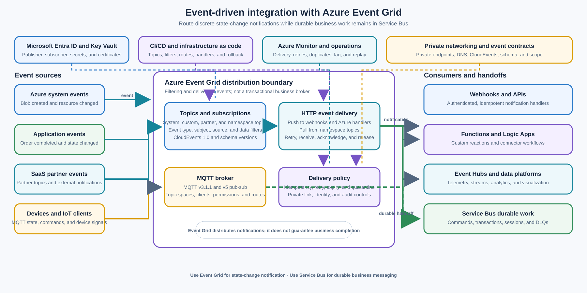

> **文档类型：**企业架构参考模型
> **规范性术语：** **MUST**、**MUST NOT**、**SHOULD**、**SHOULD NOT** 和 **MAY** 是要求级别。
> **适用范围：** 离散状态更改通知、事件路由、事件扇出和 MQTT 发布/订阅场景。
> **例外流程：** 偏离要求需要记录风险评估、补偿控制、指定风险负责人和到期日期。

|控制领域|价值|
|---|---|
|文件编号 | `ES-05` |
|负责人|云卓越中心 |
|审核周期|至少每年一次，并且在 Event Grid 主题、命名空间、交付、协议、身份、网络或事件契约发生重大变化之后|
|证据|事件目录、源和订阅定义、过滤器测试、交付和重试策略、身份和网络审查、处理程序契约测试以及运营就绪情况审查 |

# 事件驱动的集成 - Azure Event Grid

> **简要决定：** 使用 Event Grid 进行离散状态更改通知和路由。使用 Service Bus 进行持久的业务工作，使用 Event Hubs 进行大容量流。

## 目的

此体系结构使用 Azure Event Grid 来分发发生有意义的状态更改的通知。事件宣布一个事实，例如正在创建 blob、Azure 资源更改、订单完成、设备状态更改或 SaaS 合作伙伴发出事件。订阅者决定是否以及如何响应。

Event Grid 是一种用于事件分发的托管发布-订阅服务。它支持 HTTP 事件传递、CloudEvents 1.0、过滤、推拉消费以及 MQTT 消息传递场景。使用它将事件源连接到 webhook、函数、Logic Apps、Event Hubs 和其他批准的事件处理程序。 [Microsoft: Azure Event Grid 简介](https://learn.microsoft.com/en-us/azure/event-grid/overview)

Event Grid 是事件通知和路由边界，而不是通用应用运行时或事务业务代理。当需求包括事务消息传递、会话、有序处理、复杂的队列语义、持久业务命令或死信驱动的工作恢复时，请勿将其用作[企业消息传递 - Azure Service Bus](enterprise-messaging-azure-service-bus.md) 的替代品。一种常见的模式是用于通知的 Event Grid 和用于通知后持久工作的 Service Bus。

## 范围和设计成果

当工作负载需要执行以下操作时，请使用此模型：

- 宣布资源、实体、进程或设备状态发生改变；
- 将一个事件分发给多个由不同团队负责的订阅者；
- 按类型、主题、来源或其他事件属性过滤事件；
- 将 Azure 系统事件、应用事件、合作伙伴事件或设备事件连接到处理程序；
- 使用 CloudEvents 1.0 实现可互操作的事件信封；
- 通过推送传递将事件传递到 HTTP 端点；
- 当消费者需要控制接收和确认时间时，通过 HTTP 拉取传递来消费名称空间主题事件；
- 发布和订阅支持的物联网和设备场景的 MQTT 主题；或者
- 通知工作流、函数、数据管道或持久消息传递边界，而无需将源耦合到每个使用者。

目标结果是：

- 每个事件类型都有源所有者、语义、模式、版本、数据分类和生命周期；
- 事件代表事实或通知，而不是无限的命令或隐藏的工作流程步骤；
- 每个事件订阅都有一个负责任的所有者、过滤器、目的地、身份、重试行为和支持路径；
- 处理程序是幂等的，并根据事件契约容忍重复、延迟、无序和丢失通知；
- 过滤器减少不相关的交付，而不会成为未文档化的授权边界；
- 根据消费者可用性、网络、延迟、规模和操作要求选择推送、拉取和 MQTT 交付模式；
- 事件失败是可观测的，并导致明确的重放、协调、隔离或持久工作路径；和
- 事务性业务消息传递保留在 Service Bus 或其他适合用途的代理中。

## 背景和决策驱动因素

许多系统需要在发生变化时做出响应，而不需要源了解每个消费者。 Blob 存储不应直接调用每个处理器，订单服务不应对每个通知订阅者进行硬编码，Azure 资源提供程序不应在资源所有者中嵌入特定于应用的工作流。Event Grid 提供了一个路由边界，允许源发布状态更改事件，同时订阅者独立发展。

该决定的驱动因素是：

- **事件含义：** 有效负载描述了消费者可以独立解释的离散状态更改或通知。
- **扇出：** 多个订阅者需要具有独立过滤器、目的地、所有权和处理速率的同一事件。
- **松耦合：**生产者不应包含特定于消费者的端点、工作流逻辑或重试行为。
- **协议适合：** 消费者需要 HTTP 推送、HTTP 拉取、CloudEvents 或 MQTT 来进行设备和应用发布/订阅。
- **延迟：** 消费者应在状态更改发生时及时响应，而无需轮询源。
- **过滤：** 订阅者应仅接收与类型、主题、来源、租户或业务范围匹配的事件。
- **操作模型：** 团队可以为每个订阅定义交付、重试、复制、重播和协调行为。
- **持久性边界：**工作负载可以将通知与需要代理语义的持久业务工作区分开来。

## 考虑的选项

### Azure Service Bus

当事件实际上是业务命令或持久工作项，需要具有代理语义的队列、主题和订阅、死信队列、会话、排序、重复检测、计划传递或事务时，请使用[企业消息传递 - Azure Service Bus](enterprise-messaging-azure-service-bus.md)。Event Grid MAY 发布或路由导致创建 Service Bus 消息的通知，但 Event Grid 不会替换持久处理边界。

### Azure Event Hubs 或其他流平台
使用 Event Hubs、Kafka、Fabric Eventstreams 或其他流平台进行大容量遥测、面向追加的流、事件时间处理、消费者偏移以及对连续数据流的分析。Event Grid MQTT 可以将设备消息和事件路由到下游服务，但不应仅仅因为大容量数据点称为事件而选择 Event Grid。

### Azure Logic Apps

当响应主要是涉及审批、计划、SAP、SFTP、B2B、SaaS 或云到本地控制流的多步骤连接器工作流时，请使用[工作流编排 - Azure Logic Apps](workflow-orchestration-azure-logic-apps.md)。Event Grid 可以触发 Logic Apps 工作流，但 Event Grid 仍然是通知和路由边界。

### Azure Functions

当事件处理程序需要实际代码进行验证、转换、协议适应或有界自定义操作时，请使用[无服务器自定义集成 - Azure Functions](serverless-custom-integration-azure-functions.md)。函数应根据交付契约确认或完成事件，并在处理无法安全地保留在事件处理程序边界内时将持久工作交给 Service Bus。

### 轮询或直接同步调用

轮询会引入延迟、负载、重复读取和特定于源的协调。当调用者需要立即响应或请求结果时，直接调用可能是合适的，但它们将源可用性与每个消费者联系起来。当源状态更改应通知多个使用者而无需同步使用者调用时，请使用 Event Grid。

### 选择方向：Azure Event Grid

使用 Event Grid 来获取离散状态更改通知：创建了 blob、更改了 Azure 资源、完成了订单、更改了设备状态或 SaaS 合作伙伴发出了事件。从源和使用者拓扑中选择事件主题和传递模型。当下游需求是具有事务性、有序性、会话性、重复检测或复杂队列语义的持久业务工作时，请选择 Service Bus。

## 参考架构

Azure 系统主题、自定义应用主题、合作伙伴主题、命名空间主题和 MQTT 客户端发布事件。Event Grid 应用事件订阅过滤器，并通过 HTTP 推送、HTTP 拉取、MQTT 或批准的事件处理程序传递相关事件。函数、Logic Apps、webhook 和数据服务响应通知；当通知必须成为业务命令或可恢复处理项时，Service Bus 接收持久工作。

来源负责含义和发布契约。Event Grid 负责分发和订阅路由。每个处理程序都负责验证、幂等性、授权、业务处理和自己的结果。任何组件都不应仅仅因为 Event Grid 交付了事件就推断业务已成功完成。
[异步消息传递选项](https://learn.microsoft.com/en-us/azure/architecture/guide/technology-choices/messaging) 指南将 Event Grid 置于离散事件和发布者-订阅者类别中，并显示了一种常见组合，其中 Event Grid 将工作流相关事件发送到 Service Bus，而通知事件发送到 Logic Apps。当事件通知和持久业务工作具有不同的可靠性和处理要求时，应用该组合。

## 事件模型和事件目录

### 状态改变语义

事件 MUST 描述已经发生的事情或源被授权宣布的状态转换。示例包括：

|活动 |来源 |典型订阅者 |边界 |
|---|---|---|---|
|创建 Blob | Azure Storage 系统主题 |恶意软件扫描器、元数据索引器、通知工作流程 |文件处理器负责处理能力；该事件不保证文件永久可用 |
| Azure 资源已更改 | Azure 资源提供商系统主题|策略评估器、清单索引器、操作告警、合规工作流程 |资源事件是一个通知；在应用策略操作之前查询当前资源状态 |
|订单完成 |订单或业务请求 |客户通知、履行视图、分析、忠诚度服务 |使用 Service Bus 执行持久命令，例如付款采集或配置工作 |
|设备状态更改 |使用 HTTP 或 MQTT 的 IoT 或设备应用 |设备孪生更新、告警、遥测路由、控制平面响应 |使用流或设备平台进行遥测并使用显式命令语义进行控制操作 |
| SaaS 合作伙伴发出了一个事件 |合作伙伴主题或合作伙伴 Webhook 集成 | CRM 同步、案例管理、对账、通知 |验证合作伙伴身份、契约版本、签名和重复行为 |

事件 SHOULD 以有意义的事实或转换命名，例如 `OrderCompleted`、`BlobCreated`、`ResourceUpdated` 或 `DeviceStateChanged`。避免隐藏命令或实现细节的名称。如果使用者必须代表调用者执行操作，请将该操作建模为持久命令边界上的命令，而不是依赖事件名称来暗示有保证的执行。

### 活动信封

在源和使用者都支持的情况下，将 CloudEvents 1.0 用于可互操作的 HTTP 事件契约。至少定义：

- 事件 ID 和来源；
- 活动类型和主题；
- 事件时间和数据内容类型；
- CloudEvents 规范版本和架构或数据版本；
- 业务流程存在的相关性和因果关系标识符；
- 应用的租户、组织或资源范围；
- 数据分类和保留处理；和
- 具有完整性和授权规则的有效负载或声明检查参考。

事件 ID 标识通知发生。它不会自动成为每个下游业务操作的幂等键。除了事件 ID 之外，处理程序可能还需要业务密钥、源版本、实体版本或操作 ID，以区分重复通知和合法的后续状态更改。
请勿在事件中放置凭据、访问令牌、过多的受监管数据或大型二进制内容。当处理程序需要检索大型或敏感负载时，请使用对已批准存储的授权引用。参考 MUST 具有所有者、到期或保留策略、访问检查、完整性保护和恢复行为。

### 版本控制和兼容性

事件模式 版本 MUST 独立于生产者部署版本。附加变更 SHOULD 保护现有消费者；重大更改需要新类型、版本化架构或兼容性边界。消费者 MUST 容忍未知字段，并应在应用副作用之前验证所需字段。

维护包含事件类型、目的、来源、架构、示例有效负载、所有者、订阅者、数据分类、保留、预期频率、重复行为、弃用日期和支持路径的事件目录。请勿发布没有负责任的来源所有者或消费者契约的活动。

## 主题、订阅和过滤

### 主题选择

使用 Azure 服务事件的系统主题、应用发布的事件的自定义主题、受支持的 SaaS 合作伙伴事件的合作伙伴主题、发布边界需要多个域主题时的域以及 Event Grid 命名空间 HTTP 和拉式交付模型的命名空间主题。

主题所有权 MUST 反映源或发布域。当生命周期、身份、数据分类、区域、网络暴露、吞吐量或操作所有权需要隔离时，单独的主题或命名空间。不要仅仅因为生产者使用相同的 SDK 而将不相关的敏感事件放在一个主题中。

### 事件订阅

事件订阅定义了消费者接收哪些事件以及将这些事件传递到何处。每个订阅应该有：

- 所有者和商业目的；
- 来源主题和环境；
- 事件类型、主题模式和高级过滤规则；
- 目的地或拉动消费者身份；
- 重试、死信、过期和禁用行为；
- 网络和认证路径；
- 数据分类和诊断策略；和
- 仪表板、告警、操作手册和停用日期。

订阅不是授权系统。过滤器减少了交付和成本，但处理程序 MUST 在应用副作用之前重新验证事件类型、源、租户、主题、资源范围和当前授权。

### 过滤

根据稳定事件属性进行筛选，例如事件类型、主题、来源、数据版本、租户、资源组或业务范围。与接收每个事件并仅在应用代码中进行过滤的广泛消费者相比，更喜欢少量的明确订阅。

将过滤器视为版本化策略。测试正面和负面案例、区分大小写、缺失属性、架构更改、默认行为以及与多个订阅匹配的事件。对过滤器的更改可以改变哪些消费者看到与业务相关的事件；与来源和订户所有者一起审查。
不要使用过滤器来实现隐藏的工作流程、授权决策或数据保留策略。如果不同的消费者需要截然不同的契约或安全控制，请发布显式事件类型或使用受控转换边界。

## 交付模式

### HTTP 推送传递

当消费者公开已批准的端点并且应该在发生更改时接收事件而不是轮询时，请使用推送交付。Event Grid 将事件发送到配置的目标，其中可能包括 Webhook、函数、Logic Apps、Event Hubs 或其他支持的处理程序。

推送端点 MUST 满足以下要求：

- 验证 Event Grid 或验证配置的身份和来源；
- 将订阅验证事件作为受控预配步骤进行处理；
- 在处理之前验证 CloudEvents 或选定的事件模式；
- 仅在事件根据处理程序的契约被安全接受后才返回成功；
- 在支持的情况下，针对暂时不可用返回可重试失败，针对永久拒绝返回不可重试响应；
- 是幂等的，因为事件可以多次传递；
- 避免在进行无限制的业务工作时保持交付状态；和
- 公开响应、延迟、重试和拒绝指标，而不记录敏感负载。

Event Grid 推送传递根据其传递策略重试暂时性失败。重试策略不是端到端的业务恢复过程。定义重试耗尽后会发生什么，包括支持的死信或隔离行为、告警、重播、协调消费者禁用。

### HTTP 拉取交付

当使用者需要控制何时接收事件、无法公开端点、需要私有链接访问权限来使用事件或必须控制使用速率和计时时，请对 Event Grid 命名空间主题使用拉取传递。拉取消费者接收事件并根据命名空间交付契约使用支持的操作来确认、释放、拒绝或更新锁。

拉式交付为命名空间主题提供类似队列的消费控制，但假设它提供所有 Service Bus 语义。在选择用于业务工作之前，评估所需的事务边界、会话排序、重复检测、死信、消息延迟、计划交付、保留和消费者协调。

拉动消费者应该：

- 限制其下游容量的接收并发；
- 当处理无法在交付窗口内完成时，安全地更新或释放锁定；
- 仅在处理程序记录安全结果后才确认；
- 拒绝或隔离格式错误的事件，而不创建无限的发布循环；
- 记录事件 ID、来源、类型、锁定或尝试状态、结果和相关性；和
- 监控接收期限、活动锁定、释放计数、确认延迟、拒绝和积压。

### MQTT 发布和订阅
使用 Event Grid 的 MQTT 代理功能来支持需要 MQTT v3.1.1 或 v5 发布/订阅、自定义主题结构、多对一摄取、一对多分发或设备到服务路由的受支持 IoT 和设备场景。定义主题空间、客户端组、权限绑定、证书或身份验证、保留消息行为、共享订阅以及到 Azure 服务的路由。

MQTT 事件和遥测不会自动成为持久业务命令。对于高速遥测、时间序列分析或事件流处理，请在适当的情况下使用 Event Hubs、Fabric Eventstreams、IoT Operations 或其他适合用途的数据平台。对于设备控制，对调用者进行身份验证、授权命令、使用显式命令契约并定义传送和设备确认行为。

MQTT 支持具有随时间变化的服务、区域、配额、协议、客户端和功能限制。在生产设计之前确认当前层、区域、吞吐量、保留消息、共享订阅、身份验证、私有网络和路由支持。

## 可靠性、重复和恢复

### 通知未完成

Event Grid 传递是指事件系统根据选定的传递模型接受或传递通知。它不能证明下游工作流程已完成、付款已结算、设备应用了命令或已提交数据库事务。

源 MUST 公开一种在业务成果重要时查询当前状态或协调事件历史记录在案的方法。消费者应将事件视为在适当时阅读或协调权威状态的提示。在没有安全业务检查的情况下，丢失、延迟、重复或无序事件不得导致不可逆转的操作。

### 幂等处理程序

每个会更改状态的处理程序 MUST 定义其幂等性策略。使用事件 ID、业务操作密钥、实体版本、源序列、收件箱记录、唯一约束或等效机制。在协调需要时，将处理后的日志记录绑定到事件类型、源、使用者版本、结果和业务键。

当生产者为同一业务操作发出新的事件 ID 或在更正后故意重复事件时，单独的事件 ID 重复数据删除可能是不够的。定义哪些重复版本是安全的，哪些是过时的版本，哪些代表新的状态转换。

### 失败和重播

将失败分类为验证、身份验证、授权、暂时依赖、限制、超时、永久业务拒绝或消费者缺陷。仅重试具有有限尝试和退避的瞬态条件。不要无限期地重试格式错误的事件或授权失败。

每个订阅都需要针对交付失败、禁用端点、过期目的地、无法处理的事件、架构不兼容、合作伙伴中断和处理程序回归的恢复计划。该计划应确定是否从 Event Grid 功能重播、重新发布更正的事件、查询权威状态、创建 Service Bus 工作项或手动协调。
切勿创建自动无限重播循环。重播 MUST 具有新的尝试边界、操作员或批准的自动化所有者、有界速率、原因和停止条件。保留原始事件 ID 和相关数据，同时单独记录重播尝试。

## 安全和网络

在支持的情况下，为发布者、订阅者和事件处理程序使用 Microsoft Entra 托管标识或工作负载标识。将权限范围限制到所需的确切主题、命名空间、事件订阅、MQTT 主题空间、客户端组、路由或目标。单独的发布、订阅管理、消费者和操作权限。

使用 Key Vault 或经批准的机密管理服务保护 Webhook 机密、证书、MQTT 客户端凭据、合作伙伴身份验证和目标连接数据。与所有者轮换凭证、重叠过程、验证测试和回滚路径。在处理之前使用支持的身份验证、签名或证书机制验证合作伙伴事件。

对于敏感或内部事件流：

- 使用私有端点和批准的私有 DNS 来支持 Event Grid 和命名空间访问路径；
- 确定推送或拉取传递是否与所需的网络方向匹配，因为拉取场景可能支持专用链路访问，而推送需要适当的目标端点；
- 将入口、出口、IP 过滤、主题空间、客户组和事件订阅限制在批准的边界内；
- 验证处理程序中的事件源、主题、租户、资源范围和当前授权；
- 对事件有效负载、诊断、死信或隔离日志记录以及运行历史记录进行分类和脱敏；
- 防止事件数据在未经批准的情况下跨越环境、区域、租户或监管边界；和
- 审核主题、命名空间、订阅、过滤器、路由、身份、证书和网络更改。

Event Grid 过滤和主题访问不授权业务操作。消费者仍然负责授权、租户隔离、输入验证以及防止事件欺骗或混淆代理行为。

## 性能、成本和工作负载边界

围绕事件入口、出口、事件大小、订阅计数、过滤器复杂性、交付模式、重试量、拉取并发、MQTT 客户端、主题空间、吞吐量单位、私有端点、目标执行、遥测以及跨区域或出口流量规划容量和成本。使用当前的 Event Grid 层、配额、限制和定价文档进行估算。

使用过滤器和事件契约来避免提供不相关的数据。当单个共享边界会产生噪音邻居或安全风险时，按生命周期、区域、租户、数据分类或吞吐量对主题或命名空间进行分区。不要为每个单独的事件实例创建主题或订阅。

Event Grid 适用于事件分发和事件驱动响应。它不是以下用途的正确引擎：

- 大型分析连接、聚合或批量转换；
- 需要队列语义的持久采购订单、付款、预配或清单工作；
- 相关活动的全球排序或会议；
- 跨数据库和多个外部系统的分布式事务；
- 长时间运行、连接器较多的业务工作流程；或
- 任意应用代码、有状态域逻辑或日志系统。

根据主要要求使用 Service Bus、Event Hubs、Data Factory、Fabric、Synapse、Logic Apps、Functions 或应用运行时。Event Grid 可以保留将工作交给这些服务的通知触发器或路由步骤。

## 部署和生命周期

将主题、命名空间、事件订阅、过滤器、路由、身份、网络控制、证书、客户端组、主题空间和处理程序配置作为版本化部署输入进行管理。特定于环境的端点和凭证 MUST 来自批准的配置和机密存储。

每个事件订阅版本 SHOULD 包括：

- 源事件契约和示例有效负载；
- 过滤正面、负面、缺失字段和模式版本测试；
- 身份验证、授权、网络、私有 DNS 和端点验证；
- 重复、延迟、乱序、重试、超时、拒绝和重放测试；
- 目的地节流、下游中断和背压行为；
- 主题、命名空间、订阅、MQTT 或合作伙伴制品更改；
- 遥测、告警、仪表板、操作手册和支持所有者更新；和
- 成本、配额、吞吐量和保留审查。

当更改可能改变订阅者行为时，将事件模式、过滤器和处理程序一起版本化。定义旧消费者是否保持订阅、事件是否双重发布、如何处理正在进行的交付以及旧事件类型或订阅何时停用。

## 可观测性和操作

集成平台团队负责批准的 Event Grid 层、命名空间、主题模式、身份、网络集成、共享策略、遥测和服务标准。源团队负责事件含义、架构、版本控制、发布行为和当前状态协调。订阅者团队负责处理程序的正确性、幂等性、授权、下游依赖项、SLO 和恢复。安全和治理团队定义数据保护、网络、审计、保留和异常要求。

每个生产事件类型和订阅都应该有一个操作记录，其中包含源、事件类型、模式版本、所有者、目的、分类、预期数量、主题或命名空间、过滤器、目的地、交付模型、身份、网络路径、重试和重放策略、支持路径以及停用或审核日期。

至少监控：

- 发布、匹配、交付、确认、拒绝、发布、过期和死信事件；
- 传递延迟、事件期限、重试计数、重试耗尽、目标响应和处理程序持续时间；
- 过滤匹配率、丢弃或不匹配的事件、订阅更改和意外扇出；
- 重复、陈旧版本、无序、格式错误、未经授权和永久拒绝计数；
- HTTP 推送端点可用性、响应代码、延迟、限制、TLS 和身份验证失败；
- HTTP 拉取接收、锁定、释放、更新、确认、拒绝和积压行为；
- MQTT 连接客户端、身份验证、授权、发布、订阅、保留、共享订阅和路由行为；
- 主题、命名空间、吞吐量单位、配额、区域、私有端点和网络运行状况；
- 下游 Service Bus 积压、Function 故障、Logic Apps 运行、Event Hubs 滞后以及 Event Grid 交接任务的数据管道状态；和
- 事件契约、过滤器、主题、命名空间、身份、证书、网络、路由和部署更改。

Runbook 应涵盖发布者故障、主题或命名空间中断、订阅错误配置、过滤器回归、推送端点中断、拉取消费者滞后、锁定或确认失败、MQTT 客户端或证书故障、合作伙伴事件拒绝、架构不兼容、重复副作用、重试耗尽、Service Bus 切换失败以及受控重播或协调。

## 验证

- [ ] 事件表示离散状态更改或通知，并记录源、语义所有者、模式、版本和当前状态协调路径。
- [ ] Event Grid 不被用作 Service Bus 事务消息传递、会话、有序处理、复杂队列语义或持久业务工作的替代品。
- [ ] 主题、命名空间、系统/自定义/合作伙伴源、MQTT 主题空间和环境边界是适当且有明确负责人的。
- [ ] 每个事件订阅都有所有者、目的、事件过滤器、目的地、身份、网络路径、重试策略、失败路径以及停用或审核日期。
- [ ] CloudEvents 1.0 或选定的事件信封定义 ID、源、类型、主题、时间、数据版本、相关性、范围、分类以及有效负载或声明检查行为。
- [ ] 事件契约进行版本控制，测试向后兼容性，并安全处理未知字段或过时版本。
- [ ] 推送端点验证源、身份验证、订阅事件、模式、幂等性、响应语义和重试行为。
- [ ] Pull 消费者定义接收、锁定、确认、释放、拒绝、更新、并发、私有网络和积压行为。
- [ ] MQTT 场景定义协议版本、客户端身份、主题空间、权限、保留消息、共享订阅、路由和设备确认（如果适用）。
- [ ] 过滤器具有肯定、否定、缺失字段、案例、版本、重叠和默认行为测试，并且不被视为业务授权。
- [ ] 处理程序是幂等的，并针对重复、延迟、无序、格式错误、未经授权、陈旧和重播事件进行了测试。
- [ ] 记录并测试重试、隔离、死信或等效恢复、重放、协调无限循环预防。
- [ ] 大型分析转换、持久业务命令、长时间运行的工作流程、分布式事务和应用逻辑被委托给适合用途的服务。
- [ ] 验证身份、证书、机密、私有端点、DNS、网络方向、租户隔离、有效负载脱敏和审计控制。
- [ ] 仪表板、告警、事件目录证据、支持联系人、依赖 SLO、成本和配额限制以及操作运行手册在生产前准备就绪。
## 相关主题

- [企业消息传递 - Azure Service Bus](enterprise-messaging-azure-service-bus.md)
- [无服务器自定义集成 - Azure Functions](serverless-custom-integration-azure-functions.md)
- [工作流程编排 - Azure Logic Apps](workflow-orchestration-azure-logic-apps.md)
- [API 主导的集成 — Azure API Management](api-led-integration-azure-api-management.md)
- [验证、测试和运营就绪](../operations-reliability-finops/validation-testing-and-operational-readiness.md)

## 参考文档

- [Azure Event Grid 简介](https://learn.microsoft.com/en-us/azure/event-grid/overview)
- [HTTP 推送](https://learn.microsoft.com/en-us/azure/event-grid/push-delivery-overview)
- [Event Grid 命名空间主题的概念](https://learn.microsoft.com/en-us/azure/event-grid/concepts-event-grid-namespaces)
- [Azure Event Grid 中的 MQTT 代理](https://learn.microsoft.com/en-us/azure/event-grid/mqtt-overview)
- [选择正确的 Event Grid 层](https://learn.microsoft.com/en-us/azure/event-grid/choose-right-tier)
- [异步消息传递选项](https://learn.microsoft.com/en-us/azure/architecture/guide/technology-choices/messaging)
- [Azure Event Grid 的架构最佳实践](https://learn.microsoft.com/en-us/azure/well-architected/service-guides/azure-event-grid)
