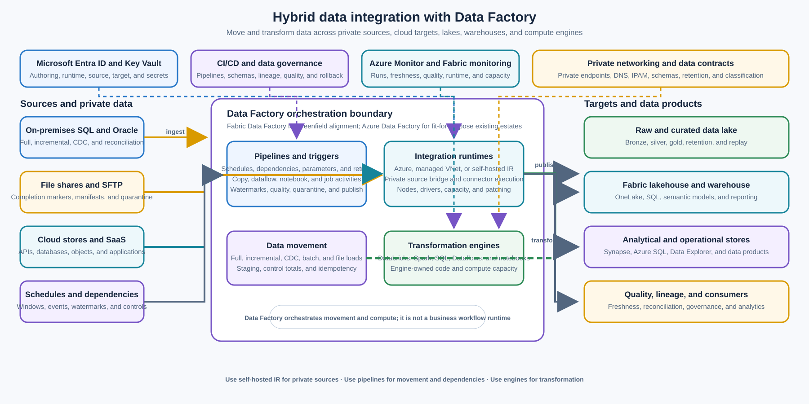

> **Document class:** Enterprise architecture reference model
> **Normative terms:** **MUST**, **MUST NOT**, **SHOULD**, **SHOULD NOT**, and **MAY** are requirements levels.
> **Applicability:** Batch ETL and ELT, replication, on-premises ingestion, data-lake loading, scheduled pipelines, dependency orchestration, and transformation-engine coordination.
> **Exception process:** Deviations require a documented risk assessment, compensating controls, named risk owner, and expiry date.

| Control field | Value |
|---|---|
| Document ID | `ES-07` |
| Owner | Cloud Center of Excellence |
| Review cycle | At least annually and after material Data Factory, Fabric workspace, integration runtime, connector, network, schema, storage, or transformation-engine changes |
| Evidence | Pipeline and data-contract definitions, source and target inventory, integration-runtime topology, identity and network review, data-quality tests, capacity model, and operational readiness review |

# Hybrid Data Integration — Azure Data Factory or Fabric Data Factory

> **Decision in brief:** Use Data Factory or Fabric Data Factory for governed data movement and pipeline orchestration. Keep business messaging, synchronous APIs, and application logic in purpose-built services.

## Purpose

This architecture uses Azure Data Factory or Data Factory in Microsoft Fabric to move, transform, schedule, and orchestrate data across cloud and private environments. Typical workloads include batch ETL and ELT, database and file replication, on-premises SQL or Oracle ingestion, file-share ingestion, data-lake loading, pipeline scheduling and dependency orchestration, and coordination of Databricks or other transformation engines.

The integration runtime provides the execution bridge between pipeline control and data stores or compute services. A self-hosted integration runtime can run close to private or on-premises data sources and securely move data between those sources and cloud destinations. [Azure Data Factory introduction](https://learn.microsoft.com/en-us/azure/data-factory/introduction)

Microsoft describes Data Factory in Microsoft Fabric as the next generation of Azure Data Factory and recommends Fabric Data Factory as the starting point for new data-integration projects. Existing Azure Data Factory deployments are not automatically obsolete: retain and evolve an existing ADF estate when it remains fit for its workloads, governance, network, operating model, and investment. Treat Fabric adoption as a greenfield or migration decision with evidence, not as an unplanned replacement mandate. [What is Data Factory in Microsoft Fabric](https://learn.microsoft.com/en-us/fabric/data-factory/data-factory-overview)

Data Factory is a data movement and pipeline orchestration boundary, not a transactional enterprise message broker, a synchronous API integration layer, or a general-purpose application runtime. Use [Enterprise Messaging — Azure Service Bus](enterprise-messaging-azure-service-bus.md) for durable business commands, [Event-Driven Integration — Azure Event Grid](event-driven-integration-azure-event-grid.md) for discrete state-change notifications, and [Workflow Orchestration — Azure Logic Apps](workflow-orchestration-azure-logic-apps.md) for connector-heavy business processes.

## Scope and design outcomes

Use this model when a workload needs to:

- copy data between on-premises, private-cloud, and cloud data stores;
- run scheduled batch ETL or ELT with explicit dependencies and parameterization;
- replicate databases, tables, files, or change streams into a data lake, lakehouse, warehouse, or analytical store;
- ingest SQL Server, Oracle, file shares, SFTP, object storage, SaaS, or other supported data sources;
- trigger ingestion when a file arrives or a defined schedule, window, or dependency is ready;
- dispatch transformations to Databricks, Spark, SQL, Fabric Dataflows, notebooks, or another approved compute engine;
- enforce data validation, quality checks, quarantine, watermarking, and reconciliation; or
- coordinate a data product lifecycle across development, test, staging, production, and recovery environments.

The target outcomes are:

- every pipeline, dataset, linked service, integration runtime, source, target, transformation, schedule, and data contract has an owner and lifecycle state;
- Azure Data Factory or Fabric Data Factory is selected deliberately based on greenfield status, analytics platform alignment, network topology, governance, and migration cost;
- private and on-premises data access uses a resilient, monitored, and patched self-hosted integration runtime or an approved managed-network alternative;
- ingestion is incremental and restartable where volume or recovery requirements justify it;
- data movement, transformation, validation, quarantine, and publication stages are explicit and observable;
- source and target systems are protected from unbounded concurrency, repeated extraction, and retry amplification;
- schemas, quality rules, lineage, classification, retention, and access controls follow the data through the pipeline; and
- business workflows, transactional commands, event notifications, and application logic remain in purpose-fit services.

## Context and decision drivers

Hybrid data integration often crosses different database engines, file formats, networks, schedules, ownership boundaries, and data-quality expectations. A pipeline must coordinate movement and transformation without requiring every source to expose a public endpoint or every target to know the details of every upstream system.

The decision is driven by:

- **Workload shape:** Batch, incremental, CDC, file-based, scheduled, dependency-driven, or transformation-engine orchestration.
- **Source and target reach:** On-premises databases, private file shares, cloud stores, SaaS systems, lakes, lakehouses, and warehouses.
- **Greenfield versus estate:** Whether the workload starts in Microsoft Fabric or must coexist with an established Azure Data Factory estate.
- **Analytics alignment:** Need for Fabric workspace, lakehouse, Dataflows Gen2, Fabric pipelines, OneLake, real-time analytics, or existing Azure data services.
- **Network and security:** Private endpoints, managed virtual networks, ExpressRoute or VPN, firewalls, DNS, customer-managed keys, and data-residency requirements.
- **Scale and performance:** Data volume, file count, parallelism, source limits, transformation duration, SLA, and recovery time.
- **Operational model:** Workspace and capacity ownership, integration-runtime patching, CI/CD, monitoring, lineage, support, and cost management.
- **Migration and continuity:** Existing pipelines, connectors, triggers, SSIS, linked services, dependencies, run history, and retraining cost.

## Service and platform selection

| Requirement | Preferred direction | Why | Important boundary |
|---|---|---|---|
| New data-integration project aligned to Microsoft Fabric analytics | Fabric Data Factory | Microsoft describes it as the next generation with a unified Fabric data, engineering, analytics, and reporting context | Validate workspace, capacity, governance, connector, private-access, regional, and migration requirements |
| Existing Azure-first estate with stable ADF pipelines | Azure Data Factory | Existing pipelines, linked services, IR topology, CI/CD, and operational investment can remain valid | Continue lifecycle management and reassess Fabric when business or platform requirements change |
| Private or on-premises source access | Self-hosted integration runtime or approved managed-network IR | Provides an execution bridge near the source or through private connectivity | Operate nodes, patching, credentials, capacity, network paths, high availability, and monitoring |
| Batch ETL or ELT into lake, warehouse, or lakehouse | ADF or Fabric pipelines with Copy, Dataflow, SQL, Spark, or Databricks activities | Separates movement, transformation, dependency control, and publication | Pipeline orchestration does not replace the data-processing engine or data model |
| Databricks, Spark, notebook, or external transformation coordination | ADF or Fabric pipeline invoking the engine | Pipeline owns dependencies, parameters, retries, and completion state | Transformation code and runtime capacity remain owned by the engine team |
| Durable business command or application workflow | Service Bus, Logic Apps, Functions, or application runtime | Provides message settlement, connector workflow, or custom code semantics | Data Factory should not become an application workflow or transactional broker |

### Greenfield guidance

For a new data-integration project, start with Fabric Data Factory when the organization has an approved Fabric tenant, workspace, capacity, security model, data governance model, and analytics target. Confirm connector coverage, hybrid connectivity, private networking, source and destination support, CI/CD, monitoring, cost, regional availability, and data residency before committing.

Fabric Data Factory combines data movement, Dataflows Gen2, pipelines, lakehouse-oriented workflows, and Fabric analytics integration. A greenfield decision MUST still identify the system of record, target data model, compute engine, retention policy, access model, recovery objective, and operational owner.

### Existing Azure Data Factory guidance

An existing ADF deployment remains a supported architecture when its pipelines, connectors, integration runtimes, network controls, monitoring, governance, and operating model meet the workload requirements. Do not migrate only to follow a product label or to reset accumulated platform knowledge without a measurable benefit.

Assess Fabric migration when the workload needs closer integration with OneLake, Fabric lakehouses, Dataflows Gen2, Fabric notebooks, real-time analytics, unified governance, or new Data Factory capabilities. Assess staying on ADF when the estate has mature Azure-native controls, specialized connectors, SSIS requirements, private-network topology, contractual constraints, or migration risk that outweighs the benefit.

Migration MUST be treated as a managed change. Inventory pipelines, triggers, linked services, datasets, integration runtimes, credentials, schedules, parameters, dependencies, custom activities, SSIS packages, runbooks, SLAs, cost, and historical evidence. Test the new platform with representative volume, private connectivity, failure behavior, and recovery before retiring the ADF implementation.

## Reference architecture

Sources include on-premises SQL and Oracle databases, file shares, SFTP, cloud stores, SaaS systems, and APIs. ADF or Fabric Data Factory pipelines trigger and coordinate Copy, dataflows, SQL, notebooks, Databricks, Spark, and other transformation activities. A self-hosted integration runtime runs close to private sources and provides the network execution bridge; an Azure or Fabric-managed runtime handles supported cloud paths and managed compute.

Targets include a raw or bronze data lake, lakehouse, warehouse, analytical store, curated data products, and operational reporting. Azure Monitor or Fabric monitoring captures pipeline runs, activity outcomes, data movement, freshness, quality, and dependency failures. The diagram keeps Service Bus, Event Grid, Logic Apps, and application runtimes outside the data movement boundary because they solve different integration problems.

The [Azure Data Factory enterprise hardened architecture](https://learn.microsoft.com/en-us/azure/architecture/databases/architecture/azure-data-factory-enterprise-hardened) shows how Data Factory, a self-hosted integration runtime, private endpoints, data stores, and Databricks can be combined in a hardened data-integration architecture. Adapt the topology to the selected Azure or Fabric platform and the organization’s network, identity, and analytics standards.

## Pipeline and data movement model

### Pipeline stages

Make each pipeline stage explicit and independently observable:

1. **Trigger and parameter resolution:** Determine the schedule, file arrival, dependency completion, watermark, environment, and processing window.
2. **Source readiness and authorization:** Validate source availability, credentials, schema version, network path, and extraction scope.
3. **Extract or copy:** Move a bounded batch, changed rows, file set, or source partition through the selected integration runtime.
4. **Landing and integrity:** Write raw data with source metadata, arrival time, checksum or control totals, and immutable or append-friendly handling.
5. **Validate and quarantine:** Apply schema, completeness, type, range, duplicate, referential, malware, and data-quality checks.
6. **Transform:** Dispatch to mapping data flows, Dataflows Gen2, SQL, Databricks, Spark, notebooks, or another approved engine.
7. **Publish:** Write curated or serving data atomically or through a versioned publication boundary.
8. **Reconcile and notify:** Record counts, watermarks, quality results, lineage, freshness, output version, and downstream completion.

The pipeline should not hide all logic in a single large expression or notebook invocation. Keep movement, transformation, validation, and publication contracts clear enough for an operator to identify the failed stage and recover only the required work.

### Batch ETL and ELT

Use ETL when data must be transformed before it reaches the target because of source constraints, privacy, compatibility, volume, or target contract. Use ELT when the target lakehouse, warehouse, SQL engine, or transformation platform is the appropriate place to transform raw or staged data.

Define the raw, staged, curated, and serving layers. Each layer should have an owner, schema, retention, access policy, quality status, and publication rule. Do not overwrite raw data without a documented correction and retention design. Avoid using a pipeline run log as the only record of what data was loaded or transformed.

### Database and file replication

For database replication, select full load, incremental watermark, change tracking, CDC, log-based replication, or another method based on source capability and recovery requirements. Define primary keys, update and delete handling, late changes, transaction boundaries, source isolation, snapshot consistency, and reconciliation.

For file replication, define file naming, completion markers, stability checks, checksum, source ownership, encryption, schema, duplicate file behavior, quarantine, archive, retention, and deletion. A file arrival trigger MUST NOT start processing a partially uploaded file. Use a manifest or control file where the source cannot provide an atomic publish operation.

Replication is not automatically synchronization. Document direction, conflict policy, latency, deletion semantics, restart behavior, and whether the target is a recoverable copy, analytical replica, or authoritative system of record.

### On-premises SQL, Oracle, and file-share ingestion

Use a self-hosted integration runtime when the source is private, on-premises, behind a firewall, or requires a custom driver or local network path. Install the runtime on a supported, monitored host close to the data source or in an approved connected Azure network. The host MUST have controlled outbound connectivity to the Data Factory control plane and the source and target paths required by the selected architecture.

The source connection should use a least-privileged identity, read-only access where possible, bounded queries, source-side indexes, and a documented extraction window. Do not run an unbounded table scan every schedule when a watermark or CDC mechanism is available.

For Oracle, SQL Server, and file shares, validate driver version, encoding, collation, timezone, numeric precision, LOB behavior, network packet size, query timeout, file locks, and source maintenance behavior. Record the source schema and compatibility assumptions in the data contract.

### Data-lake loading

Load raw or bronze data with source and ingestion metadata. Prefer immutable or append-oriented files and a partitioning scheme that balances query performance, file count, retention, and replay. Define the target format, compression, schema evolution, small-file compaction, encryption, lifecycle, and access policy.

A pipeline MUST make partial or failed loads distinguishable from published data. Use temporary paths, manifest files, transaction-like table formats, versioned partitions, or another approved publication method so consumers do not read an incomplete batch.

Data-lake loading is not complete when bytes arrive. Record row counts, file counts, control totals, source watermark, quality results, processing version, and publication state. Expose freshness and completeness to downstream consumers.

### Scheduling and dependency orchestration

Use schedule, tumbling-window, event, storage, or dependency triggers according to the workload. Define the timezone, daylight-saving behavior, expected cadence, missed-run policy, overlap policy, window lateness, catch-up behavior, and manual rerun procedure.

Dependencies SHOULD be explicit and bounded. A pipeline should not poll an unrelated system indefinitely or use a hidden external flag as its only completion signal. Use pipeline parameters, metadata tables, control files, event triggers, or an approved orchestration service with an owner and timeout.

For cross-domain dependencies, define whether the signal means source completion, data availability, validation success, or business approval. Event Grid can announce a file or resource state change, but the data pipeline still owns data readiness and quality. Logic Apps may orchestrate connector-heavy business steps around a pipeline, but the pipeline owns data movement and transformation.

### Databricks and transformation-engine orchestration

Use Data Factory or Fabric pipelines to invoke Databricks jobs, notebooks, Spark, SQL, Dataflows Gen2, Fabric notebooks, or other transformation engines when the pipeline must coordinate dependencies, parameters, retries, schedules, and publication.

The transformation engine team owns code, libraries, clusters or compute, job logic, unit tests, state, output contract, and runtime compatibility. The pipeline team owns the invocation contract, upstream readiness, timeout, retry boundary, output validation, and downstream dependency. Avoid overlapping retry policies where both the pipeline and transformation engine retry the same non-idempotent operation.

Pass configuration through approved parameters and secret references. Do not place credentials or large data payloads in pipeline parameters. Use a manifest or table to pass batch identity, source watermark, target version, schema version, and processing mode.

## Integration runtime architecture

### Azure integration runtime

Use the Azure integration runtime for supported cloud data movement and activity dispatch. It provides managed compute and can be region-selected or autoresolved according to the data path. Validate public endpoint, managed virtual network, private endpoint, data residency, and outbound IP requirements rather than assuming every connector uses the same network route.

### Managed virtual network integration runtime

Use a managed virtual network integration runtime and managed private endpoints when the platform and connector support a private Azure data path without operating runtime nodes. Confirm that the data source can be reached through the required private endpoint, DNS, network rules, and connected on-premises path. If the on-premises environment is reached through a connected Azure network, validate ExpressRoute or VPN routing and firewall policy.

### Self-hosted integration runtime

Use a self-hosted integration runtime for on-premises data access, private networks, custom drivers, or a data source that requires execution near the source. Microsoft identifies it as one of the supported integration-runtime types alongside Azure and Azure-SSIS runtimes. [Choose the right integration runtime configuration](https://learn.microsoft.com/en-us/azure/data-factory/choose-the-right-integration-runtime-configuration)

The self-hosted runtime is an operating boundary, not a disposable connector. Maintain:

- at least two nodes in a high-availability cluster when the pipeline SLO requires runtime continuity;
- supported operating system, runtime version, patching, auto-update, and expiration monitoring;
- host sizing for concurrent copy, compression, encryption, custom drivers, memory, and temporary disk;
- outbound network rules to the Data Factory or Fabric control plane, Azure Relay or private link path as applicable, source, target, Key Vault, and monitoring services;
- local service identity, registration key protection, node access, and administrative separation;
- source and target connection limits, concurrency caps, and backpressure;
- runtime health, node count, CPU, memory, disk, queue, job, and connection telemetry; and
- rebuild, restore, node replacement, credential rotation, and emergency isolation procedures.

The self-hosted runtime does not make a private source automatically secure. Use source authorization, network segmentation, firewall rules, private DNS, encryption, data classification, and pipeline-level access controls.

## Data contracts, quality, and consistency

Every source-to-target movement MUST have a data contract defining source owner, target owner, schema, keys, units, timezone, encoding, nullability, precision, classification, retention, expected volume, watermark, delete behavior, and quality rules.

Quality checks should cover:

- schema and type compatibility;
- required fields, null rate, range, precision, and units;
- duplicate keys and duplicate files;
- row, file, byte, and control-total reconciliation;
- referential and business-rule validation;
- freshness, completeness, and late-arrival thresholds;
- PII, payment, secret, and regulated-data detection;
- malformed records, unsupported encoding, and corrupt files; and
- source-to-target counts, watermarks, and deletion semantics.

Separate technical success from data-quality success. A copy activity can complete while the data is incomplete, stale, duplicated, or invalid. The pipeline MUST publish a quality and completeness state that downstream consumers can evaluate.

Use idempotent loads wherever practical. A rerun of the same batch, watermark, file, or source partition should not create duplicate target data or corrupt a published partition. Use merge keys, load IDs, manifests, source versions, target table constraints, staging areas, or versioned publication.

Data Factory pipeline activity success is not a distributed transaction across source, runtime, target, storage, and transformation engine. Use staging, checkpoints, outbox-like source patterns, reconciliation, compensating cleanup, and controlled reruns for cross-system consistency.

## Security and network architecture

Use Microsoft Entra managed identities or workload identity for Data Factory, Fabric, storage, Key Vault, Databricks, SQL, and other services where supported. Separate authoring, deployment, runtime, source, target, and operational identities. Scope access to the exact factory, workspace, pipeline, linked service, secret, storage container, database schema, table, file path, and compute job required.

Protect connection strings, passwords, certificates, registration keys, SAS tokens, and driver credentials in Key Vault or an approved secret-management service. Do not commit secrets to pipeline JSON, notebooks, parameter files, linked-service definitions, or source control. Rotate credentials with an owner, overlap procedure, validation test, and rollback path.

For sensitive or private integration:

- use private endpoints, managed private endpoints, private DNS, ExpressRoute or VPN, firewalls, and approved routing where required;
- restrict self-hosted runtime hosts to approved network paths and administrative access;
- validate whether each connector uses the Azure runtime, managed virtual network runtime, self-hosted runtime, or a separate managed connection path;
- use source-side least privilege and read-only access for ingestion unless write access is explicitly required;
- encrypt data in transit and at rest and apply customer-managed keys where the classification requires them;
- redact payloads, secrets, connection details, and regulated fields from pipeline logs and error messages;
- separate production, non-production, partner, restricted, and recovery factories or workspaces according to lifecycle and trust boundaries; and
- audit pipeline, trigger, linked service, integration runtime, secret, network, data-quality, schema, and access changes.

Data Factory moves and transforms data; it does not authorize a business action. Source and target systems remain responsible for authentication, authorization, tenant isolation, transaction rules, and domain integrity.

## Performance, reliability, and cost

Plan capacity around source extraction limits, target write limits, integration-runtime nodes, copy parallelism, file count, event volume, partitioning, compression, network bandwidth, transformation compute, concurrency, schedule overlap, retry volume, storage, private connectivity, and monitoring.

Use source-friendly incremental extraction, partitioned reads, batching, bulk load, compression, parallel copy, and target-appropriate write patterns. Do not increase parallelism until the source, runtime, network, target, and downstream query workload are measured. A pipeline that completes faster by exhausting a production database is not successful.

Retries MUST be bounded and limited to transient failures. Define the retry boundary for copy, connector, runtime, notebook, Databricks job, and publication stages. Avoid retrying a non-idempotent transformation or target write from both the pipeline and the child engine without a safe operation key.

For critical pipelines, design for:

- source unavailability and maintenance windows;
- self-hosted runtime node loss or full-cluster outage;
- network, DNS, private endpoint, firewall, and credential failure;
- partial copy, corrupt file, schema change, data-quality failure, and quarantine;
- target throttling, storage outage, database lock, and transformation-engine failure;
- missed schedule, overlapping run, stuck dependency, and late data;
- region, workspace, factory, capacity, or control-plane interruption; and
- recovery, replay, reconciliation, and safe publication.

Cost estimates MUST include Azure Data Factory or Fabric capacity, pipeline and activity execution, data movement, Dataflows Gen2, self-hosted runtime hosts, private endpoints, gateways, storage, Databricks or Spark compute, monitoring, network egress, support, and migration or training. Review idle runtimes, excessive polling, full reloads, duplicate copies, high-frequency triggers, retained run history, oversized clusters, and unnecessary data movement.

## Deployment and lifecycle

Manage factories, Fabric workspaces, pipelines, datasets, linked services, triggers, parameters, variables, integration runtimes, dataflows, notebooks, schemas, quality rules, alerts, and network dependencies as versioned deployment inputs. Promote through environments with approvals appropriate to data classification and business impact.

Each pipeline release SHOULD include:

- source and target contract tests;
- representative full, incremental, CDC, file, schema-change, and late-data tests;
- private-network, self-hosted runtime, credentials, driver, DNS, and firewall tests;
- data-quality, quarantine, row-count, control-total, watermark, and reconciliation tests;
- retry, timeout, cancellation, partial-load, duplicate, rerun, and recovery tests;
- Databricks, Spark, SQL, notebook, Dataflow, or external-engine compatibility tests;
- schedule, dependency, overlap, manual-run, backfill, and missed-run tests;
- deployment, parameter, secret, schema, lineage, monitoring, and rollback evidence; and
- capacity, cost, retention, and disaster-recovery review.

For ADF-to-Fabric migration, first inventory and classify the estate. Select a representative pilot with private sources, self-hosted runtime, incremental movement, transformation, dependencies, quality checks, and failure recovery. Compare data correctness, performance, cost, monitoring, lineage, access, deployment, and support before migrating a larger domain. Keep the ADF fallback and rollback plan until the Fabric implementation has production evidence.

Version pipeline definitions together with the data contracts and transformation interfaces they invoke. A schema, partition, watermark, connection, runtime, or trigger change can alter in-flight and future runs. Define whether in-flight runs continue, are canceled, are migrated, or are reconciled manually.

## Observability and operations

The data platform team owns approved Azure Data Factory and Fabric patterns, workspaces, capacities, integration runtimes, network integration, identity, connectors, CI/CD, monitoring, and shared runbooks. Source teams own source availability, contracts, extraction semantics, and data quality. Data-product teams own target models, transformations, consumer SLOs, and publication. Security and governance teams define access, privacy, lineage, retention, audit, and exception requirements.

Every production pipeline should have an operational record containing the owner, purpose, source and target, data contract, classification, integration runtime, schedule, dependency graph, expected volume, watermark, transformation engine, SLO, cost center, support path, recovery point, replay procedure, and retirement or review date.

Monitor at least:

- pipeline and activity success, failure, duration, cancellation, retry, timeout, and concurrency;
- trigger firing, lateness, missed schedules, overlapping runs, dependency age, and blocked pipelines;
- source and target connection health, query duration, row counts, file counts, byte counts, throughput, and throttling;
- self-hosted runtime node health, version, CPU, memory, disk, concurrency, queue, registration, and connectivity;
- data freshness, completeness, quality score, quarantine count, duplicate count, schema drift, and reconciliation status;
- watermark, CDC, checkpoint, incremental boundary, delete handling, late-arrival, and backfill state;
- Dataflow, Databricks, Spark, SQL, notebook, Fabric capacity, cluster, job, and state-store health;
- data-lake, lakehouse, warehouse, storage, private endpoint, DNS, firewall, and Key Vault health;
- pipeline, connector, linked service, trigger, integration runtime, workspace, capacity, identity, secret, and network changes; and
- cost, data movement, activity volume, storage, runtime utilization, capacity utilization, and idle-resource trends.

Runbooks should cover source outage, target outage, self-hosted runtime node or cluster failure, driver or version expiry, private-network failure, credential expiry, schema drift, data-quality failure, partial copy, corrupt file, stuck dependency, overlapping schedule, Databricks or Spark failure, Fabric capacity exhaustion, ADF-to-Fabric rollback, controlled replay, backfill, and pipeline retirement.

## Validation

- [ ] The workload is data movement, transformation, scheduling, or dependency orchestration rather than a transactional business workflow or discrete event notification.
- [ ] Azure Data Factory or Fabric Data Factory is selected from greenfield status, analytics alignment, connectors, network, governance, capacity, cost, migration, and operating-model requirements.
- [ ] Existing ADF workloads have an explicit retain, modernize, or migrate decision supported by inventory, risk, cost, and capability evidence.
- [ ] Each source, target, pipeline, dataset, linked service, trigger, transformation, integration runtime, contract, and owner is documented.
- [ ] Self-hosted integration runtime topology, node high availability, patching, version, drivers, credentials, outbound paths, source access, target access, and monitoring are verified.
- [ ] On-premises SQL, Oracle, file-share, SFTP, private database, and cloud-source access uses least privilege, bounded extraction, stable network paths, and tested connectivity.
- [ ] ETL or ELT layer, raw or bronze landing, curated or serving publication, schema, lineage, retention, and access model are defined.
- [ ] Full, incremental, CDC, watermark, file manifest, delete, late-data, duplicate, restart, and reconciliation semantics are documented where applicable.
- [ ] Partitioning, parallelism, batch size, concurrency, source limits, target limits, transformation capacity, and peak or recovery load are tested.
- [ ] Pipeline retries, timeouts, cancellation, overlap, dependencies, partial failure, quarantine, rerun, backfill, and publication behavior are tested.
- [ ] Databricks, Spark, SQL, Dataflow, notebook, Fabric, or other transformation-engine contracts and retry boundaries are explicit.
- [ ] Identities, secrets, certificates, private endpoints, DNS, firewalls, encryption, customer-managed keys, data classification, and log redaction are verified.
- [ ] Data quality, schema compatibility, control totals, row counts, freshness, completeness, drift, quarantine, and consumer publication evidence are available.
- [ ] ADF-to-Fabric migration has a representative pilot, performance and cost comparison, rollback plan, and production support readiness where applicable.
- [ ] Dashboards, alerts, lineage, support contacts, dependency SLOs, runtime health, cost limits, recovery procedures, and retirement evidence are ready before production.

## Related topics

- [Workflow Orchestration — Azure Logic Apps](workflow-orchestration-azure-logic-apps.md)
- [Real-Time Streaming — Azure Event Hubs](real-time-streaming-azure-event-hubs.md)
- [Enterprise Messaging — Azure Service Bus](enterprise-messaging-azure-service-bus.md)
- [Event-Driven Integration — Azure Event Grid](event-driven-integration-azure-event-grid.md)
- [Hybrid Network Connectivity — ExpressRoute, VPN Gateway and Virtual WAN](../networking-identity-security/nis-hybrid-network-connectivity-expressroute-vpn-gateway-virtual-wan.md)

## References

- [Introduction to Azure Data Factory](https://learn.microsoft.com/en-us/azure/data-factory/introduction)
- [What is Data Factory in Microsoft Fabric](https://learn.microsoft.com/en-us/fabric/data-factory/data-factory-overview)
- [Choose the right integration runtime configuration](https://learn.microsoft.com/en-us/azure/data-factory/choose-the-right-integration-runtime-configuration)
- [Azure Data Factory enterprise hardened architecture](https://learn.microsoft.com/en-us/azure/architecture/databases/architecture/azure-data-factory-enterprise-hardened)
- [Data Factory end-to-end scenario in Microsoft Fabric](https://learn.microsoft.com/en-us/fabric/data-factory/tutorial-end-to-end-introduction)
- [Azure Data Factory documentation](https://learn.microsoft.com/en-us/azure/data-factory/)
