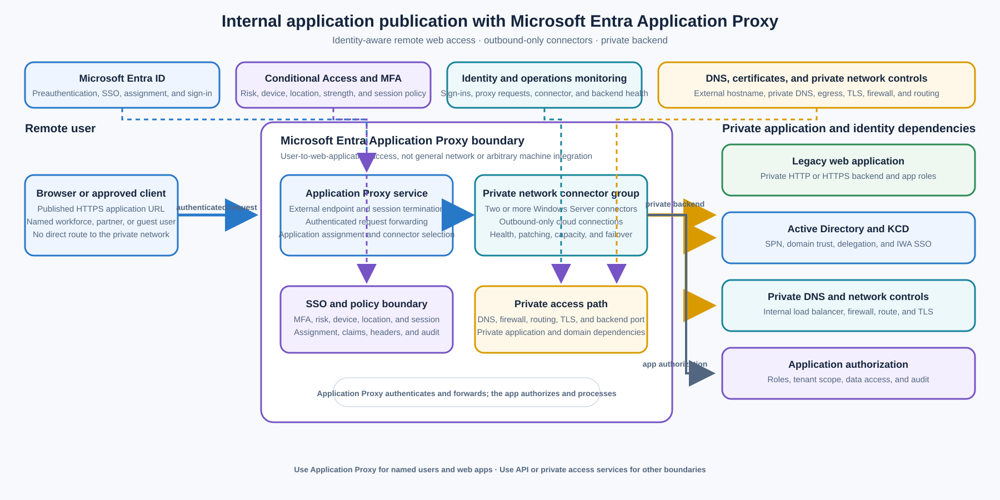

> **Document class:** Enterprise architecture reference model
> **Normative terms:** **MUST**, **MUST NOT**, **SHOULD**, **SHOULD NOT**, and **MAY** are requirements levels.
> **Applicability:** Secure remote user access to private HTTP or HTTPS web applications, including legacy applications that cannot yet authenticate directly with Microsoft Entra ID.
> **Exception process:** Deviations require a documented risk assessment, compensating controls, named risk owner, and expiry date.

| Control field | Value |
|---|---|
| Document ID | `ES-08` |
| Owner | Cloud Center of Excellence |
| Review cycle | At least annually and after material Microsoft Entra, Application Proxy, connector, Conditional Access, Kerberos, DNS, certificate, network, or application-authentication changes |
| Evidence | Published application record, user and group assignment, Conditional Access policy, connector-group topology, backend authorization, SSO tests, network review, sign-in logs, and operational readiness review |

# Internal Application Publication — Microsoft Entra Application Proxy

> **Decision in brief:** Use Application Proxy for identity-aware access to private web applications. It is not a general network tunnel, an API gateway, or a machine-to-machine transport.

## Purpose

This architecture uses Microsoft Entra Application Proxy to publish private web applications for remote users without opening inbound firewall ports to the private network. Users reach an external application URL or portal, authenticate with Microsoft Entra ID, pass Conditional Access and multifactor authentication requirements, and are forwarded through the Application Proxy service to a private backend by outbound-only connectors.

Use Application Proxy for Microsoft Entra SSO, Conditional Access and MFA, external access to legacy web applications, and Integrated Windows Authentication through Kerberos constrained delegation. It is primarily a user-to-web-application access pattern. It is not general network connectivity, a replacement for ExpressRoute, VPN Gateway, Virtual WAN, or Entra Private Access, and it is not an arbitrary machine-to-machine integration transport.

The [How to Publish an Azure VM Application through an Identity-Aware Proxy](../how-to-guides/how-to-publish-an-azure-vm-application-through-an-identity-aware-proxy.md) guide provides implementation detail for a private VM-hosted application. This architecture document defines the reusable platform boundary and service-selection decision.

## Scope and design outcomes

Use this model when remote users need to:

- access an internal HTTP or HTTPS line-of-business application from outside the private network;
- authenticate through Microsoft Entra ID and use SSO rather than a separate application login where supported;
- apply Conditional Access, MFA, identity risk, location, device, session, or user-assignment controls before the request reaches the backend;
- publish a legacy web application without creating an inbound internet route to the application network;
- support Integrated Windows Authentication using Kerberos constrained delegation;
- provide a stable external hostname while keeping the application’s internal URL private; or
- expose a bounded web API to an approved client using a documented Microsoft Entra authentication pattern.

The target outcomes are:

- every published application has a business owner, application owner, identity owner, connector owner, audience, data classification, and retirement or modernization plan;
- users are preauthenticated by Microsoft Entra ID and are assigned explicitly through users, groups, or approved entitlement workflows;
- Conditional Access and MFA requirements are evaluated before a session reaches the private application;
- connector groups are highly available, patched, monitored, and placed close to the backend and its identity dependencies;
- no inbound internet firewall opening is required for the connector path;
- backend application authorization remains independent of Entra sign-in and proxy publication;
- published hostnames, certificates, DNS, cookies, redirects, headers, and session behavior are tested; and
- Application Proxy is not used to provide arbitrary network reachability or hidden machine-to-machine integration.

## Context and decision drivers

Legacy web applications often depend on internal DNS, Integrated Windows Authentication, private network paths, or application-specific sessions. Moving every application to a modern identity protocol or public edge can take longer than the business access need allows. A controlled identity-aware proxy can provide a transitional and sometimes long-term user access boundary while keeping the application private.

The decision is driven by:

- **Audience:** Named workforce, partner, or guest users rather than arbitrary anonymous internet traffic or unmanaged machine clients.
- **Protocol:** Browser-based HTTP or HTTPS, with supported web authentication and session behavior.
- **Identity:** Microsoft Entra authentication, SSO, Conditional Access, MFA, and application assignment are required.
- **Network exposure:** The backend must not require inbound public firewall ports or a public VM address.
- **Legacy compatibility:** The backend uses IWA, forms, header-based, password-based, SAML, or another supported authentication mode.
- **Application shape:** The application can tolerate proxy termination, host translation, cookies, redirects, headers, and the connector path.
- **Operations:** The team can operate connector hosts, identity dependencies, DNS, certificates, backend health, and sign-in evidence.
- **Boundary fit:** The requirement is user-to-web-application access rather than network-level access, arbitrary TCP/UDP, or bulk integration.

## Options considered

### Microsoft Entra Application Proxy

Use Application Proxy when named remote users need secure access to private web applications with Entra preauthentication, SSO, Conditional Access, MFA, and an outbound connector path. Use a connector group with redundant connectors and a private backend. Use KCD when an IWA application requires the connector to authenticate to the backend on behalf of the user.

### Microsoft Entra Private Access or another identity-aware private access service

Use [Microsoft Entra Private Access](https://learn.microsoft.com/en-us/entra/global-secure-access/concept-private-access) or an approved zero-trust network access service when users need access to private network resources beyond a published web application, including broader private application or network segments supported by the service. Select the narrowest application-aware boundary; do not turn Application Proxy into a substitute for a private access service.

### ExpressRoute, VPN Gateway, or Virtual WAN

Use [Hybrid Network Connectivity — ExpressRoute, VPN Gateway and Virtual WAN](../networking-identity-security/nis-hybrid-network-connectivity-expressroute-vpn-gateway-virtual-wan.md) for network connectivity between users, branches, data centres, and Azure networks. These services solve routing and transport, not user preauthentication, SSO, Conditional Access, or backend web-session mediation. Network reachability MUST still be combined with identity and application authorization.

### API Management

Use [API-Led Integration — Azure API Management](api-led-integration-azure-api-management.md) for governed API publication, API products, JWT validation, quotas, transformations, rate limiting, API discovery, and machine-to-machine consumers. Application Proxy MAY publish a bounded web API in supported scenarios, but it should not replace an API gateway when the requirement is an enterprise API platform.

### Application Gateway, Front Door, or a public web edge

Use an application gateway or global edge when the application needs WAF, global routing, TLS and certificate management, health probes, high-volume anonymous access, regional failover, or L7 traffic management. Those services do not automatically provide the same Entra user preauthentication and Conditional Access boundary; combine them with an approved identity pattern when required.

### Modernize the application to Microsoft Entra authentication

Modernize the application when its lifecycle, security, user experience, scale, protocol, and engineering capacity justify direct Microsoft Entra authentication. Direct modernization can remove proxy compatibility constraints and reduce connector dependencies, but it requires application code, token validation, role and tenant authorization, testing, and a controlled migration.

### Selected direction: Microsoft Entra Application Proxy

Use Application Proxy for secure remote user access to private web applications when Entra identity policy and no inbound firewall opening are primary design drivers. Keep the backend private, use outbound-only connectors, select the correct SSO method, and retain application-level authorization. Use another service when the requirement is general network connectivity, arbitrary protocol access, high-volume public edge delivery, governed APIs, or machine-to-machine integration.

## Reference architecture

The user reaches the published external URL and is redirected to Microsoft Entra ID for preauthentication. Conditional Access and MFA evaluate the sign-in before Application Proxy accepts the session. The Application Proxy service passes the request to an available connector in the assigned connector group. The connector opens or maintains outbound connections to the cloud service and connects to the private web application using its private network path.

For IWA, the connector uses Kerberos constrained delegation to authenticate to the backend application on behalf of the user. The application remains responsible for its own authorization, roles, tenant checks, data access, and safe handling of headers and claims. The connector group, backend, Active Directory, DNS, certificate, firewall egress, and monitoring paths are operational dependencies of the published application.

The [Microsoft Entra Application Proxy overview](https://learn.microsoft.com/en-us/entra/identity/app-proxy/overview-what-is-app-proxy) documents the user, Microsoft Entra ID, Application Proxy service, private network connector, Active Directory, and backend application flow. Keep the public and private trust boundaries explicit in the application record and test both allowed and denied paths.

## Application publication model

### Published application record

Every published application MUST have a record containing:

- application name, owner, business capability, environment, and criticality;
- internal URL, external URL, custom domain, DNS owner, and certificate owner;
- connector group, connector hosts, backend servers, ports, private DNS, and firewall egress;
- Microsoft Entra preauthentication mode and SSO method;
- assigned users, groups, partner or guest scope, and entitlement process;
- Conditional Access, MFA, session, sign-in risk, device, location, and access-review policies;
- backend authentication, authorization, roles, tenant boundaries, and service account or SPN details;
- data classification, logging, retention, privacy, and regulatory requirements;
- expected users, concurrency, request size, upload and download behavior, latency, and availability;
- support path, incident owner, certificate and credential rotation, and recovery procedure; and
- modernization, review, and retirement date.

Do not publish an application with an unowned external hostname, unknown backend, shared privileged connector, undocumented authentication mode, or no way to remove access promptly.

### User request flow

The normal preauthentication flow is:

1. The user opens the published external URL or selects the application from an approved portal.
2. Microsoft Entra ID authenticates the user and evaluates assignment, Conditional Access, MFA, sign-in risk, device, location, and session policies.
3. The Application Proxy service accepts the authorized session and selects the application’s connector group.
4. An available connector receives the request through its outbound connection to the Application Proxy service.
5. The connector connects to the internal web application over the approved private path.
6. The backend authenticates the request according to the selected SSO method and enforces application authorization.
7. The response returns through the connector and Application Proxy service to the user.

The identity decision and the application decision are separate. A user who passes Entra authentication can still be denied by application role, tenant, resource, or data authorization. Conversely, an application’s internal login screen does not justify bypassing the required Entra preauthentication and Conditional Access policy.

### HTTP and HTTPS compatibility

Application Proxy is designed for web applications. Validate URL translation, host headers, absolute redirects, cookies, WebSockets or long-lived connections where needed, uploads, downloads, request size, response size, compression, client IP headers, TLS termination, backend certificates, and session affinity.

The proxy terminates the external connection and re-establishes the backend connection. Do not assume that the backend sees the original TLS session, source IP, browser connection, or client certificate. Treat forwarded headers as untrusted until the trusted proxy path, header behavior, and backend validation are documented and tested.

If the application embeds absolute internal URLs, hard-coded ports, non-public redirects, or domain-specific cookie scopes, configure supported URL translation or modernize the application. Do not solve a redirect loop by exposing the internal hostname or opening a direct public path.

### External and internal access

Use an external URL for remote users and an internal URL or approved portal experience for users inside the network where that provides the intended user experience. Define split DNS only when its ownership, resolution, certificate, routing, and monitoring are explicit.

Application Proxy is primarily intended for remote access. Microsoft cautions that using it for intranet access can introduce latency; modernize applications to authenticate directly with Microsoft Entra ID or use a suitable internal access pattern when the primary audience is already on the private network.

## Identity and SSO

### Microsoft Entra preauthentication

Use Microsoft Entra preauthentication when the application requires Entra authentication, assignment, Conditional Access, MFA, identity protection, or sign-in evidence before the request reaches the private network. Passthrough preauthentication does not provide the same Entra authentication and Conditional Access boundary; use it only for an explicitly documented compatibility requirement with compensating controls.

Application assignment MUST be explicit. Use groups or entitlement workflows with an owner, approval, access review, joiner-mover-leaver handling, and emergency removal path. Guest or partner access MUST define tenant, sponsor, authentication strength, data scope, session, and offboarding controls.

### Conditional Access and MFA

Conditional Access policies SHOULD express the actual risk and user context: required authentication strength, MFA, compliant device, sign-in risk, location, client type, session controls, and approved application scope. Test allow, deny, step-up, expired-session, risky-sign-in, unmanaged-device, and emergency-access behavior.

Do not rely on a broad policy that happens to cover the application. Record the policy IDs, exclusions, break-glass design, evaluation evidence, and change owner. A policy exclusion for service accounts, administrators, or partner users is a high-risk exception that requires explicit review.

### Sign-on methods

Choose the backend SSO method from the application’s actual protocol:

| Backend authentication | Application Proxy pattern | Controls and limits |
|---|---|---|
| Integrated Windows Authentication | Microsoft Entra preauthentication plus Kerberos constrained delegation | Connector and backend domain trust, SPN, delegation scope, time synchronization, and application authorization are required |
| Forms or password-based login | Entra preauthentication with supported password-based SSO where appropriate | Do not store or reuse credentials outside the approved Entra and application mechanism; test password rotation and account lockout |
| Header-based authentication | Supported header-based partner integration or application pattern | Validate trusted header source, claims mapping, spoofing resistance, and backend authorization |
| SAML or WS-Federation | Microsoft Entra federation-based SSO where supported | Validate audience, reply URL, certificates, claims, clock skew, and logout behavior |
| Modern OIDC or OAuth application | Prefer direct Microsoft Entra authentication or a governed API/application gateway | Avoid adding a proxy layer when the application can safely validate tokens and enforce roles directly |

Do not claim that Application Proxy makes an application modern. It provides an access boundary and compatibility path; the application still owns protocol correctness, authorization, secure session handling, and data protection.

## Kerberos constrained delegation

Use KCD when a web application uses Integrated Windows Authentication and the connector must authenticate to the backend on behalf of the signed-in user. The connector host and application server MUST be domain-joined or in trusted domains according to the supported design. The application service principal name, delegation permissions, user identifier mapping, DNS, time synchronization, and backend authentication behavior must be correct.

KCD SHOULD be constrained to the exact backend service principal and connector machine or service identity required. Do not grant unconstrained delegation or broad delegation merely to make the first test pass. Record the SPN, service account, connector group, delegation owner, domain trust, and change procedure.

Test:

- a user with the intended on-premises UPN or account mapping;
- a user without application assignment;
- a user who fails Conditional Access or MFA;
- a backend account with the expected role and a backend account without it;
- expired or invalid Kerberos tickets;
- clock skew, DNS failure, connector failure, and domain-controller failure; and
- direct backend access, alternate hostname, and forged-header bypass attempts.

If KCD cannot be made reliable or least privileged, use another supported authentication pattern or modernize the application. Do not weaken domain delegation or publish a direct backend route as a workaround.

## Connector and network architecture

### Outbound-only connector path

Private network connectors are lightweight agents installed on Windows Server within the private network. They use outbound connections to the Application Proxy service, so the design does not require inbound firewall ports from the internet to the connector or backend. The connector then reaches the backend over the approved private network path.

Permit only the required outbound destinations, DNS, certificate revocation, update, identity, monitoring, and private backend paths. Coordinate with firewall, proxy, TLS inspection, DNS, and egress owners. Do not allow unrestricted outbound access merely because the connector uses outbound connections.

The backend firewall SHOULD allow the connector or approved internal load-balancer path only. Do not allow public source ranges or a broad internet rule. Verify that the connector host and backend resolve the expected names and that routing does not bypass inspection or segmentation controls.

### Connector groups and high availability

Assign each published application to a connector group with a clear location, environment, trust boundary, backend reachability, and owner. Do not share a connector group across production and non-production applications or incompatible identity domains without an approved reason.

Production connector groups MUST have redundant connectors on separate hosts and independent failure paths where practical. Microsoft recommends at least two connectors in a group and prefers three to provide operational buffer. Place connectors across availability, host, power, network, and maintenance domains where the application SLO requires it.

Connectors are stateless and traffic is distributed across available connectors, but application behavior can still depend on cookies, connection patterns, backend session affinity, or connector capacity. Size connector groups for normal traffic, peak concurrency, one-node loss, maintenance, and backend response behavior. Monitor connector health, version, outbound connection count, CPU, memory, network, errors, and application latency.

### Private backend and DNS

Keep the application server private. Use private IP addresses, internal load balancers, private DNS, approved routing, NSGs, firewalls, and health checks. If multiple backend servers exist, define load-balancing, session persistence, health-probe, certificate, and failure behavior.

The internal URL configured in Application Proxy MUST resolve and connect from each connector host. A backend can be healthy from an administrator’s workstation and unreachable from the connector subnet because of DNS, route, firewall, certificate, or identity differences. Test from every connector group node.

## Security and authorization

- Use Microsoft Entra preauthentication, explicit application assignment, Conditional Access, MFA, sign-in risk, and device or session controls where required.
- Keep the connector, backend, domain controllers, and management paths on private networks without public inbound application or administrative ports.
- Use least-privileged connector and backend service identities; separate connector administration from application ownership and Entra application administration.
- Constrain KCD delegation to required service principals, domains, connector identities, and applications.
- Store certificates, secrets, service credentials, registration keys, and backend passwords in approved secret-management systems and rotate them with evidence.
- Validate backend roles, tenant, resource, and data authorization independently of Entra sign-in and group assignment.
- Treat forwarded headers, claims, client IP, host headers, and proxy metadata as untrusted until their origin and validation are defined.
- Use WAF, rate limits, abuse controls, upload limits, and application security controls when the threat model and traffic profile require them.
- Log identity, Conditional Access, proxy, connector, DNS, firewall, backend, and application events with a shared correlation identifier where supported.
- Redact tokens, cookies, credentials, personal data, and sensitive application content from diagnostics and support captures.

Application Proxy preauthentication reduces anonymous exposure but does not make a vulnerable application safe. Patch the backend, protect sessions, validate input, enforce authorization, and remediate application vulnerabilities according to the application security standard.

## Performance, reliability, and limits

Plan capacity around users, concurrent requests, connector count, connector outbound limits, backend latency, page and asset count, upload and download size, long-lived connections, session affinity, authentication latency, Conditional Access evaluation, DNS, and private network capacity. Validate the application’s actual behavior through the proxy rather than estimating from backend-only tests.

Use separate connector groups, backend pools, and application records when one application’s traffic or maintenance could affect another. Avoid placing unrelated high-volume applications behind one small connector group. Monitor user-perceived latency across Entra authentication, Application Proxy, connector, network, and backend hops.

Application Proxy is not designed to provide arbitrary network access, high-volume anonymous web delivery, general TCP or UDP proxying, database connectivity, file-system mounting, or a universal machine-to-machine transport. It may support bounded web API scenarios, but API consumers need an explicit authentication, authorization, quota, versioning, and operations design. Use API Management or private application access when those are the dominant requirements.

Failure design MUST cover:

- Microsoft Entra authentication, Conditional Access, MFA, or identity-provider outage;
- Application Proxy service or external DNS failure;
- one or more connector hosts, outbound paths, or connector groups failing;
- private DNS, routing, firewall, certificate, domain-controller, or KCD failure;
- one or more backend servers, load balancers, application pools, or session stores failing;
- high concurrency, slow backend responses, large upload or download, and long-lived sessions; and
- application redirect, cookie, header, protocol, or authorization regression.

Do not declare high availability from a green connector status alone. Test user sign-in, backend access, SSO, denied access, connector failover, backend failover, and recovery from each intended client location.

## Deployment and lifecycle

Manage Entra enterprise applications, Application Proxy URLs, connector groups, Conditional Access policies, SSO configuration, KCD objects, DNS, certificates, backend rules, connector hosts, monitoring, and access assignments as versioned or auditable deployment inputs. Avoid production-only portal changes without an approved evidence trail.

Each published-application release SHOULD include:

- application URL, backend URL, DNS, certificate, redirect, cookie, host-header, and TLS tests;
- assigned and unassigned user tests, Conditional Access allow and deny tests, MFA, device, location, and sign-in-risk tests;
- SSO tests for the selected forms, header, SAML, OIDC, or IWA/KCD method;
- connector health, outbound firewall, proxy, DNS, private route, backend port, and certificate tests;
- direct-IP, alternate-hostname, forged-header, public-ingress, and bypass-path tests;
- connector group node loss, maintenance, backend failure, domain-controller failure, and failover tests;
- request-size, concurrency, session, long-lived connection, upload, download, and backend-latency tests;
- sign-in, proxy, connector, network, backend, and application telemetry correlation; and
- rollback, access removal, certificate renewal, connector replacement, DNS recovery, and modernization plan updates.

Review published applications at least annually and after material identity, application, backend, network, or risk changes. Remove unused assignments, external DNS, certificates, connectors, and application records only after active users, sessions, dependencies, and rollback evidence are understood.

## Observability and operations

The identity and access platform team owns Entra enterprise application configuration, Application Proxy standards, connector groups, Conditional Access patterns, SSO guidance, and identity telemetry. Network teams own egress, DNS, routing, firewall, and private paths. Application teams own backend security, roles, sessions, data access, patching, and application SLOs. Operations teams own dashboards, alerts, incident response, connector lifecycle, and recovery evidence.

Every production application should have an operational record containing the owner, audience, business purpose, external and internal URLs, data classification, identity and SSO method, Conditional Access policies, assignment groups, connector group, connector hosts, backend pool, DNS, certificates, KCD objects, expected volume, SLO, support path, escalation path, review date, and retirement or modernization date.

Monitor at least:

- Entra sign-ins, application assignment changes, Conditional Access outcomes, MFA, risk, device, session, and authentication failures;
- Application Proxy request count, status codes, latency, response size, connection errors, redirects, and upstream failures;
- connector group and node status, version, update state, CPU, memory, outbound connections, errors, and capacity;
- connector-to-backend DNS, TCP, TLS, HTTP, application-pool, load-balancer, and health-probe outcomes;
- KCD ticket, SPN, delegation, domain-controller, time, UPN mapping, and backend IWA failures;
- external DNS, custom-domain certificate, private DNS, firewall, egress proxy, route, and private-network changes;
- backend authorization failures, application errors, session-store issues, upload or download failures, and latency;
- direct-access or bypass attempts, forged headers, unexpected source paths, abnormal user or client behavior, and exposed endpoints; and
- application assignment, connector, SSO, Conditional Access, KCD, DNS, certificate, network, backend, and deployment changes.

Runbooks should cover sign-in failure, Conditional Access denial, MFA issue, redirect loop, cookie or hostname problem, connector outage, outbound firewall failure, backend reachability, KCD or SPN failure, certificate expiry, DNS failure, backend pool failure, high latency, capacity saturation, direct-ingress exposure, access removal, connector replacement, and controlled rollback.

## Validation

- [ ] The requirement is primarily named remote user access to an HTTP or HTTPS web application, not general network connectivity or arbitrary machine-to-machine integration.
- [ ] Application Proxy is selected instead of Entra Private Access, VPN, ExpressRoute, Virtual WAN, API Management, Application Gateway, Front Door, or direct application modernization based on documented requirements.
- [ ] The published application record has owners, audience, URLs, backend, data classification, identity method, connector group, support path, and retirement or modernization plan.
- [ ] Microsoft Entra preauthentication, explicit assignment, Conditional Access, MFA, device, location, risk, session, and break-glass behavior are documented and tested.
- [ ] The connector group has at least two production connectors, independent host or network failure paths where practical, supported versions, patching, capacity, monitoring, and replacement procedures.
- [ ] Connectors use outbound-only access to the Application Proxy service and approved backend, DNS, Key Vault, update, monitoring, and certificate paths; no inbound internet firewall opening is required.
- [ ] The backend remains private, firewall rules restrict access to the connector or approved internal path, and direct-IP, alternate-hostname, and bypass tests fail safely.
- [ ] External and internal DNS, custom domains, certificates, URL translation, host headers, redirects, cookies, TLS termination, client-IP headers, and session behavior are verified.
- [ ] The selected SSO method is tested; IWA uses constrained KCD with correct domains, SPN, delegation, identity mapping, time, DNS, and backend authorization.
- [ ] Backend roles, tenant, resource, data, and administrative authorization remain independent of Entra sign-in and application assignment.
- [ ] Connector, proxy, Entra, Conditional Access, DNS, firewall, backend, and application logs correlate representative allowed, denied, failed, and recovered requests.
- [ ] Capacity and failure tests cover user concurrency, backend latency, upload and download, long-lived sessions, connector loss, backend loss, domain-controller loss, and network failure.
- [ ] Secrets, certificates, service identities, KCD delegation, connector registration, access reviews, and diagnostic redaction are least-privileged and auditable.
- [ ] Dashboards, alerts, support contacts, access removal, certificate renewal, connector replacement, rollback, recovery, and modernization runbooks are ready before production.

## Related topics

- [API-Led Integration — Azure API Management](api-led-integration-azure-api-management.md)
- [Hybrid Network Connectivity — ExpressRoute, VPN Gateway and Virtual WAN](../networking-identity-security/nis-hybrid-network-connectivity-expressroute-vpn-gateway-virtual-wan.md)
- [How to Publish an Azure VM Application through an Identity-Aware Proxy](../how-to-guides/how-to-publish-an-azure-vm-application-through-an-identity-aware-proxy.md)
- [Cloud Identity and Access Architecture](../networking-identity-security/nis-cloud-identity-and-access-architecture.md)
- [Zero-Trust and Private-Access Design](../networking-identity-security/nis-zero-trust-and-private-access-design.md)

## References

- [Publish on-premises apps with Microsoft Entra application proxy](https://learn.microsoft.com/en-us/entra/identity/app-proxy/overview-what-is-app-proxy)
- [Security considerations for Microsoft Entra application proxy](https://learn.microsoft.com/en-us/entra/identity/app-proxy/application-proxy-security)
- [High availability and load balancing in Microsoft Entra application proxy](https://learn.microsoft.com/en-us/entra/identity/app-proxy/application-proxy-high-availability-load-balancing)
- [Plan a Microsoft Entra application proxy deployment](https://learn.microsoft.com/en-us/entra/identity/app-proxy/conceptual-deployment-plan)
- [Configure single sign-on to an application proxy application](https://learn.microsoft.com/en-us/entra/identity/app-proxy/how-to-configure-sso)
- [Troubleshoot Kerberos constrained delegation](https://learn.microsoft.com/en-us/entra/identity/app-proxy/application-proxy-back-end-kerberos-constrained-delegation-how-to)
- [Access on-premises APIs with Microsoft Entra application proxy](https://learn.microsoft.com/en-us/entra/identity/app-proxy/application-proxy-secure-api-access)
