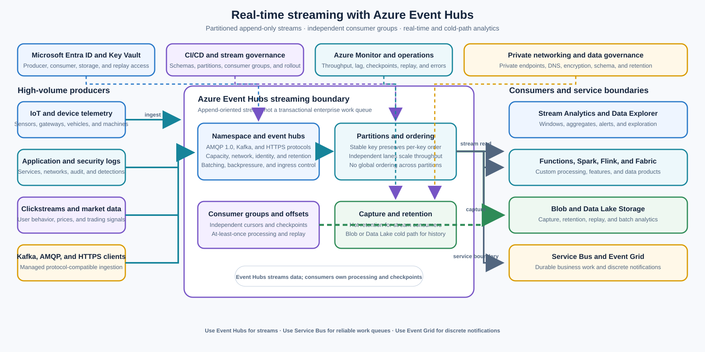

> **文档类型：**企业架构参考模型
> **规范性术语：** **MUST**、**MUST NOT**、**SHOULD**、**SHOULD NOT** 和 **MAY** 是要求级别。
> **适用范围：** 需要分区排序、独立消费者、偏移跟踪、重播或流处理的大容量、低延迟事件流。
> **例外流程：** 偏离要求需要记录风险评估、补偿控制、指定风险负责人和到期日期。

|控制领域|价值|
|---|---|
|文件编号 | `ES-06` |
|负责人|云卓越中心 |
|审核周期|至少每年一次，并且在发生重大 Event Hubs 命名空间、分区、协议、保留、采集、身份、网络或流处理更改之后 |
|证据|流目录、分区和密钥设计、生产者和消费者契约、容量模型、检查点和重放测试、安全审查和运营就绪审查 |

# 实时流 - Azure Event Hubs

> **简要决定：** 使用 Event Hubs 进行具有独立消费者和重播的大容量仅附加流。使用 Service Bus 来处理固定的业务工作，使用 Event Grid 来处理离散通知。

## 目的

此体系结构使用 Azure Event Hubs 作为大容量、面向追加的流平台，以实现低延迟摄取和独立消费有序事件流。生产者将事件附加到分区 Event Hubs；消费者应用通常通过单独的消费者组使用偏移量和检查点读取流。

使用 Event Hubs 进行物联网遥测、应用和安全日志、点击流、金融市场数据、近实时分析以及与 Kafka 兼容的摄取。Event Hubs 是一个流平台，而不是传统的企业工作队列。它为每个分区提供按时间排序的日志和消费者控制的读取；它不提供 Service Bus 事务、会话、队列结算、重复检测或复杂的工作队列语义。

Microsoft 的消息传递区别是：

|要求 |正确的服务|
|---|---|
|业务命令和可靠的工作队列| [Azure Service Bus](enterprise-messaging-azure-service-bus.md) |
|离散状态更改通知 | [Azure Event Grid](event-driven-integration-azure-event-grid.md) |
|大容量遥测和流 | Azure Event Hubs |

[Azure Architecture Center 消息传递指南](https://learn.microsoft.com/en-us/azure/architecture/guide/technology-choices/messaging) 将 Event Hubs 描述为事件流的消息代理：它以低延迟缓冲大量数据，支持多个使用者，并允许订阅者管理其在流中的位置。 [Microsoft: 什么是 Azure Event Hubs](https://learn.microsoft.com/en-us/azure/event-hubs/event-hubs-about)

## 范围和设计成果

当工作负载需要执行以下操作时，请使用此模型：

- 摄取来自许多生产者的大量小事件；
- 保留共享分区键的事件的顺序；
- 让多个独立的消费者应用以自己的速度读取同一等；
- 维护消费者偏移并在重新启动或临时中断后恢复；
- 从时间戳或偏移量重放保留的序列以进行恢复、回填或新的消费者；
- feed Stream Analytics、Data Explorer、Functions、Spark、Flink、Fabric、Synapse 或其他流处理器；
- 将热流采集到 Blob 存储或 Data Lake 存储以进行长期保留和批量分析；或
- 通过支持的 Event Hubs 协议接受 Kafka、AMQP 1.0 或 HTTPS 生产者和消费者。

目标结果是：

- 每个流都有一个负责任的所有者、目的、模式、来源、分类、保留、分区键和消费者清单；
- 分区基于显式排序和负载分布要求，而不是任意字段；
- 生产者使用稳定的模式、有界事件大小、批处理、背压和记录在案的交付契约；
- 消费者使用独立的消费者组，其中处理、检查点或发布节奏不同；
- 检查点、滞后、重放、保留和毒记录是可监控和可恢复的；
- 流被视为仅附加数据源，而不是单独解决的工作项的队列；
- 大量遥测和分析保留在 Event Hubs，而持久的业务命令保留在 Service Bus 中；和
- 身份、私有网络、模式治理和数据保护在生产者、命名空间、消费者和存储接收器之间强制执行。

## 背景和决策驱动因素

应用、设备、安全控制和财务系统不断生成数据。对每个数据点的同步调用将生产者与下游可用性耦合起来，并且在不阻塞生产者或丢弃数据的情况下无法吸收突发。当许多独立的消费者需要监控相同的有序流、维护单独的偏移量并重播历史间隔时，传统的工作队列也不适合。

该决定的驱动因素是：

- **数量：** 系统以受益于分区流服务的速率或突发配置文件摄取事件。
- **延迟：**消费者需要低延迟地访问新追加的数据以进行告警、仪表板、检测或操作决策。
- **排序：** 事件必须在业务或设备密钥内排序，而不是在整个流中全局排序。
- **扇出：**多个消费者需要独立的位置、处理逻辑、扩缩容、保留或重放行为。
- **重播：** 消费者必须从检查点恢复或在恢复、更正或加入后再次读取保留的间隔。
- **协议兼容性：** 现有的 Kafka 生产者或消费者应使用托管的 Azure 流服务，而无需管理 Kafka 集群。
- **分析集成：** 流提供实时处理器、数据探索、机器学习功能或批量分析的冷路径。
- **工作负载边界：** 负载是遥测、日志、点击流、市场或其他流数据，而不是需要按消息进行业务结算的命令。

## 考虑的选项

### Azure Service Bus
将[企业消息传递 - Azure Service Bus](enterprise-messaging-azure-service-bus.md) 用于高价值业务命令和工作队列，例如采购订单、付款说明、预配请求和清单更新。Service Bus 提供队列和主题语义、结算、死信队列、会话、排序、重复检测、计划交付和事务。Event Hubs 不会取代这些功能。

### Azure Event Grid

使用[事件驱动集成 - Azure Event Grid](event-driven-integration-azure-event-grid.md) 来获取离散状态更改通知，例如正在创建的 Blob、资源更改、订单完成、设备状态通知或 SaaS 合作伙伴事件。Event Grid 通过过滤和推拉传递来路由通知；Event Hubs 为独立消费者保留并分发大量流。

### Azure Data Factory、Fabric、Synapse 或批量数据处理

使用 [Azure Data Factory 和数据集成](../data-ai-integration/dai-azure-data-factory-and-data-integration.md)、Fabric、Synapse、Spark 或其他数据平台进行批量移动、大型联接、历史转换、仓库加载和分析批处理。Event Hubs 可以提供流入口或采集输出，但它不是转换引擎或日志记录分析系统。

### Kafka 集群或其他 Streaming 平台

当工作负载需要 Kafka 生产者或消费者协议兼容性而无需运行单独的 Kafka 集群时，请使用具有 Kafka 兼容性的 Event Hubs。当其生态系统、拓扑、协议、控制、跨云可移植性或功能集已记录为要求时，请选择自我管理或其他托管 Streaming 平台。比较分区行为、保留、模式治理、安全性、操作和成本，而不是假设协议兼容性意味着全部功能等效。

### 直接 API 调用或存储轮询

当调用者需要同步响应、验证或单个当前状态读取时，直接调用是合适的。为每个数据点轮询数据库、blob 存储或 API 会增加延迟和源负载，并且不提供独立的消费者偏移量。当源产生多个使用者需要独立处理的连续流时，请使用 Event Hubs。

### 选择方向：Azure Event Hubs

将 Event Hubs 用于高容量、低延迟、面向追加的流。使用分区键对流进行分区，在分配负载时保留所需的每键排序。为每个逻辑上独立的应用提供一个消费者组，在批准的存储中检查点进度，并根据恢复和分析要求使用保留或 Event Hubs 采集。

## 参考架构

设备、应用、安全工具、市场数据源和 Kafka 客户端将事件发布到 Event Hubs 命名空间。Event Hubs 是分区的仅附加日志。流处理器通过独立的消费者组进行消费、跟踪偏移量并产生操作或分析输出。Event Hubs 采集将冷路径副本写入 Blob 存储或数据湖存储以进行长期保留或批量分析。

Service Bus 和 Event Grid 显示为相邻边界，而不是可互换的组件。应将业务命令发布到 Service Bus，并将离散状态更改通知发布到 Event Grid。Event Hubs 是大容量流的正确重心。

[实时事件处理参考架构](https://learn.microsoft.com/en-us/azure/stream-analytics/stream-analytics-real-time-event-processing-reference-architecture) 显示了 Event Hubs 摄取、随后进行实时处理和下游分析或操作目标的常见模式。使其适应组织的身份、网络、分区、架构、保留和故障要求。

## Stream 模型和契约

### 仅附加事件流

Event Hubs 是分布式的仅附加日志。生产者附加事件；消费者读取流并保持自己的位置。消费者的进度不会删除其他消费者的事件，并且一个消费者组的检查点不会推进另一个消费者组的检查点。

流契约 MUST 定义：

- 事件类型、生产者、来源和模式版本；
- 事件 ID、事件时间、摄取时间以及关联或跟踪 ID；
- 分区键及其提供的业务排序保证；
- 有效负载大小、编码、压缩和数据分类；
- 重复、迟到、无序、更正和墓碑行为；
- 保留和重播范围；
- 消费者群体所有权和检查点行为；和
- 当前状态的权威来源或参考，其中流不是日志系统。

流应该代表事实、测量、日志或状态监控。不要在遥测流中隐藏事务命令契约。如果事件指示一个工作进程执行不可逆操作并需要完成消息结算或采用持久化死信路径，请改为向 Service Bus 发布命令。

### 活动信封

使用跨生产者一致的版本化事件信封。至少包括：

- `eventId`：来自源的唯一事件标识符；
- `eventType`：语义事件名称或测量类别；
- `schemaVersion`：兼容架构版本；
- `source`：生产者、设备、应用或系统；
- `eventTime`：事件在源发生的时间；
- `ingestTime`：平台接受事件的时间（如果有）；
- `partitionKey`：用于选择分区的分区键；
- `correlationId` 或存在请求或操作的跟踪上下文；
- `tenant`、站点、设备、账户或组织范围（如果适用）；
- `dataClassification`：处理和保留分类；和
- `payload` 或经批准的声明检查参考。
事件时间和摄取时间不同。流处理器 MUST 定义它们如何处理时钟偏差、延迟数据、重复数据以及处理窗口之后到达的事件。未经来源验证，请勿使用不受信任的设备时间戳作为财务或安全年表的证明。

### 模式治理

模式 MUST 受版本控制且可发现。当 Azure Schema Registry 或获批的架构目录提供所需协议和序列化支持时，应使用它。根据客户端和处理生态系统，MAY 使用 Avro、JSON、Protobuf 和其他格式。

附加变更 SHOULD 保护现有消费者。重大更改需要新的架构版本、兼容性边界、迁移计划或并行流。消费者 MUST 容忍未知字段并在处理之前验证所需字段。生产者 MUST NOT 默默地更改单位、时间戳语义、分区键含义或标识符格式。

维护包含 Event Hubs、源、事件类型、架构、分区键、预期速率、保留、消费者组、目标、数据分类、所有者、成本中心、SLO 和停用日期的流目录。

## 分区、排序和规模

### 分区选择

分区是独立的有序序列。Event Hubs 可以保留发送到同一分区的事件的顺序，但它不提供跨所有分区的统一全局顺序。当必须按顺序处理相关事件时，选择分区键，例如设备 ID、账户 ID、会话 ID、安全主体、市场工具或其他业务流键。

分区键 SHOULD 满足以下要求：

- 将所有需要排序的事件保留在同一分区中；
- 在分区之间充分分配活动密钥以避免出现热分区；
- 在订购契约有效期内保持稳定；
- 避免将敏感数据直接嵌入路由元数据中；和
- 进行日志记录，以便每个生产者都使用相同的语义。

不要仅仅因为客户端或服务将其散列到热分布中时看起来唯一而按高基数值进行分区。如果创建单个热分区，请勿按一个租户、区域或应用对所有事件进行分区。相反，当消费者需要按设备或按账户排序时，请勿使用随机循环分区。

### 消费者群体

为每个逻辑上独立的应用或处理视图创建一个消费者组。示例包括实时告警、安全检测、操作仪表板、功能生成、冷路径采集和审计导出。每个消费者组独立读取相同的 Event Hubs 并维护自己的偏移量。

不要为生产中的每个临时部署实例或团队实验创建使用者组。消费者群体是治理、规模和成本的边界。定义每个组的所有权、预期滞后、保留需求、访问权限和退休行为。

在使用者组中，使用支持的事件处理器或等效的协调模型在实例之间分配分区。消费者 MUST 处理分区所有权更改、实例丢失、重新平衡、检查点延迟和临时重复处理。
### 吞吐量和容量

容量规划 MUST 包括入口和出口量、事件大小、批量大小、生产者计数、消费者组计数、分区计数、协议、峰值突发、保留、采集、处理延迟和下游吞吐量。对正常流量、重新连接风暴、区域恢复、消费者追赶和重放负载进行建模。

避免在不考虑分区可用性和下游容量的情况下扩展生产者和消费者。一个消费者组中的更多消费者不会创建比该组分配的分区更多的并行性。落后的消费者可能需要更多分区、更多实例、优化处理、减少每个事件的工作或单独的流。

在支持的情况下使用批处理和异步客户端。当下游系统无法接受流速率时，在生产者或处理边界施加背压。不要使用无限制的内存缓冲来隐藏持久的容量不匹配。

## 消费、偏移量和重放

### 检查点

消费者检查点记录其已持久化处理的位置。仅在消费者完成处理或持久化记录所选处理边界的结果后才设置检查点。在副作用可能导致工作丢失之前设置检查点；仅在副作用之后设置检查点可能会在崩溃后创建重复处理。处理程序 MUST 是幂等的或使用适合目标的原子应用模式。

检查点数据应包括消费者组、Event Hubs、分区、偏移量或序列、处理版本、时间戳以及审计或重放所需的结果。通过身份和访问控制来保护检查点并监控检查点的寿命。

### 至少一次处理

设计消费者至少一次交付。副作用之后和检查点之前发生的崩溃可能会导致事件被再次处理。在出现不可重复的副作用之前，使用事件 ID 重复数据删除、收件箱记录、唯一业务密钥、更新插入、源版本检查或其他幂等操作。

Event Hubs 不提供 Service Bus 样式的重复检测或事务接收和结算操作。消费者的检查点不是具有数据库、API、SaaS 系统或文件存储的分布式事务。当跨系统一致性很重要时，使用发件箱、幂等接收器、协调作业或持久工作队列。

### 重播和回填

使用保留的偏移量或时间戳来重播消费者恢复、错误修复、新消费者加入、数据更正或分析回填后的事件。重播 SHOULD 使用单独的消费者组或显式隔离的检查点路径，因此它不会无意中移动生产消费者位置。

在重放之前，定义：

- 起始时间戳、偏移量、分区集和停止条件；
- 消费者代码和模式版本；
- 目的地以及副作用是否为只读、更新插入或补偿；
- 速率限制和下游容量；
- 重复和过时的事件行为；
- 监控、审计和运维人员所有权；和
- 协调证据和回滚或更正程序。
保留不是无限的存档。使用 Capture 或其他批准的冷路径来保留业务所需的保留期、合法保留、审计或分析历史记录。请勿承诺超出配置的保留或采集可用性的重播。

## 工作负载场景

### 物联网遥测

当数据量大、面向时间且由多个消费者处理时，使用 Event Hubs 从设备、网关、车辆和工业系统中获取测量结果。按设备、站点、车辆或与排序和负载分配相匹配的其他键进行分区。在分析之前验证设备身份、时间戳质量、单位、校准和数据分类。

当工作负载需要设备身份生命周期、孪生状态、命令传递、设备预配或特定于设备的管理功能时，请使用 IoT 中心或其他设备管理服务。Event Hubs 可以保留流入口或下游处理边界。

### 应用和安全日志

使用 Event Hubs 集中大量应用、基础设施、网络、审计和安全日志，以进行流检测、仪表板、关联并导出到分析或 SIEM 平台。定义源身份、时间戳标准化、严重性、租户、保留、脱敏和监管链要求。

不要将日志摄取视为应用操作已授权或完成的证据。应用、身份提供商和权威审计存储保留对业务或安全证据的责任。保护敏感字段并防止事件期间日志放大。

### 点击流

使用 Event Hubs 进行页面视图、点击、会话、功能交互和其他行为事件，以提供近乎实时的仪表板、实验、个性化或数据科学。在发布点击数据之前定义机器人过滤、同意、隐私、租户、用户标识符和保留策略。

将点击流事件与交易订单或支付命令分开。点击可能会重复、延迟或省略；它不应该是财务或履行状态的权威日志记录。

### 金融市场数据

当流的排序、延迟、保留和重播模型满足业务要求时，使用 Event Hubs 获取大量市场数据、定价更新、订单簿监控、欺诈信号或风险输入。按乐器、地点、账户或反映所需排序的其他键进行分区。

金融工作负载 MUST 单独定义时钟同步、序列号、间隙检测、最新数据行为、不可变存储、协调、访问控制、加密和监管保留。Event Hubs 摄取本身并不提供交换级排序、一次性处理、交易结算或合法的充分日志记录。

### 近实时分析

将 Event Hubs 与 Stream Analytics、Data Explorer、Fabric、Spark、Flink、Functions 或其他经批准的处理器结合使用，用于窗口、聚合、异常检测、告警和操作仪表板。设计用于快速洞察的热路径和用于重放、回填、审计和历史分析的冷路径。
定义事件时间窗口、水印、延迟、状态检查点、聚合校正和接收器幂等性。仪表板结果是分析视图，不一定是权威的业务状态。

### Kafka 兼容的摄取

当现有 Kafka 生产者、消费者、连接器或框架是一项重大投资并且 Event Hubs 提供所需的兼容性时，请使用 Kafka 端点。验证身份验证、主题到 Event Hubs 映射、分区语义、消费者组、偏移量、标头、压缩、配额、客户端版本和不支持的 Kafka 功能。

Kafka 协议兼容性减少了迁移工作，但不会使 Event Hubs 成为自我管理的 Kafka 集群。该服务的分区、保留、吞吐量、命名空间、网络、监视和操作模型仍然是 Azure Event Hubs 的概念。使用代表性客户端版本和故障行为测试完整的生产者到消费者路径。

## 采集和分析存储

使用 Event Hubs 采集将流写入 Blob 存储或 Data Lake 存储，以进行长期保留、批量分析、恢复和冷路径处理。采集使实时和批处理路径能够使用相同的传入流，同时保持 Event Hubs 的热保留窗口与分析存档分开。

采集不能替代分析数据模型、治理目录、生命周期策略、合法保留或经过验证的存档。定义文件格式、分区、采集间隔、存储账户、托管身份、加密、路径约定、架构、迟到处理、保留和下游摄取。

采集的文件和热流处理可以具有不同的时间和完整性。使用者 MUST 定义文件是处理触发器、批处理边界还是仅仅是归档制品。监控采集延迟、文件到达、空或部分间隔、存储授权和下游处理状态。

## 安全和网络架构

在支持的情况下，将 Microsoft Entra 托管身份或工作负载身份用于生产者、消费者应用、采集目标、处理器和操作员。将权限范围限制到所需的确切命名空间、Event Hubs、使用者组、存储容器、架构制品或处理资源。单独的发布、使用、管理、检查点、采集和重播权限。

对于 Kafka 客户端，根据客户端和兼容性要求，使用支持的 Microsoft Entra 或 SAS 认证模型。将 SAS 密钥、证书、连接字符串和客户端机密存储在 Key Vault 或批准的机密管理服务中。通过重叠、验证和回滚过程轮换凭证。

对于敏感或内部流：

- 根据需要使用私有端点、经批准的私有 DNS、网络规则、防火墙和出口控制；
- 通过身份、网络、主题、消费者组和环境限制命名空间和 Event Hubs 访问；
- 在接受事件之前验证源身份验证、租户或站点范围、事件模式和数据分类；
- 对传输中和静态的有效负载进行加密，并在需要时使用客户管理的密钥；
- 对日志和诊断中的令牌、凭证、个人数据、支付数据、机密和不必要的有效负载字段进行脱敏；
- 根据信任和生命周期边界分离生产流、非生产流、受限流和合作伙伴流；和
- 审核命名空间、Event Hubs、分区、消费者组、网络、身份、采集、架构和重播更改。

网络可达性并不授权发布或使用流。消费者组和补偿不授权商业行为。每个处理程序仍然负责身份验证、授权、租户隔离、输入验证和安全的下游副作用。

## 性能、成本和工作负载边界

围绕吞吐量单位或处理单位、专用容量（如果适用）、分区计数、事件大小、入口、出口、消费者组、协议、采集、存储、私有端点、跨区域流量、遥测和重播来规划成本和容量。在模型中包括高峰爆发、生产者重新连接、消费者追赶、灾难恢复和回填。

Event Hubs 应用于大容量流摄取和分发。它不是以下用途的正确引擎：

- 需要锁定、结算或死信语义的一次一项业务工作；
- 数据库和外部服务之间的事务协调；
- 会话或全局 FIFO 排序；
- 离散通知路由，其中 Event Grid 过滤和推送传递是主要需求；
- 大型分析连接或批量转换；或
- 任意业务逻辑、有状态的应用行为或日志系统。

根据主要要求使用 Service Bus、Event Grid、Data Factory、Fabric、Synapse、Stream Analytics、Functions 或应用运行时。Event Hubs 可以将这些组件作为流边界提供服务。

## 部署和生命周期

将命名空间、Event Hubs、分区、授权规则、私有端点、网络规则、消费者组、采集、架构、告警、处理器和下游绑定作为版本化部署输入进行管理。特定于环境的端点和机密 MUST 来自批准的配置和机密存储。

每个流版本 SHOULD 包括：

- 具有代表性的事件规模和比率的生产者和消费者契约测试；
- 分区键、排序、热分区、批处理和吞吐量测试；
- 检查点、副作用后崩溃、重复、重新启动、重新平衡、滞后和重放测试；
- 模式兼容性、格式错误的事件、延迟事件、时间戳和版本测试；
- 网络、身份、私有 DNS、Kafka 兼容性、Capture 和存储授权测试；
- 下游节流、处理器中断、接收器故障和背压测试；
- 告警、仪表板、运行手册、支持所有者和数据目录更新；和
- 容量、保留、重播、成本和恢复审查。

分区计数、分区键、模式、保留、消费者组和协议更改可能会影响现有的生产者和消费者。在进行重大更改之前定义迁移、双重发布、重播、并行消费者和退役程序。

## 可观测性和操作
Streaming 平台团队负责经批准的 Event Hubs 命名空间、容量、网络、身份模式、分区标准、保留、采集、遥测和平台运行手册。源团队负责事件含义、模式、生产率、分区键契约、数据质量和源可用性。消费者团队负责处理正确性、检查点、滞后、幂等性、目的地、SLO 和重放。安全和治理团队定义访问、数据保护、保留、审计和异常要求。

每个生产流都应该有一个操作记录，其中包含命名空间、Event Hubs、源、事件类型、架构、分区键、预期和峰值数量、保留、采集目标、消费者组、下游处理器、数据分类、所有者、SLO、成本中心、支持路径以及停用或审核日期。

至少监控：

- 入口和出口量、事件计数、批量大小、事件大小、吞吐量、限制和错误；
- 分区利用率、热分区、分区分布、容量、配额和扩展状态；
- 消费者组滞后、检查点年龄、分区所有权、重新平衡、处理延迟和积压；
- 重复、格式错误、延迟、过时、无序、拒绝和模式不兼容的事件；
- 生产者身份验证、授权、连接、重试、超时和协议失败；
- 处理器成功、失败、持续时间、状态存储健康状况、接收器延迟、限制和输出新鲜度；
- 采集文件年龄、间隔、大小、存储授权、路径、模式和下游摄取状态；
- Event Hubs 命名空间、Event Hubs、私有端点、网络、DNS、身份、证书和区域运行状况；
- 重放、回填、消费者组创建、检查点重置、分区、保留和配置更改；和
- 下游 Service Bus 积压、Event Grid 交付、Function 故障、Logic Apps 运行以及流交接任务的分析查询新鲜度。

Runbook 应涵盖生产者中断、重新连接风暴、热分区、配额耗尽、命名空间或区域故障、消费者滞后、检查点损坏、重复副作用、模式回归、Kafka 客户端故障、采集存储中断、处理器状态丢失、接收器节流、受控重播、回填和流退役。

## 验证

- [ ] 工作负载是高容量、低延迟的流式传输，不是事务性业务工作队列或离散通知路由。
- [ ] 服务选择将 Event Hubs 与用于业务命令和可靠工作队列的 Service Bus 以及用于离散状态更改通知的 Event Grid 区分开来。
- [ ] 流目录定义源、事件类型、模式、所有者、分类、预期速率、峰值速率、保留、消费者和重播策略。
- [ ] 记录并测试了分区计数、分区键、每键排序保证、热键行为和规模假设。
- [ ] 生产者使用稳定的模式、有界事件大小、批处理、背压、身份验证和重试行为。
- [ ] 每个独立应用都有自己的消费者组、检查点存储、权限范围、滞后 SLO 和退休计划。
- [ ] 消费者是幂等的，并测试了重复交付、副作用后崩溃、重新启动、重新平衡、延迟数据和无序数据。
- [ ] 检查点计时、偏移重置、重放源、重放率、下游容量、审计证据和对账均已日志记录。
- [ ] 事件时间、摄取时间、时钟偏差、水印、延迟、聚合校正和接收器幂等行为在分析使用时进行定义。
- [ ] Event Hubs 采集或其他批准的冷路径满足历史保留、重播、批量分析、数据质量和法律证据要求。
- [ ] Kafka 兼容性、协议、客户端版本、身份验证、偏移量、分区语义、标头、配额和不支持的功能在应用的情况下进行测试。
- [ ] 验证身份、私有网络、DNS、防火墙、加密、密钥、机密、租户隔离、有效负载脱敏和审计控制。
- [ ] 测试容量、突发、消费者追赶、生产者重新连接、下游节流、区域故障和成本行为。
- [ ] 大型分析转换、持久业务命令、事务、会话、队列结算和应用逻辑被委托给适合用途的服务。
- [ ] 仪表板、告警、流目录证据、支持联系人、消费者滞后阈值、成本限制、重播控制和运行手册在生产前准备就绪。

## 相关主题

- [企业消息传递 - Azure Service Bus](enterprise-messaging-azure-service-bus.md)
- [事件驱动集成 - Azure Event Grid](event-driven-integration-azure-event-grid.md)
- [无服务器自定义集成 - Azure Functions](serverless-custom-integration-azure-functions.md)
- [工作流程编排 - Azure Logic Apps](workflow-orchestration-azure-logic-apps.md)
- [Azure Data Factory 和数据集成](../data-ai-integration/dai-azure-data-factory-and-data-integration.md)

## 参考文档

- [什么是 Azure Event Hubs](https://learn.microsoft.com/en-us/azure/event-hubs/event-hubs-about)
- [在 Azure Event Grid、Event Hubs 和 Service Bus 之间进行选择](https://learn.microsoft.com/en-us/azure/service-bus-messaging/compare-messaging-services)
- [Azure 中的异步消息传递选项](https://learn.microsoft.com/en-us/azure/architecture/guide/technology-choices/messaging)
- [使用 Azure Event Hubs 采集流事件](https://learn.microsoft.com/en-us/azure/event-hubs/event-hubs-capture-overview)
- [应用于 Apache Kafka 的 Azure Event Hubs](https://learn.microsoft.com/en-us/azure/event-hubs/azure-event-hubs-kafka-overview)
- [参考架构：使用 Azure Stream Analytics 进行实时事件处理](https://learn.microsoft.com/en-us/azure/stream-analytics/stream-analytics-real-time-event-processing-reference-architecture)
