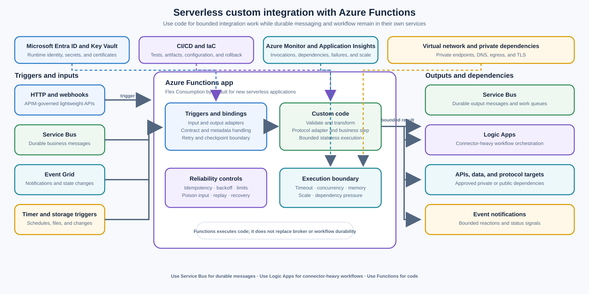

> **文档类型：**企业架构参考模型
> **规范性术语：** **MUST**、**MUST NOT**、**SHOULD**、**SHOULD NOT** 和 **MAY** 是要求级别。
> **适用范围：** 在配置和连接器不足时验证、转换、适应、安排或处理事件的自定义代码。
> **例外流程：** 偏离要求需要记录风险评估、补偿控制、指定风险负责人和到期日期。

|控制领域|价值|
|---|---|
|文件编号 | `ES-03` |
|负责人|云卓越中心 |
|审核周期|至少每年一次，并且在重大功能运行时、托管、触发器、身份或依赖性更改之后 |
|证据|功能契约、触发器和绑定定义、部署制品、安全审查、负载和故障测试以及运营就绪审查|

# 无服务器自定义集成 - Azure Functions

> **简要决定：** 将函数用于具有显式触发器和契约的有界自定义代码。将消息传递、工作流程编排、API 治理和持久状态保留在专门构建的服务中。

## 目的

当集成需要实际代码并且无法单独使用连接器、配置或声明性策略安全实现时，此体系结构使用 Azure Functions。函数提供事件驱动的、计划的和轻量级的 HTTP 执行，无需工作负载团队管理服务器群。

使用函数来验证或转换消息、处理 Service Bus 或 Event Grid 事件、实现自定义协议适配器、执行计划任务、公开轻量级 HTTP API 以及构建事件驱动的处理组件。通过为其设计的服务来保留周围的平台职责：Service Bus 提供持久的消息传递，Event Grid 提供事件通知，API Management 提供受治理的 API Front Door，Logic Apps 提供连接器密集型工作流编排。

Azure Functions 是一个代码执行边界，而不是一个通用集成平台。函数应该使用显式触发器、输入契约、输出契约、重试行为、身份和操作所有者来执行有界工作单元。函数 MUST NOT 成为未文档化的消息代理、大型有状态应用或工作流和连接器平台的替代品。

## 范围和设计成果

当组织需要执行以下操作时，请使用此模型：

- 在另一个系统接收消息之前验证、丰富、标准化或转换消息；
- 使用自定义处理逻辑使用 Service Bus 队列、主题和订阅；
- 使用有界操作响应 Event Grid 通知；
- 将自定义或遗留协议转换为受支持的 API 或消息契约；
- 执行计划的清理、协调、轮询或维护任务；
- 为范围狭窄的集成功能公开一个小型 HTTP 端点；
- 无需维护专用应用服务器即可处理文件、日志或事件；或
- 实现一个代码密集的事件驱动组件，该组件可以独立于其生产者进行扩展。

目标结果是：

- 仅当配置和连接器无法满足要求时才存在自定义代码；
- 每个函数都有一个有界触发器、契约、所有者、超时、重试策略和失败路径；
- 消息持久性和工作流状态保留在适当的代理或工作流服务中；
- 功能可以独立扩展，不会产生无限的下游压力；
- 身份、网络访问、机密、遥测和部署标准化；
- 重试和重复交付不会造成重复的业务副作用；和
- 运行时可以升级、测试和回滚，而不会隐藏与不相关功能的耦合。

## 背景和决策驱动因素

企业集成通常从连接器或配置驱动的工作流程开始。当任务主要是在支持的系统之间移动数据、映射简单字段、应用标准身份验证或协调一组已知步骤时，这是更可取的。当集成需要协议解析、重要验证、自定义签名、专门错误处理、二进制处理或特定于域的转换时，配置就会变得不够。

该决定的驱动因素是：

- **代码必要性：** 对于无法用连接器、映射或策略表示的逻辑，需要真正的运行时。
- **有界执行：** 工作可以在选定的触发器和托管限制内完成，或者委托给持久的工作流模式。
- **事件驱动的规模：** 调用可能偶尔或突发到达，并且应该独立于调用者进行扩展。
- **失败行为：** 设计定义了重试、重复传递、有害输入、超时、部分结果和操作员恢复。
- **依赖性控制：** 外部 API、数据库、代理和文件系统具有有限的连接数、速率和并发性。
- **操作清晰度：** 功能所有权、日志、指标、跟踪、部署历史记录和支持运行手册都是可见的。
- **平台适合性：** 无服务器代码比 Logic Apps、Service Bus、API 管理、容器化服务或长时间运行的应用主机更好地为应用提供服务。

## 考虑的选项

### 连接器和基于配置的集成

当集成主要是连接器调用、条件路由、标准映射、批准、通知或业务用户管理的工作流时，请使用 Logic Apps 或其他批准的连接器平台。连接器减少了自定义代码，并且通常提供内置身份验证、重试和监控。不要仅仅因为连接器工作流程尚未设计清楚而引入函数。

### Azure Service Bus

当需求是持久的业务消息传递时使用 Service Bus：队列、主题、订阅、死信、会话、重复检测、计划交付或代理事务。函数可以使用或发布 Service Bus 消息，但它们 MUST NOT 在进程内存、本地存储或自定义数据库表中重新创建这些代理功能。有关消息传递边界，请参阅[企业消息传递 - Azure Service Bus](enterprise-messaging-azure-service-bus.md)。

### Azure Event Grid
当需求是事件通知和路由时，特别是对于资源更改或应用事件，请使用 Event Grid。函数是 Event Grid 的自然事件处理程序，但函数必须定义幂等性和故障处理。如果事件代表必须等待使用者或在操作上重播的持久业务工作，请将其放置在 Service Bus 或其他合适的持久代理上。

### Azure API Management

使用 API 管理作为内部、合作伙伴和公共 API 的受控 Front Door。函数可以在 APIM 后面实现轻量级 HTTP 后端或适配器，但它不应该独立重现产品管理、消费者入驻、限制、JWT 策略、发现和 API 治理。请参阅[API 主导的集成 - Azure API Management](api-led-integration-azure-api-management.md)。

### 容器化或长时间运行的应用服务

当流程需要持久的内存状态、专门的运行时控制、长期连接、可预测的始终在线延迟、较大的依赖性或超出所选功能限制的执行时，请使用容器、App Service、Kubernetes 工作负载或其他持续运行的服务。无服务器标签并不能消除将运行时与工作负载相匹配的需要。

### 选择方向：Azure Functions

使用 Azure Functions 来执行由 HTTP、Service Bus、Event Grid、计时器、存储、数据库或其他支持的触发器调用的有界自定义代码。使用绑定可以减少集成样板代码，但在源代码管理中保持契约和行为明确。对于新的无服务器应用，请选择Flex Consumption，除非工作负载有记录在案的使用 Premium、Dedicated、Container Apps 或其他托管选项的原因。将旧版 Windows 使用计划视为现有工作负载兼容性选项，而不是新应用的默认选项。

## 参考架构

触发源负责事件或请求边界。 Function 应用验证输入，执行有界自定义代码，并通过适当的输出边界发出结果。Service Bus 仍然负责持久的消息存储和结算；Logic Apps 仍然负责连接器密集型编排； API 管理仍然负责 API 使用者治理。 Azure Monitor 和 Application Insights 提供执行和依赖性证据。

该图显示了逻辑边界，而不是强制性的单一部署。工作负载可以针对每个有限功能使用一个 Function App，通过信任或扩展边界使用多个 Function App，或者部署到不同支持的托管选项的函数。当需要独立的规模、身份或故障行为时，不要仅仅为了减少资源计数而将不相关的高容量触发器组合到一个应用中。

## 触发器和绑定模型

根据源契约和所需的执行语义选择触发器：

|触发|正确使用|保留边界|
|---|---|---|
|Service Bus |持久商业消息的定制加工|消息代理负责持久性、交付、结算、会话和死信 |
|Event Grid|事件通知和有界事件响应|事件源负责通知；该函数负责幂等处理和故障响应|
| HTTP |轻量级请求-响应适配器或 webhook | APIM 负责外部 API 治理；该函数负责有界请求处理|
|定时器|定期清理、轮询、协调或维护 |定时器开始工作；持久化存储或消息代理负责长期进展|
| Blob 或存储 |文件验证、元数据提取或受控转换 |存储负责制品；该函数负责处理和输出证据|
|数据库或更改提要 |对支持的数据更改的有限响应 |数据平台负责事实来源和变更语义 |

绑定可以减少连接和公共触发/输出路径的样板。它们并不能消除了解交付、锁定、检查点、重试、序列化、网络和身份验证行为的需要。当所需操作或可靠性控制无法通过绑定安全表达时，直接使用 SDK，并记录原因。

## 自定义集成职责

### 消息验证和转换

在调用下游系统之前验证消息身份、架构版本、必填字段、数据分类、租户或业务范围以及允许的状态转换。确定性地拒绝格式错误的输入，并将其路由到源代理的死信或故障路径，并提供足够的元数据进行诊断。

仅在有意的边界处进行变换。在输出或处理日志中保留源消息 ID、相关性 ID、因果关系 ID、生产者、模式版本和原始时间戳。映射代码应该进行版本控制，使用代表性的边缘情况进行测试，并在消费者独立升级的情况下向后兼容。

不要使用函数来无限期地隐藏不稳定的契约。如果多个使用者需要相同的转换，请考虑规范契约、共享库、API 外观或具有所有者和生命周期的专用集成组件。

### Service Bus 处理

Service Bus 触发的函数应完成有界的工作单元，并仅在记录所需的持久化结果后才处理消息。它应该根据队列或订阅策略处理锁定持续时间、传递计数、瞬态异常、依赖限制和毒消息。

假设至少交付一次。函数可能会在副作用之后和消息结算之前失败，因此相同的输入可能会再次执行。使用幂等性键、收件箱记录、独特的业务约束或原子发件箱/收件箱设计。不要将业务结果的唯一副本存储在函数内存或临时本地文件中。

当相关消息需要有序处理时，使用 Service Bus 会话；不要通过假设函数调用顺序来实现排序。使用队列或主题进行持久缓冲；不要构建进程内队列来补偿缓慢的依赖关系。

### Event Grid 处理
Event Grid 处理程序应将事件视为可以重试或多次传递的通知。在采取行动之前验证事件类型、主题、来源、事件 ID、时间、数据版本和授权。当处理程序更改外部状态时，存储已处理的事件日志或使用等效的幂等操作。

如果事件处理可能超出触发器的实际执行边界，请将持久工作消息发布到 Service Bus，并在接受切换后从事件处理程序返回。在执行属于代理或持久编排器的多步骤工作流时，函数不应保持 Event Grid 交付打开。

### 自定义协议适配器

使用函数将有界的遗留或专用协议转换为批准的 HTTP、Service Bus、存储或事件契约。尽可能将解析、验证、身份验证和映射与域服务分开。采集协议级故障详细信息，无需记录凭据或受监管的有效负载。

适配器应该定义：

- 支持的协议版本和消息大小；
- 连接、超时、重试和并发限制；
- 身份验证和证书轮换；
- 源和目的地关联；
- 部分发送和确认行为；
- 死信、隔离或手动恢复；和
- 遗留协议退役时的弃用路径。

### 计划任务

使用计时器触发的函数进行有界作业，例如清理、协调、缓存刷新、轮询或证书和元数据检查。使任务具有幂等性，并且可以在超时或主机重新启动后安全地重新运行。当作业跨越多个项目或可能超过单次调用时，请使用持久检查点、租约或工作队列。

计时器计划应使用明确的时区策略、记录在案的错过运行行为、并发防护和告警。当每个事件都必须作为业务义务进行日志、独立重试、取消或审核时，计时器触发器不能替代持久调度程序。

### 轻量级 HTTP API

函数可能会为 Webhook、适配器、健康感知集成操作或有界转换公开一个小型 HTTP 端点。对于内部、合作伙伴或公共 API，当接口需要身份验证策略、速率限制、产品、订阅、版本控制或集中发现时，请将 API Management 放在前面。

保持 HTTP 函数无状态且有界。拒绝过大或不受支持的请求，设置显式超时，使用相关 ID，避免返回内部异常详细信息，并且不要同步执行长时间运行的工作。当调用者不需要立即得到最终结果时，接受请求并排队持久工作。

## 工作流程和消息传递边界

函数和 Logic Apps 是互补的，但重心不同：

|要求 |首选边界 |原因 |
|---|---|---|
|具有标准服务集成的连接器密集型工作流程|Logic Apps|配置、连接器、工作流状态和集成操作是首要关注的问题 |
|自定义解析、验证、转换或协议代码 | Azure Functions |需要实际代码并且工作单元是有限的 |
|持久的业务命令或事件缓冲| Azure Service Bus |需要消息代理耐久性、交付、会话、死信和结算 |
|事件通知和资源变化响应|Event Grid 加 Functions |事件路由和自定义事件处理是不同的问题 |
|长期运行的以代码为中心的编排|Durable Functions 或经批准的工作流运行时 |持久状态和协调是显式的，而不是隐藏在单个调用中 |
|受监管的 API 暴露 | API Management + 后台功能 |消费者策略和定制实施仍然分开|

不要将 Service Bus 语义放入函数中。不要将连接器目录、可视化工作流程或长时间运行的编排放入大型 Function 方法中。如果集成需要代码和工作流程，请保持明确的边界并在它们之间传递持久的契约。

## 托管和规模

对于新的无服务器 Function 应用，请使用 Flex Consumer 作为默认起点，除非工作负载要求证明需要其他计划。 Flex Consumation 提供事件驱动的扩展、支持触发器的按功能扩展行为、虚拟网络集成和即用即付计费。在标准化工作负载之前，请确认当前支持的语言、触发器、区域、网络、实例、内存、并发和执行约束。

旧版 Windows 使用计划可能仍然应用于尚未迁移的现有应用，但不应成为新应用的默认设置。 Premium 提供随时可用的实例以及额外的网络和执行特性。当可预测的容量、现有的 App Service 承诺或容器级控制超过无服务器弹性时，专用计划和 Container Apps 可能更可取。

围绕完整的依赖链规划规模：

- 触发到达率和批量大小；
- 每次调用的持续时间和内存；
- 最大并发执行数；
- 下游 API、数据库、代理和存储限制；
- 连接重用和套接字耗尽；
- 冷启动和热实例行为；
- 部署包大小和依赖初始化；和
- 停电或规模事件后的积压排出时间。

不要让自动扩展压倒依赖项。使用有界并发、背压、速率限制、基于队列的负载均衡和特定于依赖项的重试策略。快速扩展但会导致数据库限制或合作伙伴阻塞的 Function 应用缺乏弹性。

## 安全和网络

在支持的情况下，使用托管标识或工作负载标识进行 Azure 资源访问。将身份范围限定为功能所需的确切 Service Bus 实体、存储容器、Key Vault 机密、Event Grid 操作、数据库或 API。将部署身份与运行时身份分开，并将生产凭据保留在已批准的机密模式之外管理的应用设置之外。

应用：

- 应用于 HTTP 端点的 Microsoft Entra 身份验证；
- 私有端点、虚拟网络集成或敏感依赖项的批准出口路径；
- Key Vault 参考或等效的证书和外部凭证机密管理模式；
- 输入验证、请求大小限制、内容类型检查和安全序列化；
- 自定义协议适配器的 TLS 验证和证书轮换；
- 仅在记录了兼容性需求的情况下才限制使用 CORS 和功能键；和
- 对令牌、凭证、消息正文和受监管数据进行诊断脱敏。

该函数不会自动受信任，因为它在 Azure 内部运行。在应用副作用之前验证调用者、触发器元数据、消息契约、租户或资源范围以及依赖项响应。将事件负载和外部 API 响应视为不受信任的输入。

## 可靠性、重试和状态

为验证失败、暂时依赖失败、授权失败、限制和永久业务拒绝实现显式异常类。仅重试具有有限尝试、指数退避和抖动的瞬态故障。在基本条件发生变化之前，请勿重试格式错误的输入或拒绝授权。

设计每个触发器以实现重复交付和部分执行。在不可重复的副作用之前记录稳定的操作键，或者使用原子应用模式，使副作用和处理记录一致。当函数在更新数据库后发布消息时，请使用事务发件箱或其他可靠的发布机制，而不是假设两个独立的调用是原子的。

当工作负载真正需要以代码为中心的持久编排、检查点、计时器、扇出/扇入或补偿时，请使用持久功能。持久功能仍然需要仔细的状态、版本控制、重放安全代码和外部依赖性控制。当连接器密集型工作流可见性和集成操作比以代码为中心的编排更重要时，请使用 Logic Apps。

## 可观测性和操作

每个函数都应发出结构化遥测数据，其中包含函数名称、版本、调用 ID、相关 ID、消息 ID 或事件 ID、触发器类型、租户或允许的业务范围、依赖项、结果、持续时间、重试尝试和失败类别。默认情况下不记录完整负载。

至少监控：

- 调用次数、成功率、失败率、持续时间、内存和并发度；
- 冷启动、实例计数、规模决策、限制和主机运行状况；
- 触发延迟、队列年龄、传递计数、检查点或锁定失败以及事件重试行为；
- 下游依赖延迟、状态、限制、连接错误和电路状态；
- 死信、隔离、重复、验证拒绝和永久失败计数；
- 计时器迟到、错过执行、重叠运行和协调期限；
- HTTP 状态代码、身份验证失败、请求大小和速率限制结果；和
- 部署版本、配置更改、机密轮换和运行时升级状态。
函数所有者对代码、契约、依赖行为、测试、部署、告警、仪表板、运行手册和成本负责。平台团队负责经过批准的托管基线、身份模式、网络、诊断、运行时支持和部署护栏。服务所有者保留对其消息代理、API、数据存储和工作流语义的所有权。

Runbook 应涵盖触发器中断、依赖项中断、重试风暴、毒消息、重复副作用、超时、内存耗尽、规模饱和、部署失败、机密或证书过期、网络路径故障、模式不兼容以及受控重播或协调。

## 验证

- [ ] 该要求需要自定义代码，并且无法通过批准的连接器、配置或策略安全地满足。
- [ ] 该函数具有一个或多个显式触发器、输入契约、输出契约、所有者和支持的执行边界。
- [ ] Service Bus 仍然是持久的消息传递边界，Logic Apps 仍然是连接器密集型工作流边界。
- [ ] Service Bus 和 Event Grid 处理程序是幂等的，并针对重复、重试、超时和副作用后崩溃行为进行了测试。
- [ ] 消息验证、转换、协议适配和模式演化具有代表性测试。
- [ ] HTTP 端点受到限制、经过身份验证、大小受限，并且在需要治理时由 API Management 负责。
- [ ] 计时器作业定义时区、错过运行、重叠、检查点、取消和协调行为。
- [ ] 灵活消费或所选替代方案根据规模、网络、延迟、执行、依赖性和成本要求进行论证。
- [ ] 运行时和部署身份是独立的、权限最小、轮换且可审核的。
- [ ] 验证私有网络、机密管理、证书验证、有效负载脱敏和出口控制。
- [ ] 在突发和中断条件下测试重试、背压、并发、下游限制和无法处理的输入行为。
- [ ] 功能遥测包括相关性、触发、依赖性、结果、重试、持续时间和故障级别证据。
- [ ] 仪表板、告警、部署回滚、运行时升级、事件和协调运行手册是最新的。
- [ ] 该函数不包含无限制的消息代理、隐藏的工作流状态或属于其他地方的连接器密集型编排。

## 相关主题

- [API 主导的集成 — Azure API Management](api-led-integration-azure-api-management.md)
- [企业消息传递 - Azure Service Bus](enterprise-messaging-azure-service-bus.md)
- [Azure Data Factory 和数据集成](../data-ai-integration/dai-azure-data-factory-and-data-integration.md)
- [验证、测试和运营就绪](../operations-reliability-finops/validation-testing-and-operational-readiness.md)

## 参考文档

- [Azure Functions 概述](https://learn.microsoft.com/en-us/azure/azure-functions/functions-overview)
- [Azure Functions 架构最佳实践](https://learn.microsoft.com/en-us/azure/well-architected/service-guides/azure-functions)
- [事件驱动架构风格](https://learn.microsoft.com/en-us/azure/architecture/guide/architecture-styles/event-driven)
- [Azure Functions 入门](https://learn.microsoft.com/en-us/azure/architecture/web-apps/serverless/architectures/web-app)
- [反腐败层模式](https://learn.microsoft.com/en-us/azure/architecture/patterns/anti-corruption-layer)
