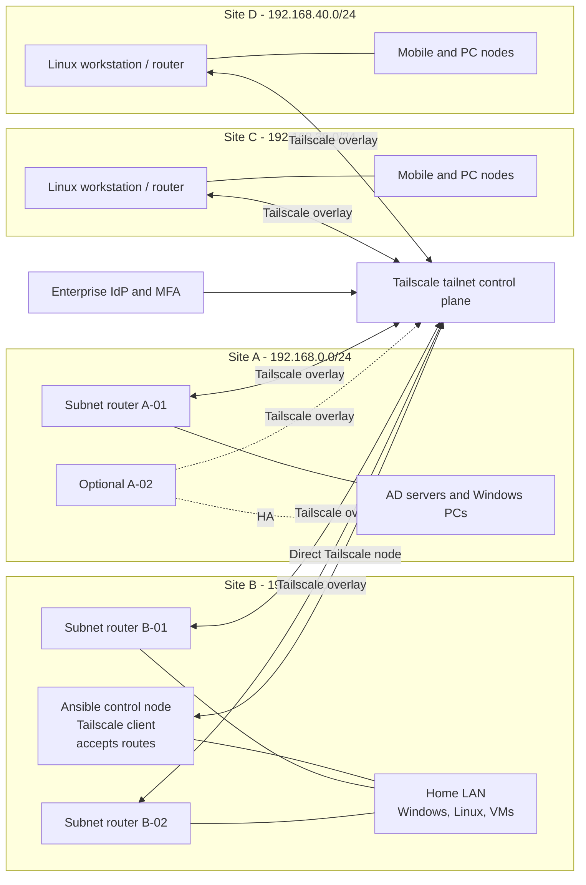

# 企业 Tailscale + Ansible 多站点管理解决方案

> **文档类型：**企业架构解决方案
> **适用范围：** 跨四个具有 Linux 和 Windows 目标的互联网分布式站点进行安全、子网路由的 Ansible 管理。

## 目的

使用单个组织管理的 Tailscale tailnet 作为加密连接和身份层，在站点 A–D 处使用 Linux 子网路由器，在站点 B 处使用直接注册的 Ansible 控制节点。

推荐的生产模式是：

- 站点 A：可能的话有两个 Linux 子网路由器；可用的 Linux VM 是最小可行路由器，并且在添加第二个路由器之前是明显的单点故障。
- 站点 B：两个专用 Linux 子网路由器以及一个单独的 Ansible 控制节点。不要使 Ansible 控制器成为唯一的路由网关。
- 站点 C 和 D：Linux 工作站可以是实验室路由器和托管端点；如果办公室需要路由器故障转移，生产环境应添加第二个 Linux 设备或虚拟机。
- Tailscale 仅通告四个站点 LAN 前缀；此设计中没有默认路由或互联网出口节点行为。
- Ansible 控制器直接连接到 Tailscale 并接受四个子网路由。它在 Linux 上使用 SSH，在 Windows 上使用 WinRM/PSRP。
- 站点到站点流量使用最低权限 Tailscale 授予、路由批准、本地主机防火墙和需要保留源的站点网关路由。

Tailscale 子网路由是一种覆盖路由通告模型，不能替代 LAN 防火墙策略或主机授权。必须通告并批准路由，并且访问策略也必须允许流量。路由和策略是单独的控制。

## 背景和决策驱动因素

### 提供的站点模型

|站点 |角色 |局域网子网|预配系统|最小路由角色|
|---|---|---|---|---|
|站点 A |企业站点| `192.168.0.0/24` | 10 台 Windows PC、2 台 AD 服务器、可能 1 个 Linux 虚拟机 | Linux VM 作为子网路由器；添加第二个 Linux 路由器用于生产 HA |
|站点 B |首页 / 管理站点 | `192.168.10.0/24` | 5 台 Windows 服务器、5 台工作站、5 台 Linux 服务器、10 台虚拟机 |两台 Linux 子网路由器和一个独立的 Ansible 控制节点 |
|站点 C |远程办公| `192.168.30.0/24` | 1 个 Linux 工作站和最多 10 个移动节点/PC/笔记本电脑/平板电脑 | Linux 工作站作为实验室路由器；添加第二个路由器用于生产 HA |
|站点 D |远程办公| `192.168.40.0/24` | 1 个 Linux 工作站和最多 10 个移动节点/PC/笔记本电脑/平板电脑 | Linux 工作站作为实验室路由器；添加第二个路由器用于生产 HA |

地址范围不重叠，这是直接站点到站点子网路由所必需的。如果真实站点有重复或重叠的范围，则在连接站点之前需要重新编号、NAT 或不同的分段设计。

### 管理要求

- 站点 B Ansible 控制器必须到达所有四个站点网络。
- 对于 Linux 系统和任何有意配置 OpenSSH 的 Windows 系统，SSH 是必需的。
- Windows 管理还必须通过 WinRM HTTPS 或 WinRM 上的 PSRP 支持，通常是 TCP `5986`。
- 常见附加服务必须明确批准而不是广泛开放：
  - HTTPS `443` 用于管理和 API；
  - RDP `3389`，用于限制操作员访问（如果需要）；
  - SMB `445` 仅应用于定义的文件管理或备份工作流程；
  - 仅当管理工作流程需要时才使用 DNS `53`；
  - 仅应用于指定系统和所有者的应用特定端口。
- 移动节点和平板电脑可以使用 Tailscale 来访问批准的站点服务，但 Ansible 仅当它们公开受支持的 SSH、WinRM/PSRP 或应用 API 接口时才能管理它们。

## 参考架构

控制平面分发节点身份、路由通告和策略。数据流量通常在可能的情况下直接在 Tailscale 节点之间流动；到非 Tailscale LAN 主机的流量由该站点的子网路由器转发。

## 地址和命名方案

以下地址是实验室或设计工作簿的示例。使用前请在真实的 DHCP/IPAM 系统中保留它们。

|站点 |功能|示例名称 | LAN 地址示例 |
|---|---|---|---:|
|一个 |主子网路由器| `tsr-a-01` | `192.168.0.2` |
|一个 |辅助子网路由器| `tsr-a-02` | `192.168.0.3` |
|一个 | AD 服务器1 | `a-ad-01` | `192.168.0.10` |
|一个 | AD 服务器2 | `a-ad-02` | `192.168.0.11` |
|一个 | Windows 电脑 | `a-pc-01` 至 `a-pc-10` | `192.168.0.101` 至 `192.168.0.110` |
|乙|主子网路由器| `tsr-b-01` | `192.168.10.2` |
|乙|辅助子网路由器| `tsr-b-02` | `192.168.10.3` |
|乙| Ansible 控制节点 | `ansible-b-01` | `192.168.10.20` |
|乙| Windows 服务器 | `b-win-srv-01` 至 `b-win-srv-05` | `192.168.10.21` 至 `192.168.10.25` |
|乙|工作站 | `b-pc-01` 至 `b-pc-05` | `192.168.10.101` 至 `192.168.10.105` |
|乙| Linux 服务器 | `b-linux-01` 至 `b-linux-05` | `192.168.10.41` 至 `192.168.10.45` |
|乙|虚拟机 | `b-vm-01` 至 `b-vm-10` | `192.168.10.61` 至 `192.168.10.70` |
| C | Linux 工作站/路由器| `tsr-c-01` | `192.168.30.2` |
| C |手机及电脑预约 | `c-node-01` 至 `c-node-10` | `192.168.30.101` 至 `192.168.30.110` |
| d | Linux 工作站/路由器| `tsr-d-01` | `192.168.40.2` |
| d |手机及电脑预约 | `d-node-01` 至 `d-node-10` | `192.168.40.101` 至 `192.168.40.110` |

在管理子网路由器后面的主机时，使用 Ansible 清单中的稳定主机名并将 `ansible_host` 设置为 LAN 地址。对直接注册的节点（例如 `ansible-b-01` 和子网路由器本身）使用 Tailscale MagicDNS 名称。

## 路由模型

### 广告路由

|路由器标签|广告路由 |站点 |
|---|---|---|
| `tag:subnet-router-a` | `192.168.0.0/24` |一个 |
| `tag:subnet-router-b` | `192.168.10.0/24` |乙|
| `tag:subnet-router-c` | `192.168.30.0/24` | C |
| `tag:subnet-router-d` | `192.168.40.0/24` | d |

对于 HA，一个站点的两台路由器必须通告完全相同的前缀。当更具体的路由失败时，Tailscale 故障转移不会提升更广泛的前缀，并且标准故障转移模型中没有管理员选择的首选路由器。该路由必须在管理控制台中手动批准或通过 `autoApprovers` 策略批准。

请勿为此用例宣传 `0.0.0.0/0`。出口节点的功能与站点子网路由器不同，并且会创建更大的安全和故障排除范围。

### SNAT 选择

|模式|优势 |权衡|使用|
|---|---|---|---|
|默认子网路由 SNAT |需要对现有 LAN 网关进行较少的更改；适合第一个实验室|远程主机将本地子网路由器视为源；站点到站点的返回路径和审核细节不太明确 |实验室快速路径和网关无法添加静态路由的环境 |
|静态路由无 SNAT |保留原始 Tailscale/LAN 源地址并支持更清晰的站点到站点路由和日志记录 |需要站点网关上的静态路由和精心设计的防火墙规则 |网关控制可用时的企业基线 |

no-SNAT 设计要求每个参与的 LAN 网关知道如何通过其本地子网路由器将流量返回到相关的远程前缀。如果无法安全实施，请保留 SNAT 并限制对直接注册的 Tailscale 客户端或显式路由管理源的访问。

### 站点 B访问

首选路径是直接在家用 PC 和 Ansible 控制器上安装 Tailscale，然后在 Linux 控制器上启用路由接受。这避免了每个家庭设备都依赖于单个 LAN 网关进行远程访问。

如果整个站点 B LAN 必须访问站点 A、C 和 D，请在站点 B 网关上添加将远程前缀指向站点 B 子网路由器的路由。对于无 SNAT 设计，请在站点 A、C 和 D 上添加相应的返回路由。在为非 Tailscale LAN 客户端声明路由器 HA 之前，验证网关是否支持冗余下一跃点。

## Tailscale 控制平面设计

### 身份和设备注册

- 使用具有 MFA 的企业身份提供商进行人工 tailnet 访问。
- 使用基于角色的组，例如 `group:netops` 和 `group:ansible-operators`。
- 对非人类设备使用标签；标签所有权必须仅限于网络/安全管理组。
- 启用设备批准时，对服务器使用预先批准的、标记的身份验证密钥。将密钥保存在 Secret Manager 或 CI 机密存储中，并且永远不要提交它们。
- 每个站点和用途使用单独的身份验证密钥，以便受损的注册机密具有有限的范围。
- 审查节点密钥到期、身份验证密钥到期、重新身份验证和注销程序。标记的设备具有不同的密钥过期行为，因此记录所选策略而不是依赖默认值。
- 当 tailnet 和运营模型支持时，考虑 tailnet lock、状态检查和策略即代码审查。

### 说明性赠款策略

以下是一个起始示例，而不是直接生产策略。替换示例身份，在 Tailscale 策略编辑器中验证当前的 Grants 语法，并从允许和拒绝的源进行测试。
```json
{
  "groups": {
    "group:netops": ["netops@example.com"],
    "group:ansible-operators": ["automation@example.com"]
  },
  "tagOwners": {
    "tag:subnet-router-a": ["group:netops"],
    "tag:subnet-router-b": ["group:netops"],
    "tag:subnet-router-c": ["group:netops"],
    "tag:subnet-router-d": ["group:netops"],
    "tag:ansible-control": ["group:netops"],
    "tag:linux-managed": ["group:netops"]
  },
  "autoApprovers": {
    "routes": {
      "192.168.0.0/24": ["tag:subnet-router-a"],
      "192.168.10.0/24": ["tag:subnet-router-b"],
      "192.168.30.0/24": ["tag:subnet-router-c"],
      "192.168.40.0/24": ["tag:subnet-router-d"]
    }
  },
  "grants": [
    {
      "src": ["tag:ansible-control", "192.168.10.0/24"],
      "dst": ["192.168.0.0/24"],
      "ip": ["icmp:*", "tcp:22", "tcp:443", "tcp:5986"],
      "via": ["tag:subnet-router-a"]
    },
    {
      "src": ["tag:ansible-control", "192.168.10.0/24"],
      "dst": ["192.168.30.0/24"],
      "ip": ["icmp:*", "tcp:22", "tcp:443", "tcp:5986"],
      "via": ["tag:subnet-router-c"]
    },
    {
      "src": ["tag:ansible-control", "192.168.10.0/24"],
      "dst": ["192.168.40.0/24"],
      "ip": ["icmp:*", "tcp:22", "tcp:443", "tcp:5986"],
      "via": ["tag:subnet-router-d"]
    },
    {
      "src": ["group:ansible-operators"],
      "dst": ["tag:subnet-router-a", "tag:subnet-router-b", "tag:subnet-router-c", "tag:subnet-router-d"],
      "ip": ["tcp:22", "tcp:443"]
    }
  ],
  "ssh": [
    {
      "action": "check",
      "src": ["group:ansible-operators"],
      "dst": ["tag:linux-managed"],
      "users": ["autogroup:nonroot"],
      "checkPeriod": "12h"
    }
  ]
}
```
网络授予允许路由 IP 访问；他们不配置操作系统 SSH 守护程序或创建 Windows 账户。 `ssh` 策略仅应用于直接注册的 Linux/macOS 设备上的 Tailscale SSH。它不向仅位于子网路由器后面的主机提供 SSH。

### Tailscale SSH 与标准 SSH

默认情况下，通过 Tailscale 网络使用标准 SSH 进行 Ansible Linux 管理。这使清单和密钥管理模型保持熟悉，并且应用于通过子网路由到达的 Linux 主机。对于直接运行 Tailscale 的 Linux 节点来说，Tailscale SSH 是一个有用的操作员访问选项，但它并不能替代每个路由主机上的标准 SSH。

Tailscale SSH 不是 Windows 管理协议，除非目标本身运行 Tailscale SSH，否则无法到达子网路由器后面的设备。 Windows 系统应根据批准的主机标准使用 WinRM/PSRP 或 Windows OpenSSH。

## Ansible 管理架构

### 控制节点

`ansible-b-01` 是站点 B 上的 Linux 控制节点，具有：

- 直接 Tailscale 客户端并启用 `--accept-routes`；
- `ssh-agent` 持有的 SSH 密钥或受保护的密钥存储；
- 用于密码、WinRM 证书、API 令牌和其他机密的 Ansible Vault；
- 包含清单、组变量、角色、Playbook、测试和更改历史记录在案的 Git 仓库；
- 本地日志和配置仓库的备份；
- 记录在案的恢复程序或辅助控制节点。

请勿将唯一的 Ansible 控制器和唯一的站点 B 子网路由器放置在同一虚拟机上进行生产。该虚拟机出现故障将取消自动化和路由访问。

### Ansible 连接标准

|目标|推荐连接 |典型端口|凭证/控制 |
|---|---|---:|---|
| Linux 服务器、Linux VM 和 Linux 子网路由器 | OpenSSH | 22 | 22按用途 `ansible` 账户、SSH 密钥、最低权限 `sudo` |
| Windows 服务器、AD 服务器、Windows PC | WinRM HTTPS 或 PSRP over WinRM | 5986 |适当的域/Kerberos，或通过受信任的 HTTPS 的本地账户/证书 |
|仅应用于 Windows 实验室的快速路径 | WinRM 与 NTLM 和 Tailscale 上的消息加密 | 5985 | Vault 中的实验室凭证；切勿将听众暴露在公共互联网上 |
|直接注册 Linux 运维节点|标准 SSH 或 Tailscale SSH | 22 | 标准 SSH 密钥或 tailnet 身份策略 |
|手机/平板电脑客户端 |默认情况下不是 Ansible 目标 |变化 |除非存在受支持的管理 API，否则只能访问 Tailscale |

Ansible 清单应该使用组变量来表示连接行为，使用主机变量来表示路由的LAN 地址。在 Playbook 和文档中使用 FQCN，例如 `ansible.builtin.ssh`、`ansible.builtin.winrm`、`ansible.windows.win_ping` 和 `ansible.builtin.ping`。

### 服务访问策略

|服务 |来源 |目的地 |决定|
|---|---|---|---|
| SSH TCP 22 | Ansible 控制、经批准的 netops 设备 | Linux 目标和子网路由器 |必填 |
| WinRM HTTPS TCP 5986 | Ansible 控制 | Windows 目标 | Windows 自动化所需 |
| WinRM HTTP TCP 5985 | 仅限实验室控制 | 实验室 Windows 目标 | 仅限临时实验室例外；使用消息加密，并在实验后删除 |
| HTTPS TCP 443 | Ansible 控制和批准的操作员 |管理门户/API |仅命名服务需要 |
| RDP TCP 3389 | 已批准的操作员组 | 命名 Windows 目标 | 可选、受限、经过审核 |
| SMB TCP 445 | 已批准的备份/文件管理作业 | 命名文件服务器 | 可选，绝不开放广泛的 tailnet 访问 |
| DNS TCP/UDP 53 | 已批准的 DNS 客户端 | 已批准的 DNS 服务器 | 可选；在可行时优先使用已知 DNS 解析器和 IP 清单 |

不要将 Ansible 控制器中的 `*:*` 授予所有四个 LAN 作为生产默认值。添加特定于应用的规则，其中包含所有者、用途、到期/审核日期和验证测试。

## 安全性、弹性和成本

主要成本驱动因素是 Tailscale 订阅层、Linux 子网路由器主机、可选冗余路由器和 WAN 容量、Ansible 控制器托管、备份和监控以及策略、防火墙和恢复测试的工程时间。设计应根据所需的 RTO 进行成本计算，而不是假设每个站点都需要相同的硬件。

|组件|故障影响|企业待遇 |
|---|---|---|
|Tailscale 控制平面|新策略、路由分配或新节点注册可能受到影响；已建立的路径具有不同的连续性特征 |保护 tailnet 管理员账户、恢复方法、策略备份和提供商升级路径 |
|站点 A Linux VM 路由器 |通过覆盖无法访问站点 A |在单独的主机、电源路径以及最好是单独的虚拟化或硬件边界上添加 `tsr-a-02` |
|站点 B 路由器对 |站点 B LAN 路由可能会失败或变得不对称 |使用两个路由相同的路由器；将 Ansible 控制分开；测试路由器故障和返回路径|
|站点 B Ansible 控制器 |自动化停止，但 Tailscale 路由仍然可用 |维护备份仓库和辅助控制器或重建过程 |
|站点 C/D Linux 工作站路由器 |每个小型办公室都无法通过覆盖层访问|如果 RTO 需要，添加第二个始终在线的 Linux 路由器/设备；请勿通过一台工作站实现 HA |
|站点 ISP 或电源|本地用户可能失去云访问权限，子网路由器可能消失 | UPS、配置备份、备用设备和基于批准的 RTO 的可选辅助 WAN/5G |
|主机防火墙或网关路由|尽管 Tailscale 路由正常，但服务可能无法访问 |尽可能以代码形式管理本地防火墙和静态路由配置 |

当重叠子网路由器通告完全相同的前缀时，Tailscale 可以在它们之间进行故障转移。记录在案的故障转移行为可能需要大约 15 秒，并且更宽或不同大小的前缀不是等效的故障转移候选者。如果站点只有一个 Linux 路由器，请将其记录为已接受的 SPOF，直到安装并测试第二个路由器。
对于通告相同本地前缀的 HA 路由器，避免在备用路由器上启用路由接受，除非设计特别需要该行为；否则备用路由器可能会通过另一台路由器转发其自身直连 LAN 的流量。故意测试 `--accept-routes` 行为，而不是将设置复制到每个路由器。

## 操作注意事项

### 机密和特权访问

- 在 Git 外部存储 Tailscale 身份验证密钥、SSH 私钥、WinRM 密码、证书和 API 凭据。
- 在设备生命周期允许的情况下，使用短期或有范围的注册密钥。
- 根据操作系统类别和站点使用唯一的本地自动化账户，或在可用的情况下使用集中管理的身份。
- 使用仅允许所需 Ansible 角色的 `sudo` 规则；不要使每个 Playbook 都成为不受限制的根工作流程。
- 使用仅具有 Playbook 所需权限的 Windows 本地/域账户。保护 WinRM 侦听器证书和 CA 信任链。
- 要求对操作员访问进行 MFA 和定期重新验证；不要使用共享的 Tailscale 用户。

### 监测和证据

监控并保留：

- 子网路由器健康状况、路由通告、路由批准和路由更改；
- Tailscale 节点授权、标签变更、关键事件、策略变更；
- Ansible 工作身份、清单修订、Playbook 修订、结果和失败原因；
- 托管主机上的 SSH、WinRM、RDP、SMB 和应用防火墙事件；
- 从站点 B 到每个站点的连接延迟和数据包丢失；
- Ansible 仓库、策略导出、路由器配置和关键服务数据的备份和恢复测试。

### 更改控制

路由通告、授予、子网路由器防火墙规则、静态网关路由、WinRM 侦听器和 Ansible 特权任务是生产更改。每次更改都应记录请求、所有者、受影响的站点、确切的前缀/端口、回滚操作、验证结果和下次审核日期。

## 实施路线图

1. 确认 IPAM、网关所有权、非重叠、DNS 行为以及站点 A–D 的真实清单。
2. 创建 tailnet、身份集成、MFA、管理员组、设备审批模型、标签所有权和恢复程序。
3. 为每个站点构建一条独立的实验室路由，并通过允许和拒绝的测试来验证策略。
4. 使用 Vault 部署站点 B Ansible 控制器并引导 Linux SSH 和 Windows WinRM/PSRP 凭据。
5. 注册站点 A，然后注册站点 C 和 D，最后注册剩余的站点 B 节点。从每个站点一台代表性的 Linux 和 Windows 主机开始。
6. 仅批准确切的四个站点前缀并验证控制器和家庭 PC 上的路由接受情况。
7. 添加特定于服务的授予和主机防火墙规则；不要因为单个测试失败而扩大访问范围。
8. 在可用性目标需要的每个站点添加第二个子网路由器，然后测试精确前缀故障转移。
9. 自动执行配置漂移检查、修补、清单收集、备份验证和恢复测试。
10. 在将设计视为生产就绪之前签署验收矩阵。

## 验证

|测试|预期结果 |
|---|---|
| Ansible 控制器可以看到所有四个通告的路由 | `ip route` 或等效项显示四个批准的前缀 |
|控制器到达每个子网路由器 | Tailscale IP 和 LAN IP 测试成功 |
|控制器达到 Linux 目标 |使用批准的密钥和账户，SSH 在 TCP 22 上成功 |
|控制器达到 Windows 目标 | WinRM/PSRP 在 TCP 5986 上成功通过证书验证和 Vault 凭据 |
|家用电脑获取 Site A/C/D 批准的服务 |只有明确允许的端口才会成功 |
|未经授权的 tailnet 用户或标签访问受保护的服务 |连接被 Tailscale 策略或主机防火墙拒绝 |
|站点网关返回路径| No-SNAT 流量通过正确的本地子网路由器返回 |
|子网路由器故障 |精确前缀路由故障转移到部署 HA 的第二个路由器 |
|新设备恢复 |无需共享永久密钥即可注册重建的路由器或控制器 |
| Ansible 幂等性 |相同的 Playbook 运行在第二次运行时不会产生意外的变化 |
|审计与回滚|策略、路由、防火墙和 Playbook 更改有证据和经过测试的回滚 |

## 范围边界

- Tailscale 不会消除对本地 Windows 防火墙、Linux 防火墙、网关 ACL、操作系统账户或应用授权的需求。
- 子网路由不会使手机或平板电脑成为 Ansible 托管节点。
- Tailscale SSH 不是子网路由器后面的主机的通用 SSH 网关。
- Ansible 是无代理的；它仍然需要受支持的连接协议和足够的主机权限。
- AD 服务器可以通过 WinRM/PSRP 进行管理，但正常的 AD DS 协议和 DNS 依赖性仍然是应用关注的问题，不应通过 tailnet 广泛暴露。
- 充当用户端点和子网路由器的单个 Linux 工作站适合实验室，而不适合高可用性生产办公室。

## 相关主题

- [企业多云 Ansible 自动化参考架构](enterprise-ansible-automation-reference-architecture.md)
- [动手实验室：跨四个站点的 Tailscale + Ansible](../hands-on-lab/tailscale-ansible-hands-on-lab.md)

## 参考文档

- [Tailscale 站点到站点网络](https://tailscale.com/docs/features/site-to-site)
- [Tailscale 子网路由器](https://tailscale.com/docs/features/subnet-routers)
- [Tailscale 路由注入](https://tailscale.com/docs/reference/route-injection)
- [Tailscale 子网路由器高可用性](https://tailscale.com/docs/how-to/set-up-high-availability)
- [Tailscale Grants 语法](https://tailscale.com/docs/reference/syntax/grants)
- [Tailscale 策略文件语法](https://tailscale.com/docs/reference/syntax/policy-file)
- [Tailscale 授权密钥](https://tailscale.com/docs/features/access-control/auth-keys)
- [Tailscale SSH](https://tailscale.com/docs/features/tailscale-ssh)
- [Ansible 清单指南](https://docs.ansible.com/projects/ansible/latest/inventory_guide/intro_inventory.html)
- [Ansible Windows 管理指南](https://docs.ansible.com/projects/ansible/latest/os_guide/intro_windows.html)
- [Ansible Windows 远程管理指南](https://docs.ansible.com/projects/ansible-core/devel/os_guide/windows_winrm.html)
- [Ansible WinRM 连接插件](https://docs.ansible.com/projects/ansible/latest/collections/ansible/builtin/winrm_connection.html)
