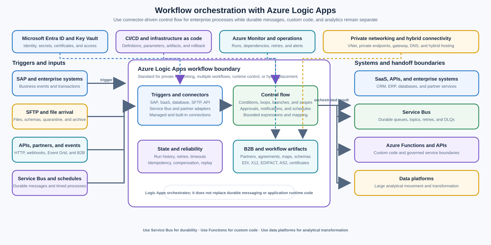

> **文档类型：**企业架构参考模型
> **规范性术语：** **MUST**、**MUST NOT**、**SHOULD**、**SHOULD NOT** 和 **MAY** 是要求级别。
> **适用范围：** 主要由连接器驱动的多步骤集成流程，需要控制流、重试、批准、计划或 B2B 处理。
> **例外流程：** 偏离要求需要记录风险评估、补偿控制、指定风险负责人和到期日期。

|控制领域|价值|
|---|---|
|文件编号 | `ES-04` |
|负责人|云卓越中心 |
|审核周期|至少每年一次，并且在发生重大 Logic Apps 运行时、连接器、身份、网络、集成账户或工作流托管更改之后 |
|证据|工作流程定义、连接器和连接清单、身份和网络审查、契约测试、故障测试、部署制品和运营就绪情况审查 |

# 工作流编排 - Azure Logic Apps

> **简要决定：** 当连接器驱动的协调是主要问题时使用 Logic Apps。将自定义代码、持久消息传递、受管理的 API 和大规模数据处理保持在适当的范围内。

## 目的

此体系结构使用 Azure Logic Apps 作为多步骤集成的受控工作流引擎，其中主要工作是连接系统和协调控制流。工作流可以由请求、事件、消息、文件、计划或连接器特定的事件触发，然后执行调用、条件、循环、转换、批准、通知、重试和补偿步骤等操作。

使用 Logic Apps 进行 SAP 到 SaaS 工作流程、SFTP 文件处理、审批和通知工作流程、使用 EDI、X12、EDIFACT 或 AS2 的 B2B 集成、云到本地数据库集成以及计划的业务流程。 Microsoft 将托管连接器生态系统描述为包含 1,400 多个连接器，具体取决于服务和连接器可用性的变化。 [连接器概述](https://learn.microsoft.com/en-us/azure/logic-apps/custom-connector-overview)

Logic Apps 是编排和集成边界，而不是应用运行时或通用数据处理引擎。工作流程 SHOULD 协调明确的步骤和契约； MUST NOT 积累大量的业务逻辑，成为持久消息传递的替代品，或用于大型分析数据转换。将自定义代码放入 Functions 或应用运行时中，将持久业务消息放入 Service Bus 中，将受控的同步 API 访问放入 API 管理中，并将分析移动或转换放入数据平台中。

## 范围和设计成果

当工作负载需要执行以下操作时，请使用此模型：

- 通过托管或自定义连接器连接多个系统；
- 表达可见的、可审计的触发器、操作、条件、循环、分支、范围、重试和补偿操作序列；
- 协调云服务、SaaS 应用、本地系统、私有网络和 B2B 合作伙伴；
- 处理通过 SFTP、文件共享或对象存储到达的文件；
- 路由批准、通知或人机决策；
- 交换标准化 B2B 文件并应用特定于合作伙伴的协议、地图、模式和证书；
- 按计划运行业务流程，并定义延迟、重叠和恢复行为；或
- 当单独的配置不够时，调用有界函数、API、Service Bus 实体或数据服务。

目标结果是：

- 每个工作流程都有业务所有者、技术所有者、目的、触发器、依赖项清单、数据分类和支持路径；
- 工作流程被分解为可读、可测试的步骤，具有明确的契约和命名的故障路径；
- 身份、连接器连接、私有网络和机密的管理独立于工作流逻辑；
- 使用有界策略重试暂时性故障，并隔离永久性故障或将其路由到可处置的异常路径；
- 工作流程运行、业务关联、连接器调用和外部副作用均可追踪，而不会暴露敏感负载；
- 根据需求而非习惯选择标准、消费或混合托管；和
- 大型分析转换由数据工程平台而不是连接器工作流程执行。

## 背景和决策驱动因素

企业集成通常跨越具有不同协议、所有权模型、数据格式、可用性目标和网络位置的系统。直接的自定义调用链可能会将流程定义隐藏在应用代码中，使合作伙伴的更改成本高昂，并使运营团队无法清楚地了解当前步骤或恢复路径。

该决定的驱动因素是：

- **连接器覆盖范围：** 该流程受益于 SaaS、数据库、文件传输、消息传递、API 和企业协议支持的连接器。
- **流程可见性：** 操作员和审核人员需要将触发器、控制流、操作结果、重试和失败分支视为工作流程，而不是从应用日志中推断它们。
- **混合覆盖：**工作流程必须跨云、本地、私有网络或具有批准的连接模式的部分连接边界。
- **业务协调：** 该流程包括批准、通知、计划步骤、人工决策或合作伙伴特定的行为。
- **可靠性：** 流程需要持久的运行状态、受控重试、超时、补偿、重播或重新提交以及操作证据。
- **更改速度：** 连接器配置、映射、合作伙伴协议和工作流程步骤应独立进行版本控制和升级。
- **安全和治理：** 连接、身份、机密、数据访问、网络路径和诊断保留需要集中控制。
- **工作负载适合：** 工作是通过有界转换进行编排，而不是大规模分析摄取或任意应用执行。

## 考虑的选项

### Azure Functions 中的自定义代码
当连接器或工作流表达式不足并且验证、转换、协议适应、事件处理、计划执行或轻量级 HTTP 端点需要实际代码时，请使用[无服务器自定义集成 - Azure Functions](serverless-custom-integration-azure-functions.md)。函数应该仍然是由工作流调用或调用工作流的有界执行组件；大型函数方法不应隐藏多步骤的业务流程。

### Azure Service Bus

当主要要求是持久业务消息传递时，请使用[企业消息传递 - Azure Service Bus](enterprise-messaging-azure-service-bus.md)：队列、主题、订阅、死信队列、重复检测、计划传送、会话、有序处理或消息代理事务。Logic Apps MAY 使用或发布 Service Bus 消息，但它不会取代消息代理的持久性或消费者幂等性。

### API Management

使用 [API 主导的集成 - Azure API Management](api-led-integration-azure-api-management.md) 作为内部、合作伙伴和公共 API 的受管 Front Door。Logic Apps 可以在 API 背后实现工作流或通过连接器调用 API，但身份验证策略、速率限制、配额、API 发现和消费者治理属于 API 边界。

### Azure Data Factory、Fabric、Synapse 或其他数据平台

使用 [Azure Data Factory 和数据集成](../data-ai-integration/dai-azure-data-factory-and-data-integration.md) 或经批准的分析平台进行大型数据移动、批量摄取、分析转换、数据质量管道以及工作负载规模联接或聚合。Logic Apps 可以启动、监视或通知此类管道，但它本身并不是转换的正确引擎。

### 直接应用到应用的调用

直接调用适合具有明确延迟预算和单一所属应用的小型同步交互。当流程具有多个依赖项、异步步骤、特定于合作伙伴的变体、批准、计划或恢复分支时，它们将变得难以管理。在这些情况下，请将协调迁移到显式 Logic Apps 工作流或另一个适合用途的协调器中。

### 选择方向：Azure Logic Apps

当集成主要是涉及连接器和控制流的多步骤过程时，请使用 Logic Apps。当私有网络、每个资源的多个工作流、单租户运行时控制、可预测的操作行为或混合部署很重要时，请选择标准。选择“Consumption”以获取更简单的工作流程，其中多租户托管、每个资源一个工作流程和按执行付费计费更适合。在标准化托管选择之前，请检查当前的服务限制、连接器行为、定价、区域可用性和数据驻留要求。

## 参考架构

SAP、SFTP、合作伙伴端点、API、消息和计划等源启动工作流程。Logic Apps 运行时评估工作流定义、调用连接、应用控制流并记录运行状态。该工作流通过批准的网络和连接模式调用 SaaS 和本地系统，在工作必须独立生存时向 Service Bus 发布持久消息，并在需要自定义代码时调用函数。

工作流边界在部署和操作中应该是可见的。连接、集成账户、证书、地图、架构、网络路由、私有 DNS、身份和机密是工作流的依赖项，但不会作为未经审核的值嵌入到定义中。每个依赖项都需要一个所有者、生命周期、环境映射和故障契约。

[Azure 上的基本企业集成](https://learn.microsoft.com/en-us/azure/architecture/reference-architectures/enterprise-integration/basic-enterprise-integration) 参考架构将 Logic Apps 与 API 管理和企业后端一起放置在工作流和编排层中。当需要更强的解耦和可靠性时，它还会推荐队列和事件。

## 工作流程和连接器模型

### 触发器和契约

每个工作流程 MUST 有一个显式的触发契约。契约应标识源、身份验证、预期节奏或到达模式、模式版本、数据分类、相关字段、重复行为以及响应或结算语义。

常见的触发器类包括：

- 来自应用或 API 使用者的 HTTP 请求或 Webhook；
- Service Bus 队列、主题或订阅消息；
- Event Grid 事件或其他事件通知；
- SAP、数据库、SaaS 或业务应用活动；
- SFTP 或文件共享到达；
- 日程、重复或日历事件；和
- 手动或经操作员批准的重播。

触发器应在正确的点确认或稳定输入。工作流 MUST NOT 在工作流记录安全处理状态之前确认持久消息或删除源文件。如果连接器的交付模型允许重复，则工作流或下游组件在应用不可重复的副作用之前需要幂等密钥和持久检查。

### 操作和控制流

保持每个操作职责单一，并根据其执行的业务步骤命名。使用范围或等效分组使主路径、重试路径、补偿路径和异常路径变得明显。条件、开关、循环、并行分支和连接 SHOULD 具有明确的并发和失败策略。

连接器操作 SHOULD 交换下一步所需的最小契约。避免通过每个分支传递整个源记录、访问令牌或大型文件内容。对大型有效负载使用声明检查或批准的存储引用，并单独定义授权、完整性、保留和删除行为。
使用工作流表达式进行有界路由、字段选择、规范化和简单决策。为复杂的算法、大量代码、密码学、自定义协议解析、大型转换或需要普通软件工程工具和单元测试覆盖的逻辑调用函数或应用服务。

### 连接和托管 API

将每个连接器连接视为受控依赖项。记录目标系统、环境、身份、权限、网络路径、所有者、轮换过程、连接器类型、限流限制和诊断行为。不要仅仅为了减少设置工作负载而在不相关的工作流程之间共享高度特权的连接。

托管连接器和内置连接器具有不同的托管和运行时特征。标准工作流可以使用在单租户运行时上运行的内置服务提供商连接器，而托管连接器连接是单独的 Azure 资源，并且可能具有自己的网络、可用性、身份验证和限制行为。测试为工作负载选择的连接器变体，而不是假设所有连接器的行为一致。

当 REST API 稳定且可复用但不存在经批准的预构建连接器时，请使用自定义连接器。自定义连接器 MUST 具有 API 契约、身份验证模型、所有者、版本控制策略、速率限制行为、错误映射和生命周期计划。自定义连接器不会将 Logic Apps 变成存储大量业务逻辑的地方；连接器背后的 API 仍然是实现边界。

## 托管选择：标准、消费或混合

### 标准 Logic Apps

标准在单租户 Logic Apps 环境中运行工作流，并且可以在一个 Logic Apps 资源中托管多个有状态或无状态工作流。它提供了对运行时和性能设置的更多控制、单租户运行时的内置连接器以及对虚拟网络和私有端点的集成支持。当企业需求包括私有网络、多个工作流程、更强的运行时隔离、可预测的操作控制或混合放置时，标准是默认方向。

标准仍然是托管工作流运行时。它并没有消除设计连接器限制、下游限制、执行历史记录、状态存储、重试、部署版本控制或工作流级所有权的需要。根据隔离、网络、容量、位置和操作要求选择工作流服务计划、App Service Environment 或混合托管选项。

### 消费 Logic Apps

Consumption 在多租户 Logic Apps 环境中运行工作流并使用按执行付费计费。消费 Logic Apps 资源支持一个工作流。它非常适合较小或互连较少的工作流程，其中快速设置、完全托管的托管和基于可变执行的成本比单租户运行时控制或每个资源的多个工作流程更重要。
Consumption 并不意味着工作流程可以忽略可靠性或安全性设计。在将其用于敏感或关键业务集成之前，定义连接所有权、重试策略、运行历史记录保留、数据驻留、连接器限制和私有访问要求。

### 混合部署

当工作流必须在本地系统、私有云或部分连接的环境附近运行并且组织需要控制本地处理、存储和网络访问时，标准混合部署是合适的。 Azure Logic Apps 运行时使用受支持的 Azure Container Apps 和基于 Kubernetes 的部署模型托管在客户控制的基础设施上。这是与常规多租户消费工作流程不同的操作模型，需要本地运行时、存储、集群、身份、升级和遥测所有权。

混合部署 MUST 以数据局部性、延迟、连接性、主权或基础设施控制要求为依据。这不是平台运营的捷径。记录如何部署工作流、如何存储运行状态、管理和遥测如何到达 Azure、连接器身份验证如何工作、如何修补集群以及控制平面或外部依赖项不可用时工作流的行为方式。

## 集成场景

### SAP 到 SaaS 工作流程

使用 Logic Apps 来协调有界流程，例如接收 SAP 业务事件、验证文档、将其映射到 SaaS 合同、调用目标 API、记录外部标识符以及通知或发布状态。保持 SAP 和 SaaS 系统对其自身业务状态的权威性。工作流应携带相关性和幂等性数据，以便重试不会创建重复的订单、发票或客户。

当映射很大或独立更改时，在不透明内联表达式外部定义合作伙伴或特定于应用的映射。根据所选 Logic Apps 模型和组织的发布流程，使用集成账户、批准的架构和映射制品或版本化转换服务。

### SFTP 文件处理

使用文件到达触发器来检测、验证、隔离、处理和归档文件。健全的工作流程应该：

- 使用托管机密或证书和最低权限对 SFTP 端点进行身份验证；
- 使用稳定的名称、校验和、来源和到达时间戳来识别文件；
- 通过要求合作伙伴完成约定或稳定性检查来避免读取部分上传的文件；
- 验证大小、格式、模式、编码、恶意软件状态和数据分类；
- 在应用下游效果之前使用幂等文件密钥；
- 以可行的理由将无效或无法处理的文件移至受保护的隔离位置；
- 根据保留和证据要求归档或删除来源；和
- 公开文件期限、积压、处理持续时间、拒绝和重播指标。
请勿将 Logic Apps 工作流用作无限制的批量数据转换循环。对于大型文件或大批量批次，请移交给批准的存储和数据处理服务，并使用 Logic Apps 来协调移交和业务完成状态。

### 批准和通知工作流程

当业务流程需要在系统操作之间进行批准、升级、提醒、通知或人工决策时，请使用 Logic Apps。批准契约应确定请求者、批准者权限、决策选项、截止日期、升级路径、证据和结果。在未验证身份、范围和决策状态的情况下，请勿将电子邮件回复视为对高风险操作的充分授权。

通知是副作用，可能会重复或延迟。将业务决策与通知传递分开日志记录，尽可能使通知幂等，并在接收系统不可用时提供协调路径。

### B2B 与 EDI、X12、EDIFACT 或 AS2 集成

在需要合作伙伴管理、协议、架构、地图、证书和 B2B 协议处理的情况下，使用 Logic Apps 企业集成包和集成账户。 B2B 集成设计 MUST 定义每个贸易合作伙伴、协议、文档类型、控制号策略、确认行为、证书生命周期、加密和签名要求、重试和重复行为以及异常流程。

[B2B 企业集成工作流程](https://learn.microsoft.com/en-us/azure/logic-apps/logic-apps-enterprise-integration-overview) 指南将集成账户描述为贸易合作伙伴、协议、地图、架构和证书等制品的容器。保持这些制品的版本控制并通过工作流程进行升级。将合作伙伴加入和证书轮换视为受控更改，而不是临时门户编辑。

### 云到本地数据库集成

根据连接器和网络拓扑，使用标准私有网络或经批准的本地数据网关。当内置连接器和网络路径支持时，标准工作流可以直接访问 Azure Virtual Network 中的本地资源；不提供该路径的连接器可能需要本地数据网关。 [本地数据网关指导](https://learn.microsoft.com/en-us/azure/logic-apps/install-on-premises-data-gateway-workflows)

工作流程 MUST 定义数据库事务范围、查询和有效负载限制、超时、锁定、重试、重复和协调行为。不要使用工作流重复扫描大型数据库或执行广泛的分析联接。首选变更跟踪、发件箱、具有有限契约的存储过程、CDC 或经过批准的用于大容量移动的数据管道。

### 预定的业务流程

将重复触发器用于有界业务流程，例如续订、对账、提醒、结算检查、清单同步和异常清理。定义时区、夏令时行为、预期时间表、错过运行策略、重叠策略、最大运行持续时间和手动重新运行器。
预定的工作流程需要持久的业务检查点。成功的工作流调用并不能证明每个业务项目都已处理；当协调很重要时，在易失性日志之外跟踪期间、水印、项目计数、结果和异常计数。防止重叠运行或将它们设计为与分区和幂等性安全并发。

## 状态、可靠性和恢复

### 有状态执行与无状态执行

当流程需要持久的运行历史记录、长时间运行的等待、批准、计时器、补偿或可恢复的业务检查点时，选择有状态工作流行为。当调用者或周围服务管理持久状态时，无状态执行可以适应短暂、高吞吐量、低延迟的步骤。记录 Logic Apps 保留哪些状态以及源系统、消息、数据库或应用服务中保留哪些状态。

工作流程运行历史记录是操作证据，而不是日志系统。保留、访问、加密、有效负载暴露和删除 MUST 遵循数据分类。将业务成果、外部 ID、幂等密钥和协调检查点保留在经批准的日志系统中。

### 重试和超时策略

仅重试暂时性故障，例如限制、临时网络错误或服务不可用的响应。使用有界尝试、指数退避、支持的抖动以及适合业务截止日期的总重试预算。在未更改条件的情况下，请勿重试验证错误、授权失败、格式错误的文档或永久业务拒绝。

每个外部操作都需要一个超时和一个定义的不确定结果路径。超时可能意味着目标完成但响应丢失。在重试付款、订单或预配操作之前，请通过幂等性密钥进行查询或使用目标的安全重试契约。不要跨 Logic Apps、API 管理、Service Bus 使用者、函数、数据库客户端和 SaaS SDK 创建重试放大。

### 补偿和部分完成

多步骤工作流程通常会取得部分成功。定义哪些操作是可逆的，哪些需要补偿操作，哪些是建议通知，哪些需要人工协调。补偿步骤不是分布式事务；它可能会失败、延迟或需要操作员做出决定。

使用范围和显式异常路径来区分业务拒绝、技术故障、超时、重复和操作员取消。重播或重新提交工作流时保留原始关联 ID 和操作证据。重播 MUST 有一个新的尝试边界，并且不能默默地重复不可逆转的副作用。

## 安全和网络架构

在连接器和目标支持的情况下，使用 Microsoft Entra 托管标识或工作负载标识。单独的部署身份、工作流运行时身份、连接所有者和操作员角色。将权限范围限定到所需的确切 API、队列、主题、数据库、文件路径、SAP 操作、SaaS 租户或 B2B 制品。
使用 Key Vault 或经批准的机密管理服务保护机密、证书、签名密钥、连接字符串和合作伙伴凭据。使用所有者和经过测试的回滚路径轮换它们。请勿将凭据嵌入到工作流定义、提交给源代码管理的参数、诊断消息或文件负载中。

对于私有或敏感集成：

- 根据需要使用私有端点、虚拟网络集成、批准的路由、私有 DNS、防火墙规则和出口控制；
- 验证每个托管连接器是否使用预期的网络路径以及连接器的连接资源是否具有单独的托管行为；
- 仅使用具有记录在案的高可用性、修补、所有权和出站连接模型的本地数据网关；
- 将入站触发器、回调 URL 和 Webhook 注册限制为已批准的来源；
- 验证 TLS、证书、合作伙伴签名、AS2 安全性、EDI 控制号和消息真实性；
- 对工作流程输入、输出、运行历史记录、连接器诊断以及死信或隔离内容进行分类和脱敏；和
- 审核工作流程、连接、集成账户、身份、网络、证书和策略更改。

工作流平台本身并不对业务行为进行授权。在产生副作用之前验证调用者、租户或组织范围、文档或消息契约、当前业务授权和下游响应。

## 性能、成本和工作负载边界

围绕触发器、操作计数、连接器类型、有效负载大小、并发性、轮询频率、运行持续时间、状态存储、集成账户使用、私有连接、网关基础设施、遥测和下游限制来规划容量和成本。消费成本主要是基于执行；标准和混合成本还包括所选的托管和基础设施模型。使用当前定价和限制文档进行估算。

使用并发控制来保护下游系统。在需要排序的情况下按业务键进行分区，仅当副作用独立时才使用并行分支，并为循环和扇出设置明确的限制。当工作流无法安全地吸收到达率时，背压属于持久消息传递或源边界。

Logic Apps 不是大型分析数据转换的正确引擎。避免在大型数据集、广泛的数据库扫描、重复的每行连接器调用或工作流运行历史记录上使用嵌套循环作为数据湖。使用 Data Factory、Fabric、Synapse、Spark、流式传输或经批准的批处理/分析平台进行大容量移动、联接、聚合、丰富和分析质量检查。Logic Apps MAY 启动或监视这些作业并发布业务结果。

## 部署和生命周期
将标准工作流定义、连接引用、参数、集成制品、基础架构和策略作为版本化部署输入进行管理。消费工作流程和相关资源也应表示为平台和连接器支持的代码。将特定于环境的值保留在批准的配置和机密存储中，而不是手动编辑生产定义。

每个工作流程版本 SHOULD 包括：

- 触发器和操作契约测试；
- 代表性成功、重复、限制、超时、无效输入、依赖性中断和重放测试；
- 连接器身份验证、网络、DNS、TLS、证书和网关测试；
- 针对架构、地图、协议、API、数据库和合作伙伴变更的迁移或兼容性计划；
- 部署验证和回滚或禁用步骤；
- 运行历史记录、告警、仪表板和支持所有者更新；和
- 基于预期数量和峰值行为的成本和限制审查。

将长期运行的工作流及其架构一起版本化。对操作、连接器、映射、证书、协议或重试策略的更改可以更改正在进行的运行的行为。定义运行中的实例是继续使用旧版本、取消、迁移还是手动协调。

## 可观测性和操作

集成平台团队负责批准的托管基线、共享连接和策略、身份模式、网络集成、连接器标准、运行时升级、遥测和平台运行手册。工作流团队负责业务契约、步骤行为、合作伙伴配置、SLO、依赖项协调、异常处理和协调。安全和治理团队定义身份、数据保护、审计、保留和异常要求。

每个生产工作流程都应有一个操作记录，其中包含所有者、目的、触发器、业务流程、数据分类、源和目标系统、连接标识、网络路径、SLO、依赖项限制、重试预算、支持路径、升级路径、运行历史策略以及停用或审核日期。

至少监控：

- 触发成功、迟到、轮询、跳过和重复行为；
- 工作流程运行计数、成功率、失败率、持续时间以及活动或等待运行；
- 操作延迟、连接器限制、速率限制响应、超时和重试计数；
- 队列年龄、消息结算、文件年龄、文件积压和合作伙伴确认状态；
- 批准年龄、升级、提醒、取消和通知发送结果；
- 数据库、SAP、SaaS、API、SFTP、网关和私有网络依赖性运行状况；
- 集成账户制品、证书、协议、映射、模式和控制号例外；
- 工作流程主机 CPU、内存、存储、规模、副本、修订和混合集群运行状况（如果适用）；
- 运行历史记录访问、有效负载脱敏、遥测摄取和诊断保留；和
- 部署、连接、身份、网络、参数、机密、证书和工作流程定义更改。
运行手册应涵盖触发器中断、连接器身份验证失败、限制、下游中断、部分完成、重复副作用、审批卡住、文件隔离、EDI 确认失败、证书过期、网关或私有网络故障、工作流版本回归、运行历史记录暴露、混合集群故障以及受控重播或协调。

## 验证

- [ ] 集成主要是一个多步骤连接器和控制流流程，涉及指定的业务所有者和技术所有者。
- [ ] 触发契约定义源、身份、模式、节奏、重复行为、数据分类以及确认或结算语义。
- [ ] Standard、Consumption 或混合托管根据私有网络、工作流计数、隔离、运行时控制、位置、延迟、可用性、成本和操作要求进行合理验证。
- [ ] 每个连接器连接都有所有者、目标、环境、身份、权限范围、网络路径、限制行为、机密或证书轮换过程以及支持路径。
- [ ] SAP 到 SaaS 映射、SFTP 文件约定、批准、通知、B2B 协议、数据库访问和计划具有明确的契约和故障路径（如果适用）。
- [ ] EDI、X12、EDIFACT 或 AS2 工作流程定义合作伙伴、协议、模式、地图、证书、确认、控制号、重复处理和重播程序（如果适用）。
- [ ] 本地访问使用经过批准的私有网络或数据网关模式，具有高可用性、补丁、DNS、防火墙和出站连接证据。
- [ ] 工作流身份、部署身份、操作员访问、连接器权限、机密、证书和诊断访问权限最低且可审核。
- [ ] 重试是有限的并且仅限于暂时性故障；测试超时、不确定结果、幂等性、补偿和协调。
- [ ] 记录工作流的有状态、无状态、运行历史记录、检查点、重叠、取消和正在进行的修订行为。
- [ ] 大型分析转换、广泛的数据库扫描、批量联接和大容量管道被委托给经过批准的数据平台。
- [ ] 工作流定义、连接引用、映射、模式、协议、基础设施、参数和操作配置通过环境进行版本控制和升级。
- [ ] 仪表板、告警、运行手册、支持联系人、证书到期告警、依赖 SLO、成本限制和受控重播程序在生产前准备就绪。
- [ ] 故障测试涵盖触发器丢失、连接器限制、依赖性中断、无效输入、重复交付、超时、部分完成、批准超时以及网络或网关故障。

## 相关主题

- [API 主导的集成 — Azure API Management](api-led-integration-azure-api-management.md)
- [企业消息传递 - Azure Service Bus](enterprise-messaging-azure-service-bus.md)
- [无服务器自定义集成 - Azure Functions](serverless-custom-integration-azure-functions.md)
- [Azure Data Factory 和数据集成](../data-ai-integration/dai-azure-data-factory-and-data-integration.md)
- [验证、测试和运营就绪](../operations-reliability-finops/validation-testing-and-operational-readiness.md)

## 参考文档

- [工作流集成和自动化 - Azure Logic Apps](https://learn.microsoft.com/en-us/azure/logic-apps/logic-apps-overview)
- [自定义连接器和 1,400 多个连接器生态系统](https://learn.microsoft.com/en-us/azure/logic-apps/custom-connector-overview)
- [Azure 上的基本企业集成](https://learn.microsoft.com/en-us/azure/architecture/reference-architectures/enterprise-integration/basic-enterprise-integration)
- [与 Azure Logic Apps 的 B2B 企业集成工作流程](https://learn.microsoft.com/en-us/azure/logic-apps/logic-apps-enterprise-integration-overview)
- [为 Logic Apps 工作流安装本地数据网关](https://learn.microsoft.com/en-us/azure/logic-apps/install-on-premises-data-gateway-workflows)
- [为混合部署创建标准 Logic Apps 工作流](https://learn.microsoft.com/en-us/azure/logic-apps/create-standard-workflows-hybrid-deployment)
